# 拉各斯地理定位数据分析。

> 原文：<https://pub.towardsai.net/geolocation-data-analysis-of-lagos-b2b4f39ac5e7?source=collection_archive---------0----------------------->

## 使用 EDA 和机器学习在拉各斯寻找最佳办公地点

> 我们将使用地理位置数据分析和机器学习来解决的问题是，帮助一家新的科技初创公司在尼日利亚拉各斯市找到理想的办公地点。

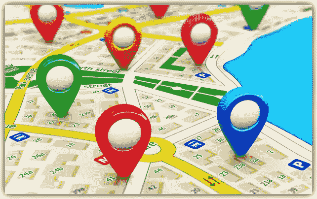

地理位置数据分析| [Img_Credit](https://blog.ipswitch.com/hs-fs/hubfs/Imported_Blog_Media/Location-Based-Data-The-Most-Annoying-Aspect-of-Mobility-1.jpg?width=622&height=384&name=Location-Based-Data-The-Most-Annoying-Aspect-of-Mobility-1.jpg)

# A.介绍

## A.1 背景:

我断断续续在拉各斯工作过，最长的一次是从 2006 年到 2009 年的三年。毫无疑问，拉各斯是一个神奇的地方。我称之为真正的艰苦学校……一个竞争最激烈、适者生存的地方。

我在欧洲和非洲旅行过，我的最后一个目的地是毛里求斯，在那里我主要是在 [***卡塞拉***](http://www.caselapark.com/bigcats/) 【顺便说一下，毛里求斯是非洲最富裕的国家，人均财富在最近一年内从 21700 美元增加到 25700 美元。 [***链接***](https://www.graphic.com.gh/business/business-news/accra-ranked-10th-wealthiest-city-in-africa.html)

这篇文章探讨了拉各斯州，它是非洲第四大富裕城市，仅次于约翰内斯堡、开罗和开普敦( [***链接***](https://www.graphic.com.gh/business/business-news/accra-ranked-10th-wealthiest-city-in-africa.html) )。拉各斯拥有超过 100 万美元的财富(6800 名百万富翁，370 名千万富翁和 4 名亿万富翁)。
它还是尼日利亚(人口最多的黑人国家)的商业首都，也是西非的商业中心。
我最近才回到拉各斯市，注册并毕业于 [***创始人学院***](https://fi.co/) 加速器项目，目前正与一位联合创始人一起创建一家保险技术初创公司。因此，我想利用这个机会帮助未来的初创企业在拉各斯找到最理想的办公地点。

在其他属性中，初创企业理想的办公地点应该具备:

1.  靠近技术中心和人才。
2.  高脚流量，便于与潜在客户互动。
3.  靠近教育机构进行研究和开发。
4.  靠近咖啡厅和餐厅，可举行商务会议或午餐会议。
5.  靠近公共汽车站、海港和机场。
6.  安保和安全。
7.  经济活动和补充业务的集群。

## A.2 数据描述


数据| [Img_credit](http://ojjme2x5sm337cgpo2mhuny3-wpengine.netdna-ssl.com/wp-content/uploads/2017/03/shutterstock_555080833.jpg)

数据集是拉格斯州的*维基百科页面*，参见 [***链接***](https://en.wikipedia.org/wiki/List_of_Lagos_State_local_government_areas_by_population) ***。***

我们将通过拉格斯市各自的地方政府辖区( **LGA** )或行政区探索拉格斯市。上面的链接是一个网页，显示了拉各斯州的各个地方政府和每个人口数字。
这些数据将通过以下步骤进行分析

1.  我们将使用漂亮的汤库抓取网页。
2.  我们将使用 Foursquare API 调用来检索地理位置数据。
3.  我们将使用请求库获取文本数据。
4.  我们将使用 json_normalize 模块将其从 JSON 转换为 Pandas DataFrame。
5.  我们将使用 follow 库来渲染地图，并通过 Matplotlib 库绘制这些地图。
6.  我们将使用 Kmeans 算法对每个 LGA 的场馆类别进行聚类。
7.  然后，我们会探索各自的地方政府机构，为一家初创公司找到 LGA 最佳办公室。
8.  最后，为了增加一些乐趣，我们将使用 word-cloud 库来显示拉各斯顶级场馆的名称。

# B.方法学

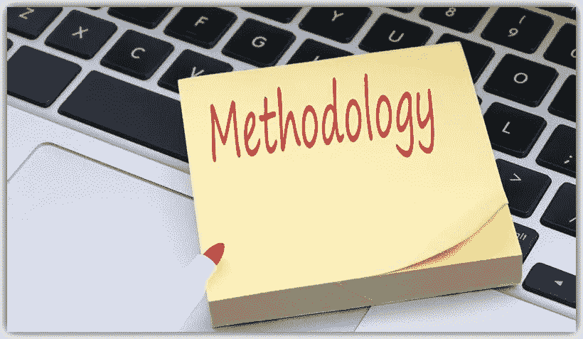

方法论| [Img_credit](http://marketglobalnews.us/wp-content/uploads/2019/04/Data-Methodology-Shift-Calms-The-US-Inflation.jpg)

首先，让我们导入所需的库。

```
**from bs4 import BeautifulSoup
import requests**  # library to handle requests.
**import pandas as pd
import json**  # library to handle JSON files.
**from pandas.io.json import json_normalize**  # transform json files to pandas dataframes.
**from geopy.geocoders import Nominatim**  # convert an address into latitude and longitude values.# Matplotlib and associated plotting modules.
**import matplotlib.pyplot as plt
import matplotlib.cm as cm
import matplotlib.colors as colors**# import k-means for clustering stage.
**from sklearn.cluster import KMeans** #!conda install -c conda-forge folium=0.5.0 --yes
**import folium** # map rendering library
**import numpy as np
import csv
print('All modules imported')**
```

## B.1 抓取网页数据:


让我们保存拉各斯数据的网络链接。

```
**lagos_link = 'https://en.wikipedia.org/wiki/List_of_Lagos_State_local_government_areas_by_population'**
```

从网站获取源代码 HTML 数据。

```
**source = requests.get(lagos_link).text**
```

让我们使用 BeautifulSoup 来解析它。

```
**soup = BeautifulSoup(source,'lxml')**# Let's pretty print it in its right shape.**print(soup.prettify())** # prettify prints the web page with tags hierarchies maintained.
```

接下来，让我们获取包含我们要从中抓取的数据的表。

```
**my_table = soup.find_all('td')**# Since the table data is between the <td> tags of the web page.
```

接下来，让我们遍历 my_table 的每个链接并追加文本部分。

```
**table_text = []****for data in my_table:
    table_text.append(data.text)**
```

所以让我们只从表中提取相关的数据。

```
**relevant_table_data = table_text[4:-3]** # relevant data is from the 4th element up to the third to the last element of the table_text list.
```

## B.2 创建拉各斯数据框架:


[Img_Credit](https://i.ytimg.com/vi/3k0HbcUGErE/maxresdefault.jpg)

首先，让我们创建一个字典，并将 LGA 和相应的人口数据追加到其中。

```
**table_dict={’LGA’:[], 'POP’:[]}
count = 0**
**for item in relevant_table_data:**
    # First let’s strip off the \n at the end.
    **item = item.strip(’\n’)
    try:
        item = int(item)
    except:**
    # if second item after the int, append to POP.
        **if count > 0:**
            #let’s remove the commas.
            **item = item.replace(’,’,’’)**
            # Next let’s convert to an integer so we can use it for   calculations.
            **item = int(item)**
            # Finally, let’s append it to the Population list of the dictionary.
            **table_dict[’POP’].append(item)
            count = 0**
        **else:**
        # if first item after the int, append to LGA.
            **table_dict[’LGA’].append(item)
            count +=1**
```

让我们从上面的 table_dict 字典中创建每个 LGA 及其各自人口的数据框架。

```
**lagos_df = pd.DataFrame(table_dict)**
# Let's see the first five rows.
**lagos_df.head()**
```


拉各斯 _df 的前五行

添加纬度和经度值:
让我们定义一个简单的方法来提取每个 LGA 纬度和经度数据。

```
**def latitude_longitude(Borough):**
**import time**
    """ Method takes a Series object and returns
a list of Latitude and corresponding Longitude data,using the geopy library.This method also prints out the coordinate data"""**address = str(Borough)**
# We must define a geolocator user agent.
**geolocator = Nominatim(user_agent="NG_explorer")
location = geolocator.geocode(address)
latitude = location.latitude
longitude = location.longitude****print('The geograpical coordinates of {} are lat {} and long {}.'.format(address, latitude, longitude))****time.sleep(2)**  # we let 2 secs pass after calling each location lat/lon so that the geocode function does not crash.**return [latitude, longitude]**
```

让我们使用 apply 将纬度和经度数据追加为一列

```
**lagos_df['latitude'] = lagos_df['LGA'].apply(latitude_longitude)**
```

让我们再来看看数据框，

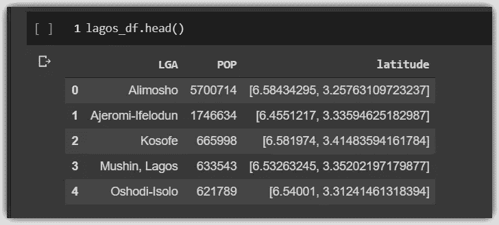

纬度列包含纬度和经度值的列表，让我们将它们分开。

让我们遍历数据帧并分离纬度和经度列。

```
**lon_list = []****for i, j in lagos_df.iterrows():
    lon_list.append(j.latitude[1])
    lagos_df.iat[i,2] = j.latitude[0]**
# next let's assign the lon_list as the value of the Longitude Column.
**lagos_df['longitude'] = lon_list**
```

让我们再看看前五行，

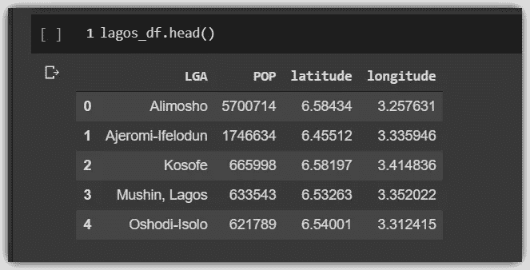

现在纬度和经度都是不同的数字列，而不是列表项。

## B.3 可视化拉各斯州地方政府机构:

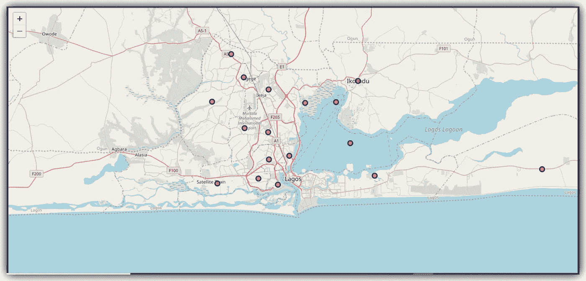

拉各斯州地图，以蓝红色圆圈显示 LGA。

让我们创建上面的拉各斯州的地图，上面叠加了 LGAs。

```
**address = 'Lagos'
geolocator = Nominatim(user_agent="NG_explorer")
location = geolocator.geocode(address)
latitude = location.latitude
longitude = location.longitude**# Render map using the Folium Library. **map_lagos_state = folium.Map(location=[latitude, longitude], zoom_start=10)**# add markers to map.**for lat, lng, LGA  in zip(lagos_df['latitude'], lagos_df['longitude'], lagos_df['LGA']):
    label = '{}'.format(LGA)
    label = folium.Popup(label, parse_html=True)        folium.CircleMarker([lat, lng],radius=6,popup=label,color='blue',
fill=True,fill_color='red',fill_opacity=0.7,parse_html=False).add_to(map_lagos_state)****map_lagos_state**
```

## B.4 使用 Foursquare API 调用:


我们将使用 *Foursquare* API 调用来检索每个 LGA 的地点的地理位置信息。首先，我们在 https://developer.foursquare.com/*注册并创建一个免费账户，该账户包含 *CLIENT_ID* 和 *CLIENT_SECRET* 参数，用于进行有效的 API 调用。*

*接下来，让我们复制原始的 lagos_df 数据帧，但这一次我们将把它的索引设置为 LGA 的名称，以使索引更容易。*

```
*# First let's make a copy of the lagos_df.**copy_lagos_df = lagos_df.copy(deep=True)**  # deep=True means if we make adjustments to this copy, the original won't be affected and vice versa.
# Then let's make LGAs the index.
**copy_lagos_df.index = copy_lagos_df.LGA**
# Let's drop the LGA Column.
**copy_lagos_df = copy_lagos_df.drop('LGA', axis=1)**
# Lets view the effect.
**copy_lagos_df.head()***
```

*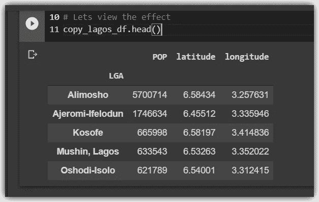*

*以 LGA 为索引项的 copy_lagos_df 数据框架。*

*接下来我们需要做的是创建一个名为[***return _ venies***](https://github.com/Blackman9t/Coursera_Capstone/blob/master/applied_data_science_capstone_project.ipynb)的方法，该方法获取每个 LGA 的地址，使用*nominam*模块将其转换为纬度和经度列表，然后我们使用 *Foursquare* API 调用来检索每个 LGA 周围 10 公里半径范围内的前 200 个可用场地类别。*

*我们为每个 LGA 重复并将唯一的场地类别列表保存到一个变量中，使用一个简单的方法叫做[***store _ venue _ categories***](https://github.com/Blackman9t/Coursera_Capstone/blob/master/applied_data_science_capstone_project.ipynb)*定义如下。**

```
****def store_venue_categories(df):****venue_set = set()****for lga in df.index:** **df_lga = return_venues(lga)**
    # Converting each category name to lower case using a list comprehension.
    **df_lga['venue.categories'] = [x.lower() for x in      list(df_lga['venue.categories'])]**
# Add each converted name to a set to avoid any possible duplicates.
    **for category in df_lga['venue.categories']:
        venue_set.add(category)**
# Finally return a list of all venue categories in our DataFrame.
    **return list(venue_set)****
```

**接下来，我们将 copy_lagos_df 数据帧作为参数传递给上面的方法，并将结果赋给一个变量，该变量存储 lagos 州所有现有的场馆类别。**

```
****all_venue_categories = store_venue_categories(copy_lagos_df)**# Let's see howmany venues we have altogether
**print(len(all_venue_categories))**
>>
101
# so we have 101 different categories of venues altogether.**
```

# **C.结果呢**

****

**结果… | [Img_credit](https://resize.indiatvnews.com/en/resize/newbucket/715_-/2019/09/822184-822007-results-2019-1569303842.jpg)**

## **C.1 使用 KMeans 算法对拉各斯州场馆进行聚类:**

**让我们从拉各斯州创建大约 5 个集群，并根据可用的场地类别选择最可行的集群。然后，我们将根据我们定义的某些参数，从这个集群中选择顶部的 LGA。**

**首先，我们创建一个名为[***getNearbyVenues***](https://github.com/Blackman9t/Coursera_Capstone/blob/master/applied_data_science_capstone_project.ipynb)***，*** 的方法，该方法返回一个 DataFrame，其中包含每个 LGA 中的每个场馆细节，所有细节都连接在一起。我们向该方法传递每个 LGA 名称的列表和相应的纬度和经度数据作为参数，并将输出数据帧保存在名为***Lagos _ state _ venies***的变量中。**

```
****lagos_state_venues = getNearbyVenues(names= lagos_df['LGA'],latitudes= lagos_df['latitude'],longitudes= lagos_df['longitude'])**# Let's see the shape and first ten rows of lagos_state_venues**
```

**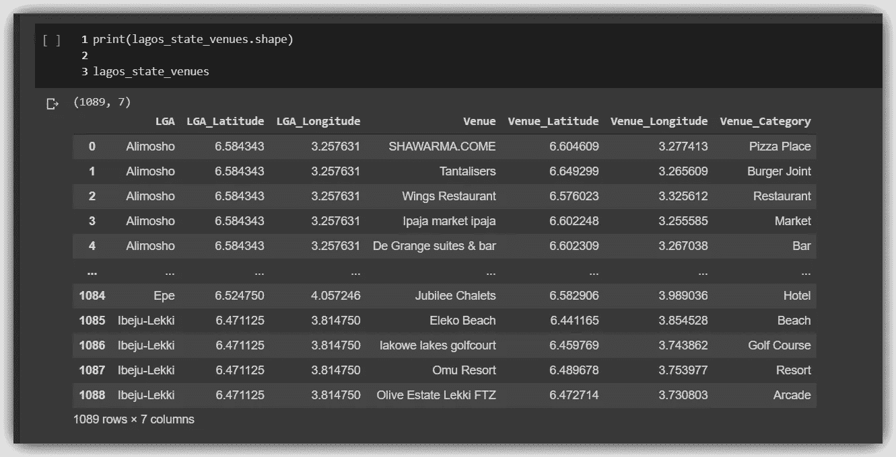**

**显示了拉各斯州所有 LGA 的所有 1089 个返回场馆的前 5 行和后 5 行。**

**接下来，我们对上述数据帧的 venue_category 列进行一次性编码，然后根据 LGA 进行分组，取每个 LGA 的每个场馆类别的平均出现频率。**

```
****lagos_grouped = lagos_onehot.groupby('LGA').mean().reset_index()****
```

**有了这个显示每个 LGA 每个场馆类别平均出现次数的分组数据框架，我们就可以创建我们的聚类算法。**

```
**# set number of clusters**kclusters = 5****lagos_grouped_clustering = lagos_grouped.drop('LGA', 1)**# run k-means clustering**kmeans = KMeans(n_clusters=kclusters, random_state=0).fit(lagos_grouped_clustering)**# check cluster labels generated for each row in the dataframe
**kmeans.labels_****
```

**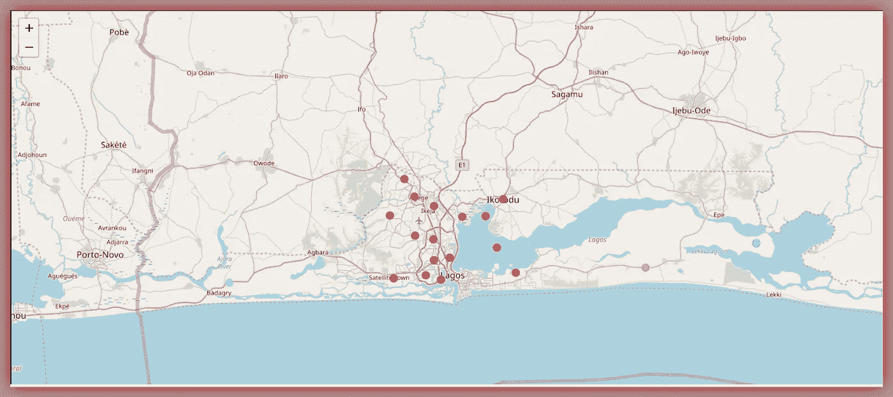**

**拉各斯各个场馆群。显然，红色圆圈的群集是主要的或理想的群集。**

**让我们检查一下这些簇，让我们检查一下每个簇的形状。**

```
****cluster1 = lagos_merged[lagos_merged['Cluster Labels'] == 0]
cluster2 = lagos_merged[lagos_merged['Cluster Labels'] == 1]
cluster3 = lagos_merged[lagos_merged['Cluster Labels'] == 2]
cluster4 = lagos_merged[lagos_merged['Cluster Labels'] == 3]
cluster5 = lagos_merged[lagos_merged['Cluster Labels'] == 4]****for i in range(5):** **x = lagos_merged[lagos_merged['Cluster Labels'] == i]
    print('cluster'+str(i+1) + ' shape is {}'.format(x.shape))**>>
**Cluster1 shape is (16, 14) 
Cluster2 shape is (1, 14) 
Cluster3 shape is (1, 14) 
Cluster4 shape is (1, 14) 
Cluster5 shape is (1, 14)**# cluster_one is the dominant cluster with 16 LGAs**
```

**让我们看看集群 1 中列出的 LGAs**

```
****cluster1_lgas = list(cluster1['LGA'])
print(cluster1_lgas)**>>
**['Alimosho',  'Ajeromi-Ifelodun',  'Kosofe',  'Mushin, Lagos',  'Oshodi-Isolo',  'Ikorodu',  'Surulere',  'Agege',  'Ifako-Ijaiye',  'Somolu',  'Amuwo-Odofin',  'Lagos Mainland',  'Ikeja',  'Eti-Osa',  'Apapa',  'Lagos Island']****
```

## **C.2 寻找最理想的地方政府机构，以拉各斯办事处为例:**

****

**让我们创建一个主数据框架，将所有场馆类别作为索引，将每个 LGA 的名称作为列标题。**

**将相似的场馆类别归入同一个列表是有意义的。例如,“餐馆”和“快餐店”应该在一个列表上。**

```
****super_list  = [continental_restaurants, eateries, coffee_shops, gas_stations, ice_cream_n_confectionery, hotels_resorts_spas, bars_n_lounges,airport, bus_stations, heliport, it_services_n_hubs, shopping_malls_n_stores, gym_sports_facilities_games, markets, fashion_n_clothing,arts_studios_galleries, convention_centers, halls_events_venues, night_clubs, beach, parks, cinemas, auto_services, electronics_shop,residences, other_services]****
```

**让我们确认一下我们现在有多少列表类别:**

```
****len(super_list)
>>
26**
# We have reduced 101 categories to 26 categories of similar venues**
```

**因此，让我们继续创建一个主数据框架，将场馆类别作为索引，将地方政府机构的名称作为列标题。**

```
**# Let's make the venue categories the index of the new DataFrame**data_index = ['continental_restaurants', 'eateries', 'coffee_shops', 'gas_stations', 'ice_cream_n_confectionery', 'hotels_resorts_spas', 'bars_n_lounges','airport', 'bus_stations', 'heliport', 'it_services_n_hubs', 'shopping_malls_n_stores', 'gym_sports_facilities_games', 'markets', 'fashion_n_clothing','arts_studios_galleries', 'convention_centers', 'halls_events_venues', 'night_clubs', 'beach', 'parks', 'cinemas', 'auto_services', 'electronics_shop','residences', 'other_services']**# Let's create a list of LGAs to be the columns of our new DataFrame
**data_columns = list(copy_lagos_df.index)**# Let's create a new DataFrame
**summary_df = pd.DataFrame(index= data_index, columns= data_columns)**# Next let’s replace any possible NaN values with 0
**summary_df.fillna(0, inplace=True)**# Let's see the first 5 rows
**summary_df.head()****
```

**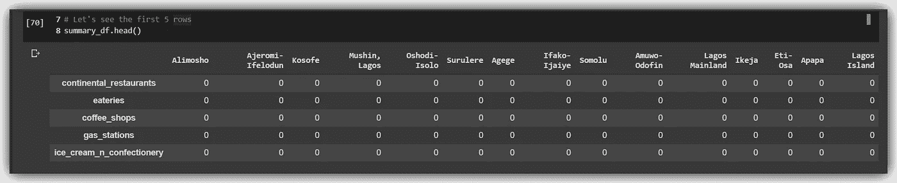**

**summary_df 数据框架，以场馆类别为索引，以 LGA 名称为列。**

**现在让我们创建一个名为[***update _ lga _ category _ values***](https://github.com/Blackman9t/Coursera_Capstone/blob/master/applied_data_science_capstone_project.ipynb)*的方法，该方法遍历每个 LGA 场馆类别，并将每个 LGA 在每个类别中的场馆数量添加到上面的 summary_df，DataFrame 中。***

```
***# Let's update the summary_df DataFrame with the number of venues per category, per LGA, using the ***update_lga_category_values*** method above**.** 
**summary_df = update_lga_category_values(copy_lagos_df, summary_df)**# Let's see the first five rows of the updated summary_df DataFrame
**summary_df.head()*****
```

**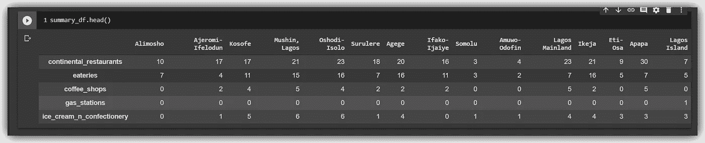**

**显示每个 LGA 的场馆类别数量的前五行**

**现在，从每个 LGA 的 26 个场馆大类中，让我们选出前 20 个类别并对地方政府区进行排序，看看哪一个拥有最广泛的场馆类别和最多的场馆组合。我们将这些保存在一个名为 ***top_criteria*** 的列表中，如下所示。**

```
****top_criteria=['hotels_resorts_spas','airport','it_services_n_hubs','gym_sports_facilities_games','shopping_malls_n_stores','coffee_shops','markets','bars_n_lounges','arts_studios_galleries','halls_events_venues','continental_restaurants','eateries','gas_stations','cinemas','residences','auto_services','convention_centers','parks','electronics_shop','night_clubs']**# Let's slice out these top-criteria only to a new DataFrame
**top_criteria_df = summary_df.loc[top_criteria,]**# Let's add a total or sum row at the base
**top_criteria_df.loc['Total Venues'] = top_criteria_df.sum()**# Let's view the first five rows**
```

**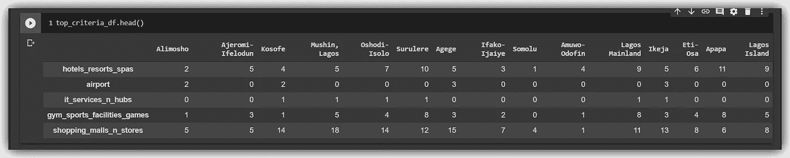**

**top_criteria 数据框架的前五行**

**从我们的分析结果来看，LGA 拉格斯大陆的顶级场馆缺席数量最少(4 个)，而可用场馆数量最多(95 个)。它旁边是 LGA，有同样数量的顶级场馆缺席(4)。**

**请参见下表，其中显示了拉各斯办事处排名前五的地方政府机构**

**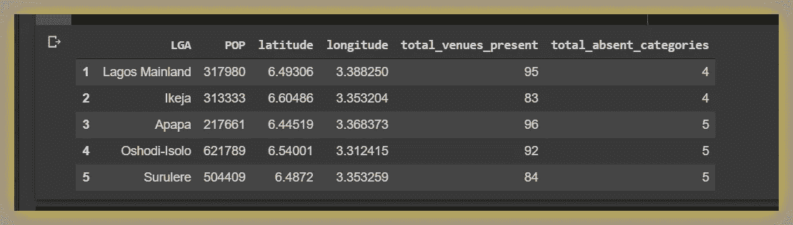**

**五大地方政府机构列举拉各斯州的一个办公室。**

**从我们上面做的聚类练习来看，所有**前 5 个 LGA**都来自主要的 ***群 1，这也不是巧合。*****

**这些是 ***拉格斯大陆*** ， ***伊克哈*** ， ***阿帕帕*** ， ***奥绍迪-伊索洛*** 和 ***苏鲁勒。*****

## **C.3 拉各斯州 LGA 最常见的十大场馆类别:**

****

**通过几行简单的代码，我们可以显示拉各斯州 LGA 最常见的 10 种场馆类型。这对于活动规划或为一群类似的企业构建解决方案非常有用。你可以在 Github 里看到我的 [***笔记本***](https://github.com/Blackman9t/Coursera_Capstone/blob/master/applied_data_science_capstone_project.ipynb) 里的代码。**

**以下是每个 LGA 最常见的 10 个场馆类别的快照。**

**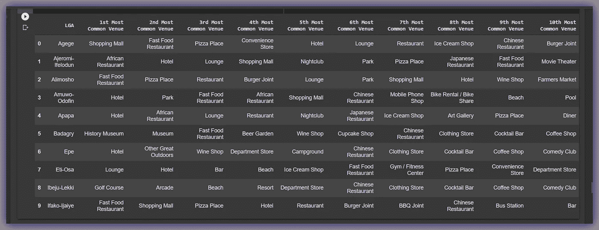**

**拉各斯州 LGA 最常见的十大场馆类别。**

# **D.讨论**

> ***所有模型都是错的，但有些有用……*[***乔治·爱德华·佩勒姆***](https://en.wikipedia.org/wiki/George_E._P._Box)**

**受乔治·佩勒姆 的启发，这绝不是对拉各斯州的详尽或准确的分析。我们简单地使用了来自拉各斯 [***维基百科页面***](https://en.wikipedia.org/wiki/List_of_Lagos_State_local_government_areas_by_population) 的数据。我们搜集了这些数据，并根据我们创建的某些参数应用了机器学习和探索性数据分析(EDA)，以得出一个关于拉各斯办公室最理想位置的合理结果，即 ***拉各斯大陆******LGA***。**

## **D.1 Lagos 拉格斯大陆:**

**拉各斯大陆由酋长奥洛芬建立，居住着与拉各斯相同的族群，尤其是埃格巴斯人和阿沃利斯人。
拉格斯大陆是从 Ebute-Metta、Ido-Otto、Ijora 等聚落发展而来。参见 [***链接***](https://web.archive.org/web/20070929061412/http://www.mainlandlg.com/)**

## **拉各斯大陆的社区包括:**

**Yaba，
Ebute-Metta，
Iddo-Otto，
Iwaya，
Akoka，
Makoko，
Abule-nla。**

**Yaba 是一个技术活动的蜂巢，有技术合作伙伴和共同工作的服务，如 [***共创中心***](http://www.cchubnigeria.com/)[***NG Hub 来自脸书***](http://nghub.fb.com/)[***Hub One***](http://theleadspace.co/index.php/plans/#hub-one-plans)***Yaba ICT Hub***[***煎饼 Hub***](http://www.pancakehub.com/)**

**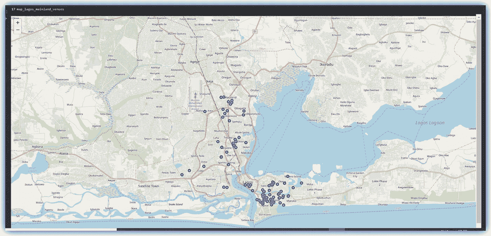**

**拉格斯大陆 LGA，显示一些场地。**

# **E.结论**

**在这篇文章中，我们探索了拉各斯市的一些情况，并帮助任何希望搬迁或扩展到拉各斯的初创企业找到理想的办公地点。**

**全文分析撑腰本文可在我的[***GitHub repo***](https://github.com/Blackman9t/Coursera_Capstone/blob/master/applied_data_science_capstone_project.ipynb)中找到。**

**最后，让我们来看一个 word cloud 对象，它显示了拉各斯州最常见的场馆类别。**

****

**女士们先生们，拉各斯市最常见的场馆是…你猜对了！…酒店和酒吧！！**

****干杯……****

## **关于我:**

**劳伦斯是技术层的数据专家，对公平和可解释的人工智能和数据科学充满热情。我持有 IBM 的 ***数据科学专业*** *和* ***高级数据科学专业*** *证书。我已经使用 ML 和 DL 库进行了几个项目，我喜欢尽可能多地编写函数代码，即使现有的库比比皆是。最后，我从未停止学习和实验，是的，我拥有几个数据科学和人工智能认证，并且我已经写了几篇强烈推荐的文章。***

**请随时在以下网址找到我**

**[**Github**](https://github.com/Lawrence-Krukrubo)**

**[**领英**](https://www.linkedin.com/in/lawrencekrukrubo/)**

**[**推特**](https://twitter.com/LKrukrubo)**