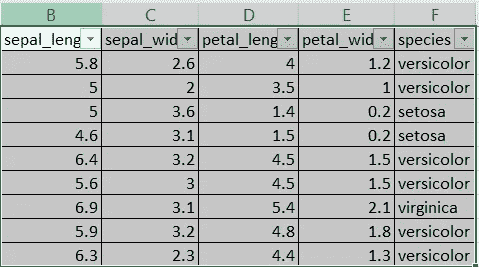
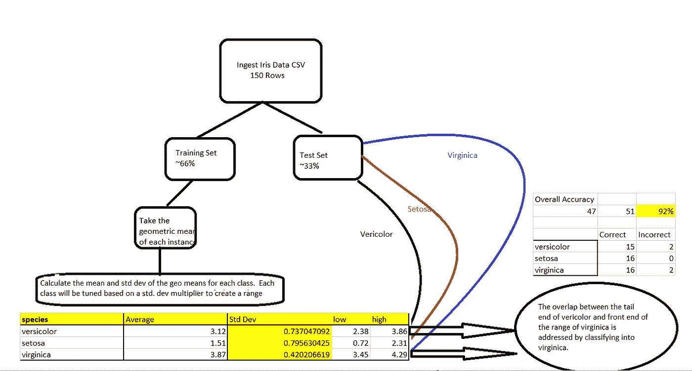
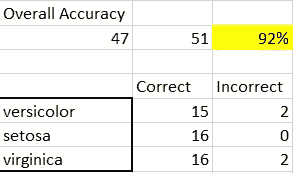

# 虹膜数据集的几何平均算法

> 原文：<https://pub.towardsai.net/geometric-mean-classifier-for-iris-dataset-ed83209f54f3?source=collection_archive---------2----------------------->

## [数据科学](https://towardsai.net/p/category/data-science)

## 这篇文章将通过几何平均学习算法对鸢尾花数据集进行分类。

来源:图片由作者创作。

在这种情况下，阶级就是物种，这就是需要预测的。

以下是一般步骤的流程图:

来源:图片由作者创作。

在尝试该算法之前，请执行预处理步骤。随机化数据集，然后将其分为训练数据集和测试数据集。你可以分别为训练和测试做 2/3 和 1/3 的分割。这很正常。

## 该算法的步骤如下:

**1。**创建一个字段，计算给定属性的几何平均值，在本例中为 sepal_length、septal_width、petal_length 和 petal_width。为训练数据的每个实例执行此操作

**2。**找出训练数据中每个类别的几何平均值，即 Versicolor、setosa 和 virginica 中的几何平均值。

**3。**求训练数据中每一类的几何均值的标准差。

**4。**使用以下公式找出每个类别的低高范围:[步骤 2 的平均值+/-步骤 3 的标准差]

**5。**分类将基于范围。如果测试数据中行的几何平均值在该范围内，则选择该类作为标签。

**6。**下一部分将显示调谐。根据您使用的乘数，使用标准差乘数调整算法也会产生重叠。您可以使用不同的方法来解决重叠问题:

## 调谐:

1.请注意，在上述算法中，每个类别的标准差都有不同的乘数。要调整算法，请分别更改每个类的标准差乘数。乘数将改变高低范围，并显著改变分类的准确性。事实上，模型的整体准确性是基于选择合适的乘数。

## 重叠:

有时，分类器会重叠并选择两个类别:

**a.** 由于 Virginica 和 Versicolor 重叠的范围，在测试集中有 11 个重叠实例。在重叠的情况下，这种方法分类到较高范围开始的地方。在这种情况下，任何超过 3.45(Virginica 低端)的重叠花都将被分类到它里面。

**b.** 但是，请注意，有多种方法可以解决重叠问题，这取决于您对数据的理解。你可以让它随机选择 2 个重叠的 1/2 或者 3 个重叠的 1/3(没有)。当我尝试这样做时，结果的准确度下降到了 80 多。这不是很低，但我只是选择了>低端作为我的决定，因为它为重叠提供了最好的精度。

## 评估:

在提供的 51 个例子中，它答对了 47 个。它预测云芝错了两次，弗吉尼亚错了两次。

来源:图片由作者创作。

如果你正在寻找算法背后的工作手册，请直接联系我在 ashu.malgaonkar@gmail.com

谢谢你，

阿什。

参考资料:

**来源:**

创建者:

拉·费希尔

捐赠者:

迈克·马歇尔(马歇尔% PLU**' @ '**io.arc.nasa.gov)

**数据集信息:**

这可能是模式识别文献中最著名的数据库。费希尔的论文是该领域的经典，至今仍被频繁引用。(例如，见杜达&哈特。)数据集包含 3 类，每类 50 个实例，其中每类涉及一种鸢尾植物。一个类与另一个类是线性可分的；后者彼此不是线性可分的。

预测属性:鸢尾类植物。

这是一个极其简单的领域。

该数据不同于 Fishers 文章中的数据(由 Steve Chadwick、spchadwick**' @ '**espeedaz.net 确定)。第 35 个样本应该是:4.9，3.1，1.5，0.2，“Iris-setosa”其中误差在第四个特征。第 38 个样本:4.9，3.6，1.4，0.1，“Iris-setosa”其中错误在第二个和第三个特征中。