# 图像的几何变换

> 原文：<https://pub.towardsai.net/geometric-transformations-on-images-962707349fee?source=collection_archive---------3----------------------->

## 使用 Monk，低代码深度学习工具和计算机视觉的统一包装器，使计算机视觉变得简单

# 目录

1.  **缩放**
2.  **翻译**
3.  **旋转**
4.  **仿射变换**
5.  **透视变换**

# **缩放**

*   图像缩放是指调整数字图像的大小。
*   数字材料的放大被称为放大。
*   缩小规模被称为缩减规模。

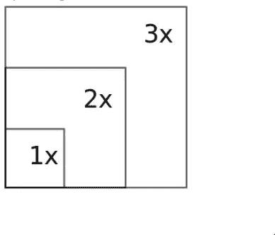

*   理想场景-无损转换。
*   图像分辨率-高度(像素)，*宽度(像素)

> 使用 numpy 调整图像大小

```
**import** **numpy** **as** **np**
**import** **cv2**
**from** **matplotlib** **import** pyplot **as** plt
img = cv2.imread("imgs/chapter4/tessellate.jpg", -1)
print("Input image shape - **{}**".format(img.shape))
plt.imshow(img[:,:,::-1])
plt.show()
```

输出

```
Input image shape - (240, 320, 3)
```

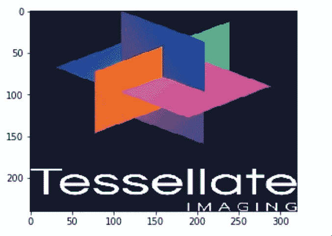

> 缩小宽度

```
height, width, channels = img.shape

*# create blank image of half the width*
resized_img_width = np.zeros((height, width//2, channels), dtype=np.int32)**for** r **in** range(height):
    **for** c **in** range(width//2):
        resized_img_width[r][c] += (img[r][2*c])

print("Width resized image shape - **{}**".format(resized_img_width.shape))
plt.imshow(resized_img_width[:,:,::-1])
plt.show()
```

输出

```
Width resized image shape - (240, 160, 3)
```

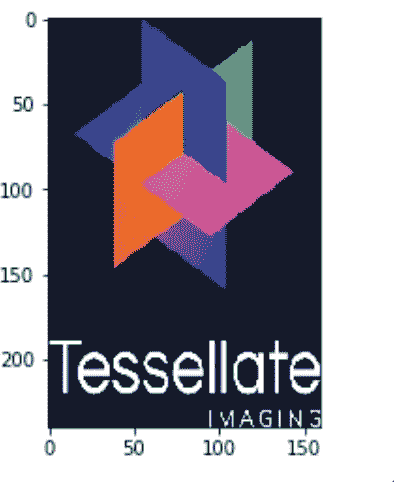

> 将图像缩小到其宽度和高度的一半

```
resized_img = np.zeros((height//2, width//2, channels), dtype=np.int32)**for** r **in** range(height//2):
    **for** c **in** range(width//2):
        resized_img[r][c] += (resized_img_width[r*2][c])
print("Complete resized image shape - **{}**".format(resized_img.shape))
plt.imshow(resized_img[:,:,::-1])
plt.show()
```

输出

```
Complete resized image shape - (120, 160, 3)
```

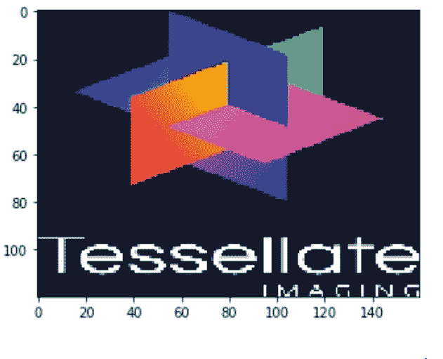

> 提升高度

```
half_upsclaled_img = np.zeros((height, width//2, channels), dtype=np.int32)half_upsclaled_img[0:height:2, :, :] = resized_img[:, :, :]
half_upsclaled_img[1:height:2, :, :] = resized_img[:, :, :]
print("Height upscaled image shape - **{}**".format(half_upsclaled_img.shape))
plt.imshow(half_upsclaled_img[:,:,::-1])
plt.show()
```

输出

```
Height upscaled image shape - (240, 160, 3)
```

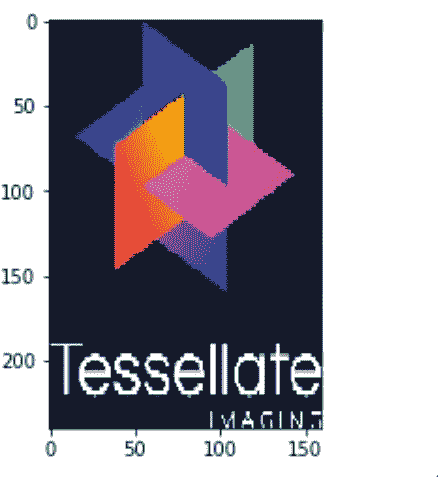

> 放大宽度

```
upsclaled_img = np.zeros((height, width, channels), dtype=np.int32)*# Expand rows by replicating every consecutive row*
upsclaled_img[:, 0:width:2, :] = half_upsclaled_img[:, :, :]
upsclaled_img[:, 1:width:2, :] = half_upsclaled_img[:, :, :]
print("Fully upscaled image shape - **{}**".format(upsclaled_img.shape))
upscaled_img_manual = upsclaled_img
plt.imshow(upsclaled_img[:,:,::-1])
plt.show()
```

输出

```
Fully upscaled image shape - (240, 320, 3)
```

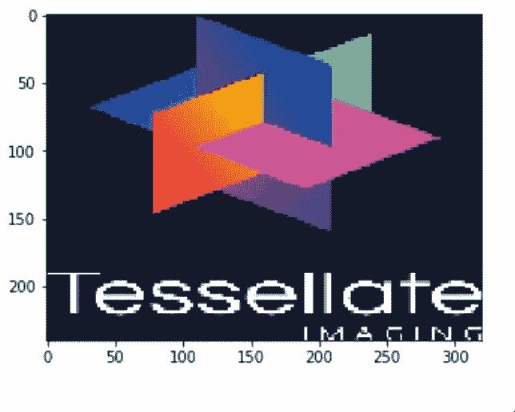

> 比较原始和升级

```
f = plt.figure(figsize=(15,15))
f.add_subplot(1, 2, 1).set_title('Original Image')
plt.imshow(img[:, :, ::-1])
f.add_subplot(1, 2, 2).set_title('Upscaled image post downscaling')
plt.imshow(upsclaled_img[:, :, ::-1])
plt.show()
```

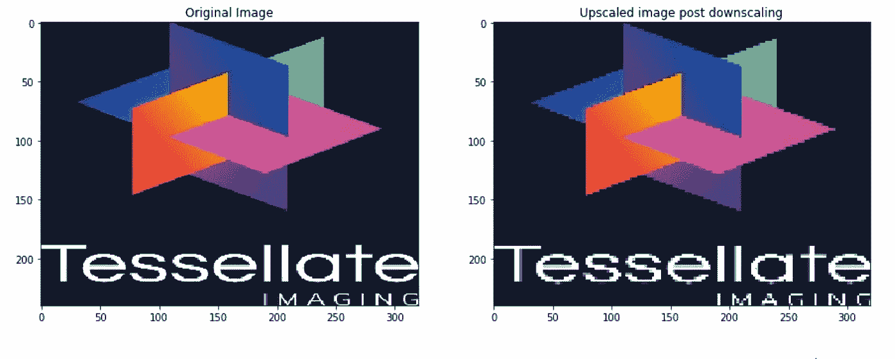

注意:*在这种图像大小调整中有很多信息丢失。*

> 使用 OpenCV 调整图像大小

*   使用 cv2.resize()缩小形状。
*   使用 cv2.resize()放大形状。

> 将图像缩小到其宽度和高度的一半

```
**import** **numpy** **as** **np**
**import** **cv2**
**from** **matplotlib** **import** pyplot **as** plt
img = cv2.imread("imgs/chapter4/tessellate.jpg", -1)height, width, channels = img.shape

*# create blank image of half the width*
resized_img = cv2.resize(img, (width//2, height//2))
print("Downscaled image shape - **{}**".format(resized_img.shape))
plt.imshow(resized_img[:,:,::-1])
plt.show()
```

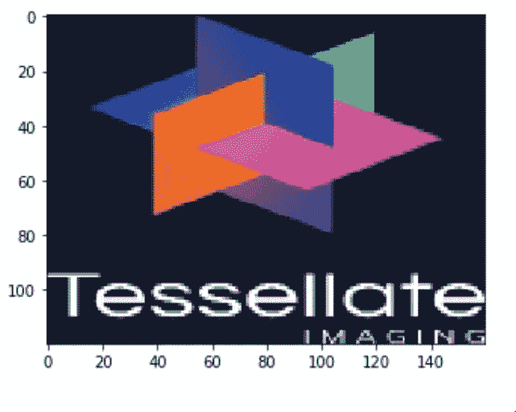

> 将图像放大到其原始宽度和高度

```
height, width, channels = img.shape

*# create blank image of half the width*upscaled_img = cv2.resize(resized_img, (width, height));
print("Upscaled image shape - **{}**".format(upscaled_img.shape))
upscaled_img_opencv = upscaled_img
plt.imshow(upscaled_img[:,:,::-1])
plt.show()
```

输出

```
Upscaled image shape - (240, 320, 3)
```

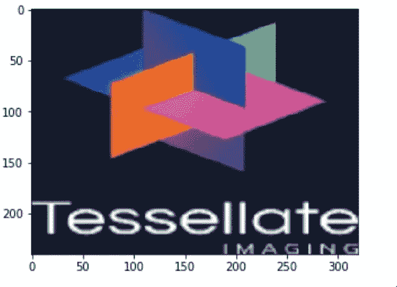

> 使用 opencv 比较原始、手动放大、重新放大

```
f = plt.figure(figsize=(15,15))
f.add_subplot(3, 1, 1).set_title('Original Image');
plt.imshow(img[:, :, ::-1])
f.add_subplot(3, 1, 2).set_title('Manually Upscaled post downscaling');
plt.imshow(upscaled_img_manual[:, :, ::-1])
f.add_subplot(3, 1, 3).set_title('Upscaled using opencv post downscaling');
plt.imshow(upscaled_img[:, :, ::-1])
plt.show()
```

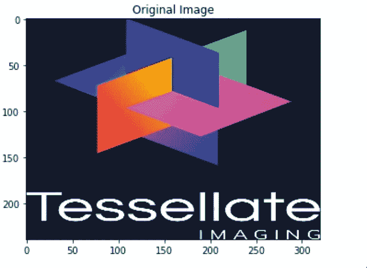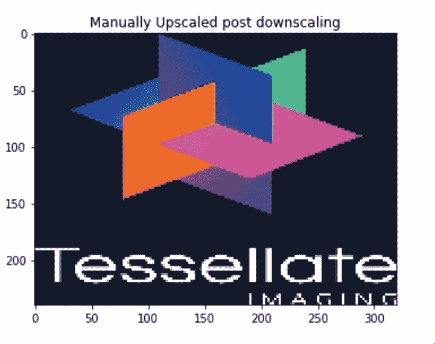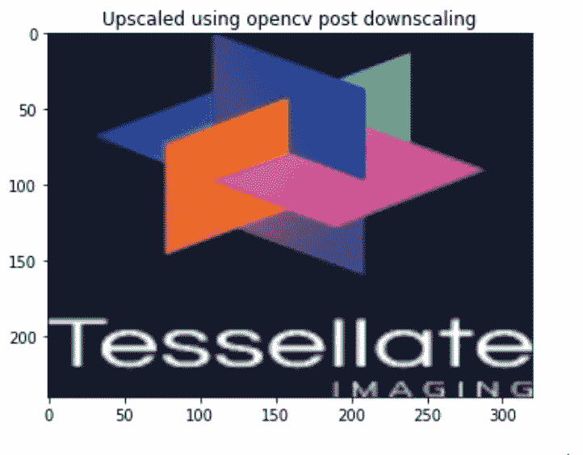

> 使用枕头调整图像大小

> 将图像缩小到其宽度和高度的一半

```
**import** **numpy** **as** **np**
**from** **PIL** **import** Image
**from** **matplotlib** **import** pyplot **as** plt
img_p = Image.open("imgs/chapter4/tessellate.jpg")width, height = img_p.size

*# create blank image of half the width*
resized_img = img_p.resize((width//2, height//2))
print("Downscaled image shape - **{}**".format(resized_img.size))
plt.imshow(resized_img);
plt.show()
```

输出

```
Downscaled image shape - (160, 120)
```

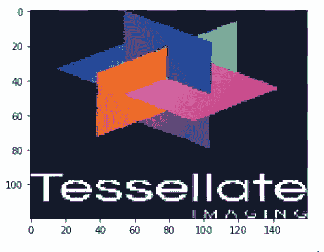

> 将图像放大到其原始宽度和高度

```
width, height = img_p.size

*# create blank image of half the width*
upscaled_img = resized_img.resize((width, height))
print("Upscaled image shape - **{}**".format(upscaled_img.size))
plt.imshow(resized_img)
plt.show()
```

输出

```
Upscaled image shape - (320, 240)
```

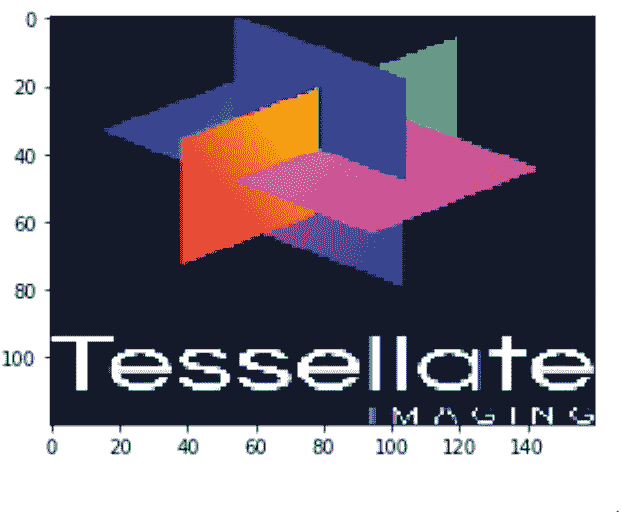

> 使用 opencv 比较原始、手动放大、重新放大

```
f = plt.figure(figsize=(15,15))
f.add_subplot(2, 2, 1).set_title('Original Image')
plt.imshow(img[:, :, ::-1])
f.add_subplot(2, 2, 2).set_title('Manually Upscaled post downscaling')
plt.imshow(upscaled_img_manual[:, :, ::-1])
f.add_subplot(2, 2, 3).set_title('Upscaled using opencv post downscaling')
plt.imshow(upscaled_img_opencv[:, :, ::-1])
f.add_subplot(2, 2, 4).set_title('Upscaled using PIL post downscaling')
plt.imshow(upscaled_img)
plt.show()
```

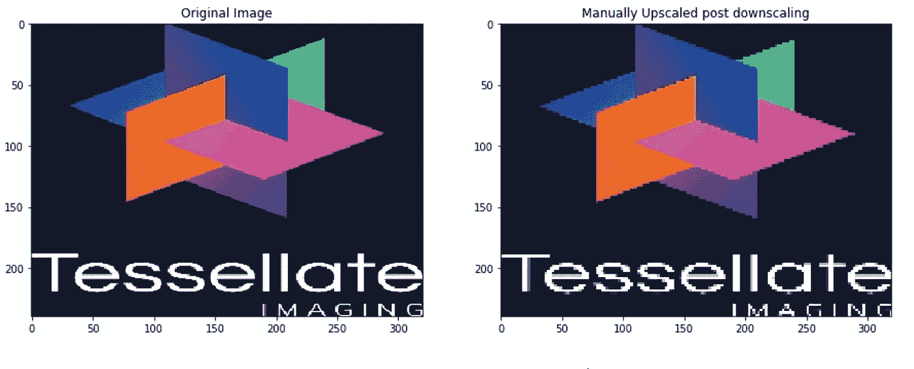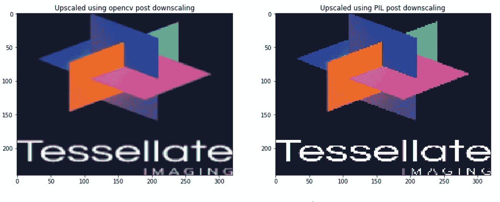

> 缩放算法

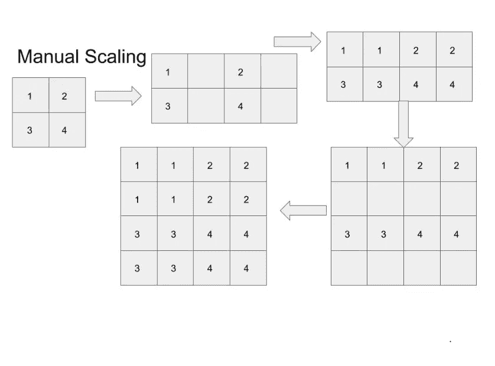

> 什么是插值

*   插值是一种在已知数据点的离散集合范围内构造新数据点的方法。
*   通常需要插值，即估计自变量中间值的函数值。
*   它也被称为曲线拟合。近似值

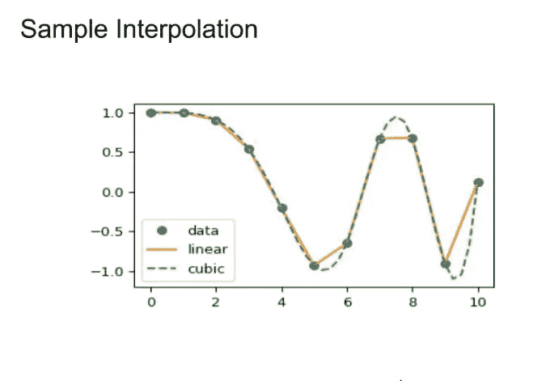

> OpenCV 插值

> 最近邻插值

*   指定最接近当前像素的值。
*   最近邻是最基本的。
*   在所有插值算法中，它需要的处理时间最少，因为它只考虑一个像素-最接近插值点的像素。

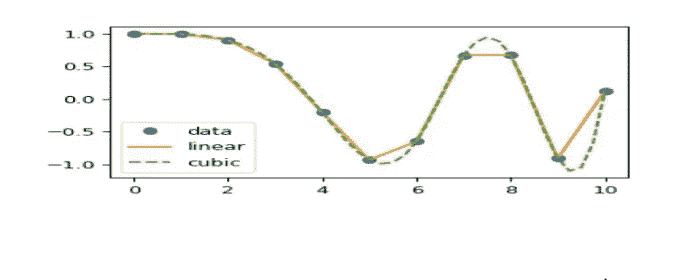

> 双线性插值

*   双线性插值考虑未知像素周围已知像素值的最近 2*2 邻域。
*   然后对这 4 个像素进行加权平均，得到最终的插值。

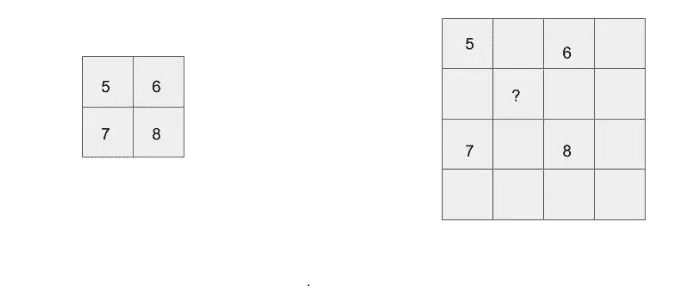

> 双三次插值

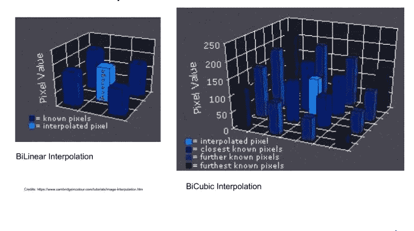

> LancZos 插值

*   高阶插值。
*   在频域工作，因此难以想象。
*   一种高维过滤和特征提取方法。

> 使用哪种插值？

*   cv2。默认情况下使用 INTER_LINEAR。
*   cv2。用于收缩的 INTER_AREA。
*   cv2。INTER_CUBIC 再次收缩，更好，但速度慢。
*   简历。用于缩放的 INTER_LINEAR。
*   不考虑计算速度时的其他复杂问题。

> OpenCV 算法

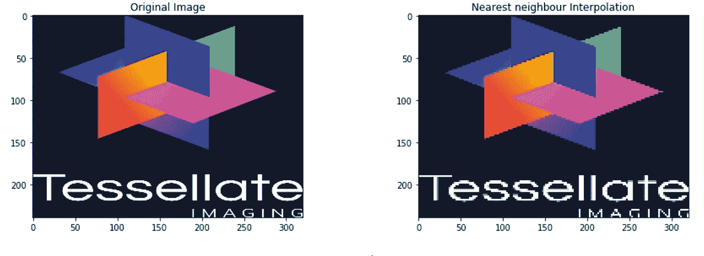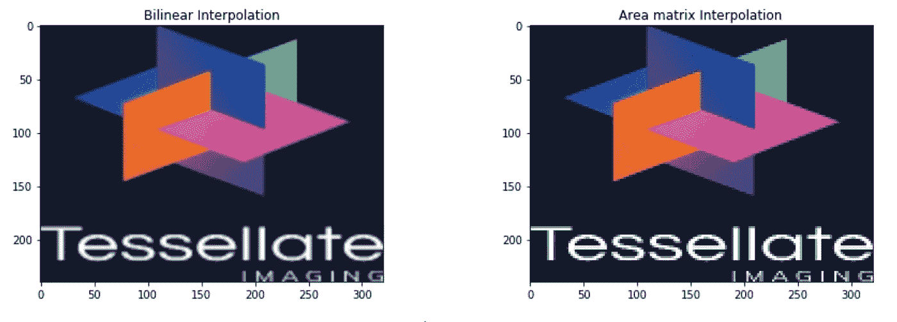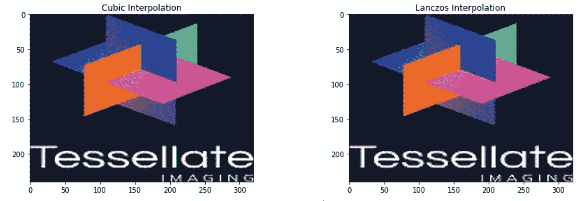

> *枕头算法*

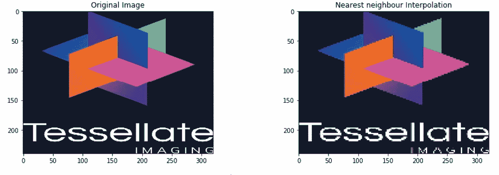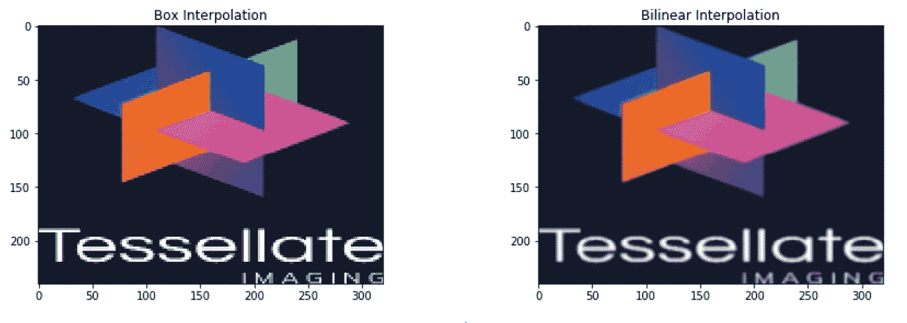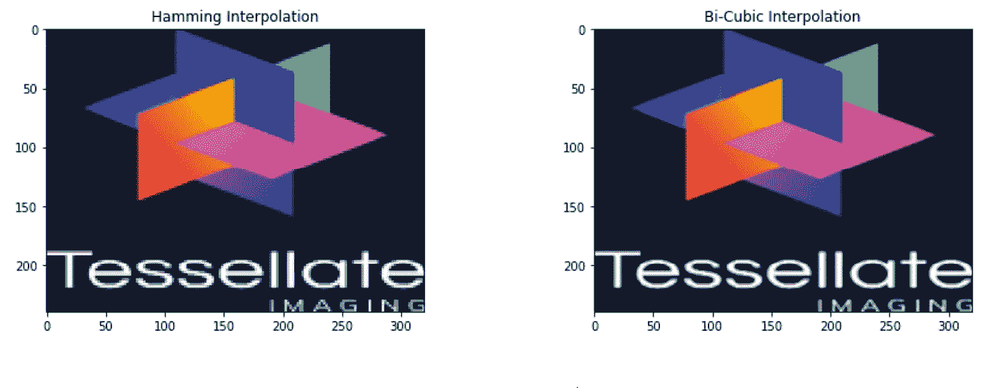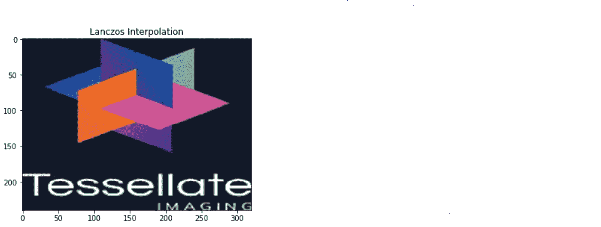

# **翻译**

*   将图像向四个方向移动一定的像素。

> 为什么需要？

*   用于数据扩充。

> 使用基本数字的图像翻译

```
**import** **numpy** **as** **np** 
**import** **cv2** 
**from** **matplotlib** **import** pyplot **as** plt 
img = cv2.imread("imgs/chapter4/dog.jpg",-1)
plt.imshow(img[:,:,::-1])
plt.show()
```

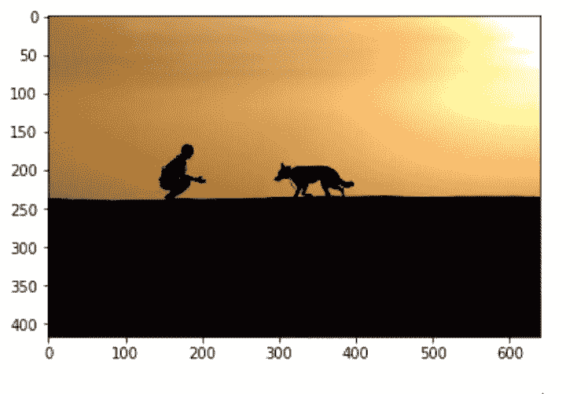

> 向右平移 50 个像素

```
h, w, c = img.shape;
img_new = np.zeros((h, w, c), dtype=np.uint8);

f = plt.figure(figsize=(15,15))
f.add_subplot(3, 1, 1).set_title('Original Image');
plt.imshow(img[:, :, ::-1])
f.add_subplot(3, 1, 2).set_title('New Blank Image');
plt.imshow(img_new[:, :, ::-1])
plt.show()
```


```
img_new[:, 50:, :] = img[:, :w-50, :]

plt.imshow(img_new[:,:,::-1])
plt.show()
```

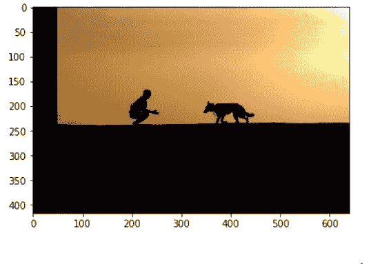

> 向左平移 50 个像素

```
h, w, c = img.shape
img_new = np.zeros((h, w, c), dtype=np.uint8)

img_new[:, :w-50, :] = img[:, 50:, :]
plt.imshow(img_new[:,:,::-1])
plt.show()
```

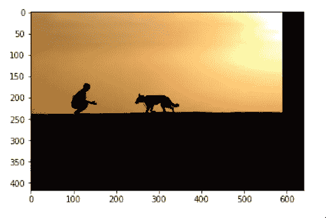

> 向下平移 50 个像素

```
h, w, c = img.shape
img_new = np.zeros((h, w, c), dtype=np.uint8)

img_new[50:, :, :] = img[:h-50, :, :]
plt.imshow(img_new[:,:,::-1])
plt.show()
```

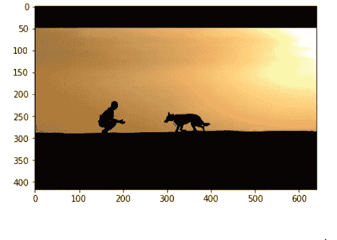

> 向上平移 50 像素

```
h, w, c = img.shape;
img_new = np.zeros((h, w, c), dtype=np.uint8)

img_new[:h-50, :, :] = img[50:, :, :]
plt.imshow(img_new[:,:,::-1])
plt.show()
```

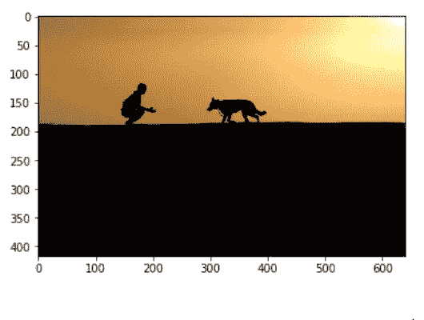

# **旋转**

> 使用 PIL 旋转图像

```
**import** **numpy** **as** **np**
**from** **PIL** **import** Image
**from** **matplotlib** **import** pyplot **as** plt
img_p = Image.open("imgs/chapter4/triangle.jpg")
plt.imshow(img_p)
plt.show()
```

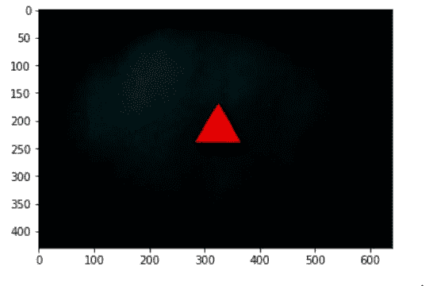

> 以枢轴为中心顺时针旋转 30 度

```
img_p_new = img_p.rotate(-30)
plt.imshow(img_p_new)
plt.show()
```

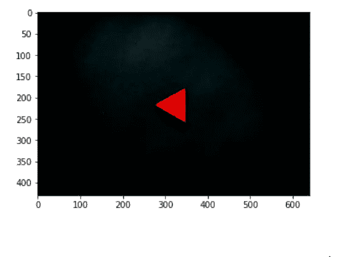

> 以枢轴为中心逆时针旋转 30 度

```
img_p_new = img_p.rotate(30)
plt.imshow(img_p_new)
plt.show()
```


# **仿射变换**

*   涉及图像平移和旋转的变换。
*   但是这种变换是以这样一种方式完成的，即图像中的直线永远不会弯曲。

> 使用 OpenCV 的仿射变换

```
**import** **numpy** **as** **np**
**import** **cv2**
**from** **matplotlib** **import** pyplot **as** plt
img = cv2.imread("imgs/chapter4/tessellate.jpg", -1)
plt.imshow(img[:,:,::-1])
plt.show()
```

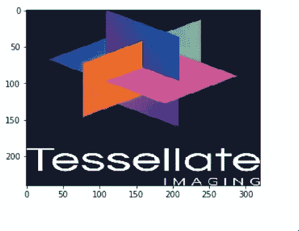

> 保持两点不变

```
img = cv2.imread("imgs/chapter4/tessellate.jpg", -1)
rows,cols,ch = img.shape

*# Read as x, y*
pts1 = np.float32([[50,50],[200,50], [50,200]])
pts2 = np.float32([[80,50],[200,50], [50,200]])

cv2.circle(img,(int(pts1[0][0]),int(pts1[0][1])),5,(0,255,0),-1)
cv2.circle(img,(int(pts1[1][0]),int(pts1[1][1])),5,(0,0,255),-1)
cv2.circle(img,(int(pts1[2][0]),int(pts1[2][1])),5,(255,0,0), -1)M = cv2.getAffineTransform(pts1,pts2)
dst = cv2.warpAffine(img,M,(cols,rows))

f = plt.figure(figsize=(15,15))
f.add_subplot(1, 2, 1).set_title('Input')
plt.imshow(img[:, :, ::-1])
f.add_subplot(1, 2, 2).set_title('Transformed')
plt.imshow(dst[:, :, ::-1])
plt.show()
```

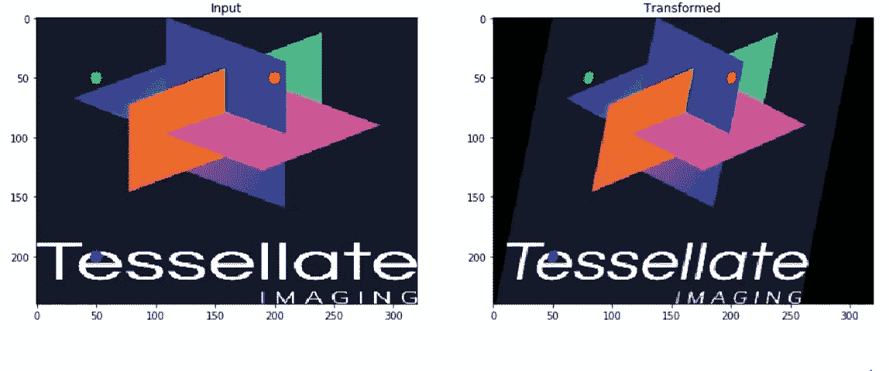

> 保持 1 点为铰链

```
img = cv2.imread("imgs/chapter4/tessellate.jpg", -1)
rows,cols,ch = img.shape

pts1 = np.float32([[50,50],[200,50], [50,200]])
*#pts2 = np.float32([[60,50],[190,50], [50,200]]) 
# Works as translation + shrinking*
pts2 = np.float32([[60,50],[200,50], [50,175]])

cv2.circle(img,(int(pts1[0][0]), int(pts1[0][1])), 5, (0,255,0), -1)
cv2.circle(img,(int(pts1[1][0]), int(pts1[1][1])), 5, (0,0,255), -1)
cv2.circle(img,(int(pts1[2][0]), int(pts1[2][1])), 5, (255,0,0), -1)

M = cv2.getAffineTransform(pts1,pts2)

dst = cv2.warpAffine(img,M,(cols,rows))

f = plt.figure(figsize=(15,15))
f.add_subplot(1, 2, 1).set_title('Input')
plt.imshow(img[:, :, ::-1])
f.add_subplot(1, 2, 2).set_title('Transformed')
plt.imshow(dst[:, :, ::-1])
plt.show()
```

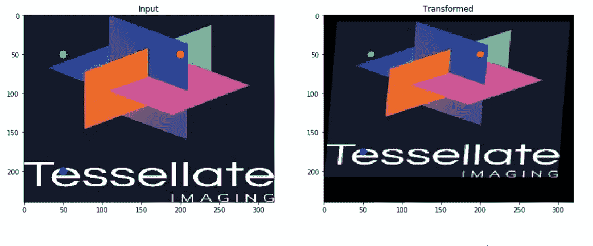

> 翻译这三点->翻译

```
img = cv2.imread("imgs/chapter4/tessellate.jpg", -1)
rows,cols,ch = img.shape

pts1 = np.float32([[50,50],[200,50], [50,200]])
pts2 = np.float32([[60,50],[210,50], [60,200]])

cv2.circle(img,(int(pts1[0][0]), int(pts1[0][1])), 5, (0,255,0), -1)
cv2.circle(img,(int(pts1[1][0]), int(pts1[1][1])), 5, (0,0,255), -1)
cv2.circle(img,(int(pts1[2][0]), int(pts1[2][1])), 5, (255,0,0), -1)

M = cv2.getAffineTransform(pts1,pts2)

dst = cv2.warpAffine(img,M,(cols,rows))

f = plt.figure(figsize=(15,15))
f.add_subplot(1, 2, 1).set_title('Input')
plt.imshow(img[:, :, ::-1])
f.add_subplot(1, 2, 2).set_title('Transformed')
plt.imshow(dst[:, :, ::-1])
plt.show()
```

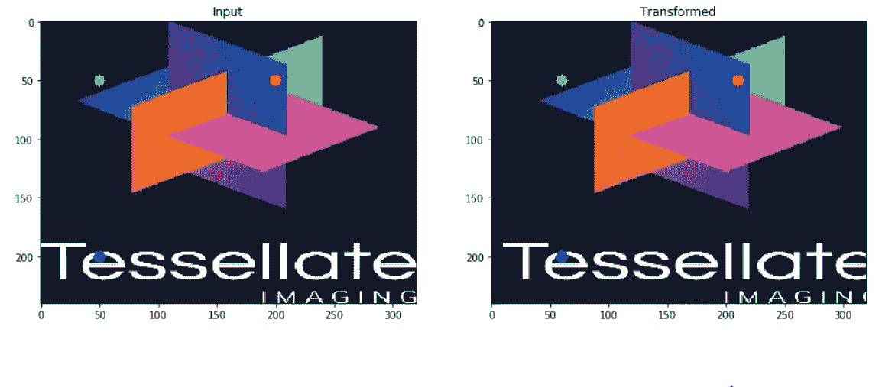

# **视角转换**

> 使用 OpenCV 进行透视变换

```
**import** **numpy** **as** **np**
**import** **cv2**
**from** **matplotlib** **import** pyplot **as** plt
img = cv2.imread("imgs/chapter4/cube.png", 1)
plt.imshow(img[:,:,::-1])
plt.show()
```

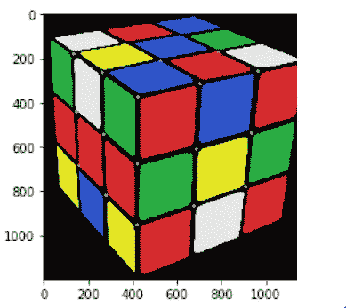

> 从视图放大

```
img = cv2.imread("imgs/chapter4/cube.png", 1)
img = cv2.resize(img, (400, 400))
rows,cols,ch = img.shape

*# Counter clock wise*
pts1 = np.float32([[130,130],[390,75],[360,320],[140, 390]])
pts2 = np.float32([[0,0],[0, 200],[200,200],[200,0]])

*# uncomment each and see*
cv2.circle(img,(int(pts1[0][0]),int(pts1[0][1])),5,(255,255,255), -1)
cv2.circle(img,(int(pts1[1][0]), int(pts1[1][1])), 5, (255,255,255), -1)
cv2.circle(img,(int(pts1[2][0]), int(pts1[2][1])), 5, (255,255,255), -1)
cv2.circle(img,(int(pts1[3][0]), int(pts1[3][1])), 5, (255,255,255), -1)

M = cv2.getPerspectiveTransform(pts1,pts2)

dst = cv2.warpPerspective(img,M,(cols,rows))

f = plt.figure(figsize=(15,15))
f.add_subplot(1, 2, 1).set_title('Input');
plt.imshow(img[:, :, ::-1])
f.add_subplot(1, 2, 2).set_title('Transformed');
plt.imshow(dst[:, :, ::-1])
plt.show()
```

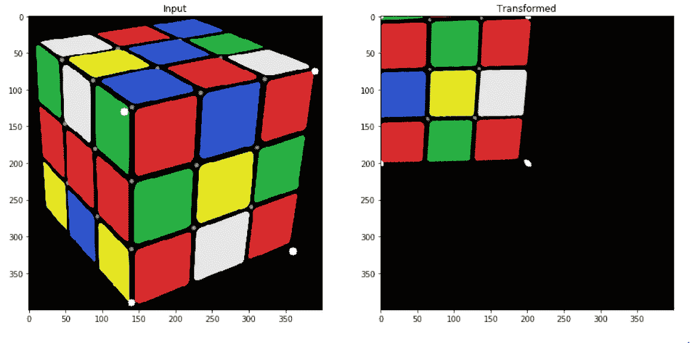

你可以在 [Github](https://github.com/Tessellate-Imaging/monk_v1/blob/master/study_roadmaps/3_image_processing_deep_learning_roadmap/1_image_processing_basics/4)%20Geometric%20transformations%20on%20images.ipynb) 上找到完整的 jupyter 笔记本。

有问题可以联系 [Abhishek](https://www.linkedin.com/in/abhishek-kumar-annamraju/) 和 [Akash](https://www.linkedin.com/in/akashdeepsingh01/) 。请随意联系他们。

我对计算机视觉和深度学习充满热情。我是 [Monk](https://github.com/Tessellate-Imaging/Monk_Object_Detection) 库的开源贡献者。

你也可以在以下网址看到我的其他作品:

[](https://medium.com/@akulahemanth) [## 阿库拉·赫曼思·库马尔培养基

### 阅读阿库拉·赫曼思·库马尔在媒介上的作品。计算机视觉爱好者。每天，阿库拉·赫曼思·库马尔和…

medium.com](https://medium.com/@akulahemanth)