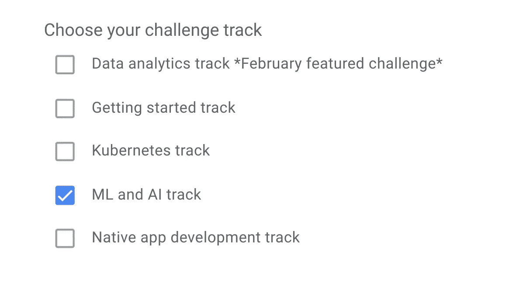
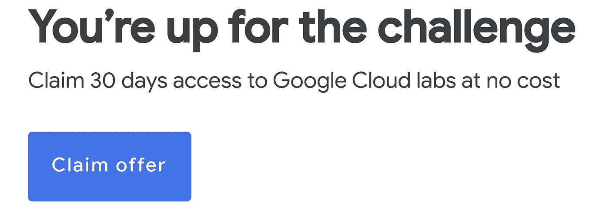

# 在短短 30 天内获得谷歌人工智能技能徽章

> 原文：<https://pub.towardsai.net/get-a-google-ai-skills-badge-in-just-30-days-5c51100bd766?source=collection_archive---------1----------------------->

## [教育](https://towardsai.net/p/category/education)

## 了解未来🚀

[凯文泽尔](https://unsplash.com/@kai_wenzel?utm_source=medium&utm_medium=referral)在 [Unsplash](https://unsplash.com?utm_source=medium&utm_medium=referral) 上拍照

谷歌是世界上最大的人工智能公司。

虽然有一些市值更大的公司，如微软和亚马逊，但没有一家像谷歌一样深入地嵌入了人工智能。

谷歌人工智能工作的领导者杰夫·迪恩[说了这样的话:](https://www.wired.com/2016/06/how-google-is-remaking-itself-as-a-machine-learning-first-company/)

> “让每个(谷歌)工程师都至少掌握一些机器学习知识，这将是一件好事。”

简而言之，谷歌是一家以人工智能为先的公司，这使得谷歌成为学习人工智能的一个令人惊叹的教育资源。为什么不向行业领导者学习呢？

# 谷歌技能挑战

谷歌提供了许多“技能挑战”，在这些挑战中，你可以选择一个挑战轨道，如人工智能和机器学习，并获得 30 天的免费机会来完成动手实验室，并获得技能徽章。

## ML 和 AI 跟踪

人工智能和人工智能课程面向数据科学家和人工智能工程师，他们准备好证明自己在谷歌云工具(如 BigQuery、云语音 API、人工智能平台和云视觉 API)方面的技能。

换句话说，它不适合初学者。也就是说，即使是完全的初学者也可以用[无代码 AI](https://www.obviously.ai/post/free-no-code-ai-crash-course) 构建和部署 AI 模型。

# 注册

2 月底前可以在[这个链接](https://inthecloud.withgoogle.com/google-cloud-skills/register.html?utm_source=google&utm_medium=blog&utm_campaign=FY20-Q4-global-trainingandenablement-website-other-skills_challenge&utm_content=kick_off_2021_ml_ai&utm_term=-)报名。该网站有一个供您填写的快速表格，之后，您将收到一封电子邮件，让您可以通过 Qwiklabs 免费访问谷歌云实验室，参加您选择的挑战。

“选定的挑战”就是你在注册表格中点击的曲目。

从那里，它是几个点击开始！您将在电子邮件中收到以下内容，您可以免费使用谷歌云实验室 30 天。

在 ML 和 AI 领域，有三种产品:

*   与机器学习 API 集成
*   在谷歌云中执行基础数据、ML 和 AI 任务
*   探索具有可解释人工智能的机器学习模型

# 值得吗？

人们往往对证书、徽章之类的东西着迷。

不幸的是，这些对大多数雇主来说并没有什么不同，他们希望确信你的附加值、你的适合度和你的交付能力。

证书不能做到所有这些，但是*课程*仍然是值得的，因为持续的学习是必须的。人工智能变化非常快，新的人工智能工具和技术层出不穷。如果你没有学习这些构建和部署人工智能的新方法，那么你将会落后。

# 摘要

人工智能每天被数十亿人使用，人工智能内部创业者和企业家有无数的机会。

如果你是高技术人员，谷歌人工智能技能徽章是一个很好的方式来正式化你的知识，但即使是非技术人员也可以用无代码工具构建和部署人工智能。