# 摆脱 Web 开发恐惧症—第 1 部分

> 原文：<https://pub.towardsai.net/get-rid-of-web-developments-phobia-part-1-abc3a04152d0?source=collection_archive---------5----------------------->

## [编程](https://towardsai.net/p/category/programming)

## 把基本面搞下去，你做的每件事的水平都会上升


照片:[蒂姆·高](https://www.pexels.com/@punttim)通过[派克斯](https://www.pexels.com/photo/man-in-white-shirt-using-macbook-pro-52608/)

这篇文章包含了关于 HTML 和 CSS 的一些基本知识。

> 标签，标题标签，插入样式表
> 
> 相对路径、元素、单位
> 
> 保留空白、跨度、不透明度
> 
> 超文本参考，源，目标

到下一篇文章，你就能设计一个静态的响应式网站，并理解网站的任何前端代码。这些文章包含了基于元素功能的信息，因为在 HTML 和 CSS 中有很多东西是相似的。

## 动机

如今，web 开发在我们的日常生活中起着至关重要的作用，每个人都需要一个网站。人们使用网站来展示投资组合，与人们互动，与 ML 模型集成，描绘项目的想法，等等。


我的座右铭是，没有必要学习完整的 web 开发，除非你想成为一名前端 web 开发人员。但是，每个人在日常生活中都需要网站。所以，从网上获得网站代码并在网站上做你喜欢的修改是可以的，或者你可以根据你所拥有的时间来设计一个网站，因为时间是宝贵的，不要浪费在你不喜欢的事情上。

## 介绍

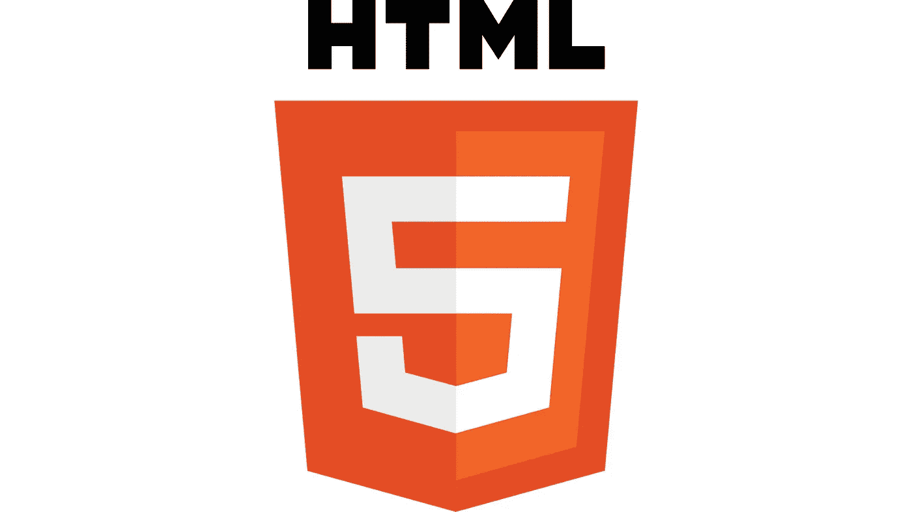

**HTML** 代表**H**yper**T**ext**M**arkup**L**语言。超文本是指一个页面可以包含的超链接，标记语言是指以标签(< tag >)形式编写脚本的风格，其中网页的对齐和内容完全基于标签。HTML 是一种不区分大小写的语言。

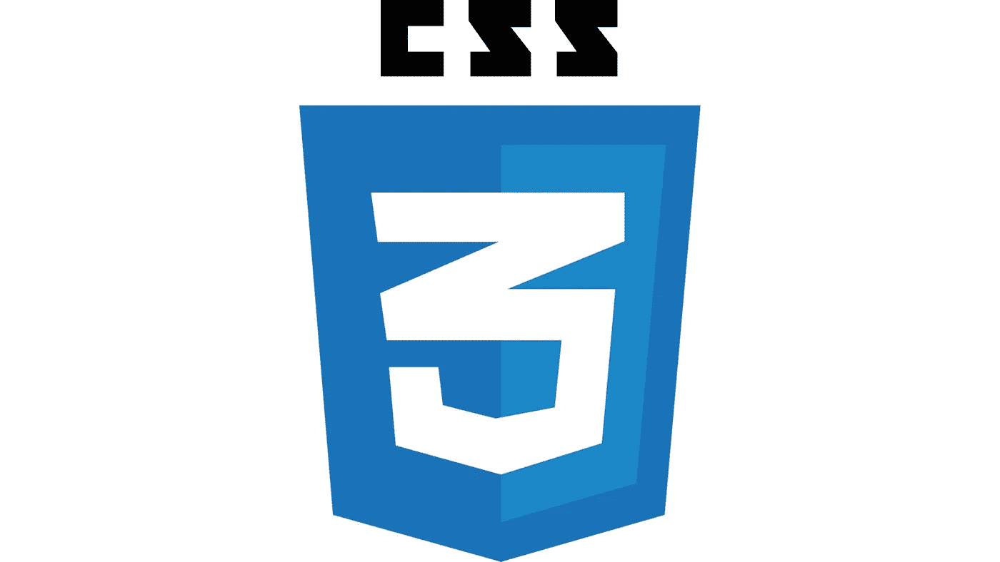

**CSS** 代表**C**as cading**S**style**S**sheets。它用于设计网页的样式，描述网页的内容和布局。CSS 的主要目的是有效地呈现网站。如果几个网页有相似类型的样式，那么 CSS 有助于定义样式，它链接到所有的网页。整个 CSS 引用内容并为各自的内容定义样式。CSS 是一种**不区分大小写的**语言，除了选择器名，比如类名和 id 名。

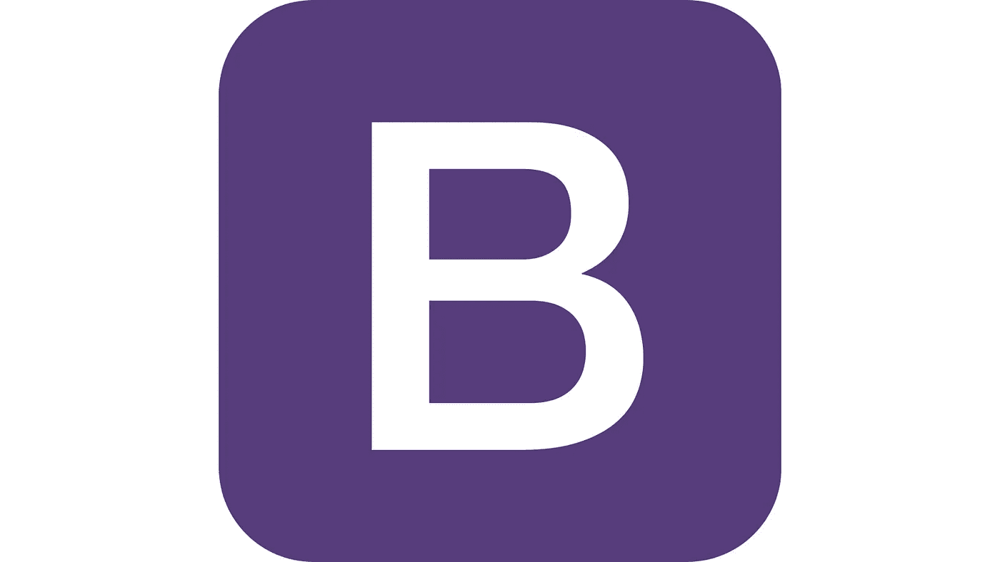

**Bootstrap** 是一个开源框架，包含 HTML、CSS、Javascript，用于设计基于屏幕大小的响应式网页，尤其适用于手机。完整的外部源代码可以在 Bootstrap 中找到，用于网页的每个组件。建议用 Bootstrap 设计一个网站。因为如果你不是初学者，它会节省很多时间。

## 入门指南

## 标签

标签是表示 HTML 文档结构的基本单词。如果元素包含额外的内容，那么它必须在开头有一个**开始标签**，在结尾有一个**结束标签**。

**例如:**

> # 标题
> 
> 段落

**自结束**标签是一个空元素，严格来说不需要任何结束标签。因为它没有内容。不一定要在标签的末尾加上“/”字符。

**例如:**

> 

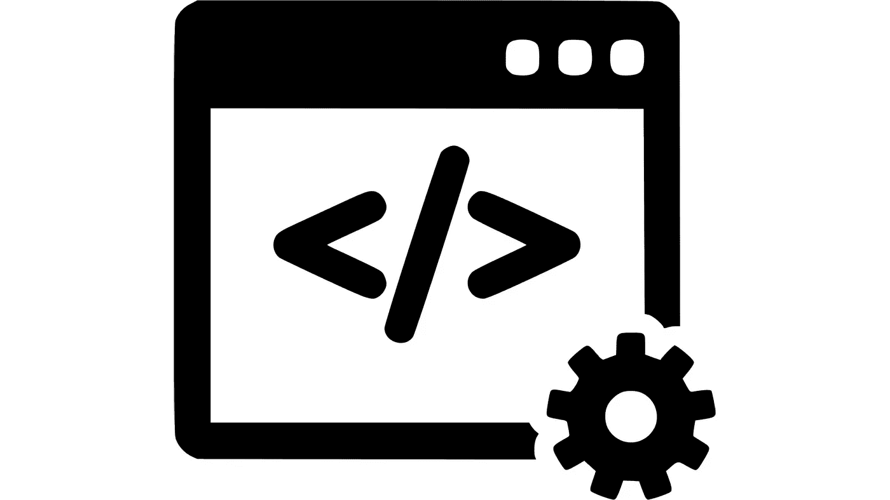

## 头部标签

Head 标签是**元数据**的容器。Head 标签中的内容不会显示在浏览器中。Head 标签的主要目的是定义文档标题、字符集、样式、脚本等。当您浏览特定的 HTML 页面时，浏览器和搜索引擎会引用元数据。

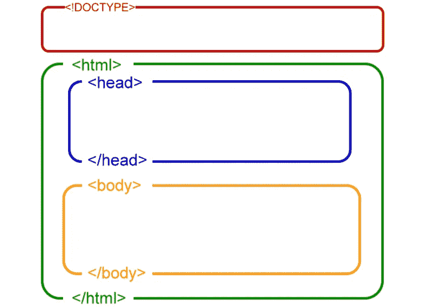

HTML 页面的基本结构

## 插入样式表

有三种方法可以将 CSS 文件插入 HTML 文件:

> 外部 CSS
> 
> 内部 CSS
> 
> 内嵌样式

**使用外部 CSS 样式表:**

在这种情况下，借助 head 标签内的 link 标签，外部 CSS 文件被链接到 HTML 文档。总是建议使用**外部样式表链接**。我们可以很容易地在 CSS 文件中进行修改，而不会干扰主 HTML 文件。这导致网站加载速度更快。

**使用内部 CSS 样式表:**

名称本身定义了在 HTML 页面中编写 CSS 代码。CSS 的内容写在 body 标签内的 style 标签中。设计网页样式不需要额外的纸张。这也可以称为嵌入式样式。

**使用内嵌样式:**

HTML 元素内部使用了**样式**属性。所有的 CSS 属性都可以以串行格式包含在样式属性中。style 属性将相应的 CSS 属性分配给 HTML 元素。与内部和外部样式相比，样式属性的优先级非常高。

> style = " property:value；属性:值；属性:值；…等等”

## 相对路径

某个文件对应于该文件当前位置的路径称为相对路径。很多人搞砸了链接一个页面到另一个页面。但是，如果我们理解了层次，这就很容易了。

> **../** 是回到上一级(下一级)
> 
> **【文件夹名称】/** 进入指定文件夹(上层)

跟随红色省略号以便于理解。

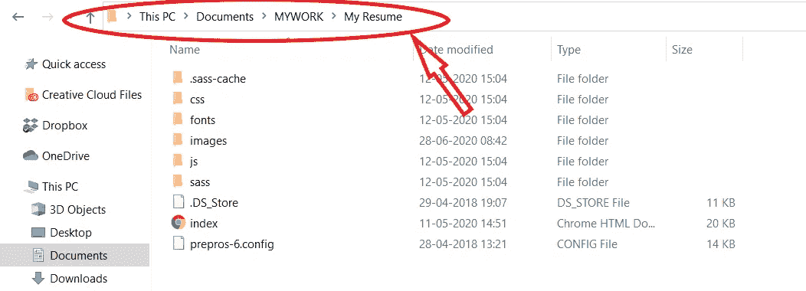

上图中，所有的元素都在同一水平线上。要将**图像文件夹**中的图像转换成 HTML 文件(index.html ),您应该向上移动一级。使用命令:

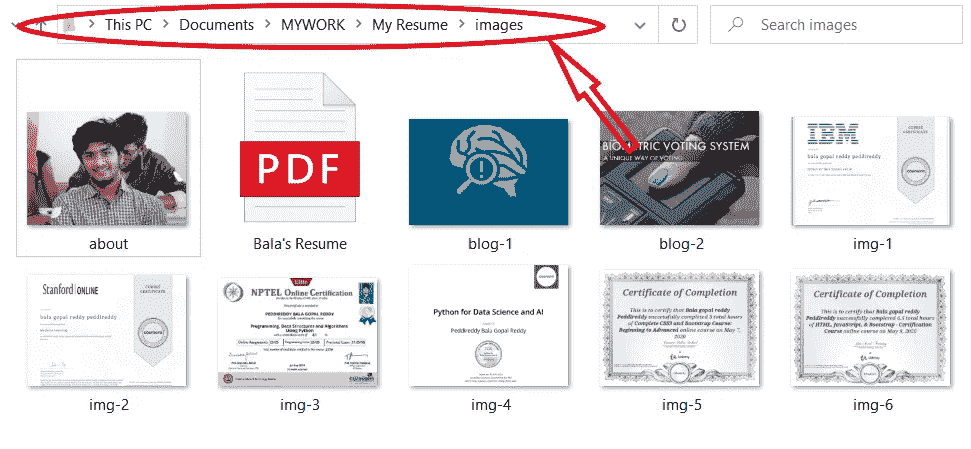

> 图片/about.jpg

如果图片在**下载文件夹**中，你需要把它放到同一个 HTML 文件(index.html)中。

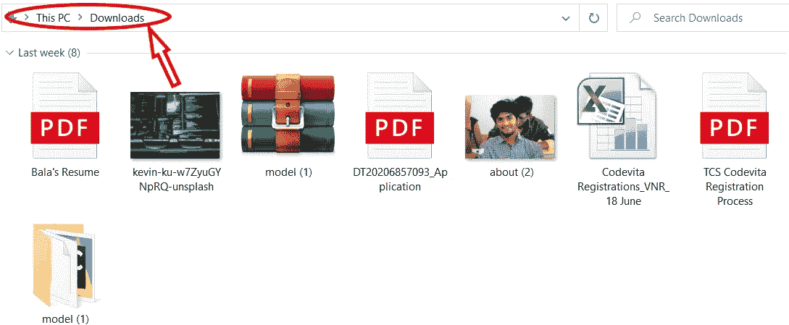

往回走三层，直到你到达**这个 PC 文件夹**，进入**下载文件夹**，在那里你可以找到关于(2)的图片。使用命令:

> ../../../下载/关于(2)。使用 jpeg 文件交换格式存储的编码图像文件扩展名

## 元素

一个标签及其内容被称为元素。例如:

标签、

# 标签等。一些元素没有内容，例如、
、<link>

**HTML 元素的语法是**

<opening tag="">内容</opening>

HTML 元素有两种类型:

**块级元素:**

块级元素总是以一个分隔线开始，该分隔线根据内容以网页的完整宽度和所需高度占据一个块区域，并以换行符结束。

**行内元素:**

内联元素不占用单独的空间。内联元素中的内容随流动继续，并在不换行的情况下获得必要的宽度。

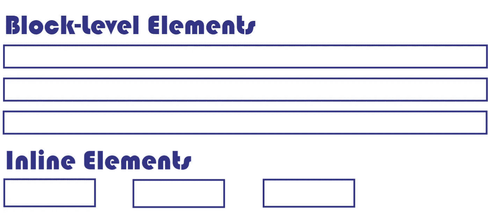

## 单位(像素，em，%)

长度几乎用于所有的 CSS 属性，如宽度、高度、边距、边框、填充等。

> 像素(1px = 1 英寸的 1/96)
> 
> 厘米-厘米(1 厘米= 96px/2.54)
> 
> 毫米-毫米(1 毫米= 1 厘米的十分之一)
> 
> 相对于元素字体大小的元素的 em- Size
> 
> %-相对元素占父元素长度的百分比

Px、cm 和 mm 是绝对或静态长度单位，因为这些大小不取决于视口的大小。Em & %是动态或相对长度单位，因为这些大小取决于视口的大小。

## 保留空白

这是一种保留空格(不止一个空格)、制表符、换行符等的技术。这可以通过使用一个前置标签(

```
)来实现，前置标签是一个预先格式化的文本块，它显示包括空白的内容。
```

但是，在段落标记(

)中，它只显示字符和单个空格字符，而不考虑内容之间的空白。

不换行空格( **& nbsp** )是 HTML 中不换行的实体，网页将其视为单个空格。它可以用来在段落标签中实现多个空格。

## 跨度

span 标记是一个内联元素，用于突出显示其内容。

## 不透明

不透明度描述元素的透明度，范围为 0 到 1(不可见到完全可见)。通过降低不透明度的值，元素被白化。多用于元素的悬停效果。

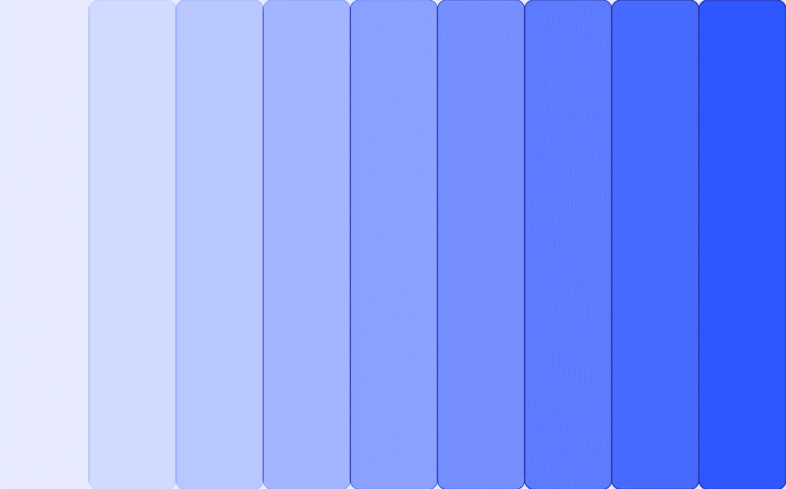

不透明度(不可见->可见)

## 超文本参考

超文本链接是一种属性。名字本身表明它指的是超文本。href 属性的目的是提供从一个页面到另一个页面的链接。锚标签< a >总是包含这个属性。它有两个部分。它们是，

> 锚文本:-代表链接的可见文本，也是可点击的。
> 
> URL:-不可见的部分，指引你到另一个位置。

href 属性引用不同类型的 URL。

> 绝对 URL:-文件的完整链接
> 
> 相对 URL:-基于您正在键入的当前 HTML 文件的文件位置
> 
> 网页的部分:-它使用选择器来引用同一网页上的其他部分。
> 
> 其他功能:-它指的是电话号码、邮件 ID 等。

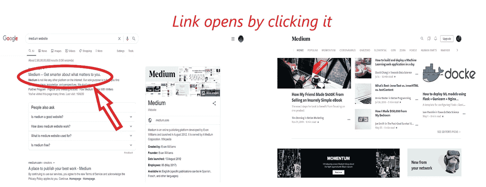

## 来源(src)

source 是一个属性，也是一个自结束标记，它定义了外部资源(如图像、视频、音频、iframe 等)的路径。这个属性的值是一个 URL，它可以是资源的相对或绝对路径。

## 目标

目标是一个属性，它确定单击链接后要打开的外部资源的位置。外部资源根据目标属性的值打开。那些是，

> _blank:-在新窗口(或)选项卡中打开链接的资源。
> 
> _self:-在同一框架中打开链接的资源(默认)。
> 
> _parent:-在父框架中打开链接的资源。
> 
> _top:-在整个窗口中打开链接的资源。

在下一篇文章中，我将写关于 CSS 的剩余基础知识和引导程序的基础知识。

我希望你喜欢这篇文章，如果文章中有任何错误，请纠正我！🤝🤝🤝

# 快乐学习！😎