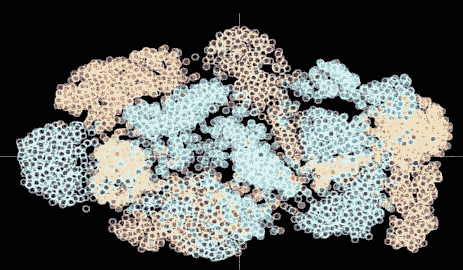
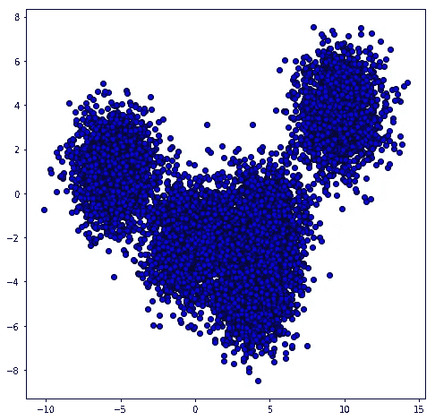
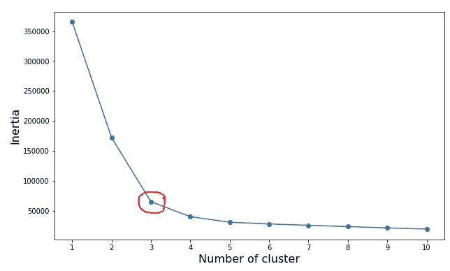
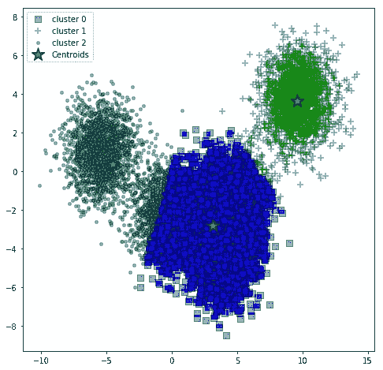
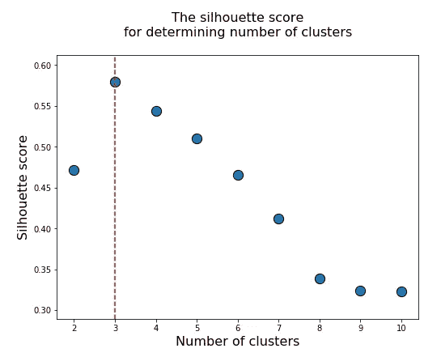
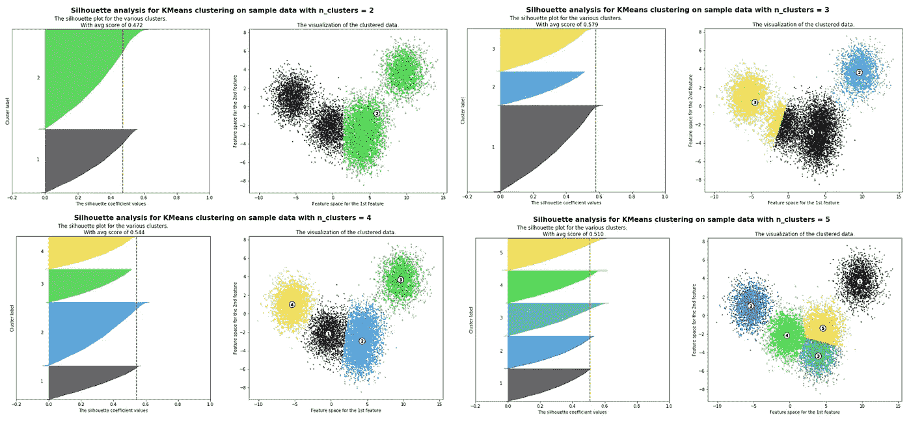
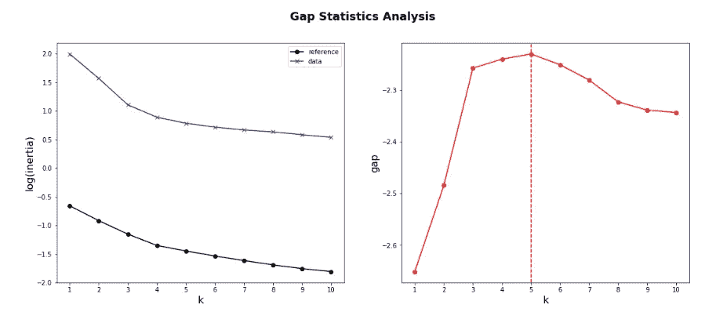
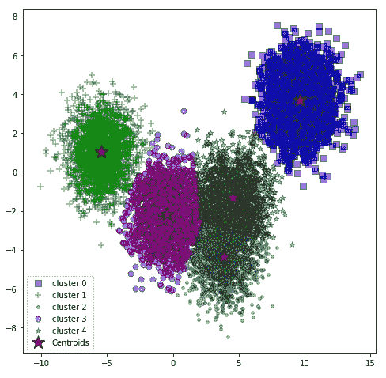

# 求 K-均值聚类中的最优 K

> 原文：<https://pub.towardsai.net/get-the-optimal-k-in-k-means-clustering-d45b5b8a4315?source=collection_archive---------0----------------------->

照片由 [Fotis Fotopoulos](https://unsplash.com/@ffstop?utm_source=unsplash&utm_medium=referral&utm_content=creditCopyText) 在 [Unsplash](https://unsplash.com/s/photos/coding-cluster?utm_source=unsplash&utm_medium=referral&utm_content=creditCopyText) 上拍摄

## [机器学习](https://towardsai.net/p/category/machine-learning)、[教程](https://towardsai.net/p/category/tutorial)

## 提供快速入门指南，以便在 K-means 聚类中找到最佳的聚类数

## 介绍

聚类(或聚类分析)有助于识别和分组数据点，这些数据点使用某种距离度量与数据块或数据段密切相关。聚类被归类为机器学习空间内的无监督学习，这意味着没有标记。

对于利用数据科学的商业或公司来说，它是机器学习中的重要技术之一。几个使用案例是:

*   在金融行业，可以使用异常检测来识别可疑活动和个人
*   在生物学中，聚类用于寻找具有相似特性或表达模式的基因组
*   在营销科学中，聚类用于通过各种特征来识别相似客户的细分。有了这些细分市场，企业可以制定个性化的营销策略和计划，以相应地应对每个细分市场

***k*-means clustering**(不要与机器学习技术混淆:k-nearest neighborhood classifier)是数据挖掘中聚类分析的常用方法。该方法旨在将给定的观察值划分为 ***k*** 个簇，其中每个观察值都在具有**最近均值**的簇中。

K-means 聚类被归类为 ***基于原型的聚类*** ，因为每个聚类由一个原型表示，该原型可以是具有连续特征的相似点的**形心** ( *平均值*)，或者是分类特征情况下的 **medoid** (最具*代表性的*或最频繁出现的点)。

选择正确数量的 ***k*** 类可能有点棘手，本文将展示 k-means 聚类的基本原理以及如何选择正确数量的类，这将帮助您启动您的聚类项目。

聚类样本

## 基本原则

有多种聚类算法，这些算法基于备选策略来解决问题。有两种主要的聚类技术；

1.  **硬聚类**技术，其中每个观察值必须只属于一个单独的聚类
2.  **软**(或**模糊** ) **聚类**，这是一种替代方法，它基于一个成员分数，该分数定义了元素与每个聚类兼容的程度。

*-表示聚类算法将*

1.  *随机分配简单点作为起始聚类中心(或**质心**)。*
2.  *然后，该算法将迭代地将质心移动到样本的中心。这种迭代方法使组内误差平方和最小化，有时称为组惯性。*
3.  *继续步骤(2 ),直到达到定义的公差或达到最大迭代次数。*

*当质心移动时，它会计算 ***平方欧氏距离*** 来衡量样本和质心之间的相似性。因此，k-means 非常擅长识别具有球形形状的聚类(因为它使用平方欧几里得距离)。这也是一个缺点，因为在现实中，数据点不会是这样的形状，k-means 不考虑方差，并且在高维时具有维数灾难的影响。*

*k-means 的另一个缺点是用户需要指定聚类数，*。这可能会导致分析和聚类性能下降。在本文中，我将展示几种有效选择 k-means 聚类数的方法。**

## **我的“k”是什么？**

**这个问题没有明确的解决方法；什么是'**'最佳**'集群数。聚类的最佳数量在某种程度上是主观的(尤其是在商业领域),并且取决于用于测量相似性的方法和聚类期间使用的参数。**

**有两种方法可以使用:**

1.  ****直接方法**包括优化标准(即在聚类平方和内)。*弯头*和*剪影*的方法都在此方法中。**
2.  ****统计检验法**这种方法将证据与原假设进行比较。*缺口统计*就是其中一个例子。**

**这是要演示的数据点的示例，让我们来看看每一种方法。**

****

**它们有多少个集群？**

# **1.肘法**

**众所周知的**肘法**是基于最优簇数必须产生**小惯性、**或总簇内变异**的假设来确定簇数。**因此，惯性和集群数量之间会有一个权衡。**

**有了这个概念，我们应该选择一些集群，这样添加另一个集群不会有太大的改善。**

****

**弯头位于 ***k* = 3****

**我们可以看到 3 个集群的惯性显著下降，我们通常称之为 ***肘*** 。**

**然后，我们可以使用它作为一些集群，如下所示。集群和你的直觉相似吗？**

****

**使用肘方法可视化 3 个集群**

# **2.剪影法**

**侧影分数衡量观察结果的聚类程度，并估计聚类之间的平均距离。它希望找到最佳数量的聚类，这些聚类将数据集细分为彼此分离的密集块。有关更多信息，我将参考此处的[以获取实施指南和定义。](https://scikit-learn.org/stable/modules/generated/sklearn.metrics.silhouette_score.html)**

**该值将介于-1 和 1 之间，而接近 0 的值表示重叠的簇。负值通常表示观测值被分配到了错误的聚类。**

****

**每组数的轮廓系数**

**我们可以清楚地看到`silhouette score`如何在 k=3 时达到峰值，这表明有 **3 个致密团聚体**。**

**而且，我们还可以对剪影情节做更多的处理。它显示一个聚类中的每个点与相邻聚类中的点的接近程度。**

**样本可视化如下所示。**

****

**2 至 5 个集群的轮廓图**

**即使剪影得分在 k=3 时显示最高分，但在聚类数据上，我更喜欢使用 k=4(甚至 5 个聚类)。你怎么想呢?**

# **3.差距统计法**

**差距统计是由[蒂布希拉尼、瓦尔特和哈斯蒂在他们 2001 年的论文](https://web.stanford.edu/~hastie/Papers/gap.pdf)中提出的。它将不同的 *k* 值的总体组内变异与数据的零参考分布下的预期值进行比较。因此， *k* 的最佳选择是使间隙最大化的值(意味着聚类结构远离点的随机均匀分布)。**

****

**k=5 产生最高的间隙值**

****

**5 个集群的可视化**

**然后，我们可以使用差距统计法中的 k=5 在`KMeans`中使用，并可视化聚类结果。**

**这实际上是唯一的方法，它正确地将数据聚集成 5 个簇。**

**生成起始数据块的源代码**

**这些并不是找到最佳的聚类数的唯一技术。还有一些其他的技术，如 Calinski-Harabasz 指数，集群不稳定性等，每种技术都有自己的优点和缺点。**

**希望这能给你关于***K-均值聚类*** 的直觉，以及我们如何为聚类找到最优的 *k* 。**

**关于本教程的完整代码，请访问我下面的 GitHub 库:**

** [## netsatsawat/tutorial _ kmeans 集群

### 此时您不能执行该操作。您已使用另一个标签页或窗口登录。您已在另一个选项卡中注销，或者…

github.com](https://github.com/netsatsawat/tutorial_KmeansClustering)**