# 使用 AWS 获得大数据/云计算工作流的峰值

> 原文：<https://pub.towardsai.net/getting-a-peak-of-the-big-data-cloud-computing-workflow-using-aws-b9360327c8df?source=collection_archive---------3----------------------->


泰勒·维克在 [Unsplash](https://unsplash.com?utm_source=medium&utm_medium=referral) 上的照片

虽然我现在有机会接触这些不同的技术，但我仍然对大数据和云计算技术为消费者和企业提供的便利性、便携性和计算能力感到惊讶。例如，从消费者的角度来看，他们能够从任何设备访问所有重要信息，而不必担心丢失信息或忘记设备。从技术或数据从业者的角度来看，他们能够利用原始处理能力和数据存储能力，如果技术不存在，他们可能永远无法获得这些能力。虽然人工智能、机器学习、数据科学或分析等时髦词汇最近都在大肆宣传，但对我来说，云计算和云存储的进步作为创新的*和*关键驱动力之一从未得到足够的喜爱；让我们能够以真正变革的方式工作、协作和扩展解决方案。

既然我们已经唱出了对云计算的赞美，现在让我们关注数据从业者在利用这些技术来利用大数据和生成可操作的见解方面的观点。在本文中，我想为那些对大数据领域感兴趣的人展示一个数据科学家在处理大数据时的工作流程，使用**亚马逊网络服务(AWS)** 提供的行业标准工具。更具体地说，我将回顾:

1.  如何访问存储与并行处理框架， [**Hadoop 文件存储系统(HDFS)**](https://aws.amazon.com/emr/details/hadoop/what-is-hadoop/)；
2.  如何将数据上传到亚马逊的 [**S3 的**](https://docs.aws.amazon.com/AmazonS3/latest/userguide/Welcome.html) 云存储系统；
3.  如何利用 **PySpark** 大规模争论和分析数据；
4.  如何把你的作品存回 HDFS，然后搬回 S3；
5.  如何连接笔记本环境，比如 **JupyterLab** 或者亚马逊的 **SageMaker** 。

请记住，在 AWS 上有许多方法可以完成相同的任务。除了已经拥有一个 AWS 帐户之外，熟悉 Python、Bash 和基本编程概念是获得本文价值的软先决条件。您还需要一个安全密钥，该密钥是在您最初注册 AWS 帐户以访问 Amazon 的 EC2 平台上的虚拟机时在一个. pem 文件中提供给您的。好了，让我们开始吧！

**1。旋转 AWS 弹性地图减少(EMR)集群**

跨云计算平台的第一步是启动 Hadoop 集群，以支持我们之前提到的存储和并行处理。亚马逊的 EMR 平台允许我们与 Apache 的 Hadoop 框架对接，以处理我们将使用的大型数据集，这是我们在计算云计算成本时必须牢记的因素，无论我们何时租用亚马逊的资源，亚马逊都会向我们收取费用。

我们将使用的大多数工具都可以在“分析”子菜单下的“服务”菜单栏中找到。

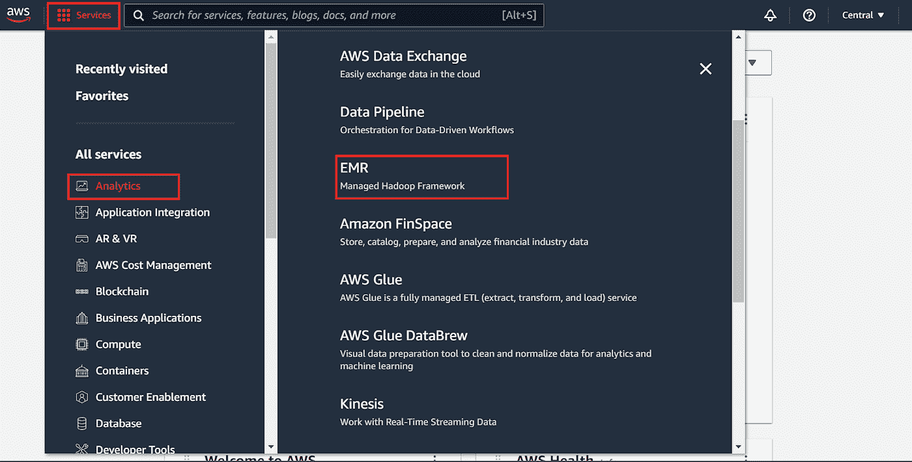

来源:图片由作者提供

接下来，我们想点击*创建一个集群*，并概述我们在第 1 步中的工作所需的规范。我们在这里要做的第一件事是点击*转到高级设置*超链接，因为我们工作的规格将比*快速选项*设置中提供的规格更精细。导航到高级设置会将我们带到*步骤 1:软件和步骤。*

在这个演练中，我们将使用 Amazon 的 EMR 集群的旧版本，以确保我们将在 AWS 生态系统中使用的所有工具都能按预期工作。我们还想检查一下我们用于这项工作的工具套件，在本例中是 Hadoop、JupyterHub、Hive 和 Spark。

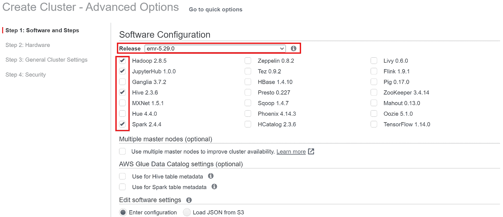

来源:图片由作者提供

对于步骤 2，我们可以保持默认设置不变。在第 3 步中，您需要在*集群名称*输入栏中命名您的集群。

接下来，进入第 4 步，指定让我们能够访问 EC2 的密钥对很重要，EC2 是 AWS 虚拟机，它让我们能够完全访问 AWS 生态系统。您的密钥对的名称应该与您给。pem 注册后。一旦您指定了您的 *EC2 密钥对*，导航到页面的右下角并点击*创建集群*。

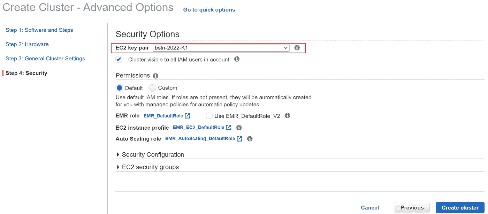

来源:图片由作者提供

**2。使用 SSH 连接到集群的头节点**

现在我们已经根据我们的工作规范配置了我们的参数，它将需要几分钟的时间来完全启动和运行。与此同时，我们可以检查以确保我们的设置以这样一种方式配置，即我们将能够通过 SSH 隧道访问我们的集群节点。为此，我们要确保我们回到了*摘要*选项卡，在*安全和访问*副标题下，我们要点击主标签的*安全组旁边的链接:*

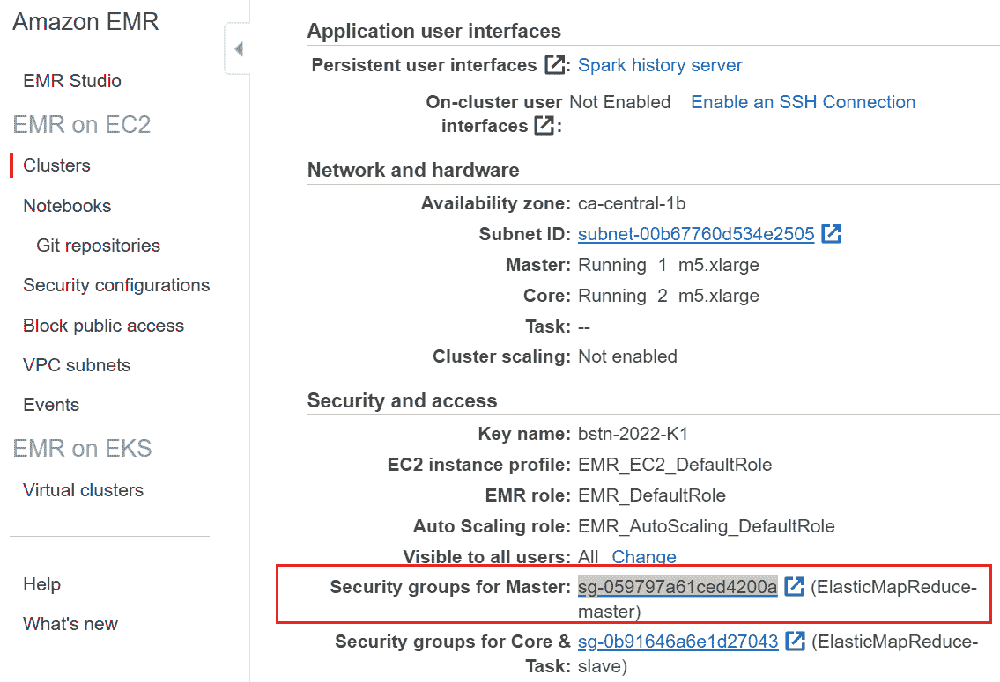

来源:图片由作者提供

单击该安全链接会将您带到*安全组*页面。在这里，您需要右键单击在其描述中提到了*主组*的安全组，并选择*编辑入站规则*:

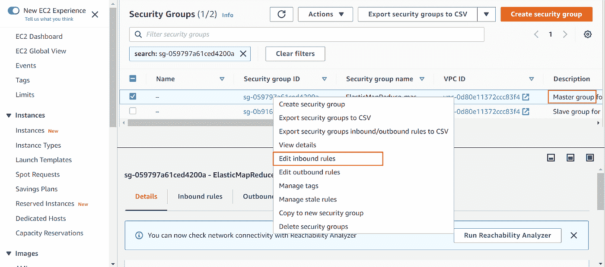

来源:图片由作者提供

最后，您需要确保其中一个入站规则已经预先选择了 *SSH* ，以及 *My IP* 选项。如果缺少其中一个选项，请使用下拉菜单选择 SSH。如果不启用 SSH 访问，我们将无法访问与计算集群交互的 EC2 虚拟机。检查完这些选项后，继续点击*保存规则*，然后导航回主摘要选项卡。希望现在集群至少显示为 **Starting** ，这样我们就可以开始建立 SSH 连接了。

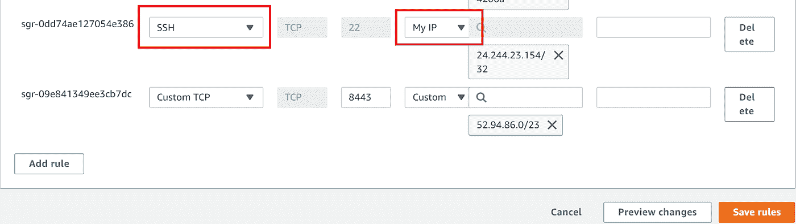

来源:图片由作者提供

在 summary 选项卡上，在显示 *Master Public DNS 的地方，*单击*使用 SSH* 连接到主节点超链接，如果您已经在计算机上安装了 **Bash 终端**，则直接导航到 Mac/Linux 选项卡，而不考虑操作系统。按照列出的说明操作，如果首先在 Bash 终端上使用 cd 命令直接导航到存储 EC2 密钥的目录/文件夹，事情会变得简单。

接下来，将指令中突出显示的 Bash 命令复制并粘贴( *Shift* + *Insert* )到您的终端，除了确保在点击*之前删除~/相对文件路径字符，输入*，然后在出现指纹提示时键入 *yes* ，如下图所示:

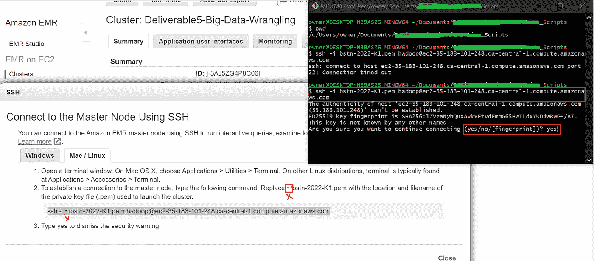

来源:图片由作者提供

如果一切顺利，您应该会在终端上看到一个 EMR 标志，表明您现在已经完全连接到 Amazon 的 EMR 计算机集群。

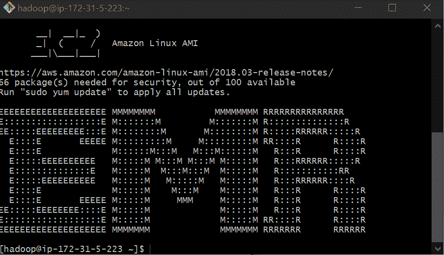

来源:图片由作者提供

**3。将文件从 S3 存储桶移动到 HDFS**

现在我们已经进入了 EMR Hadoop 框架，让我们将一个文件从公共 S3 存储桶复制到我们的 Hadoop 存储系统中。为此，请使用以下命令结构:

```
hadoop distcp {insert the S3 buckets address that you are copying from} {insert the hadoop directory you wish to move the file to}
```

就这么简单。

同样，命令结构是:

```
hadoop distcp {s3 bucket} {emr directory}
```

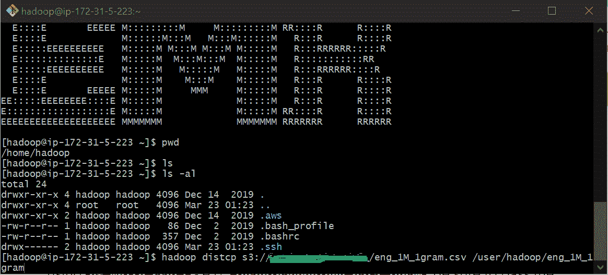

来源:图片由作者提供

**4。使用 PySpark 从 HDFS 读取文件**

厉害！现在我们已经将 CSV 文件从 S3 转移到 EMR，让我们利用 Apache 的大规模处理和分布式计算框架 PySpark 来读取数据并进行一些非常基本的探索性分析。

我们的第一步是建立另一个 SSH 隧道来访问 JupyterHub。为此，让我们导航回主摘要选项卡。向下进入*应用程序用户界面*副标题，点击*启用 SSH 连接*超链接:

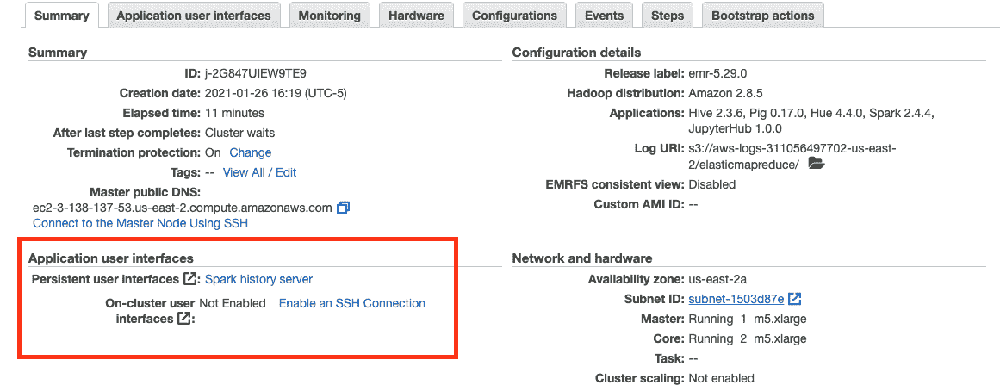

来源:图片由作者提供

这将把你带到一个与我们在步骤 2 中看到的相似的页面，因为我们基本上在重复相同的步骤。在这种情况下，第 2 步和第 4 步的最大区别在于，您需要打开另一个 Bash 终端页面，因为我们已经将前面的终端专用于建立与 EMR 的 SSH 连接。

记住不要忘记在 SSH 命令中删除密钥名文件路径中的~/字符，并在安全提示符下键入 yes:

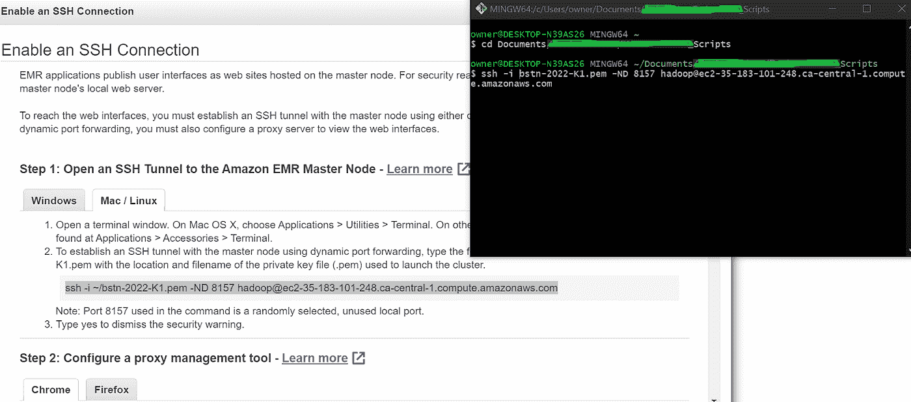

来源:图片由作者提供

建立连接后，导航回主摘要选项卡，单击摘要选项卡右侧的*应用程序用户界面*选项卡，然后将与 **JupyterHub** 关联的*用户界面 URL* 复制并粘贴到另一个浏览器选项卡中:

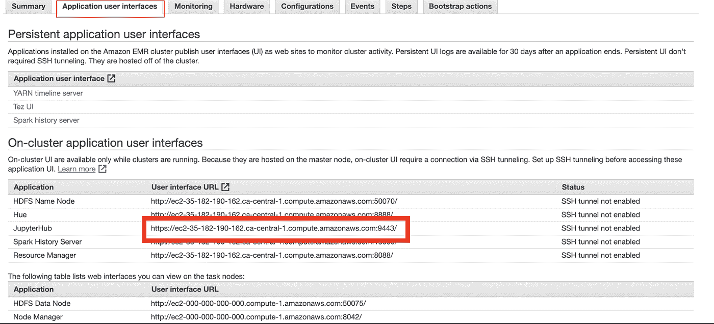

来源:图片由作者提供

如果正确执行了步骤 4 中的所有指令，我们应该会看到下面的 JupyterHub 登录页面。在访问 JupyterHub URL 时，您可能会遇到来自浏览器的安全警告。忽略它，进入下面的登录页面，在这里您可以输入与您的帐户相关的用户名和密码。

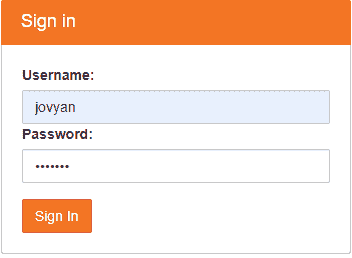

来源:图片由作者提供

一旦你登录了，界面就和你使用 Jupyter Notebook 差不多了。使用我们在 JupyterHub 中创建的笔记本，我们将使用 PySpark 完成以下任务:

读取我们从 HDFS 复制的数据，使用 **spark.read.csv(file_path，header=True)** 命令将我们的数据转换成我们现在应该非常熟悉的 DataFrame 格式；

1.  显示数据帧的模式；
2.  计算数据帧中的行数；
3.  使用 Spark SQL 过滤标记为“data”的行，并计算符合该标准的行数；
4.  最后，将我们的新数据帧保存为单独的文件，并保存在 Hadoop 中。
5.  验证我们的数据是否正确保存在 Hadoop 中。为此，我们在 Jupyter 中运行 df.write.csv()代码块之前运行了 **Hadoop fs -ls bash** 命令。运行完最后一个 Jupyter 代码块后，我们再次使用 **Hadoop fs -ls** 命令来检查我们保存为 **eng_data_1gram** 的文件是否出现在我们的 Hadoop 目录中，它确实出现了。


来源:图片由作者提供

请注意，我们在本演示中只运行简单的操作，因为在云中运行这些大规模的操作通常需要成本。


来源:图片由作者提供

**5。合并 Hadoop 文件并上传到 S3**

在过滤了“token”列中包含标签“data”的行之后，现在让我们将它与原始文件合并。我们可以使用下面的 bash 命令结构来完成这项任务:

```
hadoop fs -getmerge {filepath_doc1} {doc2_file_name}.
```

两个文件合并后，我们可以发出以下命令结构，将合并后的文件移动到 S3 存储桶中:

```
aws s3 cp {filename.format} {s3_bucket_address}.
```

最后，您需要使用以下命令列出 S3 存储桶中的内容，以验证文件是否正确地发送到了您想要的目的地:

```
aws s3 ls {s3_bucket_address}
```

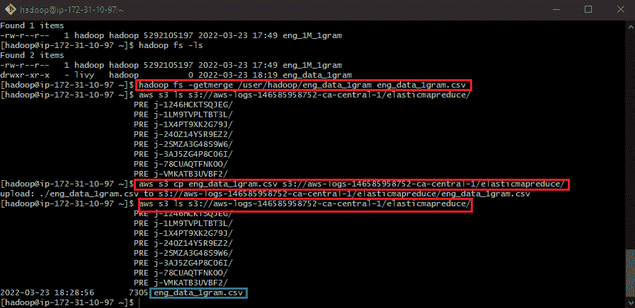

来源:图片由作者提供

**6。使用 SageMaker 从 S3 读取文件**

在本练习中，我们的最后一项行动是使用亚马逊的 SageMaker 笔记本环境和 JupyterLab 从 S3 存储桶中读取过滤后的数据，并使用传统的数据科学工具(如 pandas 和 matplotlib.pyplot)绘制图表。为此，我们将执行以下步骤:

1.  通过运行 awscli 和 s3fs 的 pip 安装来配置我们的笔记本环境；
2.  导入我们需要的包，包括 AWS 包，我们将使用它直接访问我们的 S3 桶；
3.  将 S3 数据读入熊猫数据框，并使用 matplotlib 绘制线图。

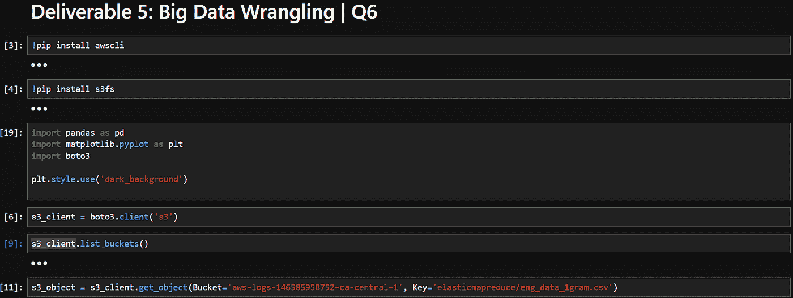

来源:图片由作者提供

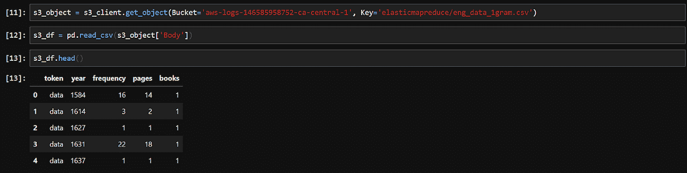

来源:图片由作者提供

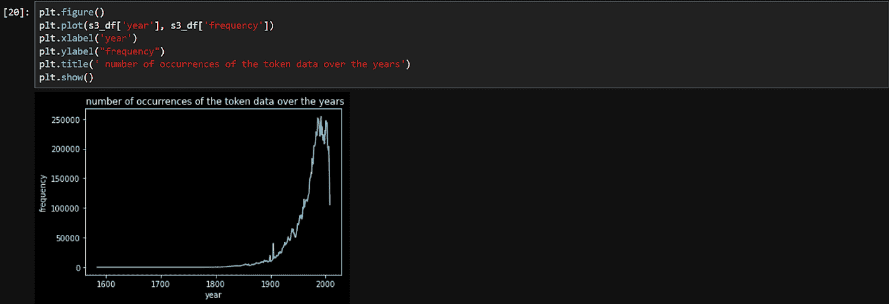

来源:图片由作者提供

就这样结束了！我希望您在阅读这篇文章时发现了价值，并能够对大数据从业者的工作流程有所了解。