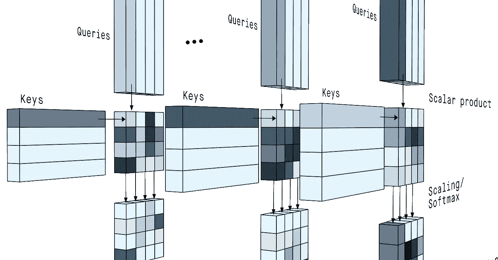
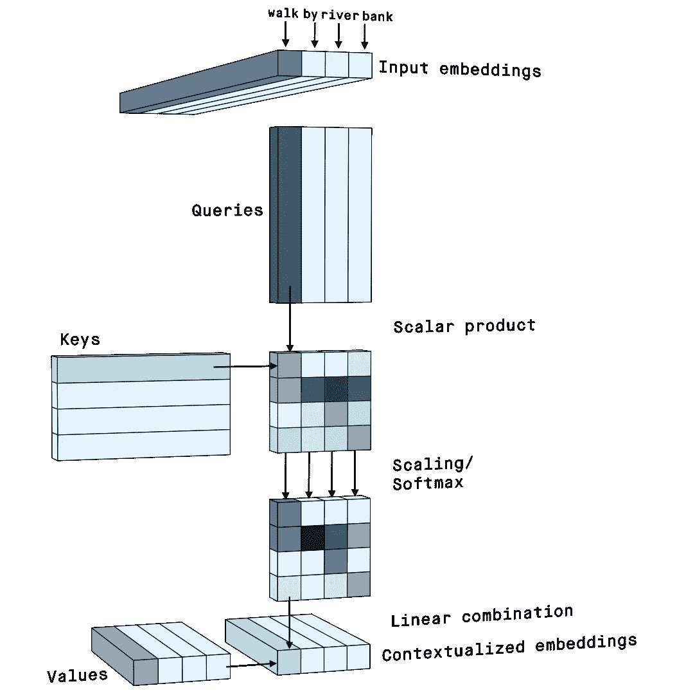
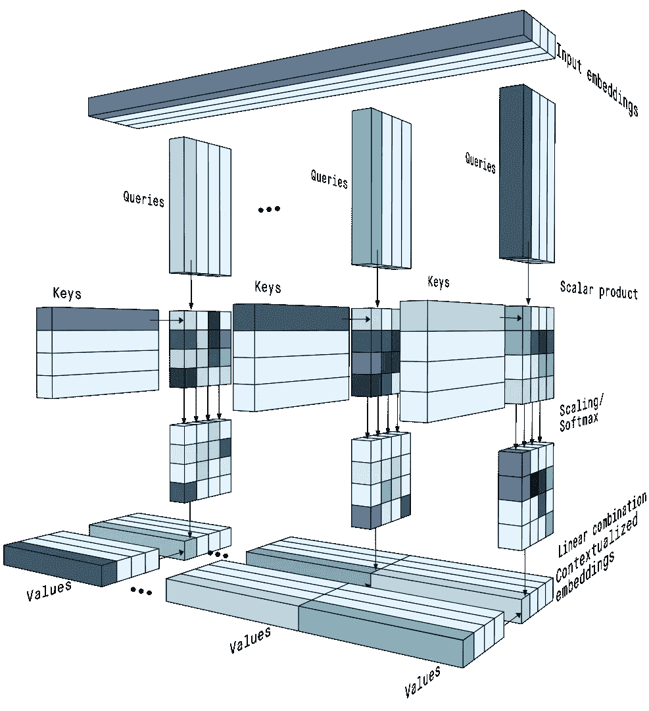
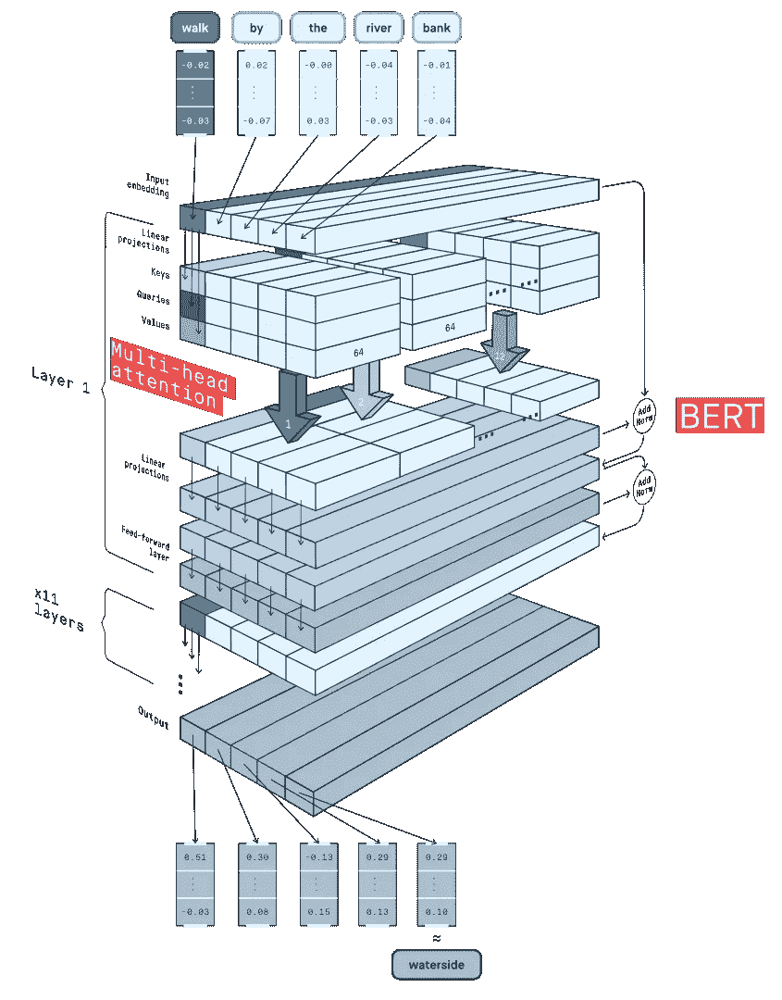

# 从文本中获取意义:自我关注分步视频

> 原文：<https://pub.towardsai.net/getting-meaning-from-text-self-attention-step-by-step-video-7d8f49694f89?source=collection_archive---------3----------------------->

## [自然语言处理](https://towardsai.net/p/category/nlp)

2019 年 10 月，[谷歌宣布](https://blog.google/products/search/search-language-understanding-bert/)将使用其研究人员开发的 BERT 模型处理搜索查询。这个模型可以抓住语言中困难的细微差别:在搜索 *2019 巴西前往美国的旅行者需要签证*，了解到该旅行者是巴西人，目的地是美国。谷歌表示，从现在开始，这一搜索将返回美国驻巴西大使馆的页面，不再显示有关美国公民前往巴西的页面。

值得注意的是，许多像 BERT 这样的变形金刚模型的核心的大部分注意力机制仅仅依赖于一些基本的向量运算。

**我们来看看效果如何。**

# 语境怎么了？

如果你看到单词 *bank* ，你可能会想到一家金融机构、你的顾问工作的办公室、在移动中给手机充电的便携式电池，甚至是湖边或河边。
如果给你更多的上下文，比如在*河边散步*，你会意识到*河岸*和*河*很配，所以它一定是指水边的土地。你也可以意识到你可以从这个河岸走过，所以它看起来一定像一条沿河的人行道。整个句子**加起来**就形成了一幅*银行*的脑海画面。

自我关注试图做同样的事情。

# 单词嵌入

像 *bank* 这样的单词，当它表示一段基本的文本时，被称为 **token** ，通常被编码为一个实值的连续值的向量:嵌入向量。

[确定标记的嵌入向量内的值](http://jalammar.github.io/illustrated-word2vec/)是文本处理中繁重工作的一大部分。令人欣慰的是，有了数百个维度来组织已知标记的词汇，嵌入可以被预先训练成[以反映其标记在自然语言中如何相关的方式进行数字关联](https://www.youtube.com/watch?v=gQddtTdmG_8)。

# 如何将嵌入情境化？

自然语言处理(NLP)技术水平的关键是转换嵌入，以从任何给定句子中的标记创建正确的数字图像。

这就是**比例点积自我关注**机制优雅地(主要)通过线性代数的一些运算所做的。

自我关注机制。图片由作者提供。

*   **令牌关系** 一个句子中的词语有时相互关联，像*河*和*岸、*有时不关联。为了确定两个令牌的相关程度，attention 只需计算它们嵌入之间的**标量积**。
    我们可以想象, *bank* 和 *river* 的嵌入更加相似，因为它们都应该对自然的方面进行编码，因此它们的标量积应该比令牌完全不相关的情况高。
*   **关键字、查询和值**
    不幸的是，当两个记号相同时，直接在嵌入上计算标量积只会给出较高的值，否则给出较小的值。但是语法分析告诉我们，完全不同的词之间可能会发生重要的关系:主语和动词、介词和补语等等。
    为了具有更大的灵活性，嵌入通过不同的**线性投影**，使得一次嵌入创建一个**键**、一个**查询、**和一个**值**向量。投影允许我们选择关注嵌入的哪些组件，并确定它们的方向，以便键和查询之间的标量积代表重要的关系。
*   **激活**
    查询和键之间的标量积给出了查询的令牌和所有其他令牌之间的关系级别，通常**缩小**以获得数值稳定性，然后通过 **softmax** [激活函数](https://peltarion.com/knowledge-center/documentation/modeling-view/build-an-ai-model/activations)。softmax 使大型关系变得更加重要。由于这种操作是非线性的，这也意味着可以多次重新应用自我注意来实现更多更复杂的转换，使过程深度学习。
*   **线性组合**
    新的**上下文化嵌入**通过组合对应于每个输入令牌的**值**来创建，其比例由 softmax 函数的结果给出:如果 *river* 令牌的查询与 *bank* 令牌的关键字有很强的关系，那么 *bank* 的值很大一部分被添加到 *river* 的上下文化嵌入中。

# 多头注意力和 BERT

可以使用**多个** **不同的**组的**、**查询**和**值**投影来投影单个输入嵌入序列，即所谓的**多头关注**。每个投影集可以专注于计算记号之间的不同类型的关系，并创建特定的上下文化嵌入。**

来自不同注意力中心的语境化嵌入被简单地连接在一起。

多头关注。图片由作者提供。

自然语言处理的深度学习模型通常应用许多层的多头注意力，并混合额外的操作以获得稳健的结果。

BERT 处理一个句子以输出更能代表真实意思的语境化嵌入。图片由作者提供。

例如， [BERT 编码器](https://peltarion.com/knowledge-center/documentation/modeling-view/build-an-ai-model/blocks/bert-encoder)使用令牌的工件嵌入，但总是从将它们添加到**位置** **嵌入**开始。这一步给出了关于输入句子中标记顺序的信息，否则自我注意不会考虑这些信息。

额外的线性投影、归一化和前馈层使整个模型更加灵活和稳定。

结果是一个模型，它可以消除自然文本中的歧义，并将其减少到精确的值，您可以使用这些值来自动搜索、分类甚至注释文本内容。

# 阅读更多

文学

*   [你需要的只是关注](https://arxiv.org/abs/1706.03762)
*   [BERT:用于语言理解的深度双向转换器的预训练](https://arxiv.org/abs/1810.04805)
*   [谷歌的神经机器翻译系统:弥合人类和机器翻译之间的鸿沟](https://arxiv.org/abs/1609.08144)

在线资源

*   [图文并茂的 Word2vec](http://jalammar.github.io/illustrated-word2vec/)
*   [图示变压器](http://jalammar.github.io/illustrated-transformer/)
*   [矢量化单词(单词嵌入)](https://www.youtube.com/watch?v=gQddtTdmG_8)
*   [网络研讨会:NLP 和 BERT 将如何改变语言游戏](https://peltarion.com/webinars/nlp-and-bert)
*   [一年回顾:2019 年 NLP](https://peltarion.com/blog/data-science/a-year-in-review-nlp-in-2019)
*   [比以往任何时候都更好地理解搜索](https://blog.google/products/search/search-language-understanding-bert/)
*   [带注释的变压器](https://nlp.seas.harvard.edu/2018/04/03/attention.html)
*   [为伯特实现的谷歌官方关注线](https://github.com/google-research/bert/blob/eedf5716ce1268e56f0a50264a88cafad334ac61/modeling.py#L558-L751)