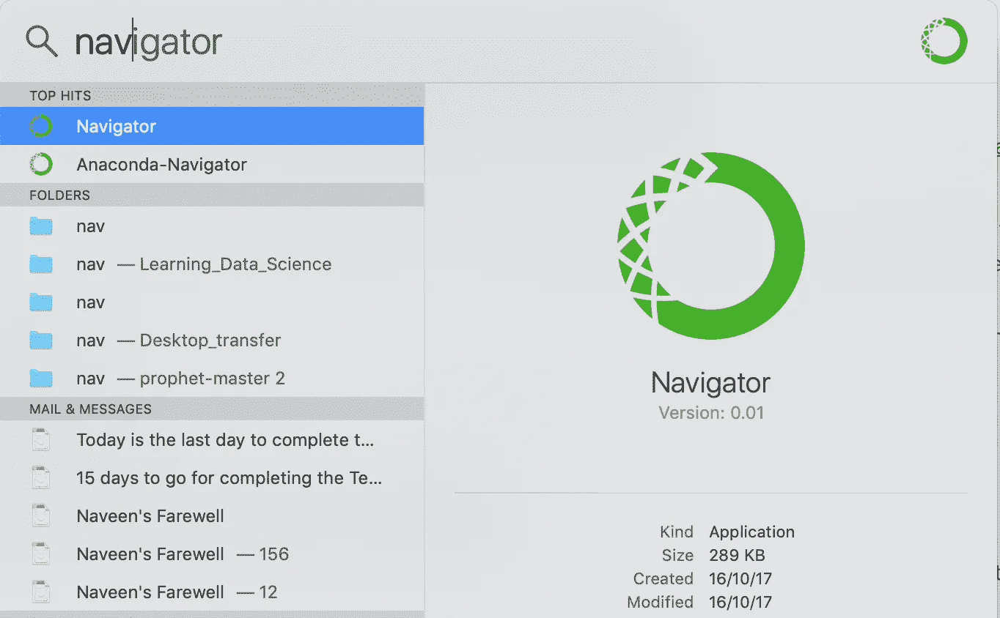
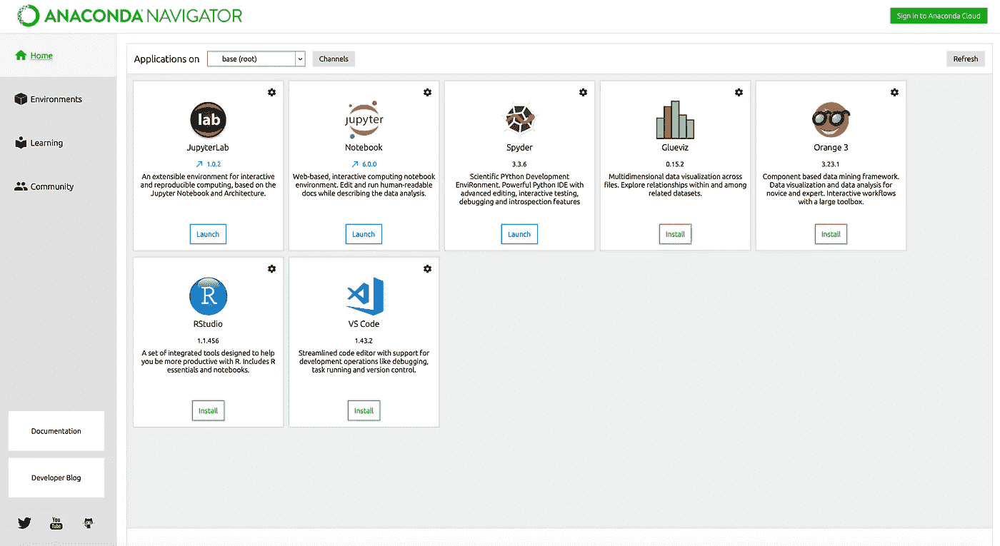
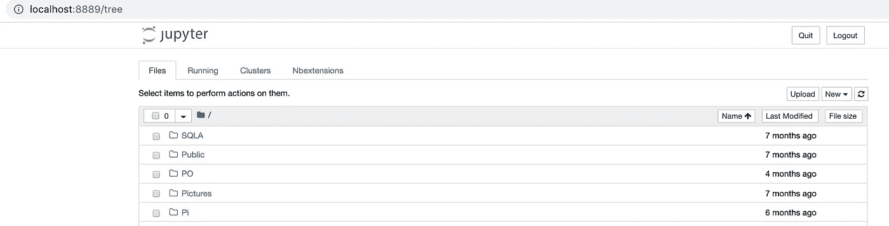
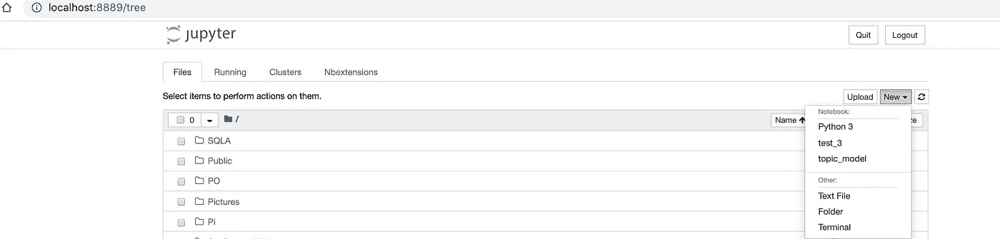
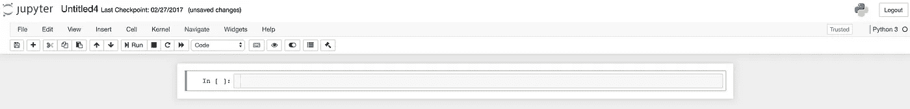
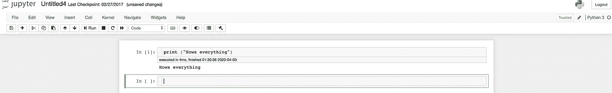

# Anaconda 入门

> 原文：<https://pub.towardsai.net/getting-started-with-anaconda-f9be6746cdab?source=collection_archive---------0----------------------->

# 介绍

每当一个人开始编码时，首先想到的是使用哪个发行版，使用哪个包管理器。

在这篇博客中，我将带你浏览一个这样的发行版“Anaconda”

**定义:** Anaconda，简而言之，是一个包管理器，环境管理器，连同来自 [PyPI](https://en.wikipedia.org/wiki/Python_Package_Index) 的 7500 个 python 包以及 R. Conda 管理包的版本。

使用 Anaconda 的优势在于它还拥有 Anaconda Navigator，这有助于命令行界面，并且不受平台限制，无论是 windows、Mac 还是 Linux。

我们将使用**蟒蛇个人版**。

在我们进一步深入之前，让我们暂停一下，试着理解什么是包管理器、环境管理器和 Conda。

软件包管理器:一个**软件包管理器**或**软件包管理系统**是各种软件工具的集合，以一种有效的方式简化安装、升级的过程。

Conda:它是一个开源的软件包管理系统和环境管理系统，用于安装、运行和更新软件包及其依赖项。其中一个用例是在我们需要不同版本的包依赖项的情况下创建一个虚拟环境。

你可以在我以前的博客中读到更多关于虚拟环境的内容。

Pip 也是 Anaconda 中已经存在的一个包管理系统。

康达与皮普

Pip 应该理想地用于从 PyPI 安装包，而 Conda 是一个跨平台的包和环境管理器。它也适用于其他语言；最好使用康达。Pip 在递归过程中安装依赖项，这可能会破坏现有的软件包。

现在我们已经做好了探索蟒蛇的准备。

# 安装 Anaconda

选择 Windows 或 Mac，从列表中下载 Anaconda。

 [## Anaconda Python/R 发行版—免费下载

### 开源的 Anaconda 个人版(正式的 Anaconda 发行版)是执行 Python/R…

www.anaconda.com](https://www.anaconda.com/download/#windows) 

如需帮助，您可以查看下面的链接。

 [## 在 macOS 上安装— Anaconda 文档

### 您可以使用图形化安装程序(“向导”)或命令行(“手动”)指令来安装 Anaconda

docs.anaconda.com](https://docs.anaconda.com/anaconda/install/mac-os/) 

可以从一些基本的备忘单开始

我们开始吧

## 如何启动 Anaconda 并使用笔记本

要了解更多关于朱庇特的笔记本，请参考这个博客。
Mac 用户可以使用 spotlight 搜索和 type navigator 它应该像下面的窗口。

启动 Anaconda-Navigator
你会看到多个选项。

启动笔记本
将会出现类似这样的内容，笔记本将从本地主机运行。下面的视图称为笔记本仪表板。

现在用 python 写代码，滚动到右上方有一个新的按钮，点击它。

选择 Python 3 开始编码。

耶！

命令行也可以代替导航器直接启动笔记本。

打开终端，输入` *jupyter notebook`* ,然后按照前面的步骤继续操作。