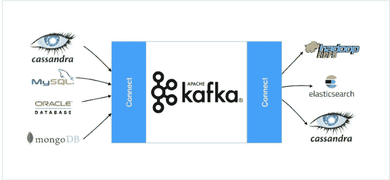
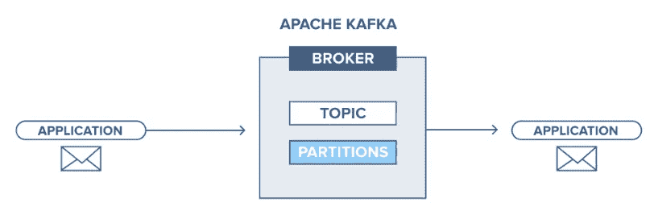
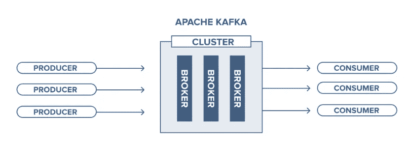
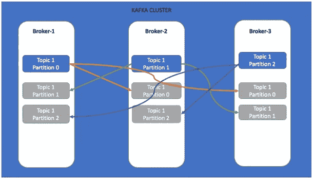
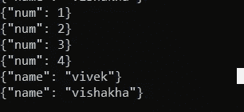

# Apache Kafka 入门—初学者教程

> 原文：<https://pub.towardsai.net/getting-started-with-apache-kafka-beginners-tutorial-d38e3634706c?source=collection_archive---------2----------------------->

## [编程](https://towardsai.net/p/category/programming)

本文的目的是建立对什么是卡夫卡，为什么是卡夫卡，卡夫卡建筑，生产者，消费者，经纪人，以及卡夫卡生态系统的不同组成部分的理解。以及 Python-Kafka 的一个小编码练习。



卡夫卡生态系统

# 1.卡夫卡是什么？

Apache Kafka 是一个分布式的、基于发布-订阅的持久消息传递系统，在进程、应用程序和服务器之间交换数据。换句话说，它是一个高度可伸缩、容错和敏捷的企业消息传递系统。



卡夫卡信息系统

不同的应用程序可以连接到 Kafka 系统，并向主题推送消息/记录。消息/记录可以是从数据库表记录到应用程序事件或 web 服务器日志的任何内容。消息或记录具有由关键字、强制属性的值以及可选的时间戳和报头组成的格式。简单地说，主题可以理解为保存记录或消息的数据库表。

# 2.卡夫卡建筑



体系结构

Apache Kafka 架构的故事围绕着四个核心 API:生产者、消费者、流和连接器。集群基本上是一个或多个 Kafka 服务器或代理的集合，是分布式消息传递系统的一部分。让我们更详细地了解它们。

**Producer API:** 支持应用程序连接到 Kafka Brokers，并发布一个或多个 Kafka 主题的记录或消息流。

**消费者 API:** 支持应用程序连接到 Kafka 代理，并消费来自一个或多个 Kafka 主题的记录或消息流。

**Streams API:** 使应用程序能够消费来自一个或多个主题的输入流，并为一个或多个主题生成输出流，从而允许输入和输出流的转换。

**连接器 API:** 允许编写可重用的消费者和生产者代码，例如，从数据库读取数据并发布到 Kafka 主题，从 Kafka 主题消费数据并写入数据库。

## 什么是经纪人？

代理是 Kafka 集群的一个实例或单个服务器。Kafka Broker 存储关于一个或多个主题的消息。我们为了访问消息或记录而连接的代理实例称为引导服务器。一个集群可以有数百个代理。

## 什么是动物园管理员？

动物园管理员可以理解为整个生态系统的资源管理部分。它保存关于系统中运行的进程的元数据，执行健康检查和代理领导者选择等。

## 什么是话题？

主题是保存发布给 Kafka 代理的消息或记录的结构。在内部，一个主题被划分为多个分区，分区就是数据发布的确切位置。这些分区分布在集群中的代理上。主题由名称标识，就像数据库中的表一样。特应性是分区的。主题的每个分区都有一个引导读/写操作的 leader。



分区主题

这就是关于卡夫卡的理论部分，还有其他一些概念，我们将在接下来的博客中涉及。

# 3.用例及编码:

在一个非常基本的 Python 代码的帮助下，我们将以键-值对格式向 Kafka Broker 发布一些消息，并从 Broker 消费这些消息。但在此之前，需要启动并运行一些服务来访问 Kafka 集群。

第一步:启动动物园管理员

```
D:\Kafka_setup\kafka_2.12–2.5.0\bin\windows\zookeeper-server-start.bat D:\Kafka_setup\kafka_2.12–2.5.0\config\zookeeper.properties
```

**第二步:**启动卡夫卡经纪人

```
D:\Kafka_setup\kafka_2.12–2.5.0\bin\windows\kafka-server-start.bat D:\Kafka_setup\kafka_2.12–2.5.0\config\server.properties
```

**第三步:**创造话题

```
D:\Kafka_setup\kafka_2.12–2.5.0\bin\windows\kafka-topics.bat — zookeeper localhost:2181 — create — topic demo1 — partitions 2 — replication-factor 2
```

我创建了一个包含两个分区的主题，复制因子为 2。在这种情况下，因为集群有两个以上的代理，所以分区是均匀分布的，每个分区的副本都被复制到另一个代理。由于复制因子为 2，因此即使代理宕机，也不会有数据丢失。为了实现弹性，复制因子应该大于 1 并且小于集群中代理的数量。

**步骤 4:** 启动消费者控制台

```
D:\Kafka_setup\kafka_2.12–2.5.0\bin\windows\kafka-console-consumer.bat — bootstrap-server localhost:9092 —-topic demo1
```

**步骤 5:** 运行生产者代码，将消息推送给 Kafka Broker

```
#producer.py
from json import dumps
import json
from kafka import KafkaProducerproducer = KafkaProducer(bootstrap_servers=['localhost:9092'],
                         value_serializer=lambda x:json.dumps(x).encode('utf-8'))try:
    for num in range(1,5):
        msg={'num': num}
        producer.send('demo1',value=msg)
    producer.send('demo1', {'name': 'vivek'})
    producer.send('demo1', {'name': 'vishakha'})
except Exception as e:
    print(e)print('Message sent to kafka demo1')
```

**步骤 6:检查消费者控制台上的消息**



代理消息

**步骤 7:** 运行消费者代码来订阅消息

```
#consumer.py
from kafka import KafkaConsumer
from json import loads
import jsonconsumer = KafkaConsumer(‘demo1’,
 bootstrap_servers=[‘localhost:9092’],
 auto_offset_reset=’earliest’,
 enable_auto_commit=True,
 group_id=’my-group’,
 value_deserializer=lambda x: loads(x.decode(‘utf-8’)))for message in consumer:
 msg = message.value
 print(msg)
consumer.close()#subscribed messages:
{"num": 1}
{"num": 2}
{"num": 3}
{"num": 4}
{"name": "vivek"}
{"name": "vishakha"}
```

让我们了解一下我们在生产者和消费者代码中使用的属性:

**bootstrap_servers** :设置生产者应该联系的主机和端口，以引导初始集群元数据。因为默认值是 localhost:9092，所以没有必要在这里进行设置。

**value_serializer** :数据在发送给代理之前应该如何序列化的函数。这里，我们将数据转换为 JSON 文件，并将其编码为 utf-8。

**enable_auto_commit** :确保消费者每隔一段时间提交一次其读取的偏移量。

**auto_offset_reset** :最重要的论点之一。它处理消费者在中断或关闭后重新开始阅读的位置，可以设置为最早或最晚。当设置为*最新*时，用户从日志末尾开始读取。当设置为 *earliest* 时，消费者从最新提交的偏移量开始读取，这正是我们在这种情况下想要的。

**value_deserializer:** 在消费端执行，是序列化的逆向操作，将数据从字节数组转换成 JSON 格式。

万岁，我们学习了一些关于 Apache Kafka 消息系统的基础知识。这个博客有助于对 Kafka 系统和生产者/消费者代码的基本理解。

# 总结:

基于 Kafka 的分布式发布-订阅消息系统。

卡夫卡建筑和不同的组成部分。

卡夫卡的概念，如生产者，消费者，经纪人，主题，分区，动物园管理员等。

与卡夫卡生态系统相关的服务。

主题创建、划分和复制因素。

python 语言中的简单编码练习、生产者和消费者。

感谢所有人阅读我的博客，如果你喜欢我的内容和解释，请在 medium 上关注我并分享你的反馈，这将永远帮助我们所有人提高我们的知识。