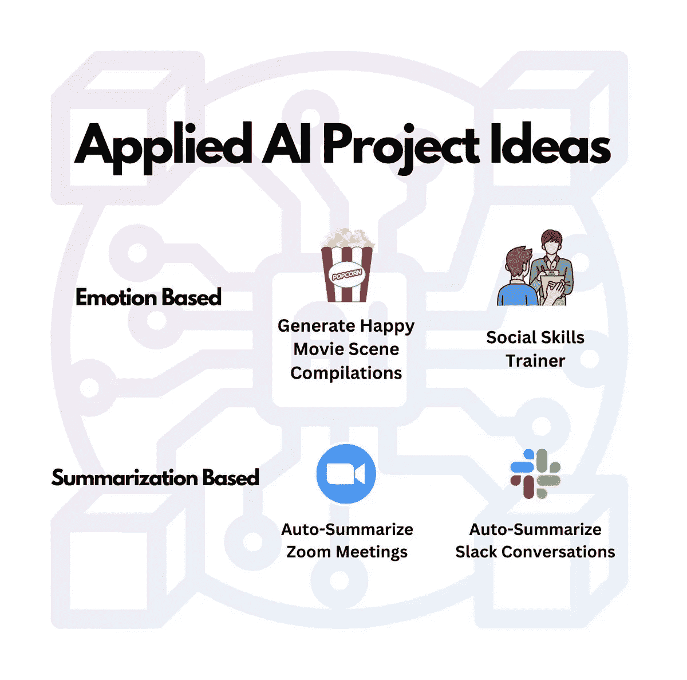
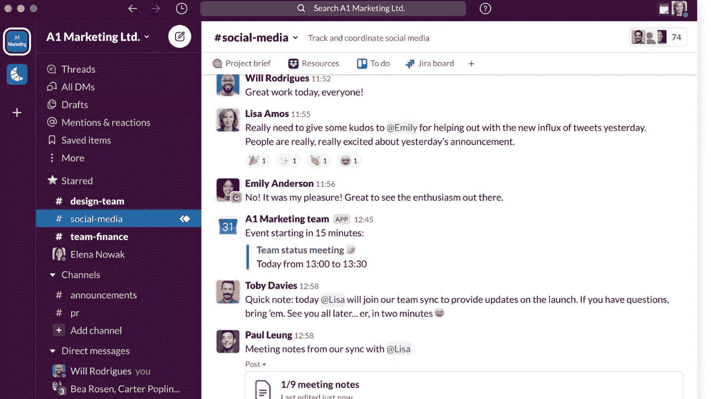

# 应用人工智能和自然语言处理入门

> 原文：<https://pub.towardsai.net/getting-started-with-applied-ai-and-nlp-982213d9422d?source=collection_archive---------3----------------------->

## 这里有 4 个应用人工智能项目的想法，你现在就可以编码

不需要复杂的自制机器学习项目——是时候用 API 代替了。你所需要的只是编码基础。

# 自然语言处理和应用人工智能的一些背景知识

> 应用人工智能是人工智能的一个分支，它将人工智能带出实验室，进入现实世界，使计算机和计算机控制的机器人能够执行真正的任务。—[cognizant.com](https://www.cognizant.com/)

就像上面的引用陈述一样——我们将使用应用人工智能，以便我们可以执行真实的日常任务。我们还将利用自然语言处理——让机器处理和理解语言，这样我们的应用程序就可以:

*   找出哪些电影场景是快乐的，以便我们可以创建快乐的电影场景汇编
*   将完整的缩放会议总结成简短的摘要。

还有更多。

# 这些项目

这些项目分为两类:基于情感的和基于总结的，我将在下一段解释。

基于摘要的项目是节省大量时间和提高效率的工具——帮助人们更有效地回顾会议和对话。

其他项目是为了娱乐，也是为了提高一个人的社交技能——无论是面试、约会，还是在社交场合结识新朋友。

不同的自然语言处理项目进行编码

# 基于情感

基于情绪的项目是基于检测情绪的项目。

当我们的应用程序成功检测到电影场景中的女演员很开心时，基于她所说的话，这使得我们的项目基于情感。

基于情感的项目:

**生成快乐电影场景剪辑**

你知道 Youtube 上的那些电影剪辑吗？在这些剪辑中，你会看到围绕一个想法排列的一堆场景。

这里有一个电影史上[最美镜头](https://www.youtube.com/watch?v=xBasQG_6p40)汇编的例子

我们可以使用 NLP 来从电影中获取快乐的场景，并创建我们自己的电影剪辑——我想到了金凯瑞的微笑:

金·凯瑞在《假面》中愉快的一幕

我们要做的是让 NLP 引擎检查电影脚本，并返回带有快乐情绪的场景的时间戳。然后，我们将这些场景连接在一起，生成一个长剪辑，我们可以在 YouTube 或社交媒体上分享。

你可以使用 [One AI](http://oneai.com) 或者你在代码中插入的其他免费使用的 NLP APIs 来做到这一点。我会在另一篇博客中继续跟进。

**社交技能培训师**

人们常常不知道谈话进行得如何。如果我们可以建立一个应用程序来提供反馈并提高人们的社交技能，会怎么样？

下面是这个应用程序的样子——

亚当约莎拉出去，谈话开始时很尴尬。然而，你可以看到亚当的最后一句话为他赢得了分数，并与莎拉产生了积极的互动。

亚当现在可以理解哪些句子给他加分，哪些句子给他减分，随着时间的推移，他可以改善与人的互动。

在这里看如何建造这个[。](https://twitter.com/dantannor/status/1577997337087164418?s=20&t=doigVoXNGACv47iBBzsE1g)

# 基于摘要

基于摘要的项目是基于 NLP 引擎对大量文本进行摘要以提供准确的内容摘要的项目。

这些内容也可以来源于视频或音频，然后我们将转录这些内容，以便人工智能在文本输出上运行。

汇总项目:

**自动汇总缩放会议**

创建您自己的应用程序来自动总结 Zoom 会议。你可以每次开会都这样做，甚至可以构建一个应用来大规模解决这个问题。

我们不都厌倦了冗长无聊的会议吗？想想看，如果你能每周提供自动、准确的会议总结，你会为自己和同事节省多少时间。

在变焦会议上睡着了

一些使用案例包括:

*   总结你自己的个人会议
*   每周为每个人总结公司会议
*   为人们创建一个 web 应用程序来总结他们的会议

点击查看如何构建这样的应用[。](https://twitter.com/dantannor/status/1576881404645756928?s=20&t=doigVoXNGACv47iBBzsE1g)

**自动总结时差对话**

Slack 可以很快变成一大堆杂乱的信息——会议记录、产品需求或与老板的谈话。

多个渠道和信息过载

找不到上周最后一个特性需求？你和你老板 1:1 会议的笔记呢？

如果我们可以构建一个应用程序来总结过去一周的要点，会怎么样？这些要点包括重要的谈话摘要和行动项目。

# 摘要

我们已经看到了许多不同的 NLP 项目。其中一些想法，或者类似的想法，肯定可以成为创业的基础——因为它们解决了我们每天都经历的现实世界的痛点。

我们已经了解了应用人工智能和自然语言处理来构建可以帮助我们完成日常任务的应用程序。

为了开始，你需要做的就是在你的代码中进行一些 NLP API 调用，然后你就可以开始了。

请随时伸出手来，分享你心中的项目想法或你已经开始建立。