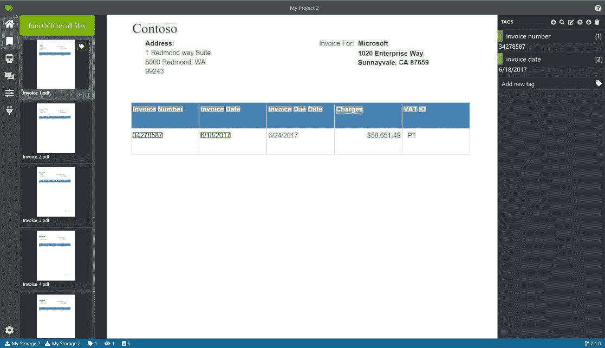
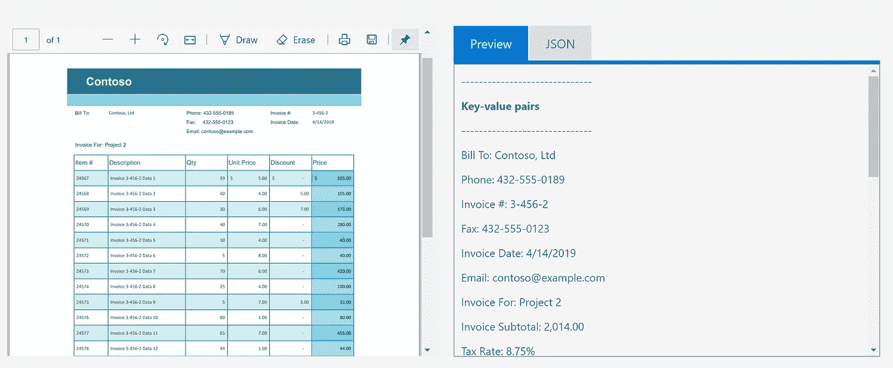
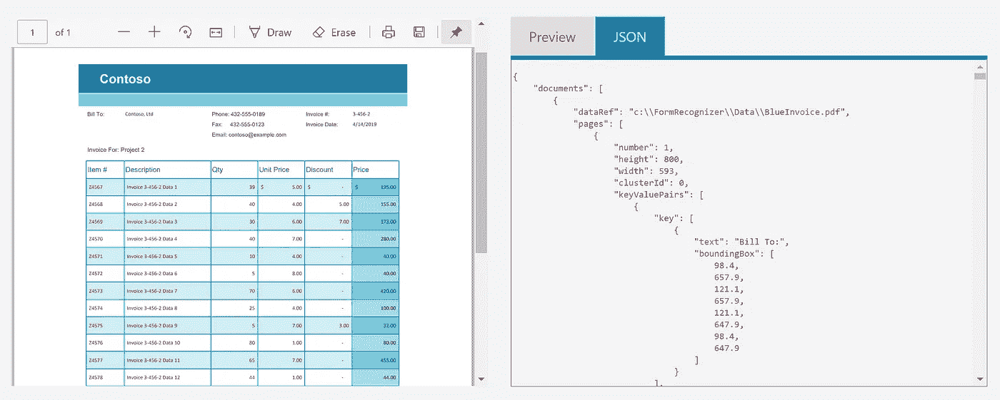
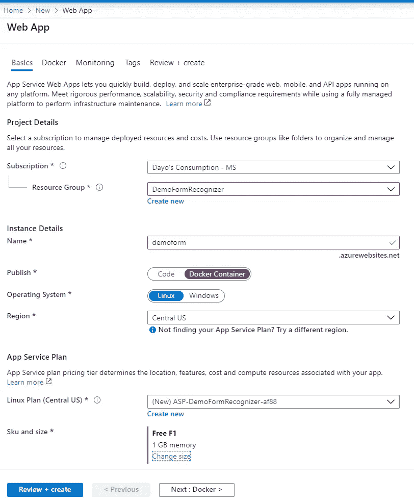
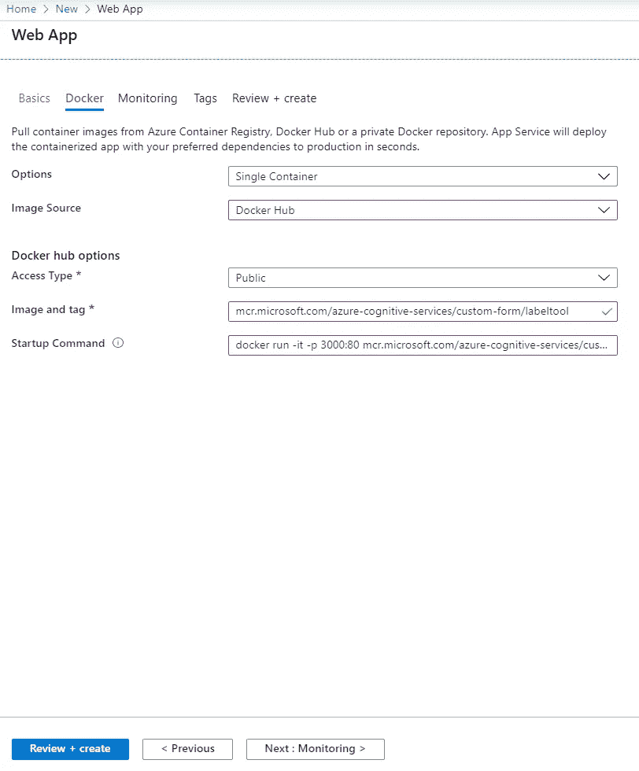
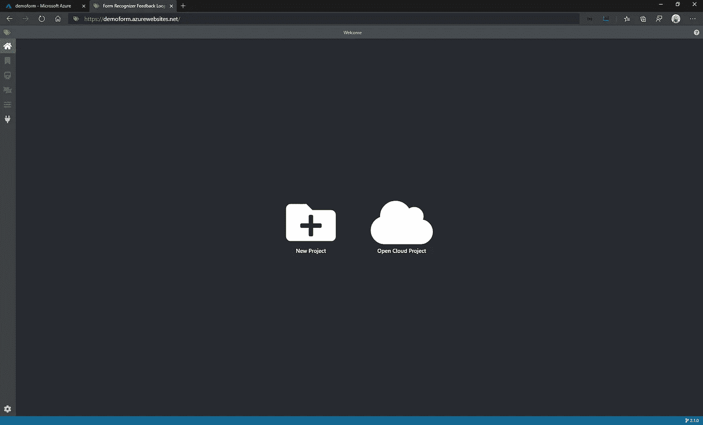

# 表单识别器-标签工具入门

> 原文：<https://pub.towardsai.net/getting-started-with-form-recognizer-labeling-tool-cf09cd10fb64?source=collection_archive---------1----------------------->

表单识别器上来自 [Microsoft Docs](https://docs.microsoft.com/en-us/azure/cognitive-services/form-recognizer/quickstarts/label-tool) 的照片

# TLDR

*   背景—需要表单识别器的故事
*   概述—关于表单识别器
*   它是如何工作的/什么是标签工具
*   如何部署标注工具

# 背景

因此，在生活中的某个时刻，我们都必须填写表格，无论是实体表格还是在线表格。从作为客户或响应者的前端来看，这是过程的结束，但是对于作为企业或评审者的后端来说，更多的东西进入了过程。通常，需要提取和分析这些表格中的回复，以便做出合理的商业决策，或者甚至是个人选择(如果你像我一样)。(**有趣的事实:**我会把收据拍下来，这样我就可以回头看看，评估自己的消费习惯，在财务上更加负责任)。表单是不同格式的文档，例如 pdf、JPGs、PNG 或 TIFF。如果不能提取、搜索或适当地分析这些文档中的文本，它们会变得难以处理。来拯救我们的表单识别器！

# 概观

表单识别器是 Microsoft Azure 认知服务的一部分。什么是认知服务？它是预先构建的人工智能特性，可以通过 API 调用轻松使用。它们可以分为 5 类:决策、语言、演讲、视觉和网络搜索。点击查看每个类别[的不同特点。表单识别器属于视觉类别，它的目标是](https://azure.microsoft.com/en-us/services/cognitive-services/#api)

> 从文档中提取文本、键值对和表格

下面是一个从收据中提取键值对的示例

图片来自微软 [Azure 认知服务](https://azure.microsoft.com/en-us/services/cognitive-services/form-recognizer/#features)演示

您还可以获得 JSON 格式的表单提取，不同的数据库(例如，NoSQL)或使用 JSON 格式的工具可以很容易地使用它。

图片来自微软 [Azure 认知服务](https://azure.microsoft.com/en-us/services/cognitive-services/form-recognizer/#features)演示

希望到现在为止，您已经对表单识别器的可能性感到兴奋了。下一个问题是，我如何让它工作。

**先决条件**

唯一的先决条件是拥有 Azure 订阅。

# 它是如何工作的？

表单识别器是如何工作的？根据 [Azure Docs](https://docs.microsoft.com/en-us/azure/cognitive-services/form-recognizer/overview) 的说法，它使用机器学习技术从文档中提取数据。因此，它需要至少 5 个表单来创建一个模型，后续的表单可以将该模型用作标记目的的参考点(有关更多详细信息，请访问表单识别器文档[此处](https://docs.microsoft.com/en-us/azure/cognitive-services/form-recognizer/overview))。用来实现这一点的工具叫做表单识别器**标签工具**。这是我想在博客的其余部分关注的。我将向您展示设置它的最有效方法，这样您就可以在所有的文档提取中使用它。

该工具可通过 Docker 获得。你可以在你的笔记本电脑或虚拟机上安装 Docker。任何操作系统都可以做到这一点:Linux、Windows 或 macOS。

虽然这是一个很好的方法，但我更喜欢使用 PaaS 方法来安装标记工具，因为它可以保证我的标记工具随时可用，而不必依赖于我的笔记本电脑或虚拟机。

为了使用 PaaS 方法部署标记工具，我们将成为 Azure Web 应用程序。

# 部署标注工具

前往 [Azure 门户](https://portal.azure.com/)

1.  选择*创建资源*
2.  选择“*Web App”*
3.  在基本选项卡上。填写以下信息:

*   资源组:DemoFormRecognizer
*   名称:" "*键入唯一的名称" "*
*   发布:Docker 容器
*   地区:美国中部
*   SKU 和尺寸:"*_ 选择开发/测试以获得更便宜或免费的尺寸 _ "*

4.在 Docker 选项卡上。填写以下信息:

*   图片来源:Docker Hub
*   图片和标签:*MCR . Microsoft . com/azure-cognitive-services/custom-form/label tool*
*   启动命令:*docker run-it-p 3000:80 MCR . Microsoft . com/azure-cognitive-services/custom-form/label tool EULA = accept*

5.选择*审核+创建*

6.通过访问以下 URL 来访问该工具

# 最后的想法

我希望这有助于部署表单识别器标签工具。现在，您可以开始为您的表单添加标签，以便进行培训和测试。接下来的步骤是按照下面的 Microsoft 文档中的说明在标签工具中创建一个项目。您需要在 Azure 中提供一个表单识别器资源以及一个 Azure 存储帐户。

 [## 快速入门:使用示例标注工具-表单来标注表单、训练模型和分析表单

### 在本快速入门中，您将使用带有示例标注工具的表单识别器 REST API 来训练带有…的自定义模型

docs.microsoft.com。](https://docs.microsoft.com/en-us/azure/cognitive-services/form-recognizer/quickstarts/label-tool#set-up-input-data)