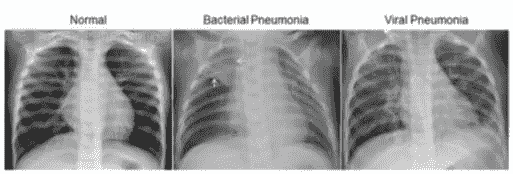
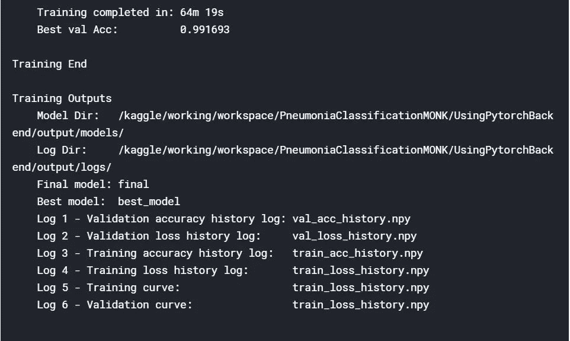
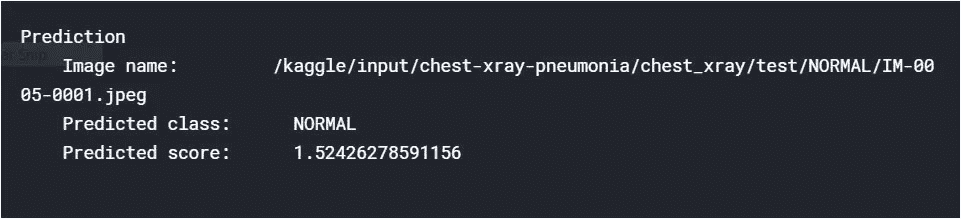
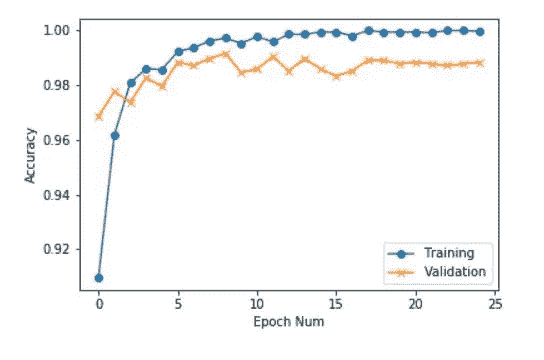
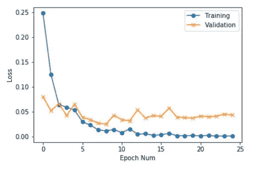

# 使用 Monk AI 开始 Kaggle 竞赛

> 原文：<https://pub.towardsai.net/getting-started-with-kaggle-competitions-using-monkai-f8cbcbb1ece6?source=collection_archive---------2----------------------->

## 深度学习

## [**Monk**](https://github.com/Tessellate-Imaging/monk_v1) 是一个低代码深度学习工具，也是一个适合计算机视觉的包装器。

## **和尚特性**

*   低代码。
*   主要深度学习框架的统一包装器——Keras、PyTorch、gluoncv。
*   语法不变包装。

## **和尚使能**

*   对深度学习实验进行创建、管理和版本控制。
*   比较不同训练指标的实验。
*   快速找到最佳超参数。

## **目标**

*   用模型做实验。
*   了解使用 Monk 有多容易。

# 目录

*   关于数据集。
*   安装。
*   正在导入 Pytorch 后端。
*   创建和管理实验。
*   所有可用型号的列表。
*   训练肺炎与正常图像分类器。
*   快速模式训练。
*   验证训练好的分类器。
*   在测试图像上运行推理。

# 关于数据集



数据:[https://data.mendeley.com/datasets/rscbjbr9sj/2](https://data.mendeley.com/datasets/rscbjbr9sj/2)

许可证:[抄送由 4.0](https://creativecommons.org/licenses/by/4.0/)

论文:[http://www . cell . com/cell/full text/s 0092-8674(18)30154-5](http://www.cell.com/cell/fulltext/S0092-8674(18)30154-5)

## [数据集](https://www.kaggle.com/paultimothymooney/chest-xray-pneumonia)结构

数据集分为三个文件夹(train、test、val ),并包含每个图像类别(肺炎/正常)的子文件夹。有 5863 张 x 光图像(JPEG)和两个类别(肺炎/正常)。

```
Train 
-----Normal
-----Pneumonia
Test
-----Normal
-----Pneumonia
Validation
-----Normal
-----Pneumonia
```

# 装置

设置 MONK 及其依赖项:

```
$ !git clone [https://github.com/Tessellate-Imaging/monk_v1.git](https://github.com/Tessellate-Imaging/monk_v1.git)
$ !cd monk_v1/installation/Misc && pip install -r requirements_kaggle.txt
```

由于我正在使用 Kaggle，所以我安装了 Kaggle 依赖项。

如果你是 Linux 用户

`$ cd monk_v1/installation/Linux && pip install -r requirements_cu9.txt`

(根据操作系统和 CUDA 版本选择需求文件)

如果使用 Colab，请使用以下命令安装

`$ cd monk_v1/installation/Misc && pip install -r requirements_colab.txt`

如果使用 Kaggle，取消对以下命令的注释

`$ cd monk_v1/installation/Misc && pip install -r requirements_kaggle.txt`

你可以在这里找到安装程序。

MONK 支持 PyTorch、Keras 和 mxnet-gluon 后端。

# 正在导入 Pytorch 后端

```
*#Using pytorch backend* 
$ from pytorch_prototype import prototype
```

*   使用 mxnet 后端

`$ from gluon_prototype import prototype`

*   要使用 Keras 后端

`$ from keras_prototype import prototype`

# 创建和管理实验

*   提供项目名称
*   提供一个实验名称
*   对于特定数据，创建单个项目
*   在每个项目中，可以创建多个实验
*   每个实验都有不同的超参数

```
$ gtf = prototype(verbose=1);
$ gtf.Prototype("PneumoniaClassificationMONK", "UsingPytorchBackend");
```

这将按照以下结构工作区创建文件和目录

```
|
|--------PneumoniaClassificationMONK (Project name can be different)
                |
                |
                |-----UsingPytorchBackend (Experiment name can be different)
                            |
                            |-----experiment-state.json
                            |
                            |-----output
                                    |
                                    |------logs (All training logs and graphs saved here)
                                    |
                                    |------models (all trained models saved here)
```

# 所有可用型号的列表

```
$ gtf.List_Models()
```

你也可以在这里找到可用模型、层、块、优化器的列表[。](https://github.com/Tessellate-Imaging/monk_v1/tree/master/monk)

# 训练肺炎与正常图像分类器

**快速模式训练**

*   使用默认功能
*   数据集路径
*   型号名称
*   次数

数据集文件夹结构 parent_directory

```
|
|
|------Pneumonia
        |
        |------img1.jpg
        |------img2.jpg
        |------.... (and so on)
|------Normal
        |
        |------img1.jpg
        |------img2.jpg
        |------.... (and so on)
```

所以对于快速模式训练，

```
$ gtf.Default(dataset_path="/kaggle/input/chest-xray-pneumonia/chest_xray/train", 
            model_name="resnet50", 
            freeze_base_network=False,
            num_epochs=25);
```

还可以找[更新模式](https://clever-noyce-f9d43f.netlify.app/#/update_mode/update_dataset)和[专家模式培训](https://clever-noyce-f9d43f.netlify.app/#/expert_mode)。

# 训练分类器

```
$ gtf.Train();
```

我训练了我的模型 25 个纪元。培训结束后，您可以阅读总结:



# 验证已训练的分类器

在验证模式下加载实验

*   将标志 eval_infer 设置为真

```
$ gtf = prototype(verbose=1);
$ gtf.Prototype("PneumoniaClassificationMONK", "UsingPytorchBackend",eval_infer=True);
```

**加载验证数据集**

```
$ gtf.Dataset_Params(dataset_path="/kaggle/input/chest-xray-pneumonia/chest_xray/val");
$ gtf.Dataset();
```

**运行验证**

```
$ accuracy, class_based_accuracy = gtf.Evaluate();
```

# 在测试图像上运行推理

# 以推理模式加载实验

*   将标志 eval_infer 设置为真

```
$ gtf = prototype(verbose=1);
$ gtf.Prototype("PneumoniaClassificationMONK", "UsingPytorchBackend",eval_infer=True);
```

# 选择图像并运行推理

```
$ img_name = "/kaggle/input/chest-xray-pneumonia/chest_xray/test/NORMAL/IM-0005-0001.jpeg";
$ predictions = gtf.Infer(img_name=img_name);
```



## 训练 v/s 验证准确度曲线

```
$ from IPython.display import Image
$ Image(filename="/kaggle/working/workspace/PneumoniaClassificationMONK/UsingPytorchBackend/output/logs/train_val_accuracy.png")
```



类似地，我们可以获得训练 v/s 验证损失曲线。



你可以在 Kaggle 的网站找到启动代码[o](https://www.kaggle.com/sinchubhat/pneumonia-classification-monk/notebook)n[k。](https://www.kaggle.com/sinchubhat/pneumonia-classification-monk/notebook)

# 资源

[**和尚 _ 物体 _ 探测**](https://github.com/Tessellate-Imaging/Monk_Object_Detection)

低代码、易于安装的对象检测管道的一站式存储库。

[**和尚 _ 鬼**](https://github.com/Tessellate-Imaging/Monk_Gui)

用于深度学习和 Monk 库上的计算机视觉的图形用户界面。

[**py torch _ 教程**](https://github.com/Tessellate-Imaging/Pytorch_Tutorial)

一套关于 PyTorch 函数的 jupyter 笔记本，带有示例。

我是 monk library 的开源贡献者。如果您有任何问题，请随时在 [GitHub](https://github.com/Tessellate-Imaging/monk_v1) 上提出问题。