# 稳定扩散入门

> 原文：<https://pub.towardsai.net/getting-started-with-stable-diffusion-f343639e4931?source=collection_archive---------0----------------------->

S table Diffusion 是由 [**CompVis**](https://github.com/CompVis) 、 [**Stability AI**](https://stability.ai/) 、 [**LAION**](https://laion.ai/) 的研究人员和工程师创建的文本到图像潜在扩散模型。它在来自 [**LAION-5B**](https://laion.ai/blog/laion-5b/) 数据库子集的 512x512 幅图像上进行训练。有了稳定的扩散，你生成人脸，也可以在自己的机器上运行，如下图。

稳定扩散生成的图像/ [Stability.ai](https://stability.ai/blog/stable-diffusion-public-release)

如果你足够聪明和有创造力，你可以创建一系列图像，然后形成一个视频。例如，[史云光·斯廷布鲁格](https://twitter.com/xsteenbrugge)使用稳定扩散和图 1 所示的输入提示创建了下面的惊人的**穿越时间**视频。

以下是他用来创作这件创造性艺术品的提示和种子:

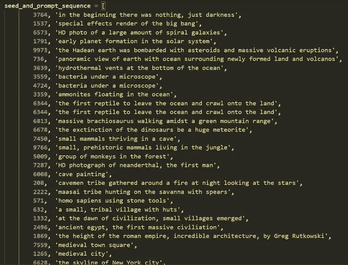

图一。使用稳定扩散创建穿越时间视频的文本提示和种子。

在本文中，我们将首先介绍什么是稳定扩散，并讨论其主要组成部分。然后我们将使用稳定扩散以三种不同的方式创建图像，从简单到复杂。

## 目录:

1.  **稳定扩散简介
    1.1。潜在扩散主要成分
    1.2。为什么潜伏扩散快&高效
    1.3。推理过程中的稳定扩散**
2.  **使用拥抱面部空间**
3.  **使用扩散器包**
4.  **用扩散器构建自己的管道**
5.  **参考文献**

**本文中使用的代码都可以在这个 GitHub 资源库中找到:**

 [## GitHub-youssefHosni/稳定扩散

### 此时您不能执行该操作。您已使用另一个标签页或窗口登录。您已在另一个选项卡中注销，或者…

github.com](https://github.com/youssefHosni/Stable-Diffusion) 

**如果你想免费学习数据科学和机器学习，看看这些资源:**

*   免费互动路线图，自学数据科学和机器学习。从这里开始:[https://aigents.co/learn/roadmaps/intro](https://aigents.co/learn/roadmaps/intro)
*   数据科学学习资源搜索引擎(免费)。将你最喜欢的资源加入书签，将文章标记为完整，并添加学习笔记。[https://aigents.co/learn](https://aigents.co/learn)
*   想要在导师和学习社区的支持下从头开始学习数据科学吗？免费加入这个学习圈:【https://community.aigents.co/spaces/9010170/】T2

**如果你想在数据科学& AI 领域开始职业生涯，但你不知道如何开始。我提供数据科学指导课程和长期职业指导:**

*   长期师徒:[https://lnkd.in/dtdUYBrM](https://lnkd.in/dtdUYBrM)
*   辅导课程:[https://lnkd.in/dXeg3KPW](https://lnkd.in/dXeg3KPW)

***加入*** [***中等会员***](https://youssefraafat57.medium.com/membership) ***计划，只需 5 美元，继续无限制学习。如果你使用下面的链接，我会收到一小部分会员费，不需要你额外付费。***

 [## 加入我的介绍链接媒体-优素福胡斯尼

### 阅读 Youssef Hosni(以及媒体上成千上万的其他作家)的每一个故事。您的会员费直接支持…

youssefraafat57.medium.com](https://youssefraafat57.medium.com/membership) 

# 1.稳定扩散介绍

扩散模型是机器学习模型，其被训练来逐步对随机高斯噪声进行去噪，以获得感兴趣的样本，例如图像。

扩散模型有一个主要的缺点，因为去噪过程既费时又消耗大量内存。这使得进程缓慢，并消耗大量内存。其主要原因是它们在像素空间中操作，这变得不合理地昂贵，尤其是在生成高分辨率图像时。

引入稳定扩散来解决这个问题，因为它依赖于**潜在扩散**。潜在扩散通过在较低维度的潜在空间上应用扩散过程而不是使用实际的像素空间来减少存储和计算成本。

## 1.1.潜在扩散主成分

潜在扩散有三个主要组成部分:

## **自动编码器(VAE)**

自动编码器(VAE)由两个主要部分组成:编码器和解码器。编码器将把图像转换成低维潜在表示，这将是下一个组件的输入，即 **U_Net。解码器将做相反的事情，将潜在的表示转换回图像。**

编码器用于在潜在扩散训练期间获得用于前向扩散过程的输入图像的潜在表示(潜在)。而在推理过程中，VAE 解码器会将潜像转换回图像。

## **U 网**

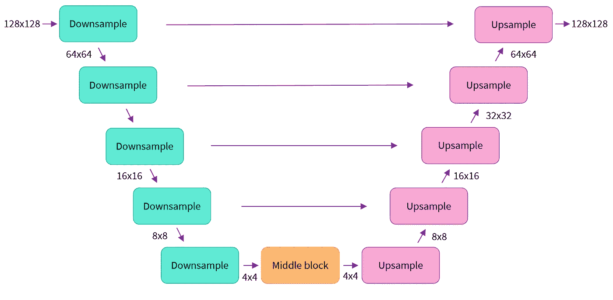

图二。优信网

U-Net 也由编码器和解码器部分组成，两者都由 ResNet 块组成。编码器将图像表示压缩成较低分辨率的图像，解码器将较低分辨率解码回较高分辨率的图像。

为了防止 U-Net 在下采样时丢失重要信息，通常在编码器的下采样网络和解码器的上采样网络之间添加捷径连接。

此外，稳定扩散 U-Net 能够通过交叉注意层将其输出取决于文本嵌入。交叉注意层被添加到 U-Net 的编码器和解码器部分，通常在 ResNet 块之间。

## **文本编码器**

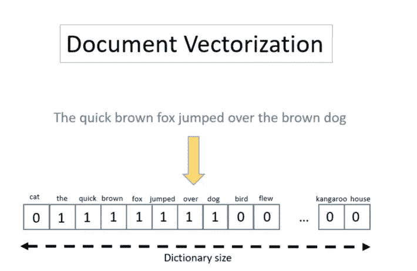

图 3。文本编码器

文本编码器会将输入提示，例如，“**一家皮卡丘餐厅，可以看到艾菲尔铁塔，**”转换为 U-Net 可以理解的嵌入空间。这将是一个简单的基于 transformer 的编码器，它将标记序列映射到潜在文本嵌入序列。

使用一个好的提示符来获得预期的输出是很重要的。这就是为什么现在**提示工程**的话题正在被潮流化**。Prompt engineering** 是寻找某些词的行为，这些词可以触发模型产生具有某些属性的输出。

## 1.2.为什么潜在扩散快速有效

潜在扩散之所以快速有效，是因为潜在扩散的 U 网是在低维空间上运行的。与像素空间扩散相比，这减少了存储和计算的复杂性。例如，稳定扩散中使用的自动编码器的缩减系数为 8。这意味着形状(3，512，512)的图像在潜在空间中变成(4，64，64)，这需要少 64 倍的存储器。

## 1.3.推理过程中的稳定扩散

图 4。稳定扩散模型在推理过程中起作用

首先，稳定扩散模型采用潜在种子和文本提示作为输入。然后，潜在种子用于生成大小为 **64×64、**的随机潜在图像表示，而文本提示则通过 CLIP 的文本编码器转换为大小为 **77×768** 的文本嵌入。

接下来， **U-Net** 迭代地*去噪*随机潜像表示，同时以文本嵌入为条件。U-Net 的输出是噪声残余，用于通过调度算法计算去噪的潜像表示。调度器算法根据先前的噪声表示和预测的噪声残差来计算预测的去噪图像表示。

许多不同的调度算法可以用于这种计算，每种算法都有其优点和缺点。为了实现稳定扩散，建议使用以下方法之一:

*   [PNDM 调度器](https://github.com/huggingface/diffusers/blob/main/src/diffusers/schedulers/scheduling_pndm.py)(默认使用)
*   [DDIM 调度器](https://github.com/huggingface/diffusers/blob/main/src/diffusers/schedulers/scheduling_ddim.py)
*   [K-LMS 调度器](https://github.com/huggingface/diffusers/blob/main/src/diffusers/schedulers/scheduling_lms_discrete.py)

*去噪*过程重复大约 50 次，以逐步检索更好的潜像表示。一旦完成，潜像表示由可变自动编码器的解码器部分解码。

# 2.使用拥抱面部空间

拥抱脸空间提供了一个 [**非常简单的 API**](https://huggingface.co/spaces/stabilityai/stable-diffusion) 来使用稳定扩散生成图像。在下图中，你可以看到我使用了“宇航员骑马”，你可以看到下图中的输出:

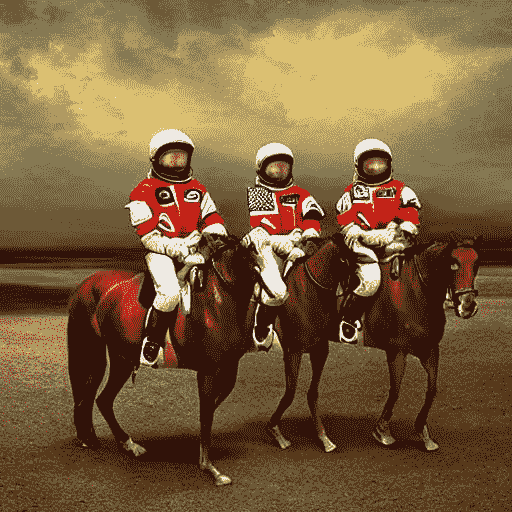

图 5。宇航员骑着马拥抱面部空间产生的图像。

有一些可用的高级选项可用于更改生成图像的质量，如下图所示:

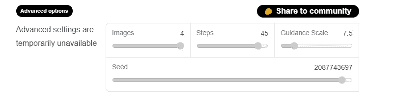

图 6。拥抱脸稳定扩散空间参数。

有四个选项可供使用:

*   **图像:**控制图像的数量，最多 4 个图像。
*   **步骤:**该选项选择您想要的扩散过程的步骤。步骤越多，生成的图像质量就越好。如果您想要高质量，您可以选择可用的最大步骤数，即 50。如果你想更快得到结果，那么考虑减少步骤的数量。
*   **引导尺度:**引导尺度是生成的图像与输入提示的紧密程度和输入的多样性之间的权衡。它的典型值约为 7.5。比例增加得越多，图像的质量就越高，但输出的多样性会越低。
*   **种子:**种子使您能够控制生成样本的多样性

# 2.**使用扩散器包**

第二种方法是使用 [**扩散器库**](https://huggingface.co/docs/diffusers/index) 生成抱紧脸并在 google Colab 上运行它。扩散器是一个由拥抱脸生成的库，它包含了迄今为止可用的大多数稳定扩散模型。

第一步是打开 google collab，按下 connect。之后，要检查它是否连接到 GPU，可以从 resources 按钮进行检查，如下图所示:

图 7。查看 google colab 中的当前资源。

另一个选项是从**运行时**菜单中选择更改**运行时类型**，然后你应该会发现硬件加速器被选择为 GPU:

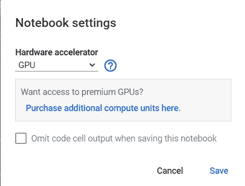

图 8。在 google colab 中设置 GPU

首先，让我们确保您正在使用 GPU 运行时来运行这个笔记本，使用下面的代码，这样推理会快得多。如果以下命令失败，使用**运行时**菜单，选择**改变运行时类型**，如上图所示:

如果它正在工作并被检测到，您将收到类似的消息:

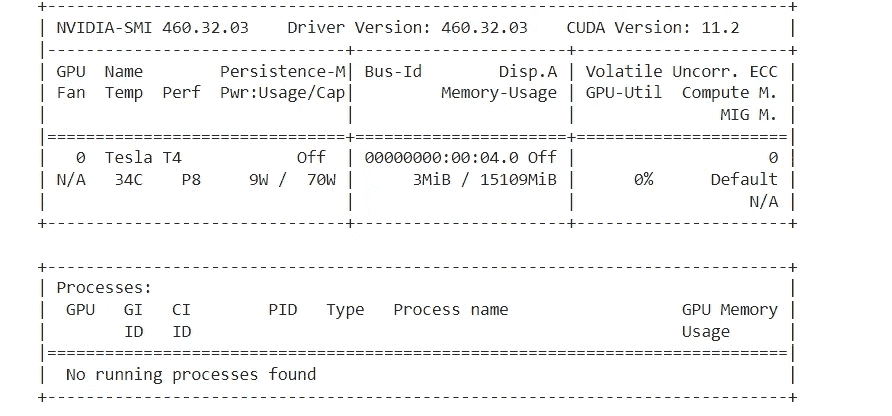

接下来，安装**扩散器**和 **scipy** 、 **ftfy** 和**变压器**:

如果您同意示范协议，您还需要在此处 勾选复选框，接受 [**的示范许可。你还必须在**](https://huggingface.co/CompVis/stable-diffusion-v1-4) **[**拥抱脸**](https://huggingface.co/) 上注册，并获得访问令牌才能使用模型。**

由于 google collab 禁用了外部小部件，我们需要启用它。为此，请运行以下代码，以便能够使用“notebook_login”

现在，您可以使用从您的帐户获得的访问令牌登录您的拥抱脸帐户:

接下来，我们将从扩散器库中加载**StableDiffusionPipeline**。**StableDiffusionPipeline**是一个端到端的推理管道，可用于从文本生成图像。

我们将加载预训练模型的权重。模型 id 将为[CompVis/stable-diffusion-v1–4](https://huggingface.co/CompVis/stable-diffusion-v1-4)，我们还将使用特定类型的修订 ad torch_dtype 来实现该功能。我们将设置**修订版** = " **fp16** "以从半精度分支加载权重，并设置**torch _ dtype**= "**torch . float16**"以告知扩散器期望 float 16 精度中的权重。

像这样设置变量是很重要的，以便能够在 google CoLab 的免费版本上运行模型。

现在，让我们将流水线移到 GPU，以便有一个更快的推断:

现在是生成图片的时候了。我们将编写一个提示，并将其提供给管道，然后打印输出。**这里的输入提示是一张宇航员骑马的照片，**让我们检查一下输出:

图 9。生成的图像使用拥抱脸扩散管道。

每次你运行上面的代码，你都会得到不同的图像。为了每次都获得相同的结果，可以向管道传递一个随机种子，如下面的代码所示:

您也可以使用 **num_inference_steps** 参数更改推理步骤的数量。一般来说，推理步骤越多，生成的图像质量越高，但生成结果所需的时间会更多。如果您想要更快的结果，您可以使用较少的步骤。

以下单元格使用与之前相同的种子，但步骤较少。请注意，一些细节(如马头或头盔)的清晰度不如上一幅图像:

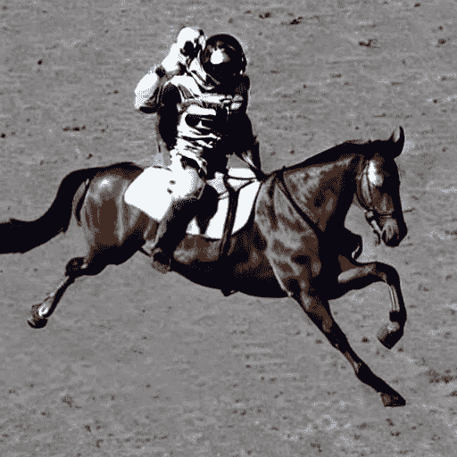

图 10。

管道调用中的另一个参数是**引导比例**。这是一种增加对条件信号的坚持的方式，在这种情况下，条件信号是文本以及总体样本质量。

简而言之，无分类器指导迫使生成更好地匹配提示。像 7 或 8.5 这样的数字给出了好的结果。如果您使用非常大的数量，图像可能看起来不错，但会减少多样性。

要为同一个提示生成多个图像，我们只需使用一个列表，让同一个提示重复几次。我们将把列表发送到管道，而不是我们以前使用的字符串。

让我们首先编写一个助手函数来显示图像网格。只需运行以下单元格来创建 **image_grid** 函数:

现在，我们可以在运行带有 3 个提示列表的管道后生成一个网格图像。

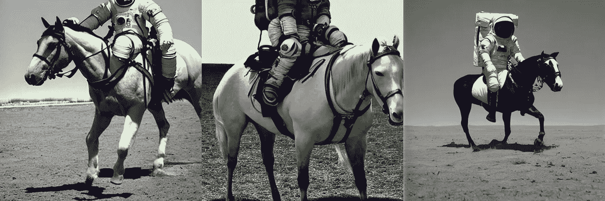

图 11。

我们还可以生成一个 n*m 图像的网格:

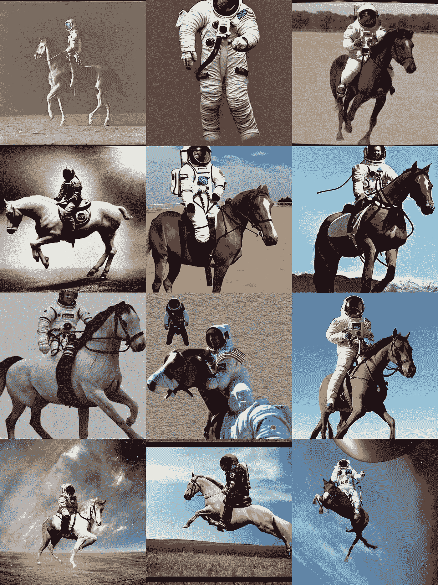

图 12。

通过稳定扩散生成的图像的默认大小为 512*512 像素。然而，使用**高度**和**宽度**参数可以非常容易地改变生成图像的高度和宽度。以下是一些选择好的图像尺寸的技巧:

*   将高度和宽度参数都选择为 8 的倍数。
*   在较低质量下，将高度和宽度中的任何一个设置为小于 512。
*   将两个方向都设置为大于 512 将导致列出全局一致性，并将导致准备图像区域。
*   最佳选择值是一个方向 512，另一个方向大于 512。

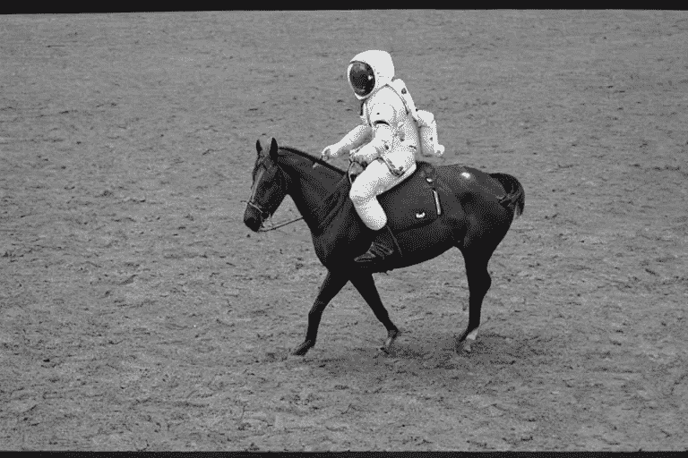

图 13。

# **4。用扩散器构建自己的管道**

最后，是时候用扩散器创建你的自定义扩散管道了。我们将演示如何使用不同调度器的稳定扩散，即 Katherine Crowson 的 K-LMS 调度器。

让我们一步一步地看一看我们自己是如何编写的。我们将从加载相关的单个模型开始:

[**预训练扩散模型**](https://huggingface.co/CompVis/stable-diffusion-v1-3-diffusers/tree/main) 包括建立完整扩散管道所需的所有组件。它们存储在以下文件夹中:

*   **text_encoder:** 稳定扩散使用 CLIP，但其他扩散模型可能会使用 BERT 等其他编码器。
*   **tokenizer:** 它必须与 **text_encoder** 模型所使用的相匹配。
*   **调度器:**用于在训练过程中逐步向图像添加噪声的调度算法。
*   **U-Net** :用于生成输入的潜在表示的模型。
*   **VAE** :自动编码器模块，我们将使用它将潜在的图像解码成真实的图像。

我们可以通过引用保存组件的文件夹来加载组件，使用**子文件夹**参数到 **from_pretrained** 。

现在，我们不是加载预定义的调度程序，而是加载一个 K-LMS 调度程序。

接下来，我们将模型移动到 GPU。

我们现在定义用于生成图像的参数。注意，与前面的例子不同，我们设置**num _ inference _ steps**= 100 来得到一个更加清晰的图像。

接下来，我们得到提示的**文本嵌入**。这些嵌入将用于调节 **U-Net** 模型。

我们还将获得无分类器指导的无条件文本嵌入，这只是填充标记(空文本)的嵌入。它们需要与条件 text _ embedding(batch _ size 和 seq_length)具有相同的形状

对于无分类器制导，我们需要进行两次前向传递。第一个是有条件的输入(text_embeddings)，第二个是无条件的嵌入(uncond_embeddings)。因此，我们将两者连接成一个批处理，以避免两次向前传递:

让我们生成初始随机噪声:

生成的潜影形状为 64 * 64。此后，该模型将把这种潜在表示(纯噪声)转换成 512 * 512 的图像。

现在我们将使用选择的 **num_inference_steps 初始化调度程序。**这将计算去噪过程中使用的 sigmas 和精确步长值:

**K-LMS 调度器**需要将**延迟**乘以其 **sigma** 值。让我们在这里这样做:

最后，我们现在准备编写去噪循环:

我们现在可以使用 **vae** 将生成的潜像解码回图像:

最后，让我们将图像转换为 PIL，这样我们就可以显示或保存它。

图 14。

# 5.参考资料:

1.  [用扩散器稳定扩散](https://colab.research.google.com/github/huggingface/notebooks/blob/main/diffusers/stable_diffusion.ipynb#scrollTo=AAVZStIokTVv)

[2。稳定扩散入门！(代码、高频空间、扩散器笔记本)](https://www.youtube.com/watch?v=epktKtLWgHQ&t=973s)

3.本文中使用的代码

 [## GitHub-youssefHosni/稳定扩散

### 此时您不能执行该操作。您已使用另一个标签页或窗口登录。您已在另一个选项卡中注销，或者…

github.com](https://github.com/youssefHosni/Stable-Diffusion) 

***喜欢文章？成为*** [***中等会员***](https://youssefraafat57.medium.com/membership) ***继续无限制学习。如果你使用下面的链接，我会收到一小部分会员费，不需要你额外付费。***

 [## 加入我的介绍链接媒体-优素福胡斯尼

### 阅读 Youssef Hosni(以及媒体上成千上万的其他作家)的每一个故事。您的会员费直接支持…

youssefraafat57.medium.com](https://youssefraafat57.medium.com/membership) 

***感谢阅读！如果你喜欢这篇文章，一定要鼓掌(高达 50！)并在***[***LinkedIn***](https://www.linkedin.com/in/youssef-hosni-b2960b135/)***上与我联系，并在*** [***上关注我的【中型】***](https://youssefraafat57.medium.com/) ***以保持更新我的新文章***