# 泰坦尼克号卡格尔入门

> 原文：<https://pub.towardsai.net/getting-started-with-titanic-kaggle-447a309f2d19?source=collection_archive---------5----------------------->

## [机器学习](https://towardsai.net/p/category/machine-learning)

来源:[吉菲](https://giphy.com/gifs/kate-winslet-XOY5y7YXjTD7q/links)

最近，我开始使用 Kaggle，并参加了我的第一场比赛——[泰坦尼克号:灾难中的机器学习](https://www.kaggle.com/c/titanic)。这是一个初学者友好的机器学习竞赛，目标是预测给定的乘客是否会幸存。在这篇文章中，我将分享泰坦尼克号数据集的基本数据分析。在处理数据集之前，我们先从 Kaggle 开始。

# 什么是 Kaggle？

> [**Kaggle**](https://kaggle.com) ，谷歌有限责任公司的子公司，是一个数据科学家和机器学习实践者的在线社区。Kaggle 允许用户查找和发布数据集，在基于网络的数据科学环境中探索和构建模型，与其他数据科学家和机器学习工程师合作，并参加竞赛以解决数据科学挑战。
> 
> Kaggle 于 2010 年通过提供机器学习竞赛起家，现在还提供公共数据平台、基于云的数据科学工作台和人工智能教育。— [维基百科](https://en.wikipedia.org/wiki/Kaggle)

## 关于挑战

> 泰坦尼克号的沉没是历史上最臭名昭著的海难之一。
> 
> 1912 年 4 月 15 日，在她的处女航中，被广泛认为是“不沉”的皇家邮轮泰坦尼克号在与冰山相撞后沉没。不幸的是，没有足够的救生艇容纳船上的每个人，导致 2224 名乘客和船员中的 1502 人死亡。
> 
> 虽然幸存有一些运气成分，但似乎某些群体比其他群体更有可能幸存。
> 
> 在这个挑战中，我们要求你建立一个预测模型来回答这个问题:“什么样的人更有可能生存？”使用乘客数据(即姓名、年龄、性别、社会经济阶层等)。— Kaggle

这篇文章分为 6 个步骤。

*   获取 Kaggle 帐户
*   理解竞争
*   导入所需的库并加载数据
*   数据清理
*   电子设计自动化(Electronic Design Automation)
*   数据可视化

# 第一步:开始

要使用 Kaggle，您需要一个 Kaggle 帐户。点击此处并在 Kaggle 上注册，你就可以获得免费的 Kaggle 账户。一旦你有了帐户，访问[泰坦尼克号比赛](https://www.kaggle.com/c/titanic)并报名参加比赛。

# 第二步:了解竞争

泰坦尼克号比赛有三个数据文件。

*   性别 _ 提交. csv
*   train.csv
*   test.csv

## 1.性别 _ 提交. csv

“gender_submission.csv”文件是一个示例，它显示了您应该如何组织您的预测。它预测所有女性乘客幸存，所有男性乘客死亡。你关于生存的假设可能会不同，这将导致不同的提交文件。但是，您的提交文件必须看起来像这个文件。

## 2.train.csv

“train.csv”包含车上乘客子集的详细信息(准确地说是 891 名乘客，其中每个乘客的详细信息在表中的不同行中给出)

## 3.test.csv

首先，你必须在“train.csv”中找到一个隐藏的模式，然后根据这个模式，你必须预测给定的 418 名乘客(在“test.csv”中)是否会幸存。

# 步骤 3:导入所需的库并加载数据

```
*# data analysis and wrangling*
import pandas as pd
import numpy as np
import random as rnd

*# visualization*
import seaborn as sns
import matplotlib.pyplot as pltsns.set_style('dark')
%matplotlib inline
```

现在我们的包已经成功导入了。让我们加载数据。

```
# load train data
train_data = pd.read_csv("/kaggle/input/titanic/train.csv")# load test data
test_data = pd.read_csv("/kaggle/input/titanic/test.csv")
```

# 步骤 4:数据清理

让我们看看我们的训练和测试数据。

```
train_data.head()
```

```
test_data.head()
```

首先，我们来看看列。

```
print(train_data.columns.values)
print("\n")
print('='*50)
print("\n")
print(test_data.columns.values)# output['PassengerId' 'Survived' 'Pclass' 'Name' 'Sex' 'Age' 'SibSp' 'Parch' 'Ticket' 'Fare' 'Cabin' 'Embarked']

==================================================

['PassengerId' 'Pclass' 'Name' 'Sex' 'Age' 'SibSp' 'Parch' 'Ticket' 'Fare' 'Cabin' 'Embarked']
```

我们可以看到，训练数据有 12 列，测试数据有 11 列。对于测试数据，我们必须预测乘客能否生还。

让我们看看每一栏的信息。

*   PassengerId:每个乘客的唯一索引。它从 1 开始，每个新乘客增加 1。
*   幸存:显示乘客是否幸存。1 代表幸存，0 代表未幸存。
*   Pclass:票类。1 代表头等票。2 代表二等票。3 代表三等舱票。
*   姓名:乘客姓名。这个名字还包括称呼男人为“先生”,称呼女人为“夫人”,称呼女孩为“小姐”,称呼男孩为“主人”。
*   性别:乘客的性别。不是男的就是女的。
*   年龄:乘客的年龄。此栏中的“NaN”值表示尚未记录该特定乘客的年龄。
*   SibSp:与每位乘客同行的兄弟姐妹或配偶的数量。
*   Parch:与每位乘客同行的儿童的父母人数。
*   车票:票号。
*   票价:乘客为旅行支付了多少钱。
*   客舱:乘客的客舱号码。此栏中的“NaN”值表示该特定乘客的客舱号码未被记录。
*   上船:特定乘客上船/上船的港口。

看看数据形状。

```
print('='*10)
print("Train data shape")
print('='*10)
print("\n")
print(train_data.shape)
print("\n")
print('='*10)
print("Test data shape")
print('='*10)
print("\n")
print(test_data.shape)# output==========
Train data shape
==========(891, 12)==========
Test data shape
==========

(418, 11)
```

使用`describe()`功能，您可以显示不同的值，如计数、平均值、标准偏差等。数值数据类型。

```
train_data.describe()
```

```
test_data.describe()
```

我们可以看到，在列车数据中，年龄、车厢和上船的值缺失，而在测试数据中，年龄、车厢和票价的值缺失。

年龄上船，票价只有几个失踪的价值。而机舱栏有这么多的缺失值。

最佳解决方案之一是填充年龄和票价的中间值。

```
# filling median for missing value in Age
train_data['Age'] = train_data['Age'].fillna(train_data['Age'].median())
test_data['Age'] = test_data['Age'].fillna(test_data['Age'].median())# filling median for missing value in Fare
test_data["Fare"].fillna(test_data["Fare"].median(), inplace=True)
```

我将首先删除客舱和机票功能，因为从中无法提取更多有用的信息。

```
# dropping Cabin column
train_data = train_data.drop(['Cabin'], axis = 1)
test_data = test_data.drop(['Cabin'], axis = 1)# dropping Ticket column
train_data = train_data.drop(['Ticket'], axis = 1)
test_data = test_data.drop(['Ticket'], axis = 1)
```

已装载的列只有两个缺失值。我用“S”填充缺失值，因为这是最受欢迎的站点。

```
train_data['Embarked'] = train_data['Embarked'].fillna('S')
```

现在我们的数据没有空值/缺失值。

让我们表演一些 EDA。

# 步骤 5: EDA(探索性数据分析)

为了进行一些观察和假设，我们需要通过旋转彼此相对的特性来快速分析一些特性的相关性。当我们清理数据时，我们能够为每个特征建立这种关联。

## 观察:

```
# number of survived passengers
train_data.groupby(['Survived'])['Survived'].count()# output
Survived
0    549
1    342
```

*   很明显，891 名乘客中只有 342 人幸存，这表明大多数乘客已经死亡。

```
# percentage of male and female who survived
train_data[["Sex", "Survived"]].groupby(['Sex'], as_index=False).mean().sort_values(by='Survived', ascending=False)
```

*   女性乘客有很高的生存优先权。

```
# percentage of people survived according to their Ticker Class
train_data[["Pclass", "Survived"]].groupby(['Pclass'], as_index=False).mean().sort_values(by='Survived', ascending=False)
```

*   头等舱乘客生还几率较高，大于 60%。

```
# Percentage of survived people based on their embarked. 
train_data[["Embarked", "Survived"]].groupby(['Embarked'], as_index=False).mean().sort_values(by='Survived', ascending=False)
```

*   从瑟堡上船的乘客。

# 步骤 6:数据可视化

让我们做一些可视化分析，以了解不同特性的重要性，并检查我们的观察。

```
sns.countplot(x = 'Survived', data = train_data)
```

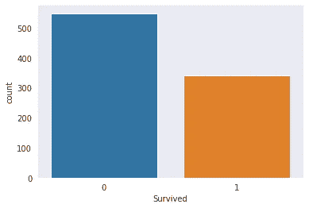

```
#draw a bar plot of survival by sex
sns.barplot(x="Sex", y="Survived", data=train_data)
```

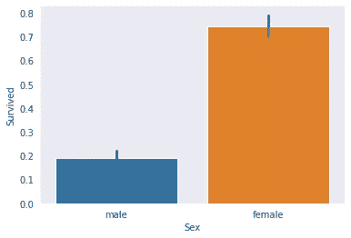

```
#draw a bar plot of survival by sex
sns.barplot(x="Pclass", y="Survived", data=train_data)
```

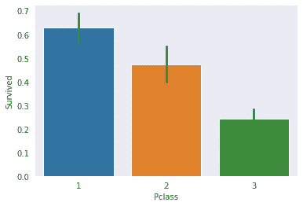

```
#draw a bar plot of survival by sex
sns.barplot(x = "Embarked", y = "Survived", data = train_data)
```

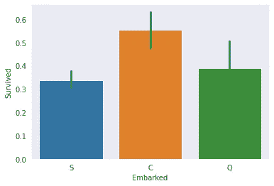

```
#draw a bar plot of survival by sex
sns.barplot(x="Parch", y="Survived", data=train_data)
```

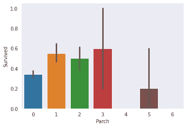

```
# peaks for survived/not survived passengers by their age
facet = sns.FacetGrid(train_data, hue="Survived",aspect=4)
facet.map(sns.kdeplot,'Age',shade= True)
facet.set(xlim=(0, train_data['Age'].max()))
facet.add_legend()# average survived passengers by age
fig, axis1 = plt.subplots(1,1,figsize=(18,4))
average_age = train_data[["Age", "Survived"]].groupby(['Age'],as_index=False).mean()
sns.barplot(x='Age', y='Survived', data=average_age)
```

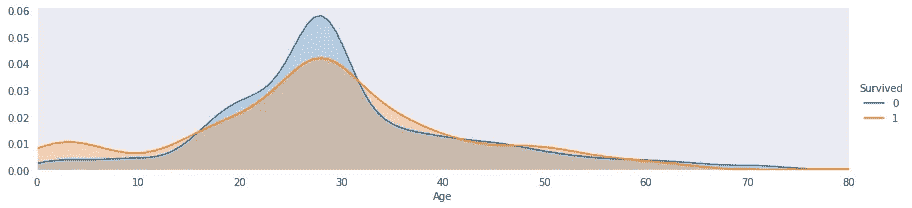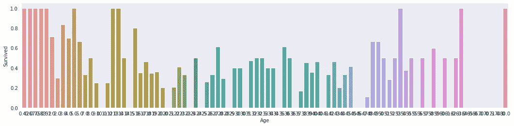

```
grid = sns.FacetGrid(train_data, col='Survived', row='Pclass')
grid.map(plt.hist, 'Age', alpha=.5, bins=20)
grid.add_legend();
```

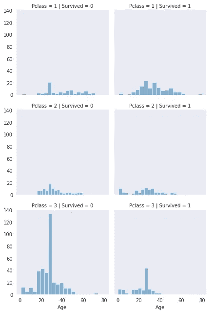

```
grid = sns.FacetGrid(train_data, col='Survived', row='Pclass')
grid.map(plt.hist, 'SibSp', alpha=.5, bins=20)
grid.add_legend();
```

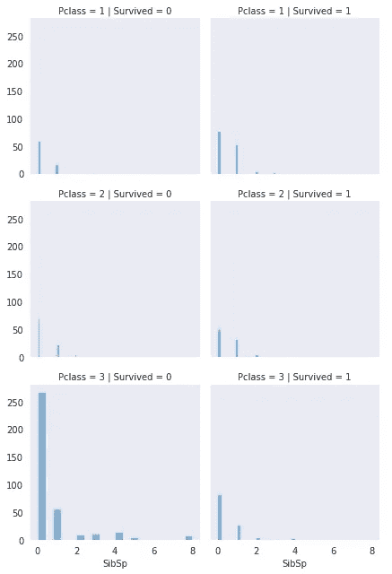

```
grid = sns.FacetGrid(train_data, col='Survived', row='Pclass')
grid.map(plt.hist, 'Embarked', alpha=.5, bins=20)
grid.add_legend();
```

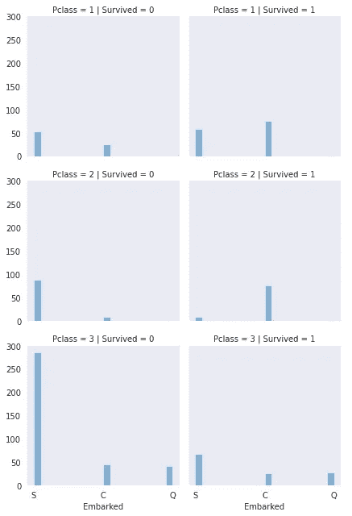

```
sns.heatmap(train_data.corr(),annot=True,cmap='RdYlGn',linewidths=0.2)
fig=plt.gcf()
fig.set_size_inches(20,12)
plt.show()
```

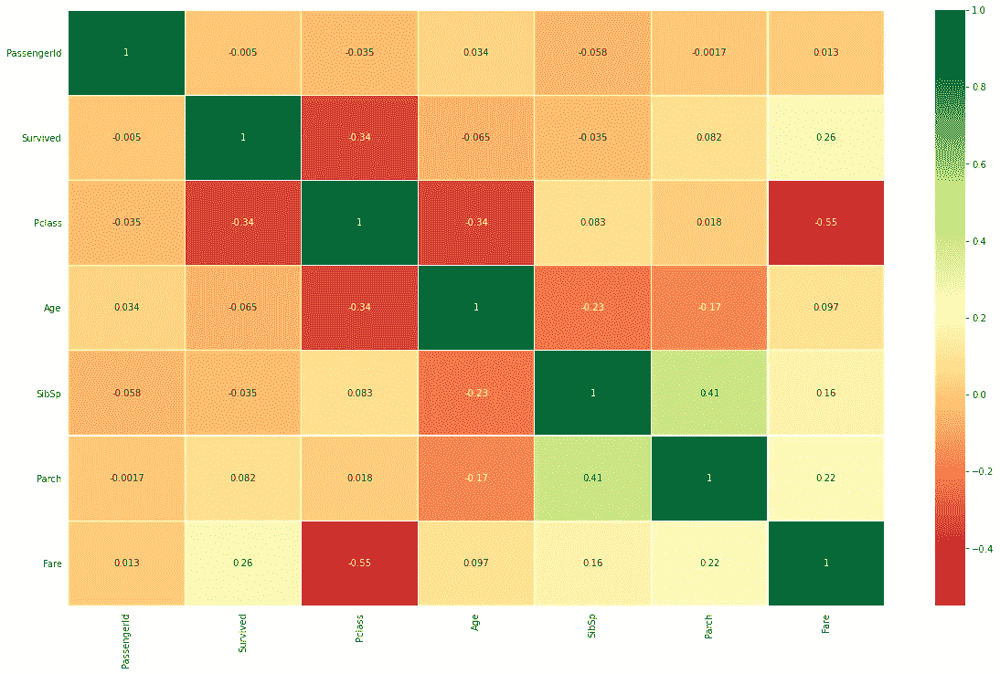

# 步骤 7:将分类数据转换为数字数据

在我们的数据中，一些特征由类别值表示，如性别、船载等。所以我们必须把它们转换成一个数值。

```
# convert sex features 0 - female, 1 - male
train_data['Sex'] = train_data['Sex'].map({'male':1, 'female':0})
test_data['Sex'] = test_data['Sex'].map({'male':1, 'female':0})# convert embarked features C - 0, S - 1, Q - 2
train_data['Embarked'] = train_data['Embarked'].map({'Q':2, 'S':1, 'C':0})
test_data['Embarked'] = test_data['Embarked'].map({'Q':2, 'S':1, 'C':0})
```

今天的帖子到此为止。在我的下一篇文章中，我将训练一些模型来预测新乘客是否幸存。你可以在这里找到一个 kaggle 笔记本/内核。

**感谢阅读！**

如果你喜欢我的工作并想支持我，我会非常感谢你在我的社交媒体频道上关注我:

*   支持我的最好方式就是跟随我上[](https://medium.com/@themlphdstudent)**。**
*   **订阅我的新 [**YouTube 频道**](https://www.youtube.com/c/themlphdstudent) 。**
*   **在我的 [**邮箱列表**](http://eepurl.com/hampwT) 报名。**

**以防你错过我的 python 系列。**

*   **第 0 天:[挑战介绍](/@durgeshsamariya/100-days-of-machine-learning-code-a9074e1c42c3)**
*   **第 1 天: [Python 基础— 1](/the-innovation/python-basics-variables-data-types-and-list-59cea3dfe10f)**
*   **第 2 天: [Python 基础知识— 2](https://towardsdatascience.com/python-basics-2-working-with-list-tuples-dictionaries-871c6c01bb51)**
*   **第三天: [Python 基础知识— 3](/towards-artificial-intelligence/python-basics-3-97a8e69066e7)**
*   **第 4 天: [Python 基础知识— 4](/javarevisited/python-basics-4-functions-working-with-functions-classes-working-with-class-inheritance-70e0338c1b2e)**
*   **第 5 天: [Python 基础知识— 5](https://medium.com/towards-artificial-intelligence/python-basics-5-files-and-exceptions-by-durgesh-samariya-5d892d170640)**

**我希望你会喜欢我的其他文章。**

*   **[给初学者的 Git](https://medium.com/dev-genius/learn-terminal-git-commands-in-3-minutes-3997b354382e)**
*   **[八月月度阅读清单](/@durgeshsamariya/august-2020-monthly-machine-learning-reading-list-by-durgesh-samariya-20028aa1d5cc)**
*   **[集群资源](/towards-artificial-intelligence/a-curated-list-of-clustering-resources-fe355e0e058e)**
*   **[离群点检测资源](/dev-genius/curated-list-of-outlier-detection-resources-35ed27d0e46e)**