# Unix/Linux 入门

> 原文：<https://pub.towardsai.net/getting-started-with-unix-linux-9eb7f9e26a5e?source=collection_archive---------2----------------------->

## 计算

## Unix/Linux shell 脚本简介


(照片由[杰瑞米·雅普](https://unsplash.com/photos/J39X2xX_8CQ?utm_source=unsplash&utm_medium=referral&utm_content=creditCopyText)在 [Unsplash](https://unsplash.com/search/photos/film-projector?utm_source=unsplash&utm_medium=referral&utm_content=creditCopyText) 上拍摄)

## 介绍

Unix 是一个多用户操作系统，大约在 1969 年由美国电话电报公司·贝尔实验室开发。UNIX 的主要目的是多任务。

*   多用户:不同的用户可以共享相同的资源。
*   多任务处理:同时执行多个进程。

Unix 是商业软件，而 Linux[是开源软件。Linux 操作系统很容易编译符合 POSIX 标准的 Unix 软件。](http://kernel.org/)

Unix 体系结构由内核、外壳和应用程序组成。/程序。

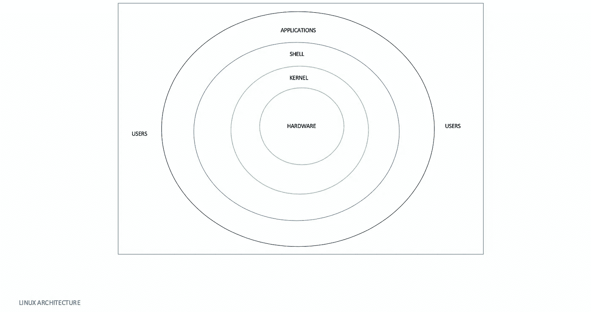

基本架构概述

**内核**是操作系统的核心组件。它与硬件和大多数任务交互，如内存管理、任务调度和文件管理。

**Shell** 是命令行界面(CLI)，在最初的日子里，没有图形用户界面(GUI)，所以需要命令行界面与计算机进行交互。例如，要创建一个目录/文件夹，我们写下`mkdir`文件夹名。简而言之，shell 是用户和计算机之间的媒介。有不同类型的外壳，例如:

*   科恩壳牌公司
*   伯恩·谢尔
*   GNU Bourne-Again Shell (BASH)
*   c 壳
*   POSIX 外壳
*   Zsh ( [macOS Catalina](https://en.wikipedia.org/wiki/MacOS_Catalina) 默认 shell)

**Shell 脚本**是将所有命令放在一个文本文件中。shell 脚本类似于电影脚本，告诉演员他们需要完成什么任务。shell 执行文本文件中的命令，就像输入命令一样。Zsh shell 是我们将在整个博客中使用的。

内核-外壳关系图解假设你要移动一个文件，那么你在外壳中键入 ***mv myfile*** 然后回车。shell 在 file-store 中搜索文件' ***myfile*** '，并通过系统调用请求内核对 ***myfile*** 执行 mv。Linux 文件存储是一个树形结构，一个顶部称为根的倒置树，用“/.”表示波浪号(`~`)代表主目录。

**应用**是在 Shell 上运行的实用程序，如文本编辑器。

## shell 脚本入门。

shell 脚本主题将分为六个部分。

*   航行
*   文件操作，如创建、删除、迁移。
*   搜索和正则表达式。
*   文件权限

让我们开始吧；

## 航行

用 Zsh 或 terminal 打开 iterm2。我将使用 iterm2，它只是一个 macOS 的终端模拟器。


***如何检查哪个 shell 在终端里？***

echo 是向控制台显示消息的命令。

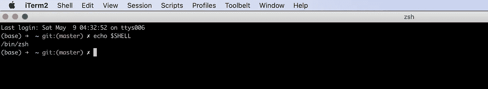

所以输出说是`zsh` shell。

命令的一般结构

```
[command] [options] [arguments]
```

*   选项前面大多是-
*   参数有文件名、文件夹名等。

例如，向控制台显示“让我们开始外壳脚本编写”。

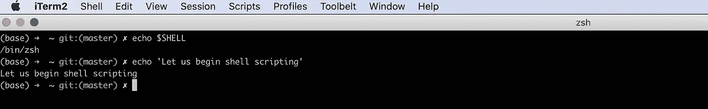

在上面的例子中， ***echo*** 是*命令，*和' ***让我们开始 shell 脚本'*** 是*参数。*

其他有用的命令

*   `***pwd***`:打印工作目录，即返回工作目录的 ***绝对路径*** 。一个目录从根目录到工作目录的顺序叫做 ***绝对*** ***路径*** 。类似的解释是对于 ***相对路径*** ，即参照当前目录。

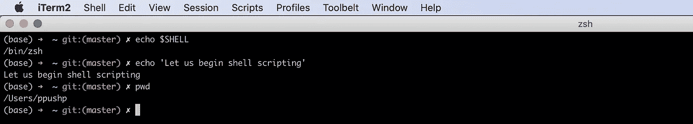

```
man command
```

> 例如`**man** **pwd**`给出了 pwd 命令的完整描述。

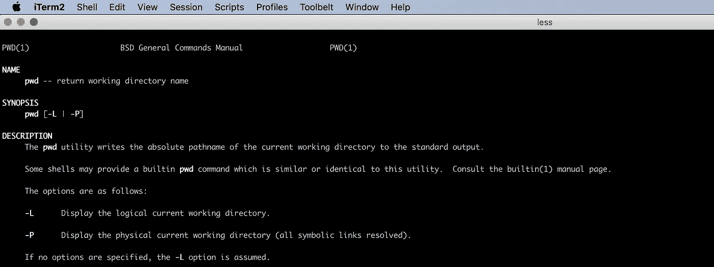

*   `***ls***`:列出工作目录下的所有文件和目录。

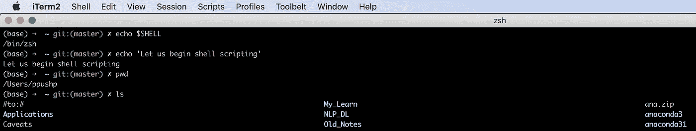

*   `***ls -l***`:工作目录下所有文件和目录的详细视图。它显示读、写权限、文件大小、正常文件或目录以及与每个文件相关的其他信息。

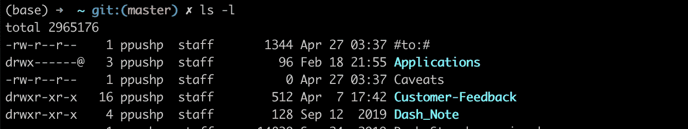

文件快照。

*   第一列指定它是文件还是目录。如果它以 **d、**开头，那么它就是目录 else 文件。
*   第二列代表内存块。
*   第三列代表所有者/创建者。
*   第四列代表一组所有者。
*   第五列以字节为单位指定大小。
*   第六列表示创建/修改日期。
*   最后一列表示文件名。
*   `***ls -l path***` **:** 显示特定路径中所有文件的详细视图。

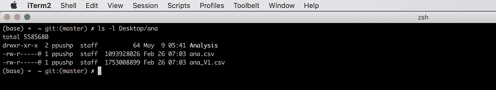

显示桌面/ana 位置中的所有文件

*   `**cd**` **:** 将目录更改为给定路径。

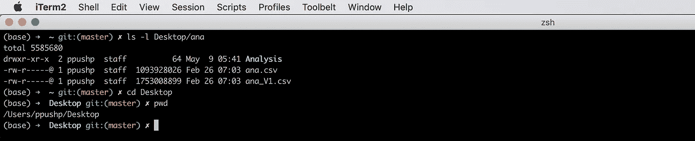

所以现在 */Users/ppushp/Desktop* 是我们当前的工作目录。

`***cd ..***` ***:将当前工作目录上移一个文件夹。***

`***cd***` *:* 没有任何参数指向主目录。

`***cd .***`:指向当前工作目录的路径。

`***cd ~***` **:** 指向主目录。

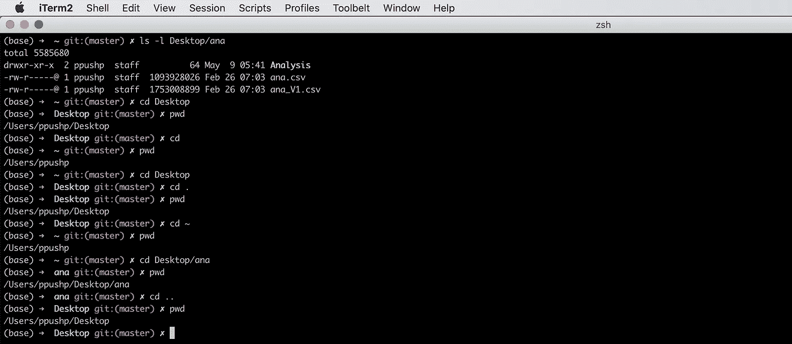

## 文件操作，如创建、删除、迁移。

我们已经看到 Linux 文件存储是一个树形结构，一个倒置的树。

*   目录的创建

```
**mkdir [options] <Directory>**
```

让我们创建一个名为 *script_tutorial 的目录。*命令是`**mkdir directory_name**` ***。***

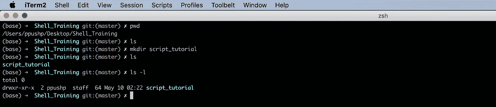

我们在*/Users/ppushp/Desktop/Shell _ Training*位置，那里没有文件。一旦我们做到****mkdir****我们就可以在那里看到*脚本 _ 教程*。**

*   **文件的创建。**

```
****touch [options] <filename>****
```

**创建空白文件'*shell _ scripting . txt '****，*** 使用 ***触摸 shell_scripting.txt*****

**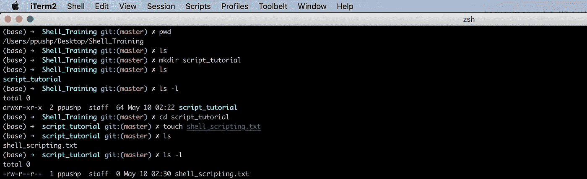**

*   **从一个地方转移到另一个地方。**

```
****mv [options] <source> <destination>****
```

**假设我们要将 *shell_scripting.txt 文件*从 *script_tutorial 移动到 Shell_Training。***

****mv**script _ tutorial/Shell _ scripting . txt/Users/ppu shp/Desktop/Shell _ Training**

**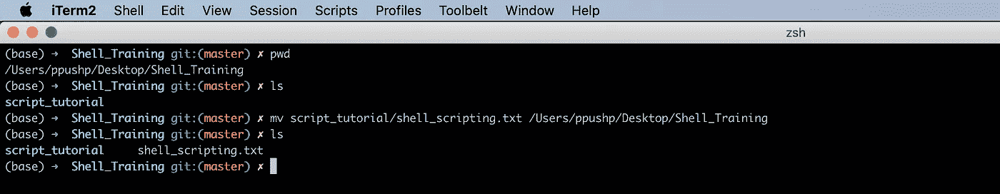**

**它甚至适用于目录。如果我们保持源和目标路径相同，但在目标中传递不同的文件名，它将重命名该文件。假设您想将文件 *shell_scripting.txt* 重命名为 *shell_script.txt.***

**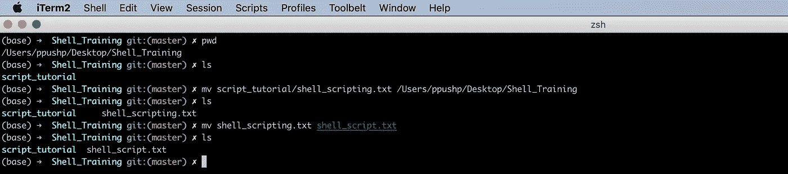**

*   **复制文件和文件夹。**

```
****cp [options] <source> <destination>****
```

**将 *shell_script.txt* 文件复制到 *script_tutorial* 目录下的任务。**

***cp../外壳 _ 脚本. txt../script_tutorial***

****

**把*脚本 _ 教程*目录复制到*桌面怎么样？***

**这个过程类似于复制文件，但是是以递归的方式，所以传递选项-r。**

****

*   **删除文件和文件夹。**

****在删除任何文件或文件夹之前要小心**,因为没有相反的方法可以找回文件/目录。**

```
****rm [options] <file>****
```

**我们想删除保存在*桌面*中的文件“*shell _ script . txt”*的副本**

***RM ~/Desktop/script _ tutorial/shell _ script . txt***

**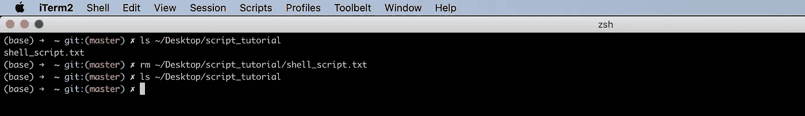**

**现在目录 script_tutorial 已经没用了，我们把它删了吧。**

***RM-r ~/Desktop/script _ tutorial***

**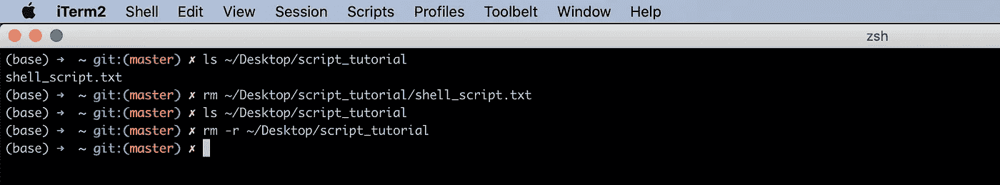**

## **搜索和正则表达式。**

**通配符是元字符的子集，用于根据某些字符选择文件或文件夹。换句话说，它是其他字符的一组符号。**

**三种广泛使用的通配符是:**

*   ******* 通配符:零个或多个字符。**
*   ****？**通配符:单个字符。**
*   ****[]** 通配符:字符的范围。**

**考虑以下字符集 push、pul、puh、pushkar、ppush、ppushkar、prkh、pus、pth。**

**p*r 代表所有以 p 开头以 r 结尾的字符。**

**输出:pushkar，ppushkar**

**p？？h:所有以 p 开头，以 h 结尾，中间有两个字符的字符。**

**输出:push，prkh**

**p[us]h:匹配以 p 开头以 h 结尾的字符，中间有 u 或 s。**

**输出 puh、psh**

**p[s-v]h:匹配以 p 开头以 h 结尾的字符，中间有 s-v 中的任一字符。**

**输出:psh、pth、puh。**

**让我将一些文件添加到 shell_script 文件夹并列出它。**

**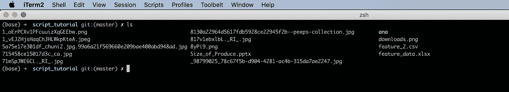**

**列出所有扩展名为 JPEG 的文件。**

```
**ls *.jpeg**
```

**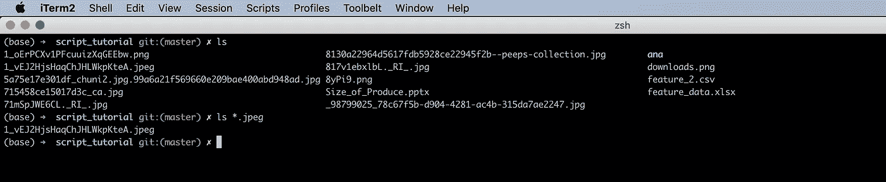**

**列出扩展名为四个字母的所有文件。**

```
**ls *.????**
```

**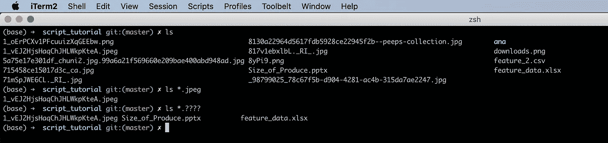**

**列出所有包含数字的文件。**

```
**ls *[0-9]***
```

**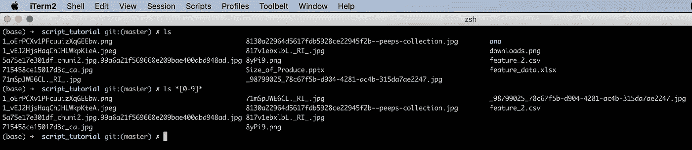**

*   ****正则表达式。****

**我有一个 player.txt 文件，其中包含了前 200 名测试运行制造商的列表。**

**让我们看看一些详细的报告，比如字数**

**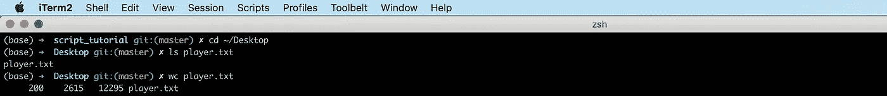**

**它显示 200 行/行，2615 个单词。**

**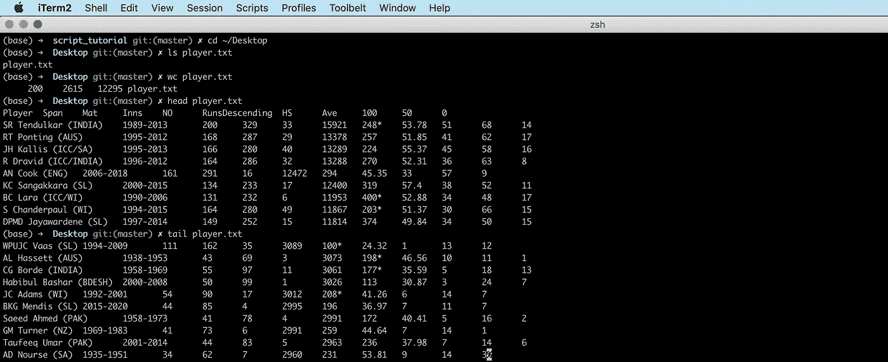**

**来自 player.txt 的示例**

**Grep 用于查找包含给定表达式的行。**

```
****grep** **<pattern> [path]****
```

**查找包含表达式“Tend”的行**

```
**grep Tend player.txt**
```

**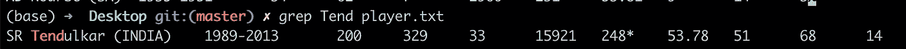**

*****元字符和正则表达式的组合。*****

```
****egrep [command line options] <pattern> [path]****
```

**示例:**

```
**grep r.a player.txt**
```

**它将获取所有包含字符“r ”,后跟任意字符，后跟字符“a”的行。**

**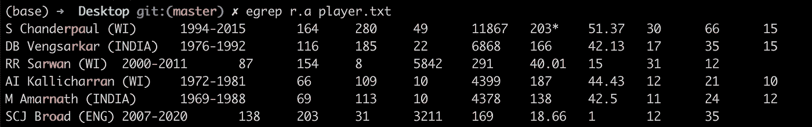**

**如果我们想看到行号和计数也分别使用选项-n 和-c。**

**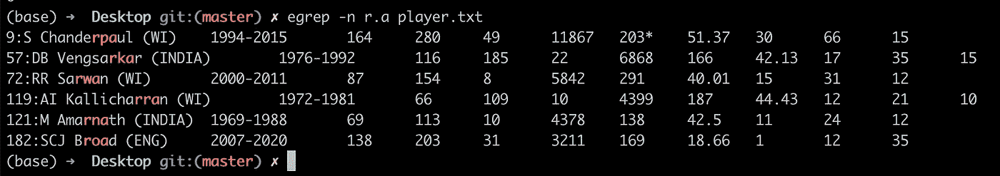**

**显示行号**

**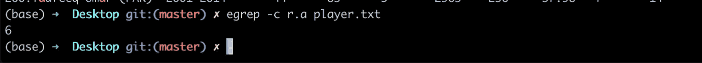**

**选定行的计数。**

**正则表达式本身是一个广泛的主题，您将在本博客中进一步阅读。**

****查找:**用于查找文件的位置**

```
****find . -name path****
```

**找到我们的文件 player.txt 的位置**

```
**find . -name player.txt**
```

****

**History 和 bash_history 可以用来检查以前使用过的命令。**

****管道:**用于链式操作，第一个命令的输出作为第二个操作的输入。**

**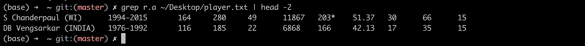**

## **文件权限**

*   **在 Linux 中一切都是文件，Linux 中有三种类型的文件**
*   ****普通文件**是系统中与数据、文本或程序相关的文件。**
*   ****特殊文件**是提供对硬盘、光驱、调制解调器等硬件访问的文件。**
*   ****目录**存储特殊和普通文件，类似于文件夹。**

**如何知道是普通文件还是目录，用下面的命令就可以了。**

```
**file path**
```

****

**输出指出桌面是一个目录。考虑下面的例子，其中用于普通文件的'*文件路径*'命令给出类似于……的输出，带有 CLRF 行终止符。CLRF 是 HTTP 协议中的回车符(ASCII 13，\r)换行符(ASCII 10，\n)，在这里可以了解更多信息。**

**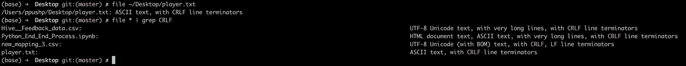**

## **文件权限。**

**权限意味着用户可以执行的操作，如读、写和执行。**

****r** :可以打开文件。**

**一个人可以做出改变。**

****x** :可以运行或执行一个文件。**

**用户可以有三种类型:**

**所有者:主要拥有创建文件的人的个人**

**组:每个文件属于一个组**

**其他人:除了小组成员或所有者之外。**

**因此，每个用户都有两个选项:允许或不允许。总共将有 2*2*2 即 8 种可能性。**

**0:没有权限**

**1:拥有权限。**

**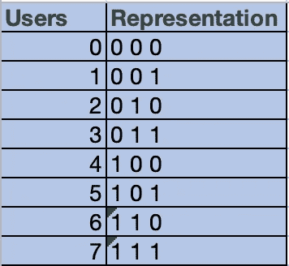**

**为了解释上表，让我们看一个例子。**

**用户 0:表示为 0，0，0 表示它没有任何权限。**

**用户 3:表示为 0，1，1 表示它没有读权限，但有写和执行权限。**

**如何更改权限？**

**`**chmod**` 是改变权限模式的命令。**

```
****chmod [permissions] [path]****
```

**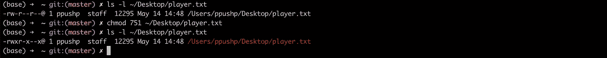**

**将 751 分成几个部分，其中 7 代表所有者，5 代表团体，1 代表其他**

**7:代表 111，因此所有者将拥有所有权限**

**5:表示 101，因此该组将拥有读取和执行权限**

**1:对于 001，所以其他人只有执行权限**

**player.txt 文件的初始权限状态是-rw-r--r--已更改为-rwxr-x- -x-**

## **结论**

**这是关于 Linux 和 bash 的入门，在我的下一篇文章中，我们将研究进程管理、脚本和调度。**