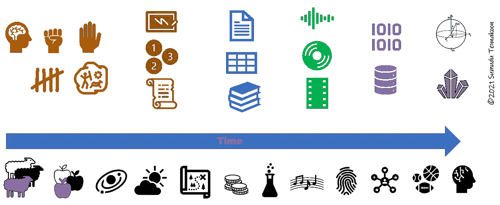
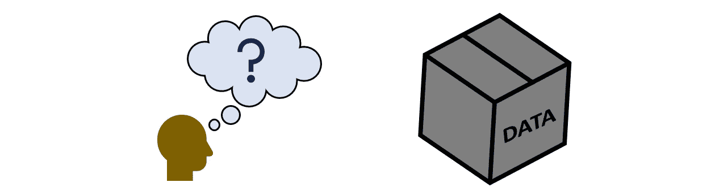
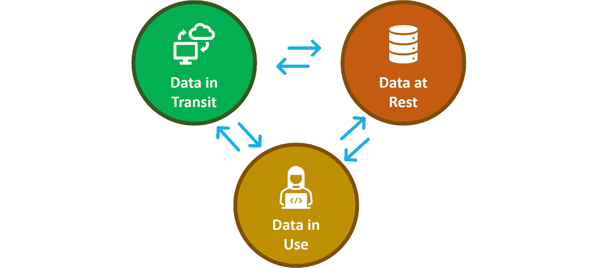
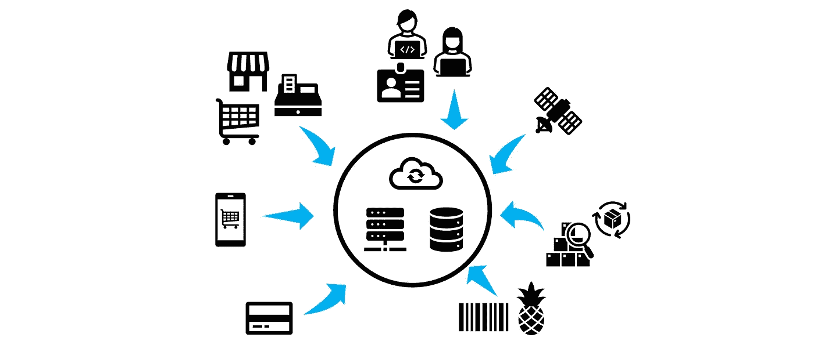

# 了解您的数据—第 2 部分(透过“数据光圈”查看数据)

> 原文：<https://pub.towardsai.net/getting-to-know-your-data-part-2-seeing-data-through-the-data-iris-c4db68960cd5?source=collection_archive---------1----------------------->

## [数据科学](https://towardsai.net/p/category/data-science)

## “面向所有人的数据科学”的第二篇文章:解决社区中数据素养问题的系列文章。

本系列的前几篇文章([了解您的数据—第 1 部分](https://medium.com/towards-artificial-intelligence/data-science-for-everyone-getting-to-know-your-data-part-1-bb8b6d7782b1))为理解数据的一些基本概念奠定了基础。

 [## 面向所有人的数据科学:了解您的数据—第 1 部分

### “面向所有人的数据科学”的第一篇文章:旨在解决社区中的数据素养问题的系列文章。

medium.com](https://medium.com/towards-artificial-intelligence/data-science-for-everyone-getting-to-know-your-data-part-1-bb8b6d7782b1) 

让我们继续讨论我们可以从不同的角度来看待数据，以增强我们对数据的理解。

在人类历史的时间轴上，我们几乎将数据视为理所当然。然而，随着 20 世纪后期计算机和信息技术的出现，数据的价值变得更加明显。随着大数据分析、数据挖掘、人工智能和机器学习的进步，我们对数据的重视程度显著提高，并继续上升。这导致了一个数字化转型的新时代，它颠覆了许多领域和我们的日常生活方式。计划在以后的文章中详细讨论与人类历史相关的数据。

文明时间线中的数据使用(图片由作者提供)

为了在这个数字时代取得成功，社会中的每个人都应该至少对数据有一个基本的了解，并学会如何处理数据以充分利用数据。正如我们在上一篇文章中讨论的那样，数字数据现在是我们生活中不可或缺的一部分，我们无法将自己与它分开。因此，我们应该付出额外的努力来更好地理解数据，并将其作为一种战略资产来积极影响我们的个人生活和工作。在任何数据驱动的项目中，了解数据都是至关重要的一步。

了解您的数据(图片由作者提供)

# 数据状态

当位于数据库、文件服务器、数据仓库或备份驱动器等物理存储设备上的数据可以称为**静态数据时，**当它在系统网络中移动时，暂时位于一个位置的数据可以称为**动态数据或传输中的数据。**当数据被应用程序主动利用时(例如，选择、过滤、修改、更新)，我们可以调用**正在使用的数据。**

除非数据处于特别严格的设置下(例如，备份、高度保护和管控源)，否则数据总是会在这三者之间改变其状态。

数据状态(图片由作者提供)。参考: [Data_at_rest，维基百科](http://Data_at_rest)。

# 数据的重要性:描述数据的特征以理解复杂性和挑战。

“大数据”一词出现在 20 世纪 90 年代的讨论中，它总是与一个显而易见的问题联系在一起，即“什么符合大数据的条件？”。你能找到的答案通常与数据积累的数量和速度有关。

> 简单来说，“大数据”可以定义为数据积累的量或速率大到常用软件工具无法处理的程度。然而，随着计算机软件和硬件技术在过去三十年中的快速发展，大数据的定义限制是一个快速移动的目标。

为了更好地理解数据，一些组织和作者探索并概念化了一个度量标准，该标准由描述数据质量的以“V”开头的术语组成。甚至一些作者定义，对于“大”数据，我认为这适用于所有数据，无论其大小、积累速度或用途如何。您可以发现，在每个出版物之间，这一指标存在一些差异，这些差异反映了我们看待数据的不同角度。

本文旨在巩固数据度量的“经典”Vs，并通过添加解决数据安全(漏洞)和隐私(可见性)的新观点来进一步扩展它。

# (大)数据的经典 3v

图:数据的经典 3 Vs(图片由作者提供)

## 1.卷

[体积](https://www.merriam-webster.com/dictionary/volume)在物理性质上定义为一个三维物体所占据的空间量。在声音应用中，我们用这个术语来量化响度或声音强度。卷也用于命名一系列创造性内容的一部分(例如，书、杂志、音乐专辑等)。).在计算中，具有单个文件系统的单个可访问存储区域称为卷。**说到数据，体积是用来描述数据量或大小的**。在上一篇文章中，我们讨论了作为可量化实体的测量数据的单位。

> 数据量越大，责任越大。

在过去的几十年里，数据通信的速度和带宽显著提高。同时，数据收集和接收设备被添加到通过互联网和本地网络运行的系统中。越来越多的企业、金融、医疗保健、科学和技术机构依赖于数字数据。他们的从业者、顾客、客户和用户也正在远离传统方法，并在实践中跟随数字化转型。在这种快速发展的情况下，我们不应该惊讶地看到全球范围内数据积累的大幅增长。

> 根据 [Statista](https://www.statista.com/statistics/871513/worldwide-data-created/) [7]预测，全球范围内创建、捕获、复制和消费的数据/信息量将呈指数级增长，预计到 2020 年将达到 59 吉字节(ZB)，即 5.9×10 千兆字节(GB)。

当组织中的数据量快速增长时，随之而来的是更大的挑战，例如，

*   如何以及在哪里储存它们？(存储)
*   他们如何防范对手以及物理或软件相关的损害？(安全)
*   创建灾难恢复计划和备份(备份和灾难恢复)
*   如何高效可靠地将数据提供给组织使用？(数据服务)

**需要数据存储来处理海量需求**

数据量是选择需要使用哪种数据存储介质的决定性因素。在互联网出现之前，将数据从一个系统转移到另一个系统的最常见方式是便携式磁存储介质，如磁带、[软盘驱动器](https://en.wikipedia.org/wiki/Floppy_disk)(高达几兆字节)和 [zip 驱动器](https://en.wikipedia.org/wiki/Zip_drive)(高达数百兆字节)，这给处理带来了许多困难，而且当容量变大时也很昂贵。

当光驱如 [CD](https://en.wikipedia.org/wiki/Compact_disc) (700 MB)、 [DVD](https://en.wikipedia.org/wiki/DVD) (4.7 -17 GB)进入数据存储领域时，它们变得更加经济。许多与磁盘相关的操作问题都消失了。光驱的最新成员是蓝光光盘，它可以存储高达 128 GB 的数据。

与光盘并行，磁性硬盘和固态硬盘在过去几十年里经历了快速发展。我们现在可以在消费市场上的单个存储介质中存储万亿字节的数据。

然而，在大多数工业应用中，数据存储由多个相连的存储设备组成。这些数据集群支持累积的大量数据，也有助于性能计算。随着过去几年**云数据存储平台**的兴起，越来越多的组织开始利用云数据存储平台来获得优势，从而摆脱管理自己的物理基础架构的负担，同时利用全球分布且安全维护的数据存储。

## 2.速度

我们在上面确定了数据的三种状态。从这三个方面来看，静态数据和动态数据给数据管理带来了许多挑战。如果我们的应用程序需要实时数据，那么即使是数据传输中的轻微延迟也会极大地影响其价值。

数据速度不是特指数据传输速率，而是泛指系统中**数据生成或累积的速率。当系统对数据速度的响应管理不当时，我们可能会丢失数据的时间敏感值。我们可能会错过捕捉部分数据的机会。这极大地影响了需要基于数据的近即时结果的系统，如天气系统、支付处理系统、医疗保健和许多其他任务关键型系统。**

更高的数据累积率的挑战与数据量的挑战直接相关，因为累积的大量数据最终需要存储以供将来使用。在某些特殊情况下，不需要数据存储，但利用传入数据流提供实时分析结果，这需要性能增强的计算硬件和软件工具。

## 3.多样化

数据以各种**形式、结构和格式出现**。在[系列的前一篇文章](/data-science-for-everyone-getting-to-know-your-data-part-1-bb8b6d7782b1)中，我们详细讨论了这一点。您可能会发现结构化(表格)、半结构化(XML、JSON)或非结构化形式的数据。有时您会得到不同文件类型的数据，如二进制或纯文本。它也可以是数据流或归档/zip 文件。在现代数据驱动的组织工作中，处理各种数据的能力是必需的。

# 通过真实的例子了解数据的 3v

照片由[科学高清](https://unsplash.com/@scienceinhd?utm_source=medium&utm_medium=referral)在 [Unsplash](https://unsplash.com?utm_source=medium&utm_medium=referral) 上拍摄

让我们看几个实际的例子。您可以通读并尝试填补从事这些场景工作的数据专业人员和科学家的空白，了解他们必须克服的复杂性和挑战。

**例 1(科学领域)**

研究基本粒子的大型科学实验。他们使用最先进的粒子加速器来碰撞亚原子粒子(如质子、中子)。

让我们做一个实验来量化和表征由高分辨率探测器探测到的碰撞产生的基本粒子。这些探测器每次捕获都会产生大量数据。由于这些测量是在非常短的时间间隔内进行的，并且实验要求每次碰撞进行大量的捕获，所以必须进行快速的数据采集。

> **世界上最大的粒子物理实验室，** [**CERN 报道**](https://home.cern/science/computing/storage) **他们每年从他们的实验中总共产生 115 的数据。**

在本例中，显然生成的**数量**的数据将是巨大的。相关的挑战将是存储数据，并利用高性能计算设施使其随时可用于进一步处理和分析。

实验时需要小心处理探测器产生的极高**速度**的数据。获取数据过程中的任何意外(如失真或丢失)都会毁掉整个实验。由于重复的设备操作和实验成本非常高，这些数据变得非常珍贵。因此，科学家和仪器团队准备非常充分，并在仪器和数据管道上采取谨慎措施，以顺利进行实验。

这里生成的数据主要是排列成表格形式的数字矩阵或带有一些半结构化元数据的二进制文件。所以**综艺**可以挑战性小一点。

**示例 2(业务领域)**

现在让我们看一个更贴近我们日常生活的例子。假设一家大型零售商在全球拥有数万家商店、数亿名客户、数百万名员工，销售数百万件商品。

(图片由作者提供)

在给定时间内发生的交易数量(**速度**)和业务流程中使用的数据来源和类型的变化(**种类**)所产生的数据都会很高。实际上，在这样一个大型组织中，一天之内可以积累几 Pb(10⁶千兆字节(GB))的数据。

对于任何企业来说，**数据的真正价值是通过它如何被用来对企业本身产生影响来衡量的**。除了员工和客户使用的数据驱动的应用程序之外，还可能有数千名数据科学家和分析师挖掘有用的数据，执行各种分析，生成报告，构建预测性的机器学习解决方案等。

在这个例子中，你可能会觉得挑战比上面的科学应用要复杂得多。你可能是对的。除了巨大的**数据量**和**速度**之外，全球连接的系统和网络、用户以及内部和外部数据生成源将增加几层复杂性。在下一节中，当我们超越上面讨论的 3v 时，我们将解决其中的一些问题。

# 数据虹膜(超过 3v 的数据)

由于 3v 已经成为数据科学/大数据社区的衡量标准，一些组织和作者通过添加更多观点对其进行了扩展[1–6]。因此，在文献中出现了 4v 的数据(增加准确性)、5v 的数据(增加价值)、8v 的数据(增加可视化、可变性和易变性)。几位作者还将其进一步扩展到大数据的 10v。

> **在回顾了之前的出版物、合并了一些术语并添加了对安全性和法规遵从性的新观点后，我们可以构建一个 10 Vs 的指标来描述数据质量，我们可以将这些数据纳入“数据虹膜”的概念中。这里有意义地选择了虹膜这个词，它是从人体解剖学中借来的，我们眼睛中的** [**虹膜**](https://en.wikipedia.org/wiki/Iris_(anatomy)) **负责控制到达** [**视网膜**](https://en.wikipedia.org/wiki/Retina) **的光量。**

当我们通过这个数据虹膜查看我们的数据并直观地操纵组件时，我们应该比以往任何时候都更好地看到我们的数据。让我们继续探索其他与制作数据虹膜。

扩展的十对数据(图片由作者提供)

## 4.诚实

我们可以充分应对数据量和数据速度的挑战。尽管如此，我们需要确保**数据可信、准确、清晰，并通过数据收集和存储保持质量**。一个数据驱动的组织需要在维护数据的准确性方面进行大量投资并应用适当的策略，以充分利用数据。消费不可信、不准确或来源不良的数据可能会降低准确性，这可能会导致产品价值贬值，并可能给遵守法规带来更大的挑战。

## 5.变化性

在数据的使用或传输过程中，数据的特征可能会发生变化。数据积累或传输的速率可以根据环境而变化。数据的形式可以改变，数据源的性质可以改变，数据本身可以在组织内转换成不同的格式。组织中的数据从业者需要跟上这些变化，并相应地解决它们，以避免对应用程序、产品或业务运营的潜在影响。

## 6.价值

数据已经成为个人和组织(政府、行业、教育和研究机构、制造商等)的重要资产。).今天有人认了；我们正处于一个新的淘金时代，数据取代了游戏中的黄金。

> **就像从矿场开采出来的未经加工的黄金一样，数据在其原始形式下价值较低，但根据矿工(在这种情况下是数据专业人员)对其进行管理、处理、分析、展示和保存的方式，数据具有很大的增值潜力。**

我们知道，当黄金被提纯并用于制作珠宝时，最终产品的价值会比原始形式的黄金增加很多倍。当数据被恰当地用于导出科学、健康、社会和商业问题的解决方案时(例如生成见解、描述性分析、预测性分析、机器学习等)，也会发生同样的情况。).嵌入在应用程序或产品中的数据分析解决方案放大了其价值、质量和实用性。

在数字时代，数据就是黄金(由[克利福德摄影](https://unsplash.com/@cliffordgatewood?utm_source=medium&utm_medium=referral)在 [Unsplash](https://unsplash.com?utm_source=medium&utm_medium=referral) 上拍摄)

数据的价值随着准确性、完整性和可访问性而上升。如果数据没有及时提供，脱离上下文，或者数据是普遍可用的，它就会下降。

举个例子，想想你在 excel 文件中得到的一个人名列表。是有价值的数据吗？如果没有适当的上下文(例如，参加活动的人员列表)，可能就不行。添加另一个包含电话号码的列(数据点)怎么样？现在，如果姓名到电话号码的分配是准确的(即，我们可以联系到这些个人的真实电话号码)和完整的(我们可以找到大部分记录的电话号码)，那么您所拥有的数据的价值将会显著增加。当更多的数据点(例如，电子邮件地址、年龄、家乡、职业等)出现时，这些数据的价值就提高了。)被添加。

## 7.波动性

像宇宙中的几乎所有事物一样，数据也有自己的生命周期。这可能是存储耗尽能量的时间，也可能是它从存储中消失的时间。然而，数据也有基于其有效性的生命周期。

根据应用的不同，该寿命可以由政策、法律或法规来定义。有时，当数据变得不再相关或有用时，数据的价值会大幅贬值。一些数据科学专业人士可能会认为，数据在一般情况下永远不会变得无关紧要，并且对于需要历史数据的未来应用程序来说可能是有价值的。

数据易变将导致做出一些组织决策，例如我们应该在保存这些数据(存储、备份等)上投资多少。)或者什么时候应该摆脱它们。

## 8.粘性

当数据以较高的速率(速度)进入系统，并且数据源和格式互不相同(多样性)时，数据集成过程中产生的阻力可能会产生内耗。当在同一个组织中使用不同的工具和技术来存储和传输数据时，这种阻力会被放大，例如本地数据库服务器与云托管。不同数据源、格式、工具和技术的混合和匹配可以在任何规模的数据项目中看到。粘度也可能被人为因素放大，如决策和专业知识的可用性。

当数据用于实时分析或应用时，例如使用流数据创建摘要、可视化、仪表板，粘度起着更大的作用。因此，需要使用适当的数据加载/检索和处理方法和工具来缓解这一问题。

## 9.能见度

数字化转型面临的一个关键挑战是保护敏感数据，防止对手出于恶意目的滥用数据或伤害附属于数据资产的实体。为了让每个人都能舒适地参与数字数据平台，我们需要建立一些关于数据资产的可访问性和可见性的标准、政策和法规。因此，可以对谁可以访问特定的数据资产、可以从哪些位置或网络访问这些数据资产进行限制。

可见性与隐私和数据保护直接相关。例如，当我们开始处理数据资产时，我们需要知道我们的限制、约束和界限，以便负责任地使用我们可用的数据，而不是利用它来获得短视的收益。

我们可以在工作中使用数据的哪些部分？我们可以与工作产品共享它的哪些部分？有哪些方法(例如，聚合、匿名、屏蔽、排除等。)以及我们可以用来按照数据隐私政策、法律和法规执行数据项目的工具(例如，[GDPR](https://gdprinfo.eu/)【15】，[CCPA](https://oag.ca.gov/privacy/ccpa)【16】)？是需要回答的关于数据可见性的重要问题。

## 10.弱点

我们之前讨论了数据如何与我们的生活和生计紧密相关，并意识到这种联系随着时间而增加。同样，我们看了一个比喻，“数据是新的黄金。”当数据或面向数据的系统被不负责任地处理或没有适当的保护时，它会给个人、社区和国家带来严重的伤害。

> 最近的[数据泄露](https://en.wikipedia.org/wiki/List_of_data_breaches)和其他各种针对组织数据基础架构的攻击提醒我们，保护我们的数据驱动型应用程序、存储平台和通信网络免受对手的物理和虚拟攻击非常重要。因此，**在所有与数据相关的工作中，我们应该对他们拥有的漏洞更加谨慎和主动**。

无论项目的规模或领域如何，在数据项目的早期阶段正确评估漏洞并解决它们都是一项至关重要的任务。然而，在现实世界的数据项目中，关键的挑战是解决漏洞。

组织面临着快速交付产品以满足市场需求的更高需求，而在解决漏洞方面分配较少的注意力和资源(金钱和时间)是一种常见的情况。另一个制约因素是组织内部缺乏专业知识。当决策者和执行人员对漏洞问题无知或目光短浅时，他们可能会将他们的组织带上一条破坏性的道路。

# 摘要

与其去理解“V 字”的定义或者有多少个，不如让我们把它看作是一个捕捉我们处理的数据的本质和复杂性的指标。我们可以利用这一点来更好地应对与之相关的挑战。

# 感谢

作者要感谢数据科学和机器学习主题中的许多内容创作者，不限于在线学习平台和博客，他们提供了有见地的资源来探索和学习数据科学这一迷人的主题。

# 放弃

*本文所表达的观点和意见均为作者个人观点和意见，不代表雇主或与作者相关的其他机构的观点和意见。本文是旨在解决社区数据素养问题的更广泛出版物的一部分。作者投入了大量的精力来研究所讨论的主题，简化技术术语以增加对内容的理解，查找相关参考资料以确保所呈现事实的有效性。欢迎讨论、批评、不同的想法和建议。*

# 参考

[1] E .邓比尔。“量、速度、多样性:你需要了解的大数据”，OReilly 的 Radar，2012 年 1 月。

[2] [大数据:每个人都必须知道的 5 个 Vs(linkedin.com)](https://www.linkedin.com/pulse/20140306073407-64875646-big-data-the-5-vs-everyone-must-know)

[3] [大数据的 5 个 V—沃森健康透视(ibm.com)](https://www.ibm.com/blogs/watson-health/the-5-vs-of-big-data/)

[4]【大数据的 10 个 v |用智能改造数据(tdwi.org)

[5] N. Khan、M. Alsaqer、H. Shah、G. Badsha、A. Ahmad Abbasi 和 S. Salehian，“大数据的 10 个 Vs、问题和挑战”，ICBDE'18，2018 年 3 月，第 52-56 页。

[6] R. Wang，[周一的思考:超越大数据的三个 V-粘度和病毒式传播](https://www.forbes.com/sites/raywang/2012/02/27/mondays-musings-beyond-the-three-vs-of-big-data-viscosity-and-virality)，《福布斯》，2012 年 2 月。

[7] A. Holst，“2010 年至 2024 年全球创建、捕获、复制和消费的数据/信息量[”, Statista，2021 年 2 月。](https://www.statista.com/statistics/871513/worldwide-data-created/)

[8] G. Jenik，“2020 年互联网上的一分钟”T13，Statista，2020 年 9 月。

[9] A .阿里，“以下是 2020 年互联网上每分钟都会发生的事情”《视觉资本家》，2020 年 9 月。

【10】[Data _ at _ rest](https://en.wikipedia.org/wiki/Data_at_rest)，维基百科。

[11]“[大数据](https://en.wikipedia.org/wiki/Big_data)”，维基百科。

[12] J. R. Mashey，[“大数据……和下一波次应力”](http://static.usenix.org/event/usenix99/invited_talks/mashey.pdf) (PDF)。应邀演讲的幻灯片，Usenix，1998 年 4 月。[via [维基百科](https://en.wikipedia.org/wiki/Big_data#cite_note-15)

[13] D. Bonderud，“飞速越过 Zettabyte 时代:互联网的下一步是什么？“现在。由诺斯罗普·格鲁曼公司提供动力，2019 年 10 月。

[14] [T. Barnett Jr.](https://blogs.cisco.com/author/thomasbarnett) ，[zetta byte 时代正式开始(那是多少钱？)](https://blogs.cisco.com/sp/the-zettabyte-era-officially-begins-how-much-is-that)》，思科博客，2016 年 9 月。

[15] [通用数据保护条例(GDPR)](https://gdprinfo.eu/)

[16] [加州消费者隐私法案(CCPA)](https://oag.ca.gov/privacy/ccpa)