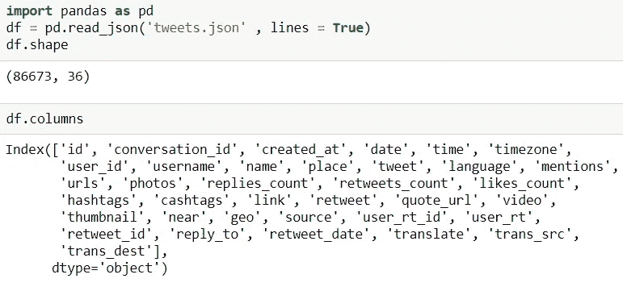
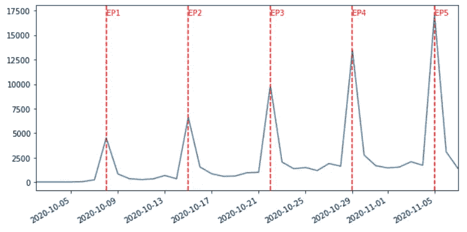
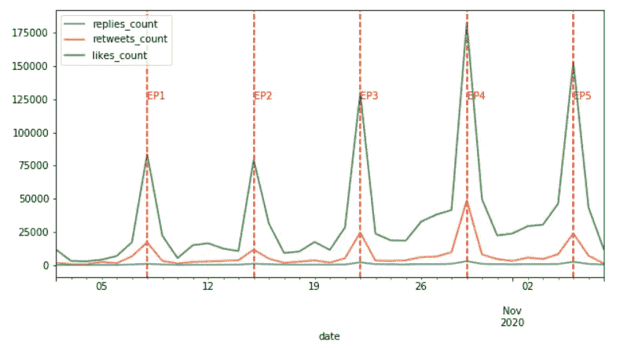
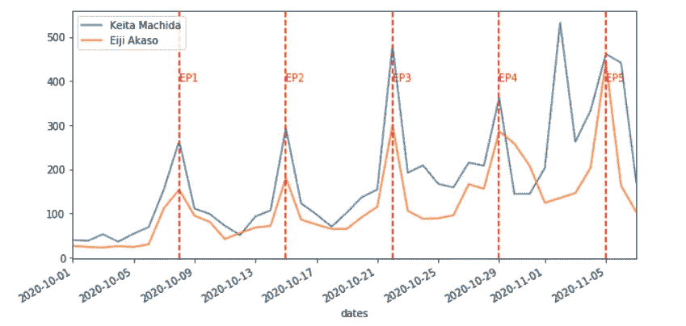
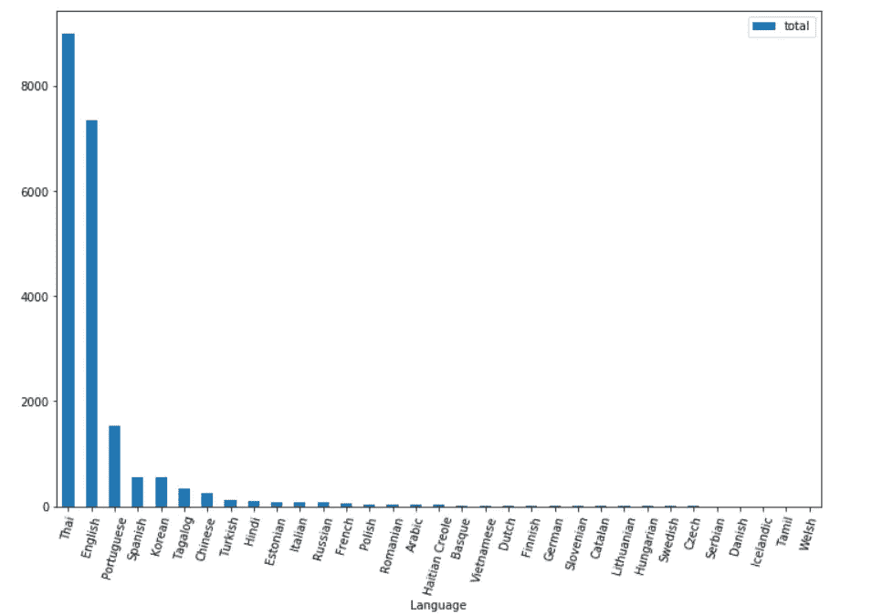

# 使用 Python 和 Twint 从推文中获得有价值的见解和可视化

> 原文：<https://pub.towardsai.net/getting-valuable-insights-and-visualizations-from-tweets-using-python-and-twint-28d9f9eb9128?source=collection_archive---------1----------------------->


照片由[莫兰](https://unsplash.com/@ymoran?utm_source=unsplash&utm_medium=referral&utm_content=creditCopyText)在 [Unsplash](https://unsplash.com/s/photos/twitter?utm_source=unsplash&utm_medium=referral&utm_content=creditCopyText) 上拍摄

## [数据科学](https://towardsai.net/p/category/data-science)，[数据可视化](https://towardsai.net/p/category/data-visualization)，[编程](https://towardsai.net/p/category/programming)

## 我的第一个有趣的数据科学项目

最近我迷上了一部日本电视剧。我发现自己无法停止在 Twitter、Instagram 和一个名为豆瓣的中国应用程序上查看关于该节目的更新和讨论。其间偶遇[一篇关于 Python 库](https://nealcaren.org/lessons/twint/) [Twint](https://github.com/twintproject/twint) 的介绍文章，在收集 twitter 数据方面非常方便。虽然每周等待新一集的到来是一种折磨，但我决定利用等待的时间探索 Twint，并从 Twitter 上获得一些关于该剧的见解。

本文将讨论`twint`的使用，包括如何安装`twint`，如何查找用户信息，以及在给定条件下搜索历史推文。收集完数据后，我将使用`Pandas`库来清理数据并得出见解。我希望这篇文章可以让你开始`twint.`最重要的是，如果你有一些你非常有兴趣使用数据科学技能探索的话题，我希望我的文章可以启发你构建你的思想，并引导你走向一个起点。

# Twint 简介和安装

根据的官方文件:

> Twint 是一个用 Python 编写的高级 Twitter 抓取工具，允许在不使用 Twitter API 的情况下从 Twitter 个人资料中抓取 Tweets。Twint 利用 Twitter 的搜索运营商让你抓取特定用户的推文，抓取与某些主题、标签和趋势相关的推文，或者从推文中挑选出*敏感的*信息，如电子邮件和电话号码。Twint 还对 Twitter 进行特殊查询，允许您在没有任何身份验证、API、Selenium 或浏览器模拟的情况下收集 Twitter 用户的关注者、用户喜欢的 Tweets 以及他们关注的人。

安装`twint`有三种方式:git、pip 和 pipenv。无论您使用什么方法安装它，我发现一个基本的步骤是在安装后总是使用这个命令行:

```
pip install — user — upgrade -e git+ [https://github.com/twintproject/twint.git@origin/master#egg=twint](https://github.com/twintproject/twint.git@origin/master#egg=twint)
```

最近，这个库有许多更新，所以确保您已经安装了所有最新的包以确保最佳使用是很重要的。

安装后，您应该能够导入库。但是，如果你需要在 Jupyter Notebook 或 Spyder 中成功运行它，你需要安装`nest_asyncio`库并将其与`twint`一起导入:

```
import twint
import nest_asyncionest_asyncio.apply()
```

现在`twint`已经可以使用了。

# 目标是什么？

如上所述，我想通过`twint`来获得一些关于我正在看的日剧的见解。以下是该节目的官方推特账号:


[https://twitter.com/tx_cherimaho](https://twitter.com/tx_cherimaho)

该节目在日本每周四凌晨 1 点播出。到目前为止，他们已经发布了五集，拥有超过 47000 名粉丝。在讨论节目的更多细节之前，我想先关注技术部分。

我的第一步是使用`twint`收集与这个节目相关的历史推文。具体来说，通过查看历史推文，我想知道**他们是什么时候发关于节目的推文的？** **谁发微博说这个节目？**和**他们发微博的时候在说什么？为了更进一步，我将收集其官方账户的关注者信息，并了解更多关于该节目粉丝的信息。例如，我可以了解更多关于粉丝来自哪里、何时加入 Twitter 等细节。**

# 获取历史推文

首先，我会收集关于这个节目的历史推文。首先，我们需要定义一个“引擎”，然后我们需要指定在搜索过程中应用的条件以及如何存储我们获得的信息。让我们一步一步地分解它。

## 指定引擎:

首先，我们需要从`twint`调用一个 Config()函数，并指定我们想用这个引擎搜索什么。你可以用“搜索”指定引擎，寻找带有特定单词、标签、提及等的推文；您可以使用“用户名”来查找特定用户使用他们的用户名发布的推文。你可以把你在这里输入的内容想象成你在 Twitter 搜索框中输入的内容，以获得你想要的内容:


twitter 搜索框

在这一步，我想提取标签为'#チェリまほ'.的所有推文我真的不知道这是什么意思，因为我不懂日语，但这是官方推特账户用来指代这部剧的标签。代码很简单:

```
c = twint.Config()c.Search = '#チェリまほ'
```

## 为搜索提供额外的条件

如果我们没有指定额外的条件，引擎将搜索所有带有标签的 tweets。这个过程可能会因为无用的信息而变得乏味，并且需要很长时间才能完成。

我在这里加的额外条件是起始日期。2020 年 8 月 24 日开通官方账号，该剧自 2020 年 10 月 8 日开播。我把起始日期定为正式开户日期:

```
c.Since = ‘2020–08–24’#c.Username = "tx_cherimaho"
#c.Limit = 10
#c.Until = ‘2020–01–01’
```

我们可以在这里设置其他条件。通过设置“用户名”，我们只查看来自特定账户的推文。我想知道该节目的观众在推特上谈论什么，所以我没有在这里指定用户名。此外，在进行最终搜索之前，使用“Limit**”**总是有用的，它只会返回有限数量的符合搜索条件的推文，因此您可以在继续之前检查您是否获得了正确的数据。像开始日期一样，我们也可以使用“直到”来设置推文的结束日期。

## 格式化输出

在获得新数据的同时保存获得的数据是很重要的，以防程序意外退出。我们可以输出不同格式的数据，包括熊猫数据帧，CSV，JSON 等。首先，我们需要指定输出格式，然后列出保存数据的文件名。

在我的例子中，我将数据存储为一个 JSON 文件。注意这里的“Hide_output”。当收集大量数据并希望将它们保存在一个文件中时，这个命令非常方便。如果在这里指定，它将不会显示程序的抓取结果，而是将数据直接保存在文件中。

```
c.Hide_output = True
c.Store_json = True
c.Output = ‘tweets.json’
```

## **准予搜索**

最后一步是开始搜索。运行下面的代码:

```
twint.run.Search(c)
```

现在`twint`将开始搜索，并将结果提取到名为“tweets.json”的文件中，该文件与 python 文件在同一个目录中。

总之，我们可以编写一个函数来抓取推文:

```
def grab_tweets(search,file):
    c = twint.Config()
    c.Search = search 
    c.Since = ‘2020–08–24’
    c.Hide_output = True
    c.Store_json = True
    c.Output = file
    twint.run.Search(c)
```

## 我发现了什么

**1、推文总数**

花了一些时间才得到所有带有标签的推文。完成之后，我使用 Pandas 来读取 JSON 文件:



它显示这个标签中有 86673 条推文，对于每条推文，上面显示了 36 个不同的特征。我首先检查的是他们发布推文的日期:

```
%matplotlib inlinedf[‘date’].value_counts().plot()
```


按日期排列的推文数量

我们可以看到，推文数量有很多季节性，并且呈增长趋势。该节目于 10 月开始，在此之前，推文数量不足。在下一步中，我将排除 10 月之前的日期，并绘制节目播出时间以解释季节性:

```
df_short = df[df['date']>pd.to_datetime('2020-10-01')]
df_short.shape #(86021, 36)#episode dates so far
eps_dates = [pd.to_datetime('2020-10-08'),pd.to_datetime('2020-10-15'),pd.to_datetime('2020-10-22'),pd.to_datetime('2020-10-29'),pd.to_datetime('2020-11-05')]ax = df_short['date'].value_counts().plot(figsize=(10,5))for i in range(len(eps_dates)):
    ax.axvline(eps_dates[i], color='r', linestyle='--')
    ax.text(eps_dates[i],17000,'EP{}'.format(i+1),color='red')
```



按日期和剧集日期分类的推文数量

图表显示，随着日期的推移，对该节目的讨论有增加的趋势。在新一集发布的当天，推文的数量是最高的。

**2、推文行动指标**

除了按日期查看帖子的数量，我们还可以查看关于推文的行为，以猜测其他人对关于这个主题的推文以及对这个节目的看法。具体来说，我查看了这些推文的回复、转发和点赞数量:

```
ax = df_short.groupby("date").sum()[['replies_count','retweets_count', 'likes_count']]
.plot(figsize=(10,5))for i in range(len(eps_dates)):
    ax.axvline(eps_dates[i], color='r', linestyle='--')
    ax.text(eps_dates[i],125000,'EP{}'.format(i+1),color='red')
```



按日期划分的推文行动指标

我们可以从前面的图表中看到，峰值仍然在新剧集的发布日期。然而，与第 4 集相比，第 5 集的推文响应更少，尽管从之前的图表中，我们知道推文的数量在随着时间的推移而增长。这与我在社交媒体上冲浪时对第五集的印象相符。一些观众对第五集有限的浪漫场景感到失望，因此解释了下降的原因，但我相信第六集会根据预告重新吸引注意力。

此外，与转发和点赞相比，回复量要小得多。这是意料之中的，因为回复一条推文肯定要比其他两条花费更多的精力。希望在未来，我们可以在相关推文中看到更多的回复。

**3、演员受到的关注**

What about the tweets regarding the two leading actors? To answer this question, I use the hashtag ‘#赤楚衛二’ for Eiji Akaso and ‘#町田啓太’ for Keita Machida to start new searches. They are outstanding actors, and their performances in the show are important reasons that this show attracts so many fans.

为了在一个图中可视化两个不同的搜索，我将 value_counts()结果导出到 DataFrames 中并合并它们。然后，我通过绘制数据帧的多列来绘制图表:

```
#read the json files
df_a= pd.read_json('tweets_a.json' , lines = True)
df_k= pd.read_json('tweets_k.json' , lines = True)#convert value counts to dataframes
values_a =
df_a[‘date’].value_counts().rename_axis(‘dates’).reset_index(name=’counts’)values_k = df_k['date'].value_counts().rename_axis('dates').reset_index(name='counts')#merge dataframes and clean it
values = values_k.merge(values_a,on='dates',how='outer')values.rename(columns={"counts": "Keita Machida","counts_x":"Eiji Akaso"},inplace=True)values.fillna(0,inplace=True)values['dates'] = pd.to_datetime(values['dates'])ax = values.plot(x='dates', y=["Keita Machida", "Eiji Akaso"],figsize = (10,5))for i in range(len(eps_dates)):
    ax.axvline(eps_dates[i], color='r', linestyle='--')
    ax.text(eps_dates[i],400,'EP{}'.format(i+1),color='red')
```



关于这两个演员的推特

如图所示，关于这两位演员的推文数量不断增加，并在剧集发布日达到峰值。不过 11 月 1 日凯塔最高。我回去在推特上查了原因。在那一天，他发布了一个舞蹈视频，这可能会导致越来越多的关于他的推文。

**4、他们在推文中使用什么语言**

了解这些推文显示的语言有助于我们了解受众和关注者的位置。为了找到答案，我结合了几次搜索，统计了每种语言的推文总数。

我使用的搜索包括'チェリまほ'这个节目的日文符号，以及两个英文单词，“tx_cherimaho”，“CherryMagic”。其中一个是官方账号的名字，另一个是类似'チェリまほ'的日文翻译，被所有粉丝使用。包括英语单词可以帮助增加从世界各地获取推文的数量。

```
#read the json files and count the use of different languages
lan_t = tweets_total['language'].value_counts().rename_axis('language').reset_index(name='チェリまほ')lan_c = df_cherry[‘language’].value_counts().rename_axis(‘language’).reset_index(name=’CherryMagic’)lan_tx = df_cherry[‘language’].value_counts().rename_axis(‘language’).reset_index(name=’tx_cherimaho’)#merge datasets
lans = lan_tx.merge(lan_t.merge(lan_c,on='language',how='outer'),on='language',how='outer')#Use language rather than language code
#source: [https://www.w3schools.com/tags/ref_language_codes.asp](https://www.w3schools.com/tags/ref_language_codes.asp)lan_list = pd.read_excel('language_code.xlsx')
lan_list.rename(columns={'ISO Code':'language'},inplace=True)
#merge
lans_f = lans.merge(lan_list, on='language',how='left')#sum, sort, get rid of Japanese, and delete unrecognized languages
lans_f['total'] = lans_f.sum(axis=1)
lans_f.sort_values(by=['total'],ascending=False, inplace=True)
lans_short = lans_f[lans_f['language']!='ja']
lans_short.dropna(inplace=True)lans_short.plot(x='Language',y='total',kind='bar',figsize=(12,8),rot=75)
```



日语岗位数量为 136170

包括日语在内，在这些搜索中检测到 36 种语言。与其他语言的推文相比，日语的帖子太高了(136170 比 8987 的泰语)。在图表中包含日语会使图表很难阅读。在这里，我已经把日本人从之前的图表中排除了。根据图表，我们可以看到该节目在泰国的收视率最高，这与该节目在泰国的 Twitter 趋势上多次出现的事实是一致的。对于中国这样的国家，我知道这个节目肯定比这里显示的数字更受欢迎。由于 Twitter 不是中国人使用的主要社交媒体，所以中国人的推文比其他国家低是可以理解的。

# **未来的步骤**

在收集 Twitter 数据方面是如此有用和强大，以至于仍然有很多东西可以获得更多的见解。其中很大一部分就是分析官方账号的关注者。到目前为止，官方账号已经有超过 47000 名粉丝，并且这个数字还在持续增长。关注一个账户是最省力的操作，相比之下，在推特上发布关于该节目的消息，回复和转发其他推文，以及喜欢一条相关主题的推文。因此，预计分析关注者将涉及更多用户，并提供更丰富的数据。

# 一些想法

首先感谢所有读到这里的人。我很高兴分享我在将数据科学技能应用于我非常感兴趣的事物方面的工作。我参与了许多项目，以完成我的博士论文，完成数据科学训练营的任务，或者制作一个项目演示，与我的学生或媒体分享。这是我第一次为了好玩而做一个项目。我确实喜欢它。如果我的工作对任何对从 Twitter 收集数据感兴趣的人有所帮助，我会很高兴。如果有人受到这篇文章的启发，并开始从事自己的项目，我会很高兴。

感谢您的阅读！这是我所有博客帖子的列表。如果你感兴趣的话，可以去看看！

[](https://zzhu17.medium.com/my-blog-posts-gallery-ac6e01fe5cc3) [## 我的博客文章库

### 我快乐的地方

zzhu17.medium.com](https://zzhu17.medium.com/my-blog-posts-gallery-ac6e01fe5cc3) [](https://zzhu17.medium.com/membership) [## 阅读朱(以及媒体上成千上万的其他作家)的每一个故事

### 作为一个媒体会员，你的会员费的一部分会给你阅读的作家，你可以完全接触到每一个故事…

zzhu17.medium.com](https://zzhu17.medium.com/membership)