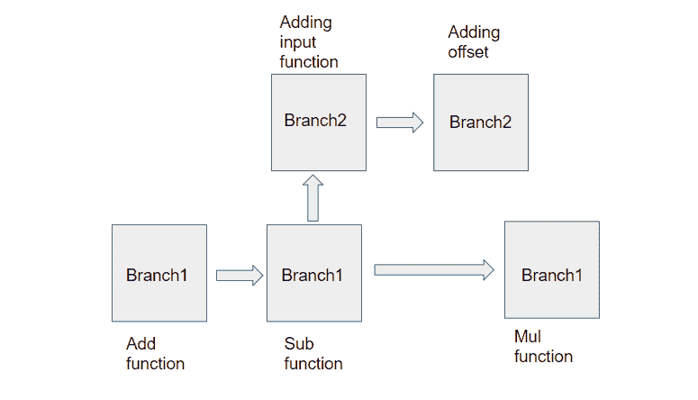
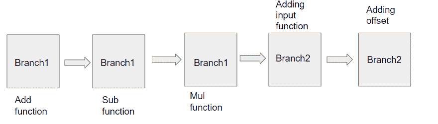
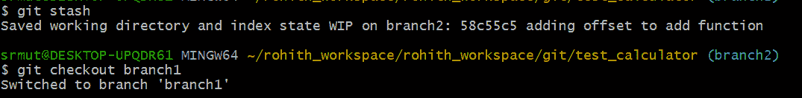
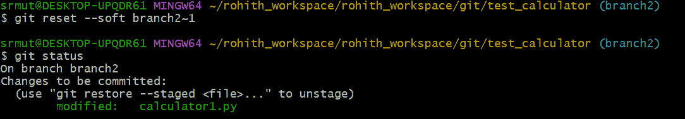

# Git 重置、合并、隐藏、还原和重置

> 原文：<https://pub.towardsai.net/git-rebase-merge-and-stash-763fcf3ec060?source=collection_archive---------0----------------------->

> Git rebase 是 Git 中的一个高级特性，当我们处理多个分支时，它可以帮助我们。重设基础稍微高级一点，但是在你需要的时候非常有用。当您执行基础变更时，您正在变更分支的基础。本质上，rebase 将查看您的分支上的每个提交，并更新代码，使其看起来好像您一直在新的基础上工作。虽然它们有相似的用途，但是 rebase 与 merge 的不同之处在于 rebase 通过调整每个提交来更新您的分支，而 merge 通过在您的分支顶端创建一个新的提交来更新您的分支。

这是关于 Git 系列文章的第三篇——
完整的 Git 初学者教程，带示例。下面有链接—

[](https://muttinenisairohith.medium.com/complete-git-tutorial-for-beginners-with-examples-4ebd90e76bfc) [## 完整的 Git 初学者教程，带示例

### Git 是一个版本控制系统，它可以让我们跟踪随着时间的推移我们对文件所做的更改。

muttinenisairohith.medium.com](https://muttinenisairohith.medium.com/complete-git-tutorial-for-beginners-with-examples-4ebd90e76bfc) 

第二篇文章是关于 Git 分支……以及 Git pull vs fetch…
下面的链接—

[](https://muttinenisairohith.medium.com/all-about-git-branches-and-git-pull-vs-fetch-5b961c13ead) [## 关于 Git 分支的所有内容...Git pull vs fetch

### 使用 Git 中的分支，我们可以创建我们想要处理的文件的副本，而不会弄乱原始文件…

muttinenisairohith.medium.com](https://muttinenisairohith.medium.com/all-about-git-branches-and-git-pull-vs-fetch-5b961c13ead) 

所以回到理解 Git Rebase，让我们从头开始，用 Git 开发新代码。让我们创建 branch1 并向其中添加一些新代码。

```
git checkout -b branch1
```

这里我们在代码中添加了 add 函数-

```
def add(a,b):
    return a+b

a,b = 5,6
print(add(a,b))
```

现在让我们将代码推送到我们的分支 1

```
git add .
git commit -m “adding calculator1 code”
git push origin branch1
```

现在让我们假设另一个开发人员(developer2)正在处理这段代码，他基于 branch1 创建 branch2，并在您在 branch1 中实现更多功能的同时更改特性

假设 developer2 通过添加 input()函数和向 branch2 中的 add 函数添加 offset +5，向代码添加了两次提交

同时，您在 branch1 中添加了两个 commits sub()函数和 mul()函数

在 branch1 中提交两次之后，代码看起来像这样—

```
def add(a,b):
    return a+b

def sub(a,b):
    return a-b

def mul(a,b):
    return a*b

a,b = 5,6
print(add(a,b))
print(sub(a,b))
print(mul(a,b))
```

在 Branch2 中提交两次之后，代码看起来像这样—

```
def add(a,b):
    return a+b+10

a = int(input())
b = int(input())
print(add(a,b))
```

我们的回购分支流程看起来像这样-



支流

现在让我们假设 developer2 想要将他的分支 branch2 与 branch1 合并，这样他就可以与现有的项目保持同步，那么在这种情况下，使用 merge 函数将要求我们隐藏我们的更改，因为从 branch1 中提取代码将覆盖我们的更改。因此，我们可以简单地使用 rebase 并合并分支，而不是使用 stashing、pull 和 merge。

语法:

```
git rebase branch1
```

从本地 branch2 执行上述命令后，如果存在合并冲突，请手动接受更改，一旦更改完成

添加代码并提交代码。

一旦你觉得重设基础完成了，我们可以发出下面的命令来完成重设基础-

```
git rebase --continue
```

如果没有现有的合并冲突，那么 rebase 将被完成，然后我们可以推送代码。

现在我们的分支 2 流看起来像这样-



支流

这就是 git rebase 的用处。

**Git 藏匿点**

假设 developer2 在 Branch2 中做了一些更改，他知道代码是由 developer1 在 Branch1 中更改的，Developer2 有一个想法，他可以在 Branch1 中添加一些小代码块，然后将代码从 Branch1 拉到 Branch2，然后提交他的代码，以避免合并冲突。

在这种情况下，如果您试图将 Branch2 中未提交的更改签出到 Branch1，Git 将不允许我们这样做

在这种情况下，Git stash 会帮助我们-

Stashing 允许您保存当前未被 Stashing 的更改，并将您的分支带回到未被修改的状态。当你存储时，你的改变被压入堆栈。如果您需要快速切换到另一个分支，而不必提交未完成的更改，这将非常有用。

我们可以使用命令将代码保存在 Branch2 中

```
git stash
```



之后，我们的工作在 branch1 中完成。我们可以签出到 branch2，并使用 stash 来应用命令以取回我们的更改。

```
git stash apply
```

稍后，我们可以使用添加、提交和推送命令来推送我们的更改。

**Git stash 应用与 Git stash 弹出**

Git stash pop 将在应用更改后从堆栈中移除更改。

```
Git stash pop = Git stash apply + Git stash drop
```

**Git 恢复与 Git 重置**

Git 重置:

当我们想要卸载一个文件并把我们的更改带回工作目录时，就使用 Git reset。它还可以用于从本地存储库中删除提交。

```
git reset --soft branch2~1
```



输出

```
git reset –soft HEAD~1
```

此命令将删除提交，但不会卸载文件。我们的更改仍然在准备区。

```
git reset –mixed HEAD~1 or git reset HEAD~1
```

这是我们将使用的默认命令，该命令删除提交并取消文件的存放，我们的更改存储在工作目录中。

```
git reset –hard HEAD~1
```

该命令从您的工作目录中删除提交和更改。这个命令也可以称为破坏性命令，因为我们将无法恢复更改，所以使用这个命令时要小心。

注意:Git 重置只有在远程存储库中没有推送提交时才起作用。

**Git 回复:**

类似于 git reset，但是唯一的区别是当我们想要从远程存储库恢复提交时，可以使用 Git revert，而 Git reset 只适用于本地存储库。

Git revert 将创建一个新的提交，它与给定提交中的所有内容相反。

我们可以通过使用 head 别名来恢复最新提交，如下所示:

```
git revert HEAD
```

与 git reset 不同，我们可以回滚最近 n 次本地提交，我们可以使用 commit-id 并使用 git revert 命令从远程存储库中恢复任何提交

```
git revert HEAD commit-id-here
```

我希望在这个关于 Git 的系列文章中，我们已经涵盖了关于 Git 的所有主题。

你可以在这里 **找到参考 Git cheatsheet [**。**](https://www.freecodecamp.org/news/git-cheat-sheet/)**

希望这有帮助。

快乐学习…