# MLOps 中的 GitHub 动作:自动检查和部署您的 ML 模型

> 原文：<https://pub.towardsai.net/github-actions-in-mlops-automatically-check-and-deploy-your-ml-model-9a281d7f3c84?source=collection_archive---------0----------------------->

## 使用 GitHub 动作自动化您的 ML 管道

# 动机

假设你的公司正在创建一个 ML 驱动的服务。作为一名数据科学家，您可能会尝试不断改进现有的 ML 模型。

一旦找到了更好的模型，如何确保在部署新模型时服务不会中断？

如果您可以创建一个工作流来:

*   自动测试来自团队成员的拉请求
*   当所有测试都通过时，合并一个拉请求
*   将 ML 模型部署到现有的服务中？


作者图片

**在本文中，您将学习如何使用 GitHub 操作创建这样的工作流。**

# 什么是 GitHub 动作？

[GitHub Actions](https://github.com/features/actions) 允许你自动化你的工作流程，更快地构建、测试和部署你的代码。

一般来说，工作流看起来类似于下图:

从上面的代码中可以理解 3 个重要的概念:

*   当*事件*发生时(如推送或拉取请求)，将触发由一个或多个*作业*组成的*工作流*
*   *作业*与**相互独立**。每个*作业*都是一组*步骤*，它们在自己的虚拟机运行器或容器中运行。
*   *步骤*与**相互依赖**并按顺序执行。

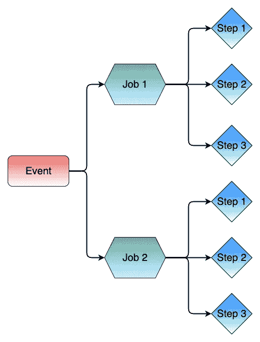

作者图片

让我们在接下来的几节中更深入地研究这些概念。

# 找到最佳参数

ML 项目的第一步包括在非主分支中试验不同的参数和模型。在上一篇文章中，我提到了如何使用[ml flow](https://mlflow.org/)+[DagsHub](https://dagshub.com/)来记录您的实验。

[](https://towardsdatascience.com/dagshub-a-github-supplement-for-data-scientists-and-ml-engineers-9ecaf49cc505) [## Dag shub:GitHub 对数据科学家和 ML 工程师的补充

### 将您的数据、模型、实验和代码保存在一个地方

towardsdatascience.com](https://towardsdatascience.com/dagshub-a-github-supplement-for-data-scientists-and-ml-engineers-9ecaf49cc505) 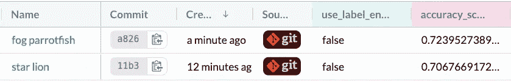

作者图片

[*链接到上图所示的实验。*](https://dagshub.com/khuyentran1401/employee-future-prediction/experiments/)

一旦我们发现参数和模型的组合比生产中的现有模型具有更好的性能，我们就创建一个 pull 请求来合并新代码和主分支。

# 使用 GitHub 动作测试代码、ML 模型和应用程序

为了确保合并新代码不会导致任何错误，我们将创建一个工作流:

*   自动测试拉取请求
*   仅允许通过所有测试的拉请求与主分支合并。

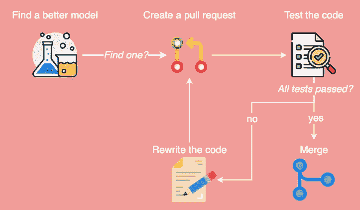

作者图片

我们将在`.github/workflows`下的 YAML 文件中编写这个工作流。

```
.github
└── workflows
    └── test_code.yaml
```

## 指定事件

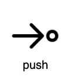

作者图片

在这个工作流中，我们使用`on`来指定工作流将只运行:

*   如果事件是拉请求。
*   如果提交文件的路径与某些模式匹配。

## 指定步骤

接下来，创建一个名为`test_code`的作业，它由按顺序执行的几个步骤组成。

前几个步骤将在运行代码之前设置环境。

上面代码中的语法解释:

*   `name`:你脚步的名字
*   `uses`选择一个*动作，*即一个执行复杂但频繁重复任务的应用。你可以从 [GitHub Marketplace](https://github.com/marketplace?type=actions) 上的数千个动作中选择一个动作。
*   `with`插入动作所需的输入参数
*   `run`使用 shell 运行命令行程序

步骤说明:

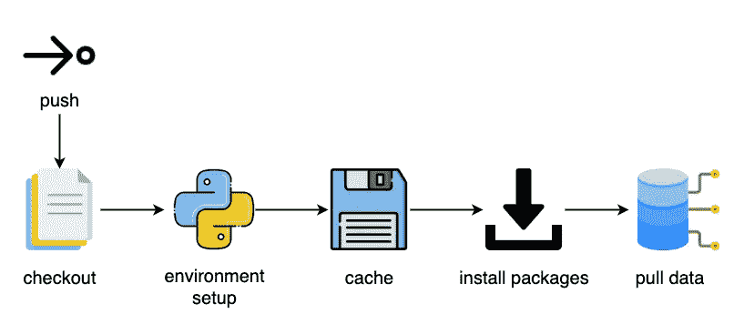

作者图片

*   `Checkout`签出您的存储库，以便工作流可以访问存储库中的文件
*   `Environment setup`为您的工作流设置一个 Python 环境(我选择了 Python 3.8)
*   `Cache`缓存依赖关系，这样您就不需要在每次运行工作流时安装依赖关系
*   安装代码成功运行所需的所有依赖项
*   `Pull data`验证并从远程存储中提取数据。在这里，我的远程存储是 [DagsHub](https://towardsdatascience.com/dagshub-a-github-supplement-for-data-scientists-and-ml-engineers-9ecaf49cc505#:~:text=DagsHub%20is%20a%20platform%20for,models%2C%20experiments%2C%20and%20code.&text=The%20interface%20of%20your%20new,Notebooks%2C%20DVC%2C%20and%20Git.)

请注意，将您的用户名和密码放在每个人都能看到的脚本中是有风险的。因此，我们将使用加密的秘密来隐藏这些机密信息。

## 加密的秘密

机密是您在存储库中创建的加密环境变量。要创建一个秘密，进入你的储存库，点击*设置* → *秘密* → *动作* → *新建储存库秘密*。

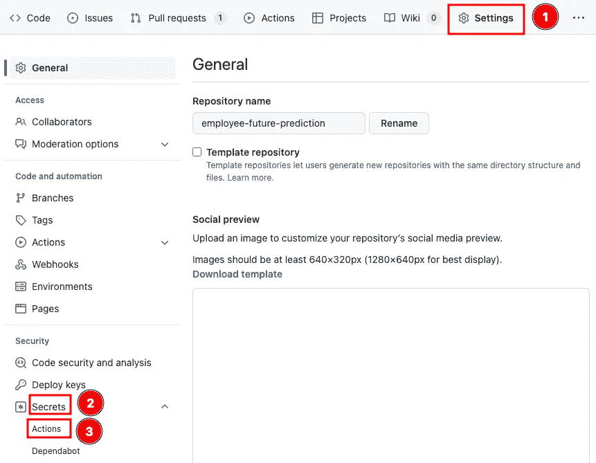

作者图片

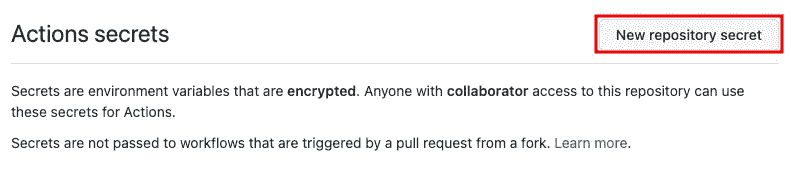

作者图片

插入您的机密名称以及与此名称相关的值。

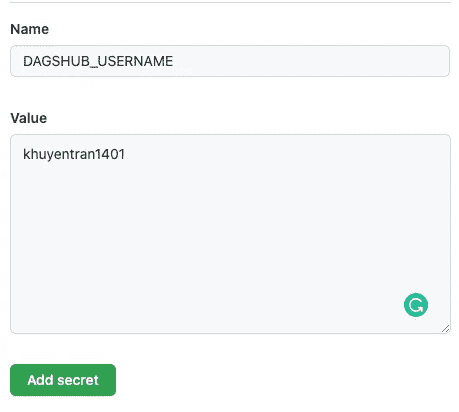

作者图片

现在您可以使用`${{ secrets.DAGSHUB_USERNAME }}`来访问秘密`DAGSHUB_USERNAME`。

## 运行测试

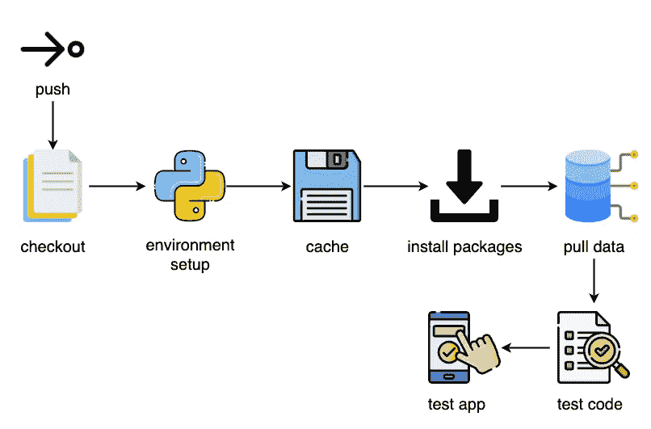

作者图片

我们的代码有两个部分:训练模型和部署模型。我们将编写一些步骤来确保这两个部分都可以无任何错误地运行，并按预期工作。

下面是测试训练代码的步骤:

具体来说，我们测试处理代码和 ML 模型。


*在这里* *找到所有的测试* [*。*](https://github.com/khuyentran1401/employee-future-prediction/tree/master/training/tests)

测试部署代码的步骤包括:

*   将模型保存到 BentoML 本地商店

*   在本地运行应用程序，并运行[测试](https://github.com/khuyentran1401/employee-future-prediction/blob/master/application/tests/test_create_service.py)以确保应用程序按照我们的预期工作。

*注意:这里，我们使用 BentoML 创建了一个 ML 驱动的应用程序。阅读这篇文章，了解更多关于 BentoML 的知识:*

[](https://towardsdatascience.com/bentoml-create-an-ml-powered-prediction-service-in-minutes-23d135d6ca76) [## BentoML:在几分钟内创建一个 ML 驱动的预测服务

### 用 Python 封装和部署您的 ML 模型

towardsdatascience.com](https://towardsdatascience.com/bentoml-create-an-ml-powered-prediction-service-in-minutes-23d135d6ca76) 

将此工作流添加并提交到 GitHub 上的主分支。

```
git add .github
git commit -m 'add workflow'
git push origin master
```

## 添加规则

为了确保只有在工作流成功运行时代码才可以被合并**，选择*设置* → *分支* → *添加规则*。**

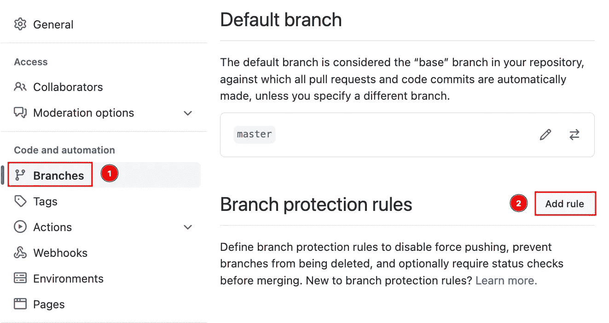

作者图片

添加`master`作为分支名称模式，勾选`Require status checks to pass before merging`，然后在*状态检查下添加需要*的工作流名称。最后，点击*保存更改*。

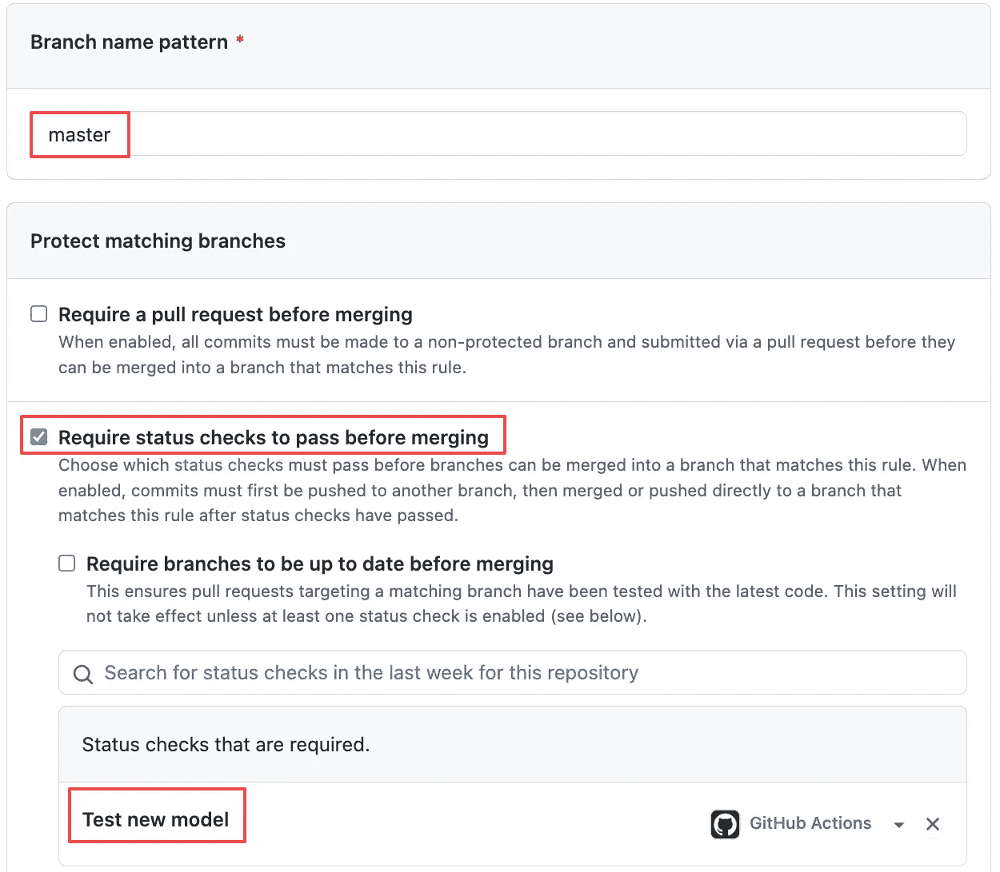

作者图片

现在当你创建一个拉请求时，GitHub Actions 会自动运行工作流`Test new model`。如果检查未通过，您将无法合并拉取请求。

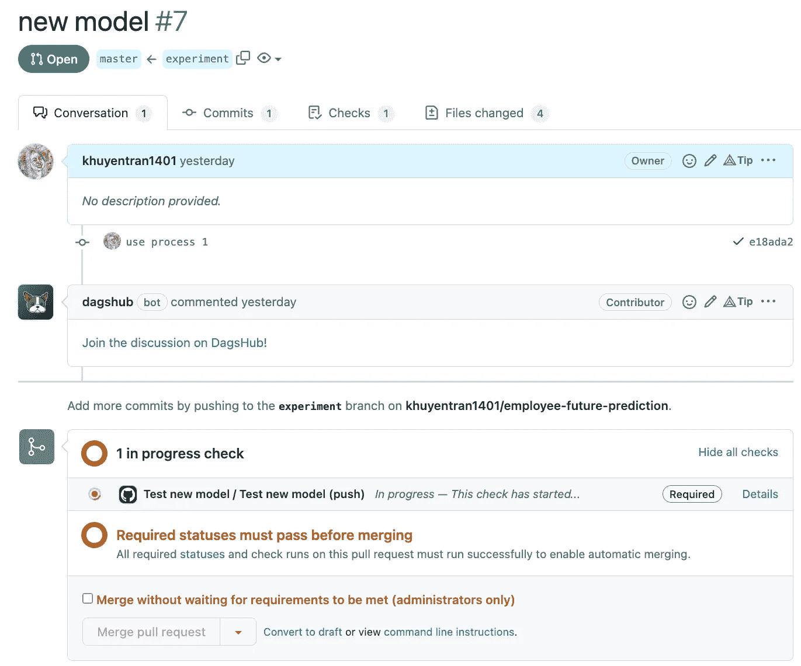

作者图片

点击*详情*将显示运行状态。


作者 GIF

测试训练代码的完整代码:

# 合并后使用 GitHub 操作部署模型

在合并拉请求之后，模型应该会自动部署到现有的服务中。让我们创建一个 GitHub 工作流来做这件事。

首先创建另一个名为`[deploy_app.yaml](https://github.com/khuyentran1401/employee-future-prediction/blob/master/.github/workflows/deploy_app.yaml)`的工作流:

```
.github
└── workflows
    ├── deploy_app.yaml
    └── test_model.yaml
```

工作流程的前几个步骤与之前的工作流程相似:


作者图片

我们还使用`env`将环境变量添加到工作流中。环境变量将在工作流的某些步骤中使用。

接下来，我们使用 [BentoML](https://towardsdatascience.com/bentoml-create-an-ml-powered-prediction-service-in-minutes-23d135d6ca76) 将模型打包，然后部署到 [Heroku](https://www.heroku.com/) 。

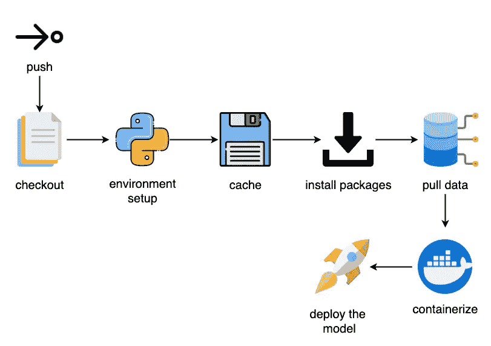

作者图片

> [部署 app 的完整代码](https://github.com/khuyentran1401/employee-future-prediction/blob/master/.github/workflows/deploy_app.yaml)。

将此工作流添加并提交到 GitHub 上的主分支。

```
git add .github
git commit -m 'add workflow'
git push origin master
```

现在，当您合并一个拉取请求时，一个名为`Deploy App`的工作流将会运行。要查看工作流的状态，请单击*操作* →最新工作流的名称→ *部署应用程序*。

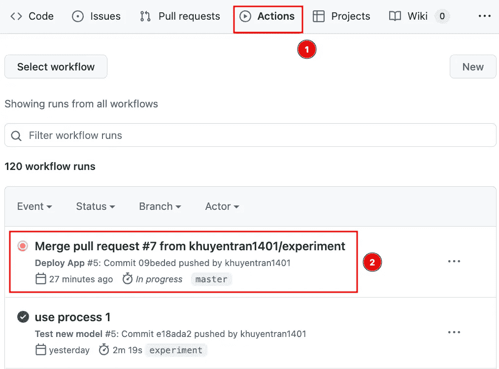

作者图片

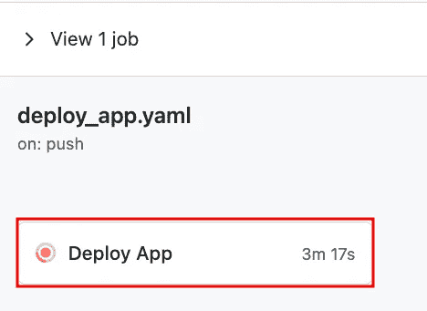

作者图片

现在，您应该看到您的工作流正在运行:

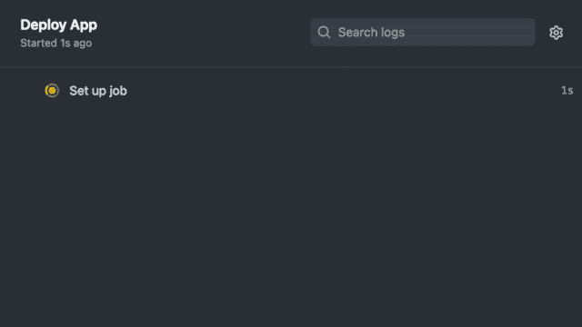

作者 GIF

酷！这款应用的网站名为[https://employee-predict-1.herokuapp.com/](https://employee-predict-1.herokuapp.com/)，现已更新。

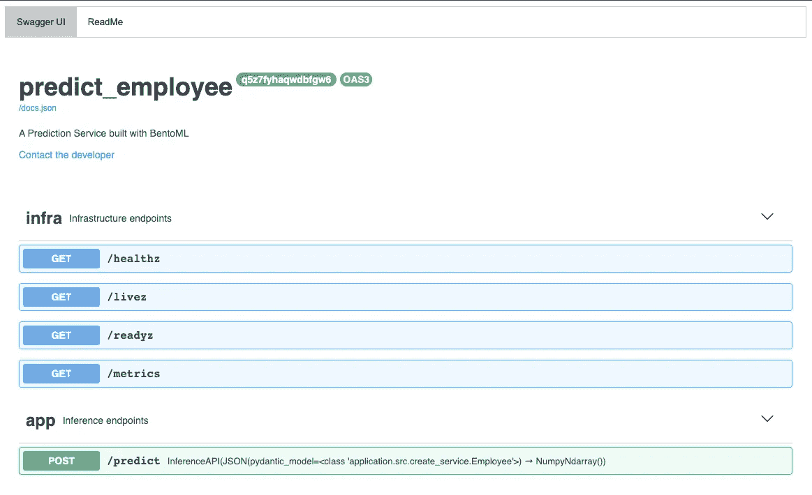

作者图片

由于我的 Streamlit 应用程序向上面的 URL 发出 POST 请求来生成预测，因此该应用程序也进行了更新。

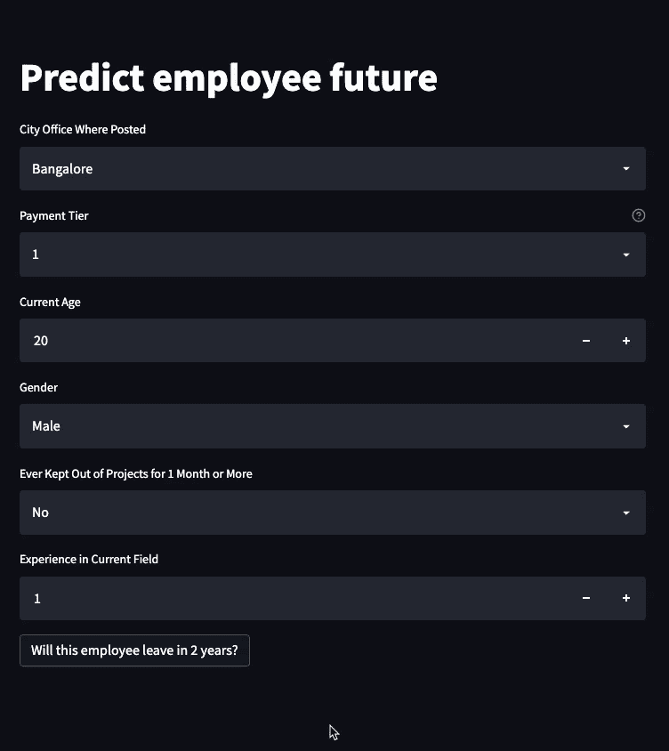

作者 GIF

# 结论

恭喜你！您刚刚学习了如何使用 GitHub 操作来创建工作流，该工作流自动测试来自团队成员的 pull 请求，并将 ML 模型部署到现有的服务中。我希望这篇文章能给你动力，用 GitHub Actions 自动化你的任务。

随意发挥，并在这里叉这篇文章的源代码:

[](https://github.com/khuyentran1401/employee-future-prediction) [## GitHub-khuyentran 1401/employee-future-prediction:在 MLOps 中使用 GitHub 操作的演示

### 在数据科学团队中，经常会不断尝试找到比生产中现有模型更好的模型。它…

github.com](https://github.com/khuyentran1401/employee-future-prediction) 

我喜欢写一些基本的数据科学概念，并尝试不同的数据科学工具。你可以在 LinkedIn 和 Twitter 上与我联系。

如果你想查看我写的所有文章的代码，请点击这里。在 Medium 上关注我，了解我的最新数据科学文章，例如:

[](https://towardsdatascience.com/introduction-to-dvc-data-version-control-tool-for-machine-learning-projects-7cb49c229fe0) [## DVC 介绍:机器学习项目的数据版本控制工具

### 就像 Git 一样，但是有数据！

towardsdatascience.com](https://towardsdatascience.com/introduction-to-dvc-data-version-control-tool-for-machine-learning-projects-7cb49c229fe0) [](https://towardsdatascience.com/bentoml-create-an-ml-powered-prediction-service-in-minutes-23d135d6ca76) [## BentoML:在几分钟内创建一个 ML 驱动的预测服务

### 用 Python 封装和部署您的 ML 模型

towardsdatascience.com](https://towardsdatascience.com/bentoml-create-an-ml-powered-prediction-service-in-minutes-23d135d6ca76) [](https://towardsdatascience.com/dagshub-a-github-supplement-for-data-scientists-and-ml-engineers-9ecaf49cc505) [## Dag shub:GitHub 对数据科学家和 ML 工程师的补充

### 将您的数据、模型、实验和代码保存在一个地方

towardsdatascience.com](https://towardsdatascience.com/dagshub-a-github-supplement-for-data-scientists-and-ml-engineers-9ecaf49cc505) [](https://towardsdatascience.com/orchestrate-a-data-science-project-in-python-with-prefect-e69c61a49074) [## 用 Prefect 编制 Python 中的数据科学项目

### 用几行代码优化您的数据科学工作流程

towardsdatascience.com](https://towardsdatascience.com/orchestrate-a-data-science-project-in-python-with-prefect-e69c61a49074) 

# **参考**

*用 Github 动作部署到 Heroku*。显著的标记。(2021 年 3 月 12 日)。2022 年 5 月 31 日检索，来自[https://remarkable mark . org/blog/2021/03/12/github-actions-deploy-to-heroku/](https://remarkablemark.org/blog/2021/03/12/github-actions-deploy-to-heroku/)

加尔维斯，J. (2020 年 8 月 12 日)。*使用 Github 动作对 REST API 进行集成测试*。中等。2022 年 5 月 31 日检索，来自[https://medium . com/weekly-web tips/using-github-actions-for-integration-testing-on-a-rest-API-358991d 54 a 20](https://medium.com/weekly-webtips/using-github-actions-for-integration-testing-on-a-rest-api-358991d54a20)

Ktrnka。(未注明)。 *Ktrnka/MLOPS_EXAMPLE_DVC:使用 DVC、S3 和 Heroku 的 MLOPS 示例*。GitHub。于 2022 年 5 月 31 日从[https://github.com/ktrnka/mlops_example_dvc](https://github.com/ktrnka/mlops_example_dvc)检索

员工未来预测。CC0:公共领域。检索自[https://www . ka ggle . com/datasets/tejashvi 14/employee-future-prediction](https://www.kaggle.com/datasets/tejashvi14/employee-future-predictio)