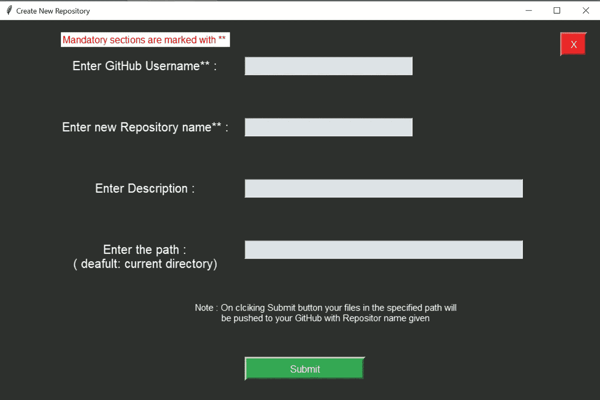
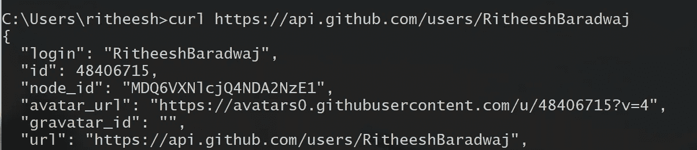
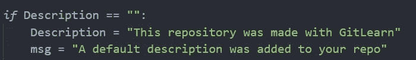
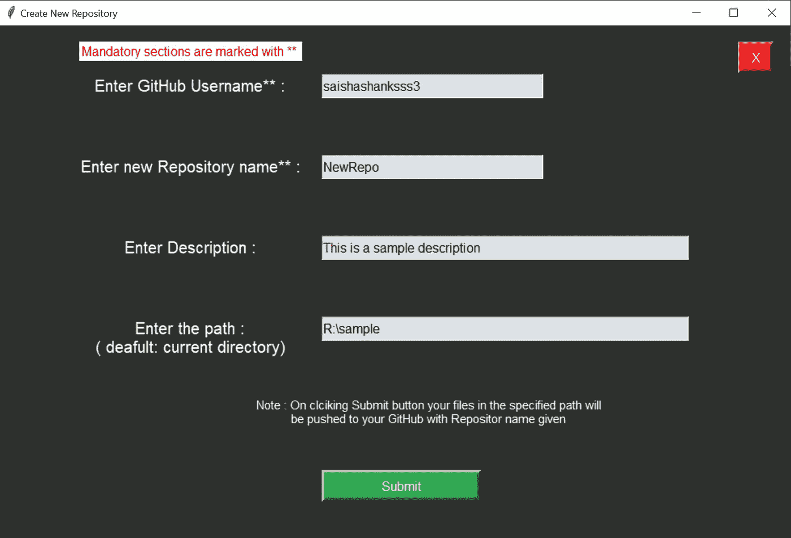
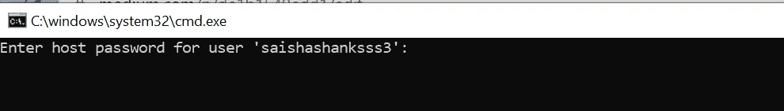
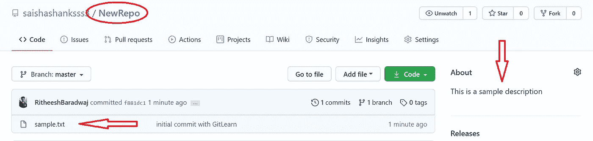
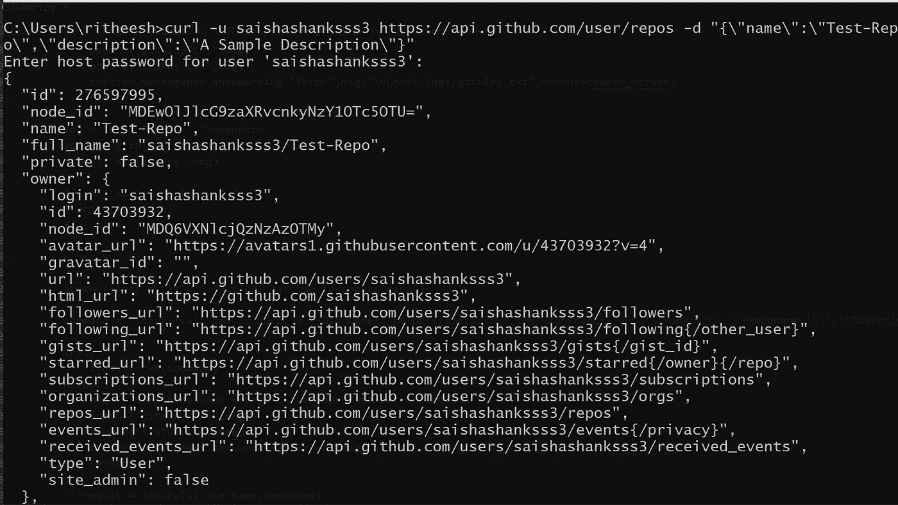

# 带有 Python 和 PowerShell 脚本的 GitHub API

> 原文：<https://pub.towardsai.net/github-api-with-python-powershell-scripting-47d39b5d32d1?source=collection_archive---------2----------------------->

## [编程](https://towardsai.net/p/category/programming)

## 使用 GitHub API 和 Python 以及 PowerShell 脚本来创建和管理存储库


使用 Canva 设计

**GitHub API** 是 **GitHub** 为想要开发针对 **GitHub** 的应用的开发者提供的接口。例如，您可以在 **API** 之上构建一个具有更多功能或更好表示层的应用程序。

在本文中，我将向您展示如何使用 GitHub API 开发一个很酷的 python 应用程序来创建和管理 GitHub 存储库。


一个简单的 Python 应用程序(作者提供图片)

要创建 GUI，我们可以使用 python Tkinter 模块。让我们使用下面的命令来测试我们的 API 设置。所有数据都以 JSON 的形式发送和接收。

```
curl [https://api.github.com/zen](https://api.github.com/zen)
```


API 回应(作者供图)

答案将是从 GitHub 的设计理念中随机选择的。

## 创建新的存储库



创建新的存储库(作者图片)

为了创建一个新的存储库并将必要的文件推送到该存储库中，我们需要从用户那里获取必要的输入并验证它们。

*   **GitHub 用户名验证** —可以发现 GitHub 帐户是否存在给定的用户名。

我们需要利用下面的端点。

```
[https://api.github.com/users/GitHub_Username](https://api.github.com/users/GitHub_Username)
```

如果用户存在，则返回状态代码“200”。我们可以看到如下所示的输出



GitHub 用户名 API(作者供图)

现在，这可以用来构建一个函数来验证用户是否存在。

GitHub 用户名验证

如果用户名不存在，我们可以要求用户创建一个 GitHub 帐户。如果存在，我们需要检查存储库是否存在。

*   **检查仓库是否存在**

以下端点将以 JSON 格式返回给定用户名的存储库列表。

```
curl [https://api.github.com/users/GitHub_UserName/repos](https://api.github.com/users/GitHub_UserName/repos)
```

回应会是这样的


GitHub Repo 的回应(作者提供图片)

要创建新的存储库，我们需要检查用户输入的存储库名称是否不存在。

检查存储库是否存在

如果响应没有返回状态码“200 ”,则表明该 GitHub 帐户的公共存储库不存在。所以我们可以创建一个存储库了。

*   **说明** —这是一个可选参数。我们可以通过 API 向 GitHub 存储库添加描述。



GitHub 回购描述(作者照片)

*   **存储库路径—** 要将文件推(上传)到存储库，我们可以向用户询问目录的路径。它可以是一个可选参数，默认情况下我们可以取当前目录的路径


回购路径(作者供图)

现在，我们已经获得了创建新存储库并将文件推送到其中所需的所有变量。要创建 GitHub repo，我们可以使用下面的命令

创建 GitHub repo 的命令

一旦创建了存储库，就需要上传给定路径中的文件。为了实现这一功能，我们可以利用 PowerShell 脚本。

用于创建新存储库的 PowerShell 脚本

现在我们可以用 python 执行脚本，如下所示，

使用 Python 执行 PowerShell 脚本

你可以在这里找到 PowerShell 脚本的完整代码。

让我们试一个例子，



创建新的存储库(作者图片)

提交详细信息后，我们需要输入 GitHub 帐户的密码。



输入密码(作者照片)

就这样，将为我们创建存储库，并上传所有需要的文件。



使用上传的文件创建存储库(作者提供照片)

我们也可以用下面的命令创建一个存储库，

```
curl -u GitHub_UserName [https://api.github.com/user/repos](https://api.github.com/user/repos) -d "{\"name\":\"Test-Repo\",\"description\":\"A Sample Description\"}"
```



创建一个 GitHub 存储库(图片由作者提供)

我们也可以在我们的 web 或 android 应用程序中使用 GitHub APIs。可以将各种参数传递给根端点，以获得当前应用程序所需的特定响应。你可以在这里找到更多关于[的信息。](https://developer.github.com/v3/)

*点击* [*下载整个 python 应用程序。*](https://bit.ly/GitLearn-download)

*完整代码可以在 GitHub* [*这里*](https://github.com/RitheeshBaradwaj/GitLearn) *找到。*

## 结论

我们已经看到了如何在我们的应用程序中使用 GitHub API 来创建和管理存储库。我会带着更多有趣的话题很快再见到你。在那之前，注意安全，呆在家里。

如果你想联系，请在[**LinkedIn**](https://www.linkedin.com/in/ritheesh-baradwaj-yellenki-8a6988173/)**上**联系我。****