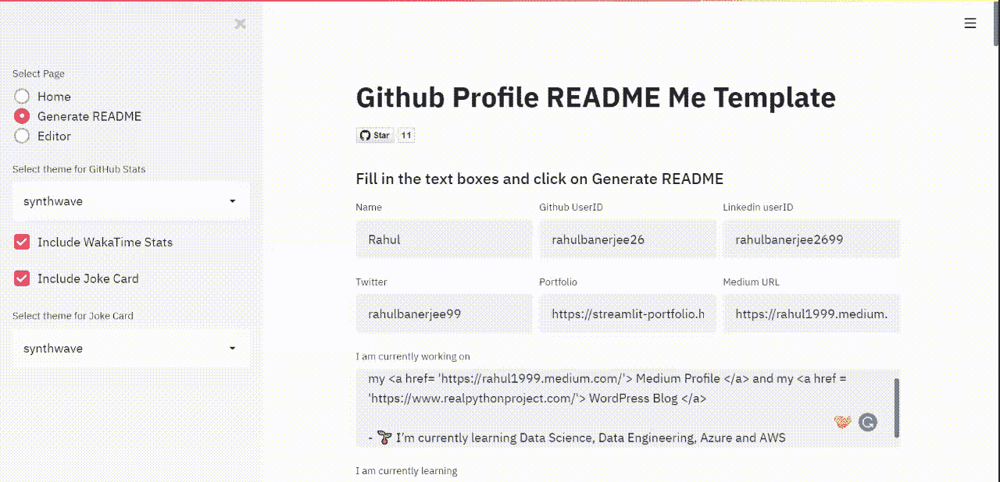

# GitHub 配置文件自述文件生成器

> 原文：<https://pub.towardsai.net/github-profile-readme-generator-db655e341017?source=collection_archive---------4----------------------->

## [编程](https://towardsai.net/p/category/programming)

## Github 有一个“秘密”回购功能，可以用来为你的个人资料创建一个很酷的自述文件。如果你像我一样，你可能已经知道了，但是懒得写 Markdown 和创建一个自述文件。

应用程序的截屏

我使用 Python 和 Streamlit 构建了一个 web 应用程序，它接受用户(您)的一些输入，并生成一个很酷的自述文件。该应用程序还包含一个编辑器，以防你想对你的自述文件进行调整。

下面是应用程序的回购

 [## rahulbanerjee 26/githubprofilereademergenerator

### https://share . streamlit . io/rahulbanerjee 26/githubaboutmegenerator/main/_ _ init _ _。py…

github.com](https://github.com/rahulbanerjee26/githubProfileReadmeGenerator) 

下面是生成的自述文件示例

 [## rahulbanerjee26

### 🔭我目前正在制作我的媒体简介和我的 WordPress 博客🌱我目前正在学习数据科学，数据…

www.github.com](https://www.github.com/rahulbanerjee26/rahulbanerjee26) 

# 特征

*   gif
*   社交图标
*   技能图标
*   访客徽章
*   Github 统计
*   能够改变 GitHub 统计卡的主题
*   瓦卡提时间统计
*   。yml 文件来显示订阅源中的博客文章
*   能够在自述文件的开头添加图像横幅。只需粘贴网址和尺寸，您就可以开始了:)
*   用实时更新编辑降价的编辑器
*   随机笑话卡

# 未来发布的计划

*   增加用户在各种自述文件设计中进行选择的能力
*   添加更多徽章
*   添加资源部分
*   改进现有的自述文件设计
*   添加更多卡片
*   添加一个页面来展示使用此应用程序构建的各种 READMEs

# 如何投稿

## 投稿指南

*   放弃这个项目
*   创建您的功能分支 git checkout -b 功能/amazing 功能
*   提交您的更改 git commit -m '添加一些令人惊叹的功能'
*   推送至分支 git 推送原点功能/amazing 功能
*   打开拉取请求
*   合并您的 PR 后，我会将您添加为贡献者:)如果您希望将自己添加到“使用此应用程序的用户”列表中，只需分叉回购，更新自述文件并制作 PR。
*   按照下面的格式
    `<a href = 'Your Github URL'> Your Name </a>`或者在 Twitter/LinkedIn 上联系我，我会添加你:)

## 作为用户

*   自述文件中有一部分可以列出你的名字。查看回购的其他人会看到你的名字，这可能有助于你获得更多曝光率
*   要提交，只需转到“使用此应用生成自述文件的用户”部分
*   按照以下格式在末尾添加您的姓名
    `- <a href = 'Your Github URL'> Your Name </a>`

## 作为贡献者

1.  通过创建问题并上传自述文件或发布自述文件的 URL 来提交自述文件设计建议
2.  构建上述功能之一
3.  通过创建问题来建议功能

# 当前已知问题

web 应用程序不支持分页，即当您从一个页面移动到另一个页面时，数据不会保存。

# 使用的技术

*   计算机编程语言
*   细流
*   HTML/CSS
*   降价

# 如何支持

对我来说，一颗简单的星星意味着很多，:D

感谢您花时间阅读我的文章，希望我构建的 web 应用对您有用:)

*原发布于*[*https://realpythonproject . hashnode . dev*](https://realpythonproject.hashnode.dev/github-profile-readme-generator)*。*