# 给我 5 分钟，我给你一个深度假！

> 原文：<https://pub.towardsai.net/give-me-5-minutes-ill-give-you-a-deepfake-ce83a645b0f9?source=collection_archive---------0----------------------->

## [计算机视觉](https://towardsai.net/p/category/computer-vision)，[机器学习](https://towardsai.net/p/category/machine-learning)

## 如何不用写任何代码就产生 DeepFakes？

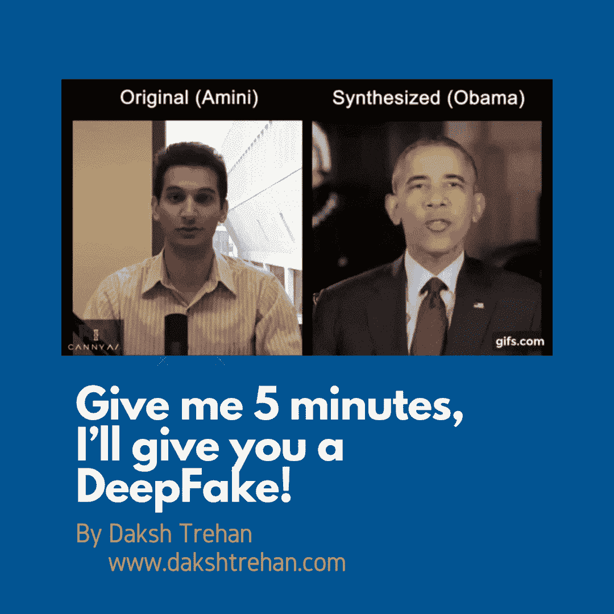

作者在 Canva 上设计的视觉效果。GIF 来源:[什么是 deepfakes？—tech talks(bdtechtalks.com)](https://bdtechtalks.com/2020/09/04/what-is-deepfake/)

你喜欢表演者和艺术家吗？你想模仿他们吗？现在你可以了！

你想在抖音走红，但又害怕自己的舞步吗？好吧，我支持你。你所需要的只是你的静止图像和你最喜欢的艺术家表演一些动作的视频。然后，嘣！你是网络红人。

为了模仿上述工作流程，我们实现了图像动画，它使用神经网络来帮助我们将源图像包裹在视频序列中对象的运动上。在本文中，我们将看到图像动画是多么简单，以及如何不用编写任何代码就可以使用它！

# 它是如何工作的？

在“[图像动画的一阶运动模型](http://papers.nips.cc/paper/8935-first-order-motion-model-for-image-animation)中提出的模型是一种新颖的方法，在没有关于对象的任何附加信息的情况下，用源图像替换驾驶视频中的对象。

在构建我们的序列之前，理解在引擎盖下发生了什么是非常重要的！

该模型实现了一个神经网络，有助于重建驾驶视频，其中视频中的对象被源图像中的对象所替换。在测试期间，该模型试图根据驾驶视频中描述的帧来预测源图像中的对象如何移动。使用上述过程，该模型可以跟踪驾驶视频中的每个细节，从头部运动到说话。

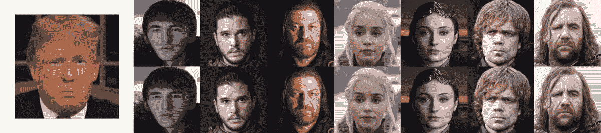

# 工作流程

训练是在大量的视频集合上进行的。为了重建训练视频，模型提取帧对，并尝试学习视频中运动的潜在表示，使用提取的信息，它学习将运动编码为特定于运动的关键点位移和自然仿射变换的混合[1]。

在测试时，该模型通过将源图像的对象包装到驱动视频的每一帧并因此执行图像动画来重新生成视频序列。

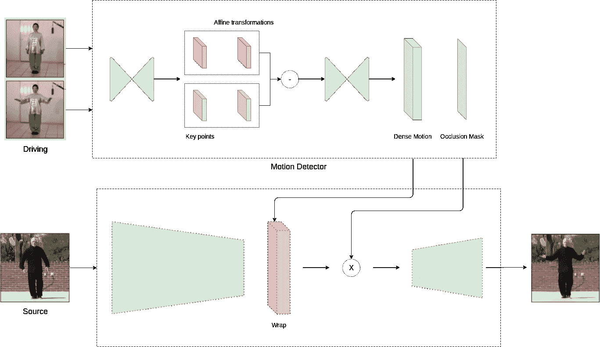

使用运动估计模块和图像生成模块来实现该框架。

运动估计器的目标是学习视频中运动的潜在表示。简而言之，它试图跟踪序列中的运动，并将它们编码为特定于运动的关键点位移和局部仿射变换。输出包括密集运动场和遮挡掩模。遮罩定义了要由源图像包裹的驱动序列对象的相关部分(例如，面部的前侧)。

例如，在给定的 gif 中，女士的背部没有动画，这是由运动估计器确定的。

最后，运动估计器的输出与源图像和驱动视频一起被输入到图像生成器。图像生成器生成具有包装的源图像对象的驱动视频的帧，并且这些帧被结合在一起以创建视频序列。

# 创建 DeepFakes

论文的源代码在 Github 上很容易找到。创建 deepfake 有两种方法:

## 老派技术:

1.  下载 zip 格式的存储库。

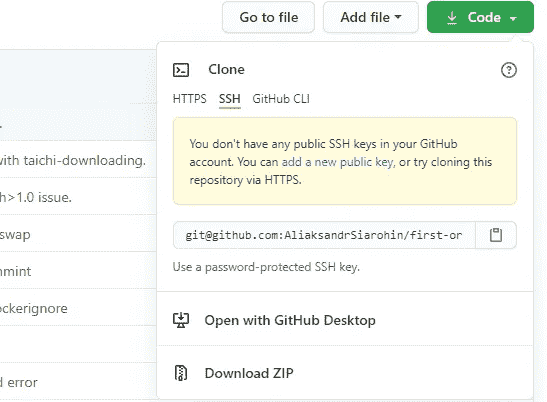

2.提取文件。

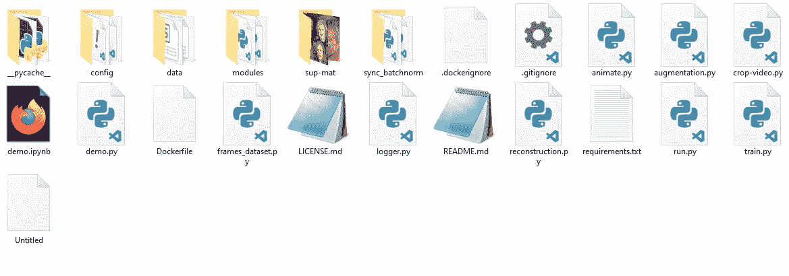

3.使用解压缩文件夹中的终端，并使用以下命令下载所有需要的包。

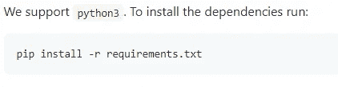

4.下载预先训练好的检查点。

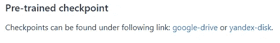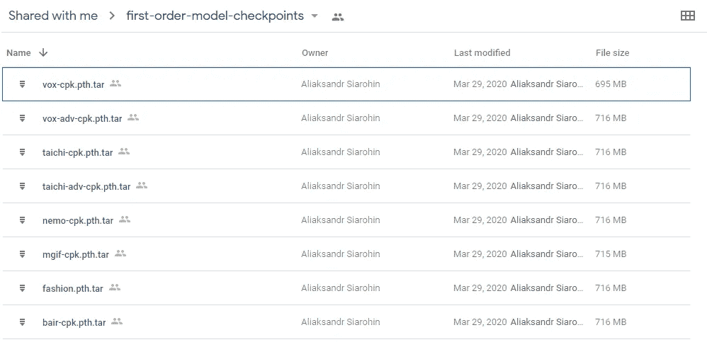

根据您的喜好下载任何检查点。

5.将源映像、驱动程序视频和预先训练的检查点复制到提取的文件夹中。

6.打开终端并使用以下命令:

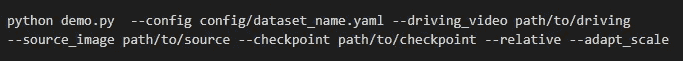

将“config/dataset_name.yml”、“path/to/driving”、“path/to/source”、“path/to/checkpoint”分别替换为数据集名称、驱动序列路径、源映像路径和检查点路径。

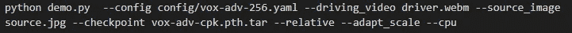

运行修改后的命令，如果没有 GPU，不要忘记添加“— cpu”。

7.你将在同一个解压文件夹中获得你的 DeepFake 视频。

## Google-Colab 技术:

1.  访问[https://colab . research . Google . com/github/AwaleSajil/deep fake _ 1/blob/master/first _ order _ model _ demo(Youtube)_ new _ audio V5 _ a . ipynb](https://colab.research.google.com/github/AwaleSajil/DeepFake_1/blob/master/first_order_model_demo(Youtube)_new_audioV5_a.ipynb)
2.  创建此 ipynb 文件的副本。
3.  配置您的模型。

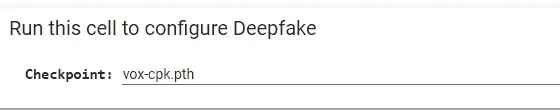

4.根据训练数据训练您的模型。

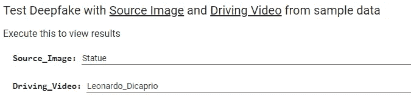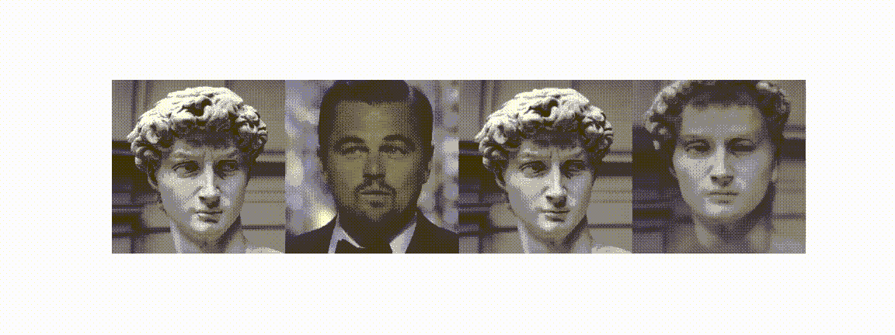

上述命令生成的输出

5.添加您的来源和驾驶视频。

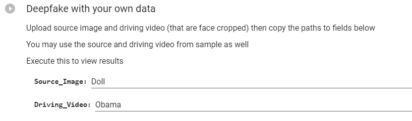

6.享受你的 DeepFake。

**如果你喜欢这篇文章，请考虑订阅我的简讯:** [**达克什·特雷汉每周简讯**](https://mailchi.mp/b535943b5fff/daksh-trehan-weekly-newsletter) **。**

# 参考资料:

[1] [用于图像动画的一阶运动模型(nips.cc)](https://papers.nips.cc/paper/2019/hash/31c0b36aef265d9221af80872ceb62f9-Abstract.html)

[2][AliaksandrSiarohin/一阶模型:(github.com)](https://github.com/AliaksandrSiarohin/first-order-model)

[3] [一阶模型(aliaksandrsiarohin . github . io)](https://aliaksandrsiarohin.github.io/first-order-model-website/)

[4] [如何在 5 分钟内制作一个深度假视频| Dimitris Poulopoulos |走向数据科学](https://towardsdatascience.com/how-to-produce-a-deepfake-video-in-5-minutes-513984fd24b6)

【5】[从零到深假。用 DeepFaceLab 探索 deepfakes 作者 Jarrod Overson | Medium](https://jsoverson.medium.com/from-zero-to-deepfake-310551e59aa3)

[6] [(51)如何在 5 分钟内制作 Deepfake 视频(印地语)——YouTube](https://www.youtube.com/watch?v=O-Eh2r2_nZU)

请随意连接:

> *作品集~*[*https://www.dakshtrehan.com*](http://www.dakshtrehan.com/)
> 
> *LinkedIn ~*[*https://www.linkedin.com/in/dakshtrehan*](https://www.linkedin.com/in/dakshtrehan/)

关注更多机器学习/深度学习博客。

> *中等~*[*https://medium.com/@dakshtrehan*](https://medium.com/@dakshtrehan)

# 想了解更多？

[准备好拜 AI 神了吗？](https://medium.com/swlh/are-you-ready-to-worship-ai-gods-818c9b7490dc)
[利用深度学习检测新冠肺炎](https://towardsdatascience.com/detecting-covid-19-using-deep-learning-262956b6f981)
[逃不掉的 AI 算法:抖音](https://towardsdatascience.com/the-inescapable-ai-algorithm-tiktok-ad4c6fd981b8)
[GPT-3 向一个 5 岁的孩子解释。](/gpt-3-explained-to-a-5-year-old-1f3cb9fa030b)
[Tinder+AI:一场完美的牵线搭桥？](https://medium.com/towards-artificial-intelligence/tinder-ai-a-perfect-matchmaking-b0a7b916e271)
[使用机器学习的卡通化内幕指南](https://medium.com/towards-artificial-intelligence/an-insiders-guide-to-cartoonization-using-machine-learning-ce3648adfe8)
[强化强化学习背后的科学](https://medium.com/towards-artificial-intelligence/reinforcing-the-science-behind-reinforcement-learning-d2643ca39b51)
[解码生成性对抗网络背后的科学](https://medium.com/towards-artificial-intelligence/decoding-science-behind-generative-adversarial-networks-4d188a67d863)
[了解 LSTM 和 GRU 的](https://medium.com/towards-artificial-intelligence/understanding-lstms-and-gru-s-b69749acaa35)
[用于假人的递归神经网络](https://medium.com/towards-artificial-intelligence/recurrent-neural-networks-for-dummies-8d2c4c725fbe)
[用于假人的卷积神经网络](https://medium.com/towards-artificial-intelligence/convolutional-neural-networks-for-dummies-afd7166cd9e)

> *欢呼*