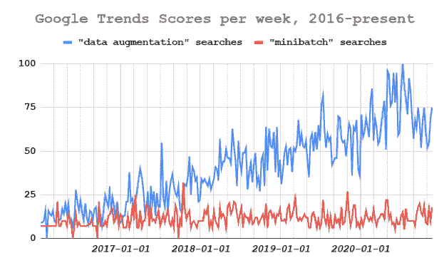
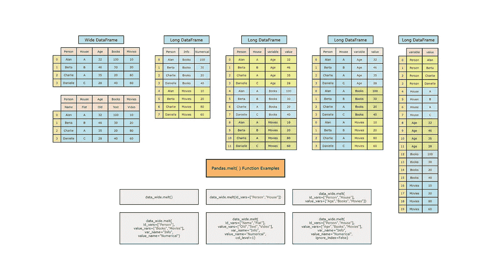
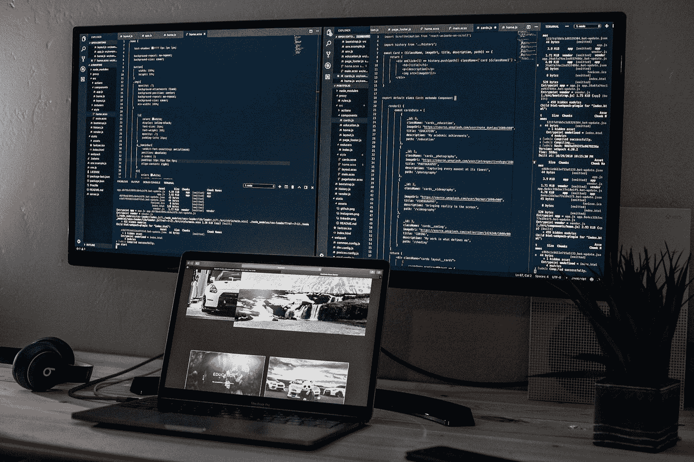
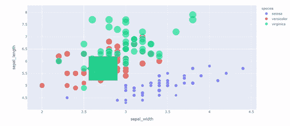
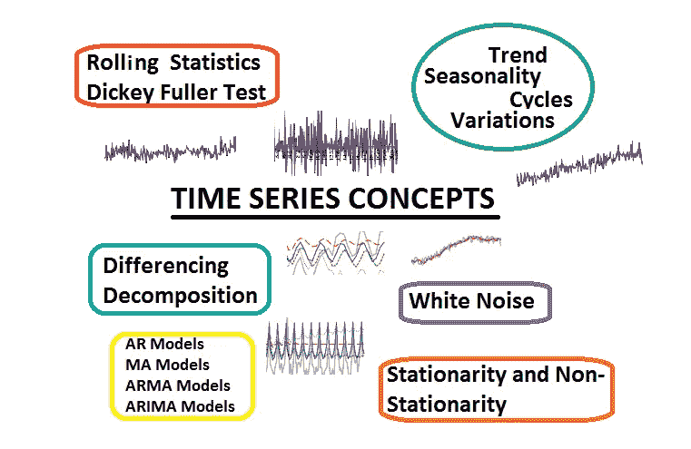

# GNNs 到数据扩充再到利用开源构建大规模分布式应用

> 原文：<https://pub.towardsai.net/gnns-to-data-augmentation-to-building-distributed-applications-at-scale-with-open-source-15822cc0cc78?source=collection_archive---------0----------------------->

## [**新闻**](https://towardsai.net/p/category/news) **，** [**通迅**](https://towardsai.net/p/category/newsletter)

## 人工智能新闻，研究和更新，一个激动人心的和[免费参加的人工智能峰会](http://ws.towardsai.net/inb)，以及我们每月的编辑精选！

***如果你阅读这封邮件有困难，请在*** [***网络浏览器***](http://ws.towardsai.net/g9k) ***上查看。***

T 何开源 [**AI 社区**](https://members.towardsai.net/) 正在快速成长。TensorFlow、Theano、Caffe、BERT、MXNet、PyTorch、Gluon 和 PyStanfordNLP 等开源项目有助于让每个人都可以使用人工智能。为了让你对可扩展人工智能更感兴趣，请查看由 **Anyscale** 举办的这场精彩且免费的活动:

[Free] [射线峰会 6 月 22 日–24 日](http://ws.towardsai.net/inb):扩展 AI 的最佳方式

[**Ray Summit**](http://ws.towardsai.net/inb)**汇集了开发人员、数据科学家、架构师和产品经理，使用 Ray(分布式计算的主导框架)来构建可扩展的 AI。主题包括顶级人工智能趋势、生产中的 ML、MLOps、强化学习、云计算、无服务器&等。 [**注册免费加入直播或点播**](http://ws.towardsai.net/inb) 。**

**实践中最常用的 GNNs 实现使用基于节点的阈值策略来保护敏感信息(例如，电子邮件、电话号码、街道地址等)。).这种方法容易受到社交网络上的信息泄露攻击。来自麻省理工学院、卡耐基梅隆大学和 UIUC 的研究人员在廖培源的带领下提出了一种 [**新算法图对抗网络(GAL)**](https://mktg.best/uyf2b) 与极小极大博弈来保护此类敏感信息。**

****

**在 [**【自然语言处理】**](https://news.towardsai.net/nlp) 领域，数据增强非常重要。在许多 NLP 子领域中，通过依赖辅助数据集来提高模型性能是一种已被证明的策略。然而，这绝不是一个“容易”的问题。查看 [**本文**](https://mktg.best/l0l53) 由谷歌、卡耐基梅隆大学和 Mila-Quebec AI 的研究人员领导，探索用于数据增强方法的最先进技术(DAA)。**

**接下来，在受监督的 [**机器学习**](https://mld.ai/mldcmu) 文献中，通常假设早期学习意味着泛化:开发一个在训练集的早期部分表现良好的系统将导致外推至看不见的或未来的数据。 [**本文**](https://mktg.best/pi6it) 由 CMU 大学的 Saurabh Garg 和 [**机器学习团队领导，提出的结果表明，这一假设对于各种模型和问题类型都是正确的:这项工作表明，早期学习是理解概括的关键。**](https://mld.ai/mldcmu)**

**现在，让我们面对现实吧。人工智能系统通常是不透明的，奇怪的，难以使用的。在机器学习领域，尤其如此。如果我们想要制造智能系统，让人们能够更容易地理解并与之互动，解决方案的一个关键部分就是建立一个社区，让人们能够聚集在一起，分享想法并相互学习。这就是为什么我们在 Discord 上创建了我们的 [**人工智能社区——与其他数据专家和爱好者联系和学习。**](https://members.towardsai.net/)**

**如果你还没有查看，我们最近用 Python 在 [**上推出了我们的**](https://gumroad.com/l/descriptive-statistics) **[**书**](https://news.towardsai.net/descriptive-statistics) 。这篇 [**文章**](https://news.towardsai.net/descriptive-statistics-book-sample) 或者这篇 [**PDF**](https://github.com/towardsai/tutorials/blob/master/descriptive-statistics/descriptive-statistics-pdf-book-sample.pdf) 提供了本书前 36 页的样本。请不要忘记，成为**会员，你就可以接触到这部作品、更多的书籍和其他好东西。******

****分享是关怀。请随时与您的朋友、同事和熟人分享我们的 [**简讯**](http://ws.towardsai.net/g9k) 或 [**订阅链接**](https://ws.towardsai.net/subscribe) 。每月一封电子邮件；随时退订！**如果您对我们如何改进有任何反馈，请随时通过** [**告诉我们**](https://app.joinpalette.com/t/amas/n1PYGbcbPthObD71gGCq) **。******

****现在进入月度精选！我们根据读者、粉丝和某篇文章的浏览量来挑选这些文章。我们希望你和我们一样喜欢阅读它们。此外，我们开始做一些新的东西！我们将选出我们表现最好的文章，我们的编辑将选择几篇表现不突出的文章，但由于它们的质量，它们进入了本月的名单。****

# ****📚编辑选择每月精选文章↓📚****

********

## ****[2021 年每个机器学习领域的最先进模型](https://mktg.best/lbczl)作者 [Mostafa Ibrahim](https://medium.com/u/b1f214c06d3e?source=post_page-----15822cc0cc78--------------------------------)****

****最先进的模型一直在变化。作为一个已经参加 Kaggle 竞赛将近一年的人，我发现自己遇到了许多这样的竞赛，并对它们进行比较、评估和测试。我认为列出每个 ML 任务的最佳模型是个好主意，这样你就知道从哪里开始了。事不宜迟，我们开始吧！****

******[**阅读更多**](https://mktg.best/lbczl)******

************

## ******[了解熊猫 Melt — pd.melt()](http://news.towardsai.net/pdm) 由[走向 AI 团队](https://medium.com/u/aea8a19ea239?source=post_page-----15822cc0cc78--------------------------------)******

********Pandas melt()** 函数是许多其他方法中的一种，用于将 Pandas 数据帧从宽格式重新整形为长格式，特别是在 [**数据科学**](https://mld.ai/mldcmu) 中。然而，`pd.melt()`函数是**中最高效、最灵活的**。`pd.melt()`函数将熊猫数据帧从宽格式解旋转/融化为长格式。******

******[**阅读更多**](http://news.towardsai.net/pdm)******

************

## ******[变形金刚会取代计算机视觉中的 CNN 吗？](https://mktg.best/entid)由[路易(什么是艾)布沙尔](https://medium.com/u/f34bfe2bbaec?source=post_page-----15822cc0cc78--------------------------------)******

******这篇文章很可能是关于所有计算机视觉应用的下一代神经网络:transformer 架构。你肯定已经听说过自然语言处理(NLP)领域的这种架构，主要是在 2020 年制造了很多噪音的 GPT3。变压器可以用作许多不同应用的通用主干，而不仅仅是 NLP。几分钟后，你就会知道如何将变压器架构应用于计算机视觉，这是微软研究院的泽·莉雅等人发表的一篇名为 Swin Transformer 的新论文[1]。******

********[**阅读更多**](https://mktg.best/entid)********

************

## ******[我的 VS 代码通过](https://mktg.best/5364i) [___](https://medium.com/u/3c36dad0dabc?source=post_page-----15822cc0cc78--------------------------------) 使用精益在本地设置原型算法交易策略******

******这篇文章描述了我在本地机器上使用 QuantConnect 的 [LEAN](https://github.com/quantconnect/lean) 引擎开发算法交易策略的 VS 代码设置。这是使用 QuantConnect Lean CLI 工具的替代方法。在这个报告中可以找到所有代码和脚本来重现本文中描述的结果。******

********[**阅读更多**](https://mktg.best/5364i)********

************

## ******[plot Express:由](https://mktg.best/302g0) [Eugenia Anello](https://medium.com/u/86fdc517c278?source=post_page-----15822cc0cc78--------------------------------) 通过交互式可视化解释数据******

******这是使用其他工具来可视化数据的最佳时机。你知道 **Matplotlib** 吗？你做梦去吧。也许它可以很容易应用并且不占用太多内存，但是很难从静态图中观察到特征随时间的变化。******

******[**阅读更多**](https://mktg.best/302g0)******

************

## ******[特征工程方法的完整列表:40 项技术，10 个类别](https://mktg.best/oyghe)作者[michelaangiolo Mazzeschi](https://medium.com/u/153452706ad7?source=post_page-----15822cc0cc78--------------------------------)******

******事实上，当您开始过渡到大数据时，功能工程变得至关重要。大数据分析现在和将来都将保持高需求，因为到目前为止，你几乎没有办法学会如何独自处理庞大的数据集。着手处理大数据的唯一方法是在工作场所与一个专家团队合作。这是真正的数据科学的全方位体验。******

********[**阅读更多**](https://mktg.best/oyghe)********

************

## ******[如何使用解析几何高效地为任何欧几里德旅行商问题找到最短路线/回路](https://mktg.best/je65e)作者 [Ashutosh Malgaonkar](https://medium.com/u/edc61e2d976?source=post_page-----15822cc0cc78--------------------------------)******

********旅行推销员问题**(也称为**旅行推销员问题**[【1】](https://en.wikipedia.org/wiki/Travelling_salesman_problem#cite_note-1)或 **TSP** )提出以下问题:“给定一个城市列表和每对城市之间的距离，恰好访问每个城市一次并返回出发城市的最短可能路线是什么？这是组合优化中的一个 NP-hard 问题，在理论计算机科学和运筹学中很重要…******

******[**阅读更多**](https://mktg.best/je65e)******

************

## ******[DeepMind 结合逻辑和神经网络从嘈杂的数据中提取规则](https://mktg.best/zjgbx)由 [Jesus Rodriguez](https://medium.com/u/46674a2c9422?source=post_page-----15822cc0cc78--------------------------------)******

******人工智能研究员佩德罗·多明戈斯(Pedro Domingos)在他的书《大师算法》(The Master Algorithm)中探索了一种可以结合机器学习的重要流派的单一算法的想法。毫无疑问，这个想法是非常雄心勃勃的，但我们已经看到了它的一些迭代。去年，谷歌发表了一篇研究论文，题目很吸引人……******

********[**阅读更多**](https://mktg.best/zjgbx)********

************

## ******[用 Python 理解时间序列组件](https://mktg.best/n3a7e)作者 [Amit Chauhan](https://medium.com/u/502d63083812?source=post_page-----15822cc0cc78--------------------------------)******

******在本文中，我们将通过处理数据中时间成分的机器学习示例来讨论时间序列概念。预测在银行部门、天气、人口预测以及许多直接处理现实生活问题的领域都是必不可少的。******

********[**阅读更多**](https://mktg.best/n3a7e)********

************

## ******[使用 MLFlow 和 LakeFS 实现高效工作流的数据版本控制](https://mktg.best/z5ho3)作者 [Giorgos Myrianthous](https://medium.com/u/76c21e75463a?source=post_page-----15822cc0cc78--------------------------------)******

******版本控制系统，比如 Git，是对源代码进行版本控制和归档的重要工具。版本控制帮助您跟踪代码中的更改。当进行更改时，也可能引入错误，但是使用源代码控制工具，开发人员可以回滚到工作状态，并将其与非工作代码进行比较。这最大限度地减少了对可能正在处理代码的其他团队成员的干扰，并帮助他们有效地协作。******

********[**阅读更多**](https://mktg.best/z5ho3)********

************

## ******[通过](https://mktg.best/6vlyj) [Satsawat Natakarnkitkul](https://medium.com/u/43a2b4818096?source=post_page-----15822cc0cc78--------------------------------) 的可视化理解贝叶斯定理******

******当我们开始我们的机器学习之旅时，我们经常问自己是否应该学习统计和概率，尤其是概率。答案取决于你在哪里，以及你想让自己理解它有多深。但是，请记住这些…******

********[**阅读更多**](https://mktg.best/6vlyj)********

************

## ******你应该知道的 7 个令人敬畏的 Jupyter 工具******

******Jupyter 笔记本被认为是任何数据科学实验的支柱，这是有充分理由的。它们允许交互式的、有文化的编程，这是其他平台所不能提供的。在这篇短文中，我分享了一些我在笔记本上编写数据科学项目时经常使用的技巧和诀窍。******

********[**阅读更多**](https://mktg.best/nzbhf)********

************

## ******[Fastai 课程第三章 Q&A Linux 上的](https://mktg.best/7r3gi)作者[大卫·利特尔菲尔德](https://medium.com/u/b07fc33d437e?source=post_page-----15822cc0cc78--------------------------------)******

******教科书的第三章概述了人工智能领域存在的伦理问题。它提供了警示故事，意想不到的后果，和伦理考虑。它还涵盖了导致道德问题的偏见和一些可以帮助解决这些问题的工具。******

********[**阅读更多**](https://mktg.best/7r3gi)********

************

## ******[让您的仪表盘脱颖而出—平铺地图](https://mktg.best/8ayq8)作者[孟菲斯](https://medium.com/u/85370dce2b14?source=post_page-----15822cc0cc78--------------------------------)******

******对我来说，Tableau 是唯一一种允许我作为艺术家进行数据科学研究的工具。然而，如果每个人都用 Tableau 做精确的可视化，那就没什么意思了。本文是我的系列文章“*让您的仪表板脱颖而出，*”中的一集，它为您提供了一些出色但非默认的可视化想法。如果你对我来说是新的，一定要看看下面的文章…******

********[**阅读更多**](https://mktg.best/8ayq8)********

************

## ******[使用 T5 变压器生成很酷的故事情节，并获得乐趣](https://mktg.best/e9rhw)由 [Vatsal Saglani](https://medium.com/u/5d2dda83897?source=post_page-----15822cc0cc78--------------------------------)******

******谷歌人工智能的人发表了一篇论文“用统一的文本到文本转换器探索迁移学习的限制”，并提出了一项关于什么类型的预训练方法或迁移学习技术最有效的实证研究，然后使用该研究创建了一个新的模型，即文本到文本转换器(T5)。这个变形金刚模型是在一个更干净的普通爬行语料库上进行预训练的，谷歌将其命名为巨大的干净爬行语料库(C4)******

********[**阅读更多**](https://mktg.best/e9rhw)********

****** [## 赞助商|了解如何成为《走向人工智能》的赞助商

### 无论你是想以一种吸引读者的方式突出你的产品，吸引高度相关的小众受众，还是…

sponsors.towardsai.net](https://sponsors.towardsai.net/)  [## 店铺↓ |走向 AI

### 发布最好的技术、科学和工程|社论→https://towardsai.net/p/editorial |订阅→…

ws.towardsai.net](https://ws.towardsai.net/shop)  [## 加入我们吧↓ |面向人工智能成员|数据驱动的社区

### 向着 AI 加入。通过成为会员，你不仅将支持人工智能，但你将有机会…

members.towardsai.net](https://members.towardsai.net/) 

**🙏感谢您成为** [**订户**](https://ws.towardsai.net/subscribe) **与** [**同向艾**](https://towardsai.net/) **！🙏**

*关注我们↓*

*****】|***[***推特***](https://twitter.com/towards_ai?lang=en)***|***[***insta gram***](https://www.instagram.com/towards_ai/)***|***********