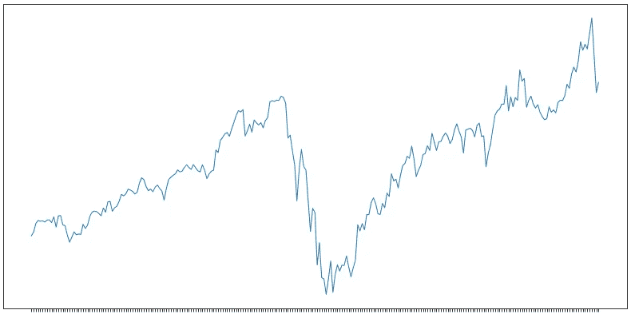
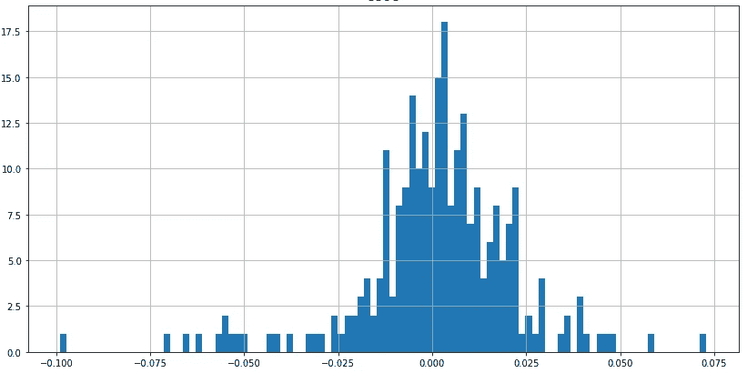
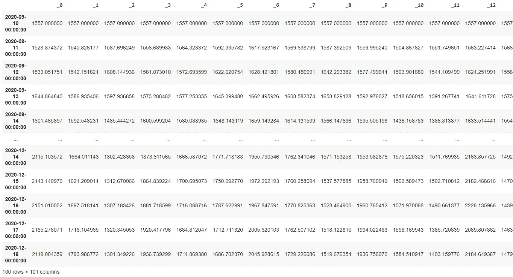
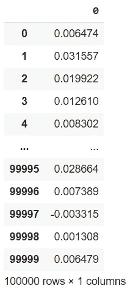
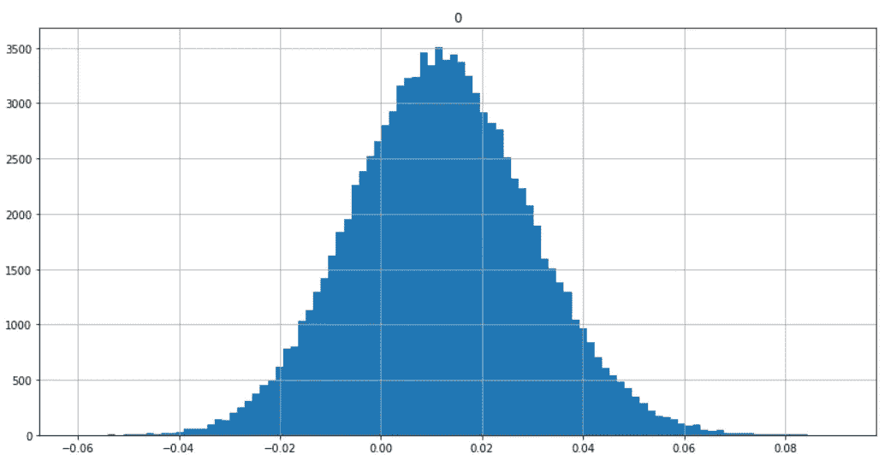
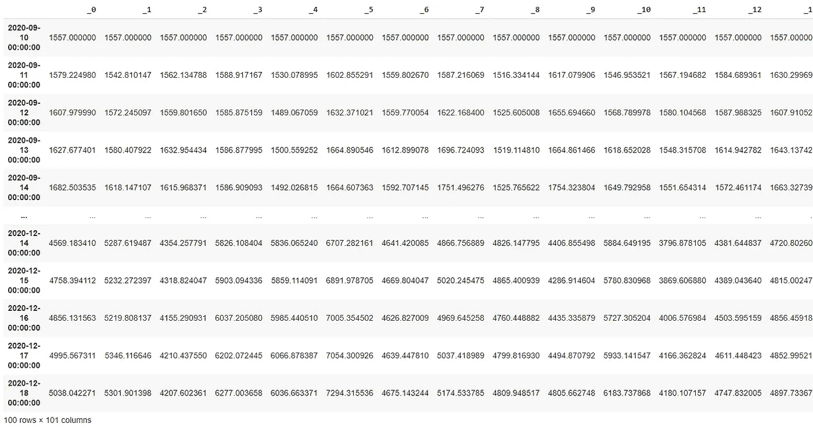
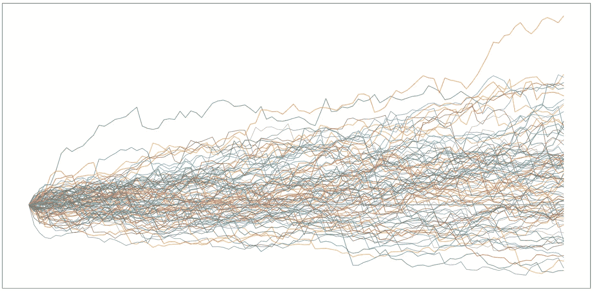
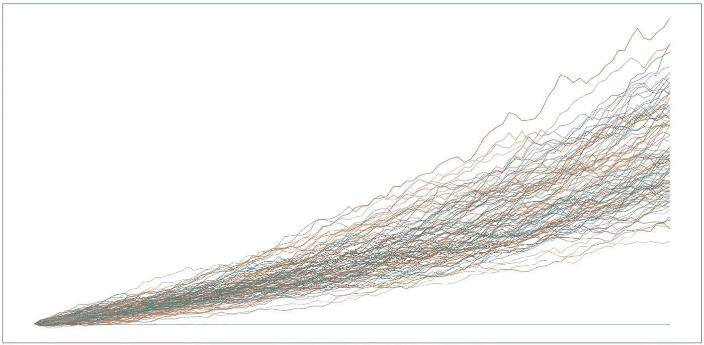

# 谷歌 10，000 蒙特卡洛，发现风险价值

> 原文：<https://pub.towardsai.net/goog-10-000-monte-carlo-discovering-var-value-at-risk-b15325a71262?source=collection_archive---------1----------------------->

## 金融，[概率](https://towardsai.net/p/category/probability)，[编程](https://towardsai.net/p/category/programming)

## 用去年的 APPL 回报率进行数百次模拟，以发现风险价值。全部代码可在我的 Github repo 获得[。](https://github.com/arditoibryan/Projects/tree/master/20200906_GOOG_Monte-Carlo)

在本文中，我将对谷歌股票去年的历史数据的 RoR 执行一个被称为蒙特卡罗模拟的随机过程。在 10，000 次模拟后，我将根据我选择输入的信心水平，估计我在 GOOG 上分配的投资组合有多少处于风险之中。

# 用 Alpha Vantage 下载股票价格

为了下载历史股票价格，我将使用一款名为 Alpha Vantage 的软件。你需要什么:

*   [您的 API 密钥](https://www.alphavantage.co/)
*   运行代码的笔记本(如果您是专家，可以放在本地机器上)

下载限制是可管理的:每分钟 5 个请求，每天 500 个请求。

```
!pip install alpha_vantagefrom alpha_vantage.timeseries import TimeSeries
import pandas as pd#credenziali
def download_stock(tag):
  key = 'your key'
  ts = TimeSeries(key)
  stock, meta = ts.get_daily(symbol=tag, outputsize='full')
  return stock, metaimport timedef get_index(tag):
  df_, _ = download_stock(tag)
  df_ = pd.DataFrame(df_)
  df_ = df_.transpose()
  df_ = df_.loc['2020-09-10':'2019-09-10']
  df_ = df_['1\. open']
  df_ = pd.DataFrame(df_)#extract index and return it as series
  df_ = df_.reset_index()
  return df_['index']#moduli di download
def stock(tag, df_to_add):
  #passimo come df_to_add il database di stock già creato
  try:
    df_, _ = download_stock(tag)
    df_ = pd.DataFrame(df_)
    df_ = df_.transpose()
    df_ = df_.loc['2020-09-10':'2019-09-10']
    df_ = df_['1\. open']
    df_ = pd.DataFrame(df_)
    df_.columns = [tag]
    df_ = df_[tag].values.astype(float)
    df_ = pd.concat([df_to_add, pd.DataFrame(df_)], axis=1)
    return df_, 'Successful'
  except:
    return df_to_add, 'Error'##Stock Downloader#se lo volgiamo in più tranches, invece di utilizzare timers lo spezziamo
tag_list = ['Skip', 'GOOG']#questo scarica il giusto index, OVVERO IL TIMESTAMP
index = get_index(tag_list[1])
index = pd.DataFrame(index) #conta come 1 richiesta
index#csv of remaining stocks
empty = pd.DataFrame()
df, _ = stock(tag_list[0], empty) #solo per la prima si utilizza empty
for k in range(1, len(tag_list)):

  #print stock you are ATTEMPTING to download now
  print('Iteration:', k, 'Trying to download:', tag_list[k])

  #diciamo di aggiungere al database creato il nuovo download
  #se ci sono problemi da None e non viene aggiunto nulla
  df, result = stock(tag_list[k], df)
  print('Iteration:', k, result) #every 4 stock pause 70 seconds
  if k%4 == 0:
    time.sleep(70)#renaming the columns with tag_list
df.columns = tag_list[1:]
dfdf1 = df.copy()#reattach index
total = pd.concat([index, df1], axis=1)
total = total.set_index('index')
totaltotal.to_csv('GOOG.csv')
```

对于本教程，我将只需要 GOOG 股票。当然，我可以对不同的股票进行多次模拟，以模拟投资组合的表现(假设模拟股票之间的相关性保持不变)。

# 准备模拟

下载了 GOOG 股票后。csv 文件，我用熊猫导入。我现在能够利用这些数据进行任何类型的分析。

```
import pandas as pddf = pd.read_csv('/content/drive/My Drive/Colab Notebooks/Projects/20200906_GOOG_Monte_Carlo/GOOG.csv')
df.index = df.pop('index')
df = df.iloc[::-1]
dffrom scipy.stats import skewnorm
import pandas as pd
import numpy as np
import matplotlib.pyplot as plt
```

## 绘图功能

我将创建两个不同的函数:第一个函数允许我将股票绘制成时间序列图(以了解价格变动)，第二个函数检查柱状图中的回报。 **graph_stock** 函数允许我一次绘制多只股票的图形。我将使用这个函数一次绘制不同的模拟图。

```
#graphing timeseries
def graph_stocks(stock):
  #graph all stocks
  plt.figure(figsize=(14, 7))
  for c in stock.columns.values:
    #print(c)
    fig = plt.plot(stock.index, stock[c], lw=1, alpha=1)
  #plt.legend(loc='upper left', fontsize=12)
  #plt.ylabel('price in $') #remove axis labels
  plt.gca().axes.get_yaxis().set_visible(False)def graph_returns(df):
  fig = plt.figure(figsize = (14,7))
  ax = fig.gca()
  df.hist(ax=ax, bins=100)returns = df.pct_change()
returns
```

## 图形结果

在研究蒙特卡洛之前，我只想分析一下我目前持有的谷歌股票:

```
#graphing prices
graph_stocks(df)
```



谷歌的价格，1 年

不仅仅是时间上的价格变动，我更感兴趣的是知道哪些是股票的回报。我将从所有的 RoR(回报率)中随机选取一个来创建一个模拟，而不是在回报分布中生成随机数。

```
#graphing returns
graph_returns(returns)
```



谷歌的回报，1 年

## 创建单个模拟

我将使用下面的函数来创建一只股票的模拟。创建一个模拟只需要三个输入:

*   模拟股票的初始价格
*   天数
*   收益的概率分布函数

有了这些参数，你就可以很好地控制整个模拟，这要归功于 pdf 以及它的方向和波动性。

```
def simulate_stock(initial_price, days, pdf): def create_empty_df(days):
    #creare un empty DataFrame con le date
    empty = pd.Series(
        pd.date_range("2020-09-10", periods=days, freq="D")
    )
    empty = pd.DataFrame(empty)
    #si tagliano ore, minuti, secondi
    empty #si tagliano ore, minuti, secondi
    empty.index = [str(x)[0:empty.shape[0]] for x in     list(empty.pop(0))]
    empty #final dataset con values
    stock = pd.DataFrame([x for x in range(0, empty.shape[0])])
    stock.index = empty.index
    return stock #skeleton
  stock = create_empty_df(100) #initial price
  stock[0][0] = initial_price #create entire stock DataFrame
  for _ in range(1, stock.shape[0]):
    stock.iloc[_] = stock.iloc[_-1]*(1+float(pdf.sample(n=1)))return stock
```

## 创建模拟数据集

使用蒙特卡罗方法的真正价值不在于进行随机模拟，而在于进行成千上万次模拟。使用函数 **create_simulation，**我可以创建任意多的模拟。我将传递 pdf _ probabilty 分布函数作为参数，因为它将被传递给 **simulate_stock** 函数。

```
def create_simulation(n_iter, pdf):
  #create multiple stocks
  stock_list = list()
  column_name = list() for _ in range(n_iter):
    print(_)
    text = '_'
    column_name.append(text + str(_))
    stock_list.append(simulate_stock(df.iloc[252][0], 252, pdf)) #join the stocks together
  stock = pd.concat([x for x in stock_list], axis=1)
  stock.columns = column_name
  stock
```

在同一个数据集中，我将添加一个基准:一只股票的初始价格在其整个生命周期中保持不变(绘制时是一条水平线)。我将用它作为其他股票的比较。

```
 #adding benchmark
  stock['benchmark'] = df.iloc[252][0]
  return stock
```

# 具有可用回报的蒙特卡洛

为了模拟每个分布，我将使用 GOOG 股票去年的 RoR 回报率。这将作为我的 pdf _ 概率分布函数。**我将简单地从分布中选取随机值，而不是使用 GOOG 股票参数(均值、标准差、alpha)** 重新创建高斯函数。此外，这是一种有效的概率方法。我将进一步解释我为什么做这个决定。


谷歌的回报，1 年

因为我已经准备好了函数，所以我将简单地调用 **create_simulation** 函数来创建 n 个模拟。在这种情况下，如果您查看 **create_simulation** 函数的参数:

*   100 代表我希望在数据集+ 1 基准中的模拟总数
*   概率分布函数是 GOOG 的回报，我会从中随机挑选

```
returns['GOOG'].dropna().sample(n=1)[0]simulation_real = create_simulation(100, returns['GOOG'].dropna())
simulation_real
```



已创建的数据集的快照

# 重建正态分布的蒙特卡罗

对于实验的第二部分，我将使用 GOOG 股票参数(均值、标准差、阿尔法)重新创建一个数学上完美的分布，而不是从 GOOG 股票的 RoR 中挑选。然后，我将从这个分布中挑选回报率，看看蒙特卡罗与之前的实验有何不同。

```
mean = returns['GOOG'].mean()
sd = returns['GOOG'].std()
alfa = returns['GOOG'].skew()print(mean, sd, alfa)#simulated probability distribution of one stock
from scipy.stats import skewnorm
import matplotlib.pyplot as plt
sd, mean, alfa = sd, mean, alfa#invertire il segno di alfa
x = skewnorm.rvs(-alfa, size=100000) 
def calc(k, sd, mean):
  return (k*sd)+mean
x = calc(x, sd, mean) #standard distribution
x = pd.DataFrame(x)
x
```

用这段代码，我创建了一个 GOOG 股票的模拟 RoR 发行版。我用了 10 万个样本:



模拟正态分布数据集

```
graph_returns(x)
```



模拟谷歌股票 RoR pdf 我刚刚创建

```
#pick one random number from the distribution
#formally I would use cdf, but I just have to pick randomly from the 1000000 samples
float(x[0].sample(n=1))simulation_gen = create_simulation(100, x[0])
simulation_gen
```

我将遵循第一次实验的相同步骤。我将创建 100 个蒙特卡洛模拟，并将使用 x[0]作为 pdf，软件将从中随机选择 RoR。



已创建的数据集的快照

# 比较结果

```
graph_stocks(simulation_real)
```



使用 GOOG 股票的 RoR 进行模拟

```
graph_stocks(simulation_gen)
```



使用正态分布中再现的 RoR 进行模拟

结果很有趣。虽然第一个实验通过模拟完美分布产生了一组非常现实的场景，但总是有正的股票(这是完全不现实的)。我只能用第一组模拟的数据作为有效数据。

# 定义变量

为了找到风险 VaR 值，或者我确信在一定程度上我会损失的整个投资组合的最大百分比，我将使用收益总体的百分位数。

```
import numpy as npprint('VaR')#VaR at 90%
price = np.quantile(sorted(simulation_real.loc['2020-12-18 00:00:00']), 1-.90)
print('.90:', (price/1557)-1)#VaR at 95%
price = np.quantile(sorted(simulation_real.loc['2020-12-18 00:00:00']), 1-.95)
print('.95:', (price/1557)-1)#VaR at 99%
price = np.quantile(sorted(simulation_real.loc['2020-12-18 00:00:00']), 1-.99)
print('.99:', (price/1557)-1)
```

例如，我有 90%的信心，我可以在 100 天内损失最多 16%的股票。

```
VaR 
.90: -0.16419445994801085 
.95: -0.19257895372980727 
.99: -0.3062363704067327
```