# 用于图像分类的谷歌自动视觉

> 原文：<https://pub.towardsai.net/google-automl-vision-for-image-classification-503267be6ccd?source=collection_archive---------2----------------------->

## [机器学习](https://towardsai.net/p/category/machine-learning)

## 训练一个定制的机器学习模型来分类图像，然后将其部署到云或边缘

使用 Canva 制作

> 谷歌的 AutoML 让你不用编码就能训练定制的机器学习模型

训练高性能的深度网络通常是一项艰巨的任务，尤其是对于那些在深度学习或人工智能方面经验较少的人来说。此外，除了 RAM 和 CPU，我们可能还需要 GPU。我在尝试与 CNN 分类时经历了很多问题。

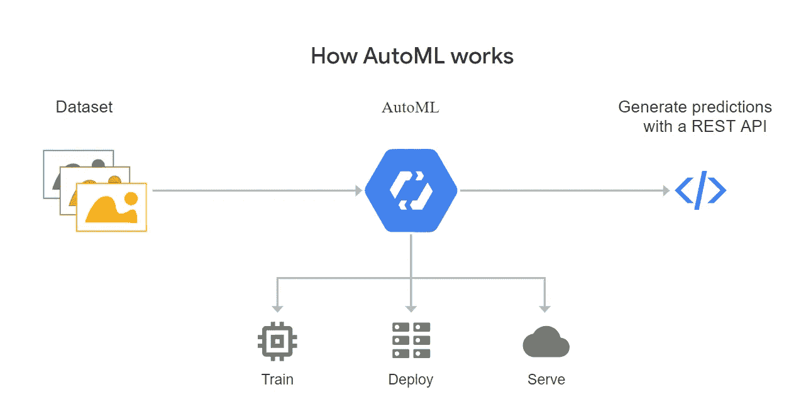

AutoML 如何工作

如果我说谷歌自动视觉将解决我们的问题呢？是的，AutoML Vision 使我们能够训练定制的机器学习模型，根据我们自己定义的标签对我们的图像进行分类。它将从标记的图像中训练模型，并评估性能。它不需要用户有任何深度学习或人工智能的知识，你需要的只是标记的数据！它将为我们训练、部署和服务应用程序。

在本文中，我将向您展示如何使用 Google AutoML 进行面部表情识别。

这是开始的好时机。(使用 Canva 设计)

> 你兴奋吗？趁还不算太晚，让我们深潜吧！

## 准备带标签的数据集

面部表情识别(使用 Canva 设计)

面部表情中的数据来自各种来源，包括

*   [日本女性面部表情(JAFFE)数据库](http://www.kasrl.org/jaffe.html)
*   [印度电影人脸数据库(IMFDB)](http://cvit.iiit.ac.in/projects/IMFDB/)
*   [扩展的耶鲁人脸数据库 B](http://vision.ucsd.edu/~iskwak/ExtYaleDatabase/ExtYaleB.html)

我下载了一个 CSV 文件，这是一个数据集，由 [Kaggle](https://www.kaggle.com/c/challenges-in-representation-learning-facial-expression-recognition-challenge/data) 提供的训练和测试图像的像素组成。

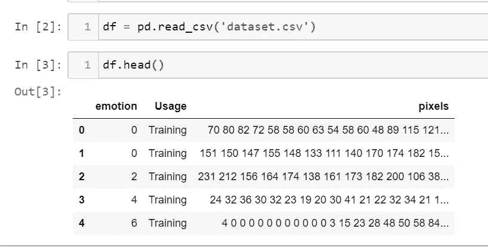

包含像素值的数据框(作者提供的照片)

现在我们有了一个图像的像素及其相应标签的数据帧(0 =生气，1 =厌恶，2 =恐惧，3 =快乐，4 =悲伤，5 =惊讶，6 =中性)。我们需要从这些像素值中获取图像，并将每个标签组织到一个单独的文件夹中。

像素到图像的转换—数据组织

组织好图像后，您可以计算每个标签中的图像数量。为了获得更好的结果，请确保数据集是平衡的，每个标注都有相似数量的图像(至少数量不应变化太大)。

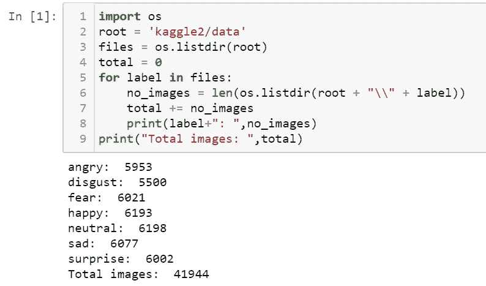

平衡数据(作者照片)

在图像被完美地组织起来之后，你的数据集文件夹看起来就像这样，

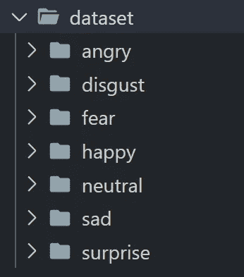

带标签的数据集(作者照片)

**在您可以使用云视觉 API 之前，您必须为您的项目启用它:**

> 谷歌为新客户提供 300 美元积分，以便免费开始使用谷歌云平台。如果你没有使用免费层，谷歌为你创建的每一个资源收费。

1.  登录您的**谷歌**账户。
2.  在云控制台的项目选择器页面上，选择或创建云项目。
3.  确保你的**谷歌**云项目启用了计费。
4.  启用云**视觉** API。
5.  设置身份验证。

如需更多信息，请点击此处的[。](https://cloud.google.com/vision/docs/before-you-begin)

## 创建新数据集

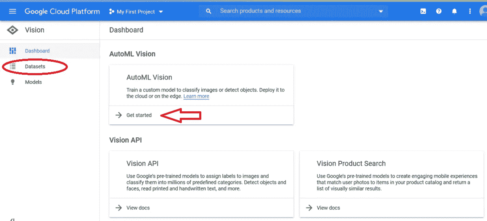

视觉(作者供图)

初始设置后，您可以看到如上所示的视觉仪表板。现在点击**开始。**

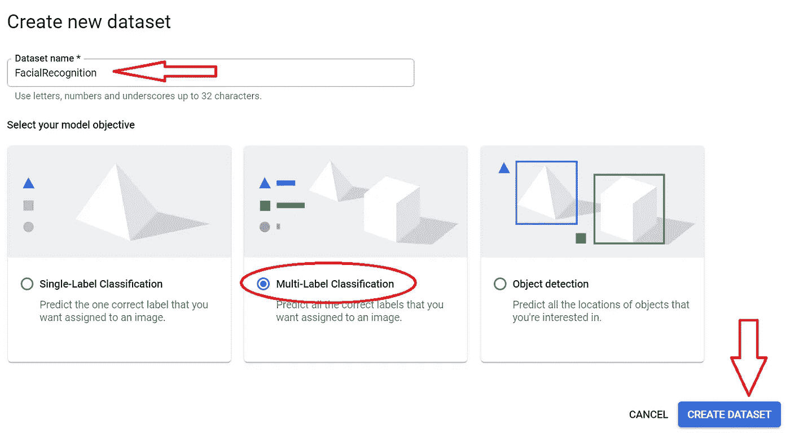

创建新数据集(作者照片)

您将被重定向到控制台以创建新数据集。为其命名，选择您的模型目标，并点击**创建数据集。**

## 导入数据集

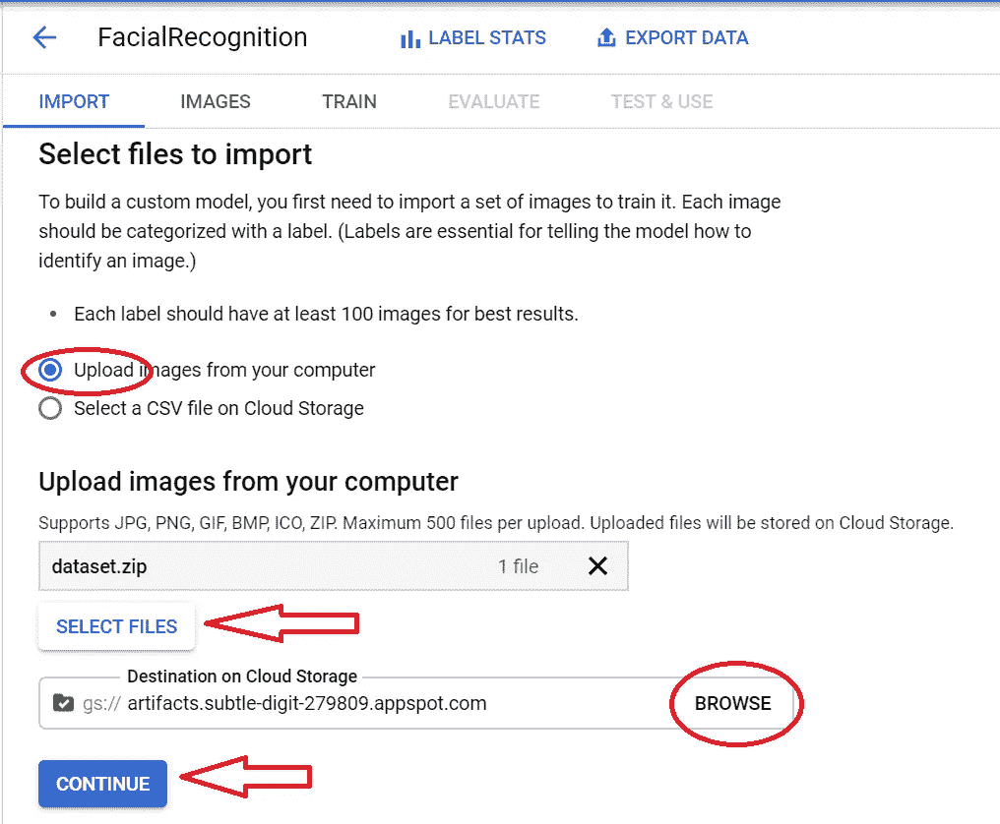

导入数据集(作者照片)

现在，点击**选择文件，上传数据集 zip 文件。**浏览云存储上的目的地，即存储数据集的桶的路径。点击**继续。**我们还可以导入带有图片链接的 CSV 文件。导入数据集需要一些时间。

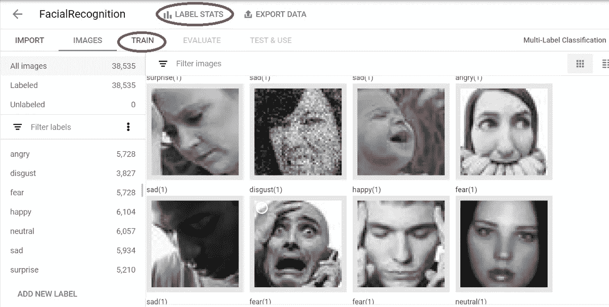

导入的图像(作者提供的照片)

导入数据集后，您可以检查每个标签中的图像数量。我们可以在这里添加新标签，删除任何图像。你可以看到图片总数是 38，535。但是我们的初始数据集包含 41，944 个样本，这是因为一些图像将被 AutoML 默认丢弃(错误:标签已经是地面事实)。

点击**标签统计，**查看用于训练、验证和测试的图像数量。

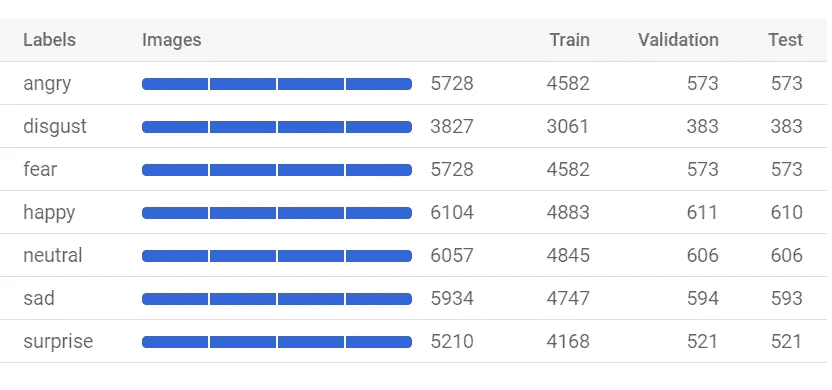

数据集分割(作者照片)

## 训练模型

现在，我们已经将带标签的数据集导入到 google cloud 中。我们可以通过选择**开始训练来训练模型。**

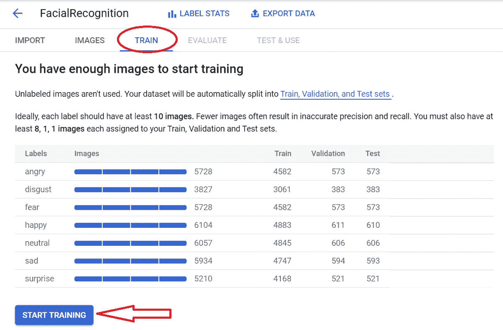

训练模型(作者供图)

现在会出现一个控制台来训练模型，

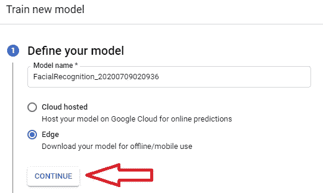

定义模型(作者照片)

为模型命名并选择 Edge 以下载模型文件供以后使用。此外，如果您想在 Google cloud 上托管模型，可以选择**云托管**。点击**继续。**

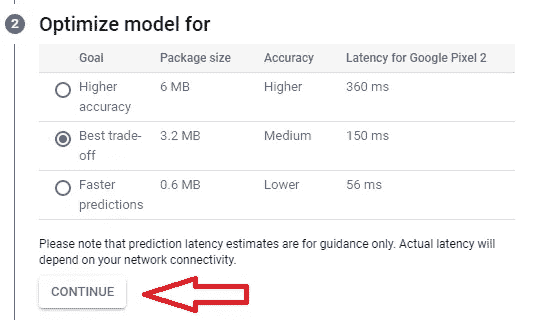

优化模型(作者照片)

在定义模型之后，我们需要通过在包大小(模型文件)、响应时间、准确性之间进行权衡来优化它。选择您的应用所需的选项，然后点击**继续。**

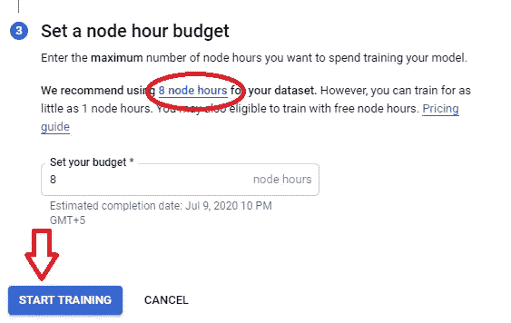

设置节点小时预算(作者供图)

最后一步，我们需要设定预算。AutoML 将推荐训练模型所需的节点数。但是，您可以减少或增加节点小时数。(**注:**节点小时成本越高)。点击**开始训练。**培训可能需要几个小时，培训结束后您会收到一封电子邮件。

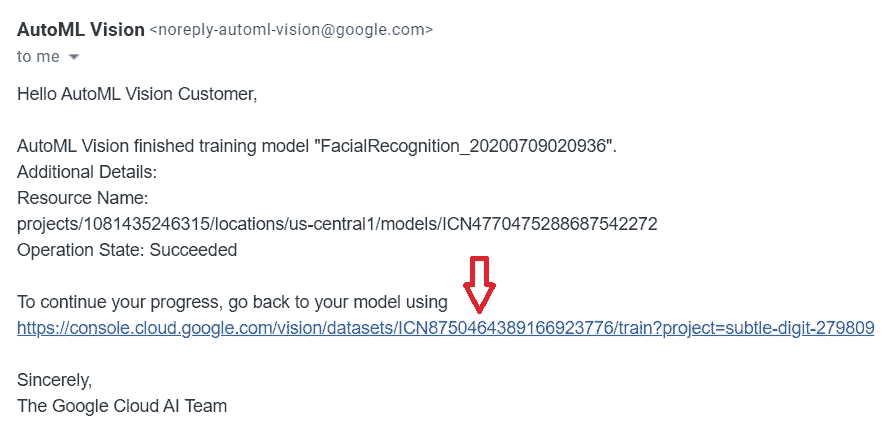

模型训练完毕(作者供图)

点击链接开始使用您的模型。

## 评估模型

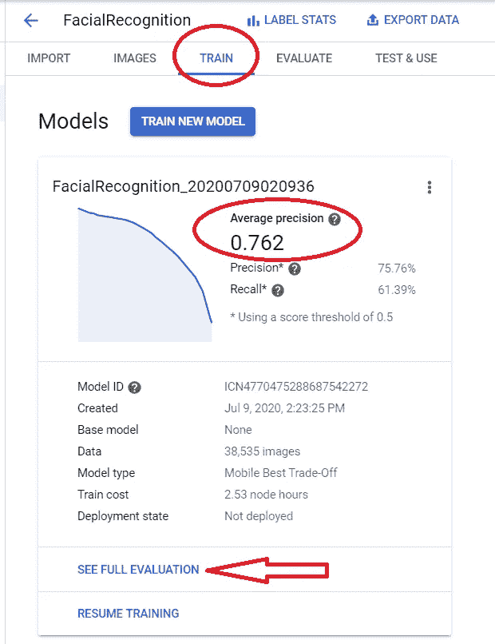

模型评估(作者供图)

训练完成后，我们可以检查模型的详细信息，即用于训练的样本(图像)数量、训练所用的时间、精确度、召回率等。点击**查看完整评估。**

> 平均精度为 76%

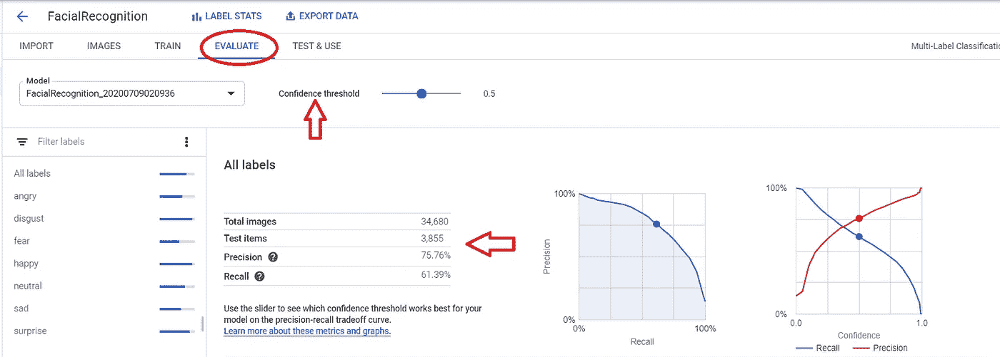

对模型的全面评估(作者照片)

我们可以看到用于测试的图像数量，即 3，855。这里我们可以改变置信度阈值(初始设置为 0.5)并检查变化。

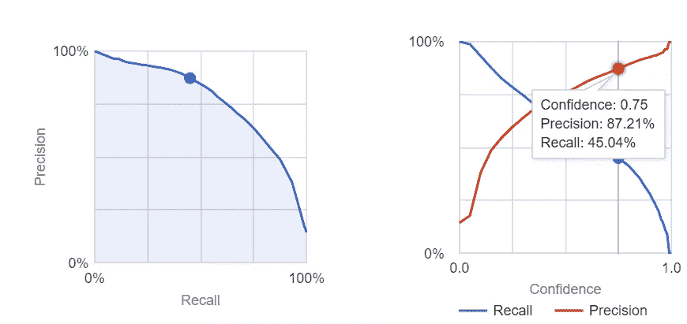

置信阈值的变化(作者提供照片)

上述图表是在阈值设置为 0.75 时获得的。观察到精度值增加(即，低假阳性**率)**但召回率降低。

为了简单起见，我将置信度阈值保持为 0.5

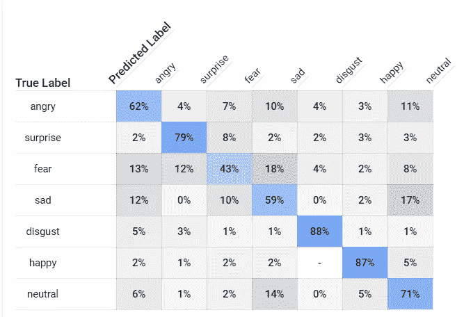

困惑矩阵(作者供图)

还提供了混淆矩阵。此表显示了模型对每个标签进行正确分类的频率(蓝色)，以及哪些标签最常与该标签混淆(灰色)。我们可以下载整个混淆矩阵作为一个 CSV 文件。

## 测试和使用模型

从收集、组织、导入数据集、训练数据集到完成评估，我们已经走了很长的路，现在最后一部分是在我们的应用程序中使用，这也非常简单。

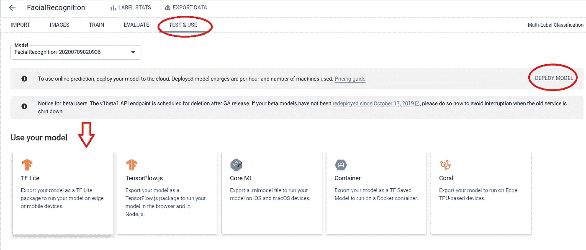

测试和使用(作者照片)

通过选择右上方的**部署模型**，我们可以将模型部署在 Google Cloud 上进行在线预测，这又要花费我们很多钱。

> Google Cloud AutoML 为我们提供了使用模型的各种方法。例如，我们可以将模型导出到 Docker 容器上运行，或者在 iOS 和 macOS 设备上进行调优，或者在浏览器中运行模型。

我想将模型导出为 TF Lite 包，以便在移动设备上运行。点击图标 **TF Lite** 。

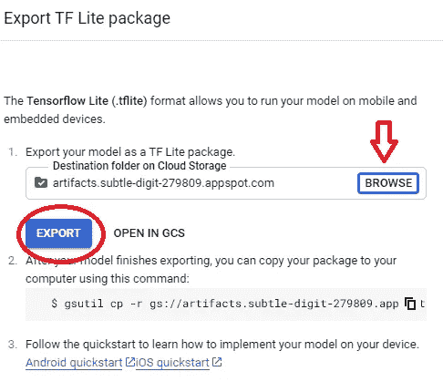

导出 TF Lite 包(作者提供照片)

浏览云存储上的路径/目标文件夹以存储`tflite`包。

点击**导出。**转到路径并下载文件。

## 使用 TF Lite 包

下载完`tflite`模型文件后，我们就可以用 TensorFlow 进行预测了。

分类(作者照片)

实现，

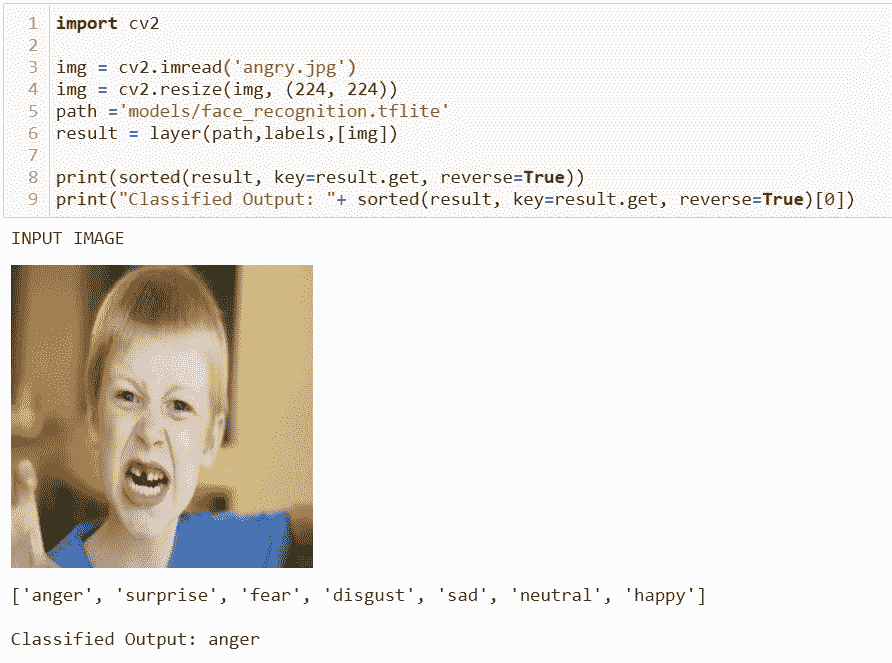

图片分类(作者图片)

使用 TF Lite 包很简单，通过在设计 API 或 Flask 中使用该函数，Django Server one 可以找到许多应用程序。

使用 AutoML，可以设计定制的机器学习流水线，它具有各种好处。人们可以通过自动化任何重复的 ML 相关任务来提高数据专家的生产力，并帮助他们专注于其他问题。它还减少了 ML 模型中主要由人工步骤引起的人为错误。

使用 AutoML，远离人为错误(使用 Canva)

我用 AutoML 开发了一个生成迷因的应用程序。你可以在这里查看[。](https://github.com/developers-cosmos/Meme-Generator)

## 结论

我们已经看到了如何使用 Google Cloud AutoML 来训练定制的机器学习模型，以及如何使用工件进行进一步的部署(tflite 包)。

如果你有什么建议，我很乐意听听。我很快会带着另一个有趣的话题回来。在那之前，呆在家里，保持安全，继续探索！

如果您想联系，**请在** [**LinkedIn**](https://www.linkedin.com/in/ritheesh-baradwaj-yellenki-8a6988173/) **上联系我。**