# 使用 Python 的 Google Colab 101 教程—提示、技巧和常见问题

> 原文：<https://pub.towardsai.net/google-colab-101-tutorial-with-python-tips-tricks-and-faq-7689bd4d24b4?source=collection_archive---------0----------------------->

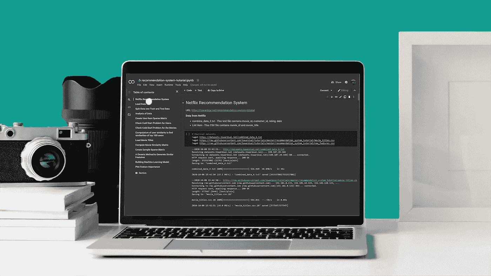

来源:由 [Bongkarn Thanyakij](https://www.pexels.com/@bongkarn-thanyakij-683719) 在[像素](https://www.pexels.com/photo/silver-laptop-beside-analog-camera-and-camera-lens-3759108/)上从原始数据衍生而来

## [编程](https://towardsai.net/p/category/programming)、[编辑](https://towardsai.net/p/category/editorial)、[教程](https://towardsai.net/p/category/tutorial)

## 关于如何将 Google Colab 与 Python 结合使用的深入教程，以及 Colab 的技巧、诀窍和常见问题

最后更新，2021 年 1 月 8 日

**作者:**萨妮娅·帕维斯，[罗伯托·伊里翁多](https://mktg.best/vguzs)

[](https://members.towardsai.net/) [## 加入我们吧↓ |面向人工智能成员|数据驱动的社区

### 加入人工智能，成为会员，你将不仅支持人工智能，但你将有机会…

members.towardsai.net](https://members.towardsai.net/) 

**本教程的代码可在**[**Github**](https://github.com/towardsai/tutorials/tree/master/google_colab_tutorial)**上获得，其完整实现也可在**[**Google Colab**](https://colab.research.google.com/drive/1ymIYzFg4Q7iBjnTut31aBqPHgOpkjHYD?usp=sharing)**上获得。**

## 目录

1.  [简介](#1257)
2.  我们为什么使用谷歌 Colab？
3.  [启动 Google Colab](#5f77)
4.  [从 Github 上传笔记本](#3714)
5.  [从 Kaggle 上传数据](#21db)
6.  [从 Google Drive 读取文件](#b753)
7.  [为运行时设置硬件加速器 GPU](#e1e6)
8.  [克隆一个 GitHub 库到 Google Drive](#023e)
9.  [Colab 魔法](#f6bf)
10.  [绘图](#ab84)
11.  [Google Colab 中的 TPU(张量处理单元)](#1a56)
12.  [结论](#007a)

> 📚查看我们对[最佳机器学习书籍](https://towardsai.net/p/machine-learning/best-machine-learning-books-free-and-paid-ml-book-recommendations-40c9ab30b0c)的编辑推荐。📚

# 介绍

Google Colab 是 Google Research 的一个项目，这是一个免费的基于 Jupyter 的环境，允许我们创建 Jupyter[编程]笔记本，以在 web 浏览器中编写和执行 Python [ [1](https://colab.research.google.com/) ](以及其他基于 Python 的第三方工具和 [**机器学习**](https://mld.ai/mldcmu) 框架，如 **Pandas、PyTorch、Tensorflow、Keras、Monk、OpenCV** 等)。

编程笔记本是一种文字处理器形式的外壳或内核，我们可以在其中编写和执行代码。在 Google Colab 中处理所需的数据可以安装到 Google Drive 中，也可以从互联网上的任何来源导入。Project Jupyter 是一个开源软件组织，为交互式计算开发和支持 Jupyter 笔记本电脑。

Google Colab 不需要任何配置就可以开始使用，并且**提供对 GPU 的免费访问**。Google Colab 的主要功能之一是，它允许任何人与他人共享实时代码、数学方程、数据可视化、数据处理(清理和转换)、数值模拟、机器学习模型和许多其他项目。

# 我们为什么使用 Google Colab？

Google Colab 具有独特而关键的特性:

*   它提供了一个免费的 Jupyter 笔记本环境。
*   它带有预安装的软件包。
*   它完全托管在谷歌云上。
*   用户不需要在服务器或工作站上设置。
*   笔记本会自动保存在用户的谷歌硬盘上。
*   它提供基于浏览器的 Jupyter 笔记本。
*   它是完全免费的，并提供 GPU 和 TPU 功能(除非你需要更多的资源，并决定使用 [**Colab Pro**](https://mktg.best/5o4zj) )。
*   它支持 Python 版本 2 和 3(然而，谷歌建议将重要的笔记本迁移到 Python 3[[2](https://research.google.com/colaboratory/faq.html#python-2-deprecation)][[5](https://research.google.com/colaboratory/faq.html)])。
*   它提供了两个硬件加速器:
    1。图形处理器。
    2。TPU(张量处理单元)。

# 启动 Google Colab

使用 Colab 可以直接在 web 浏览器上执行 Python 代码。我们可以通过下面的 URL 启动它:

[](https://mktg.best/d7b6u) [## 谷歌联合实验室

### 编辑描述

colab.research.google.com](https://mktg.best/d7b6u) 

启动窗口打开时会弹出一个窗口，提供许多功能:

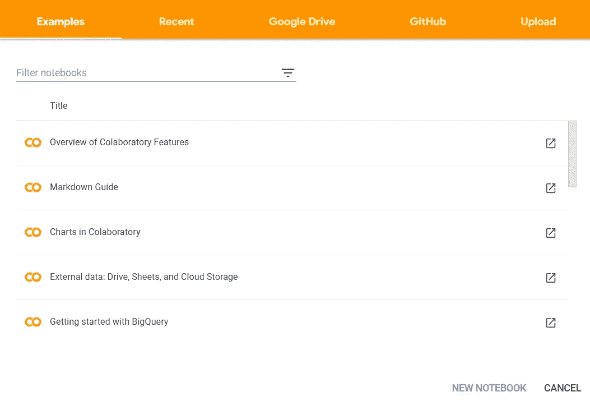

图 Google Colab 的起始页截图。

它提供了创建笔记本以及上传和选择不同来源的选项，例如:

*   开源代码库
*   Google Drive
*   本地计算机

# 从 GitHub 上传笔记本

Python 代码可以通过使用其项目的 URL 或者通过搜索组织或用户直接从 Github 上传。以下步骤强调了如何使用 Github URL 上传项目:

*   推出 Google Colab。
*   从弹出框中选择 GitHub 选项卡。

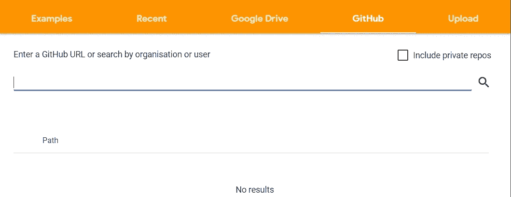

图 Google Colab 使用 Github URL 上传代码的截图。

*   输入 GitHub 的项目 URL 并搜索它以获取代码

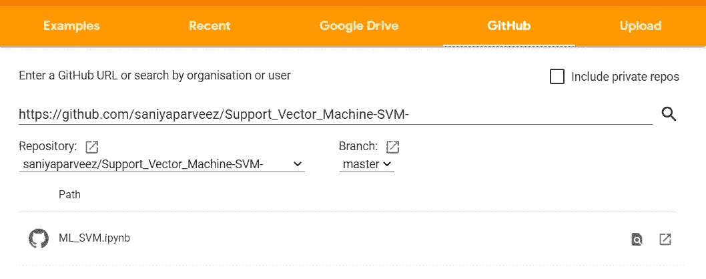

图 3:显示如何用 Google Colab 上传 Github 存储库的截图。

*   它会一键将完整的代码上传到 Google Colab 笔记本。

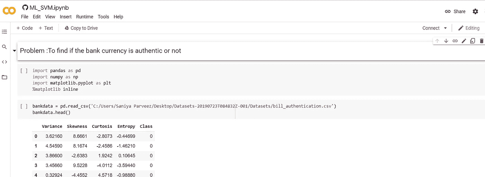

图 4:显示使用 URL 上传 Github 存储库的屏幕截图。

类似地，通过按名称、日期、所有者或修改日期过滤保存的笔记本，可以直接从 Google Drive 上传代码。

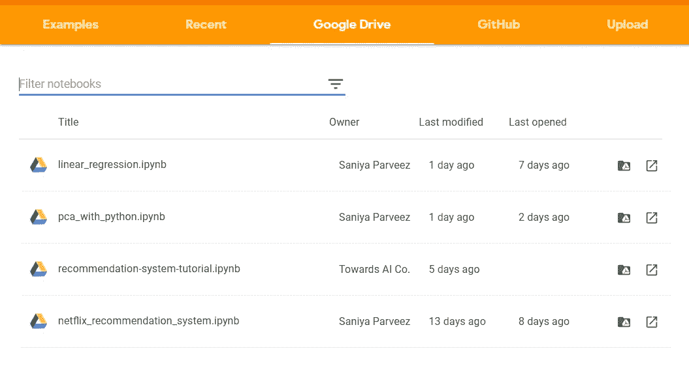

图 5:显示如何将笔记本从 Google Drive 直接上传到 Google Colab 的截图。

# 从 Kaggle 上传数据

Kaggle 的数据可以直接上传到 Colab 进行处理。需要来自 Kaggle 的 API 令牌来完成数据导入。

**从 Kaggle 生成 API 令牌的步骤**

*   打开[T3 和](https://mktg.best/purlg)
*   转到“我的帐户”
*   向下滚动到“API”部分

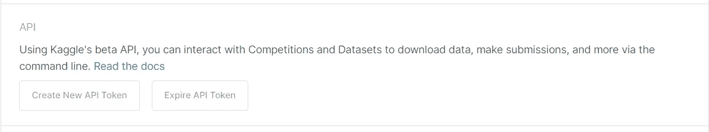

图 6:显示 API 部分的 Kaggle 网站截图。

*   如果需要，单击“过期 API 令牌”删除以前的令牌。
*   点击“创建新的 API 令牌”它将生成一个新的令牌并下载一个名为" **kaggle.json** 的 JSON 文件
*   “kaggle.json”文件包含用户名和密钥，如下所示:

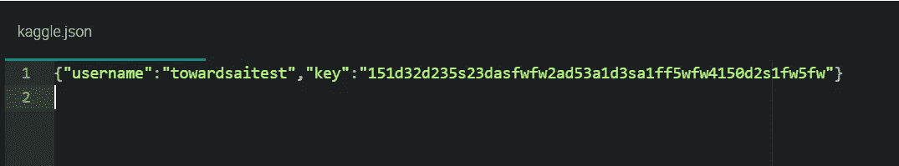

图 IDE 截图显示了 Kaggle 的测试 API 键。

**从 Kaggle 上传数据的步骤**

在本地计算机上保存“kaggle.json”文件。

安装 Kaggle 包

```
!pip install -q kaggle
```

导入包:

```
from google.colab import files
```

上传本地文件“kaggle.json”

```
files.upload()
```


图 8:上传文件“kaggle.json”的输出截图

检查 Colab 笔记本是否与 Kaggle 正确连接。

```
!kaggle datasets list
```

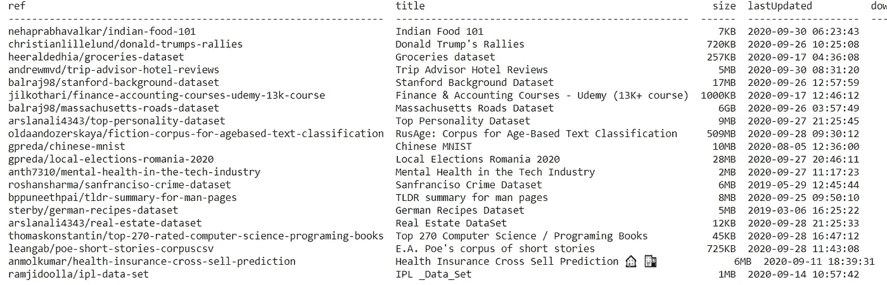

图 9:显示 Kaggle 数据集列表的屏幕截图。

从 Kaggle 下载任何竞争数据(即竞争名称—预测未来销售)

```
!kaggle competitions download -c competitive-data-science-predict-future-sales
```

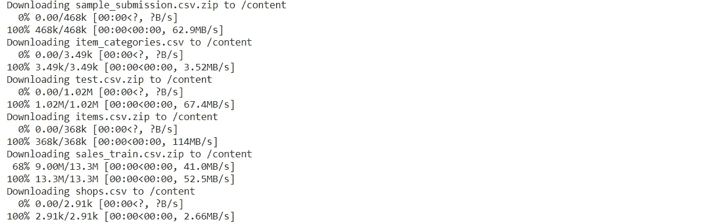

图 10:显示 Kaggle 数据下载输出的屏幕截图。

来自 Kaggle 的数据将被下载并上传到 Colab，例如:

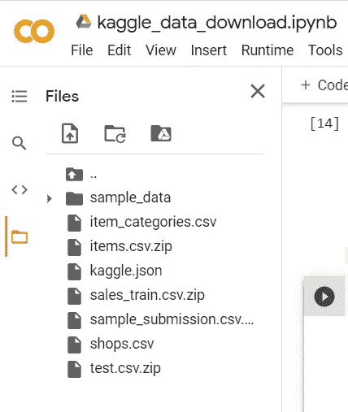

图 11:Google Colab 的截屏显示了从 Kaggle 上传的数据。

# 从 Google Drive 读取文件

Google Colab 也提供了从 google drive 读取数据的功能。

导入包

```
import globimport pandas as pdfrom google.colab import drive
```

安装 Google Drive

```
drive.mount('/gdrive')
```

这将要求谷歌驱动授权代码。

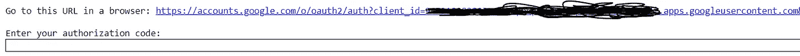

图 12:显示 Google Colab 要求您插入 Google Drive 的授权代码的屏幕截图。

授权码的输入框

点击链接并生成授权码。

从驱动器中读取 CSV 文件。

```
file_path = glob.glob("/gdrive/My Drive/***.csv")for file in file_path:
    df = pd.read_csv(file)
    print(df)
```

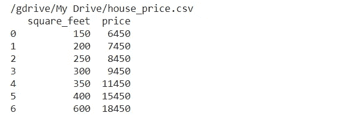

图 13:Google Drive 上的测试 CSV 文件的输出。

# 为运行时设置硬件加速器 GPU

Google Colab 提供免费的云服务，带有 GPU 硬件加速器。高配置 GPU 机器非常昂贵，在机器学习和深度学习中需要同时处理多个计算。

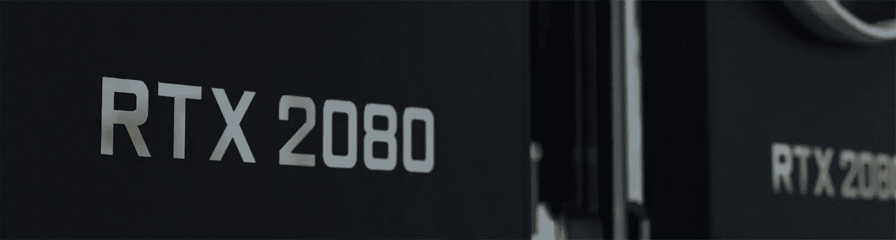

来源:[娜娜杜瓦](https://www.pexels.com/@nanadua11)上[像素](https://www.pexels.com/photo/internet-technology-computer-business-4581816/)

## 机器学习或者深度学习为什么需要 GPU？

如今，由于计算密集型工作负载和流内存模型的优化能力，GPU 在机器学习和深度学习中占据主导地位。

GPU 通过并行性提供出色的性能，可以在一次调用中启动数百万个线程。尽管与 CPU 相比，GPU 的时钟速度可能较低，并且没有众核管理功能，但它们的性能却比 CPU 好得多。

## 在 Colab 中设置硬件加速器 GPU

设置 GPU 的步骤:

*   转到运行时→更改运行时类型。
*   从弹出菜单中选择**GPU**

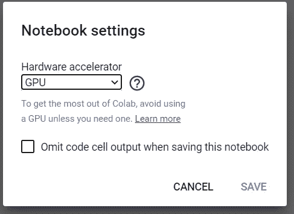

图 14:GPU 的加速器选择截图。

**在 Colab 中查看关于 GPU 的详细信息。**

导入重要的包

```
import tensorflow as tffrom tensorflow.python.client import device_lib
```

检查 GPU 加速器

```
tf.test.gpu_device_name()
```


图 15:Google Colab 中 GPU 的加速器截图。

检查用于 GPU 的硬件。

```
device_lib.list_local_devices()
```

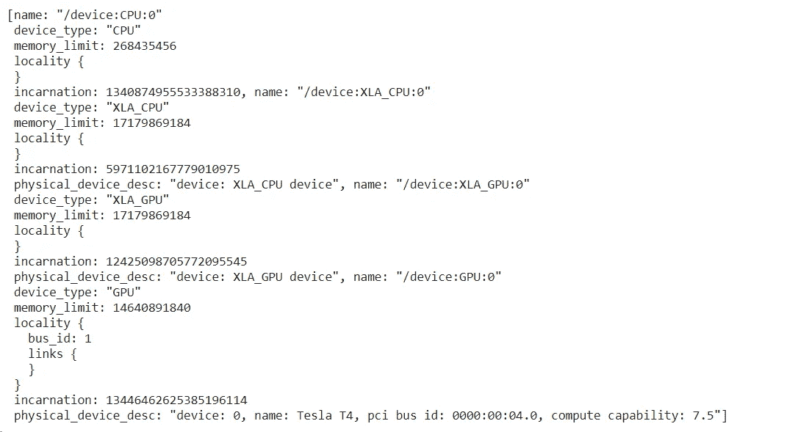

图 16:展示我们会话中关于 GPU 细节的屏幕截图。

## 使用 GPU 的代码示例

在运行时不选择 GPU 的情况下，检查可用 GPU 的数量。保持设置为“**无**”

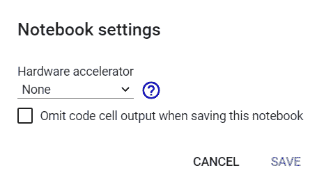

图 17:硬件加速器设置为无。

```
import tensorflow as tfno_of_gpu = len(tf.config.experimental.list_physical_devices('GPU'))print("Total GPUS: ", no_of_gpu)
```

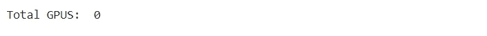

图 18:硬件加速器是 None，所以 GPU 的值是 0。

在运行时选择**硬件加速器**到 GPU。

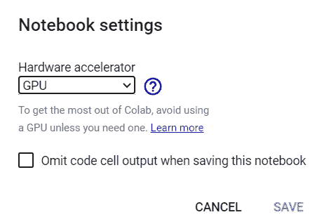

图 19:设置为 GPU 的硬件加速器截图。

```
import tensorflow as tfno_of_gpu =len(tf.config.experimental.list_physical_devices('GPU'))print("Total GPUS: ", no_of_gpu)
```


图 20:硬件加速器是 GPU，所以 GPU 的值是 1。

在 GPU 上乘以张量:

```
try:
    with tf.device('/device:GPU:1'):
        tensor1 = tf.constant([[1.0, 2.0, 3.0], [4.0, 5.0, 6.0]])
        tensor2 = tf.constant([[1.0, 2.0], [3.0, 4.0], [5.0, 6.0]])
        result = tf.matmul(tensor1, tensor2)
        print(result)
except RuntimeError as exception:
    print(exception)
```

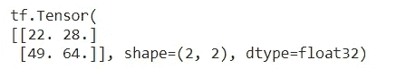

图 21:张量乘法结果。

# 将 GitHub 存储库克隆到 Google Drive

GitHub 存储库代码可以被克隆并存储到本地 Google Drive 中。

将 GitHub 存储库克隆到 Google Drive 的步骤:

*   安装 Google Drive。

```
from google.colab import drive
drive.mount('/content/gdrive')
```


图 22: Google Drive 成功安装在 Google Colab 中。

*   进入 Google drive，创建一个名为“project”的目录。

```
%cd gdrive/My Drive/mkdir project%cd project/
```


图 23:进入项目目录。

*   克隆存储库，即:

```
!git clone [https://github.com/saniyaparveez/youtube_video_type_prediction.git](https://github.com/saniyaparveez/youtube_video_type_prediction.git)
```

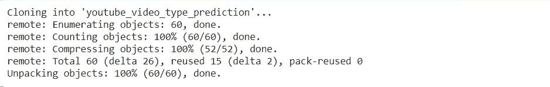

图 24:显示如何克隆 Github 存储库的屏幕截图。

*   检查克隆的项目。

```
!ls
```


图 25:克隆的项目。

# 科拉布魔法

Colab 提供了一些有趣的惊人技巧。简而言之，它提供了多个提供快速操作的命令。这些命令带有%前缀。

**列出所有魔法命令**

```
%lsmagic
```

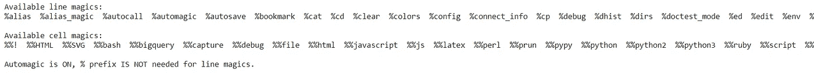

图 26:Google Colab 所有神奇命令的列表。

**列出本地目录**

```
%ldir
```


图 27:本地目录列表。

**获取笔记本历史记录**

```
%history
```

**CPU 时间**

```
%time
```

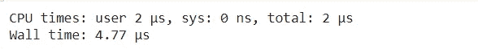

图 28: CPU 和墙时间。

**这个系统运行了多久？**

```
!uptime
```

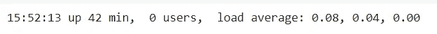

图 29:显示系统正常运行时间。

**显示可用和已用内存**

```
!free -hprint("-"*100)
```


图 30:显示可用和已用内存。

**显示 CPU 规格**

```
!lscpuprint("-"*70)
```

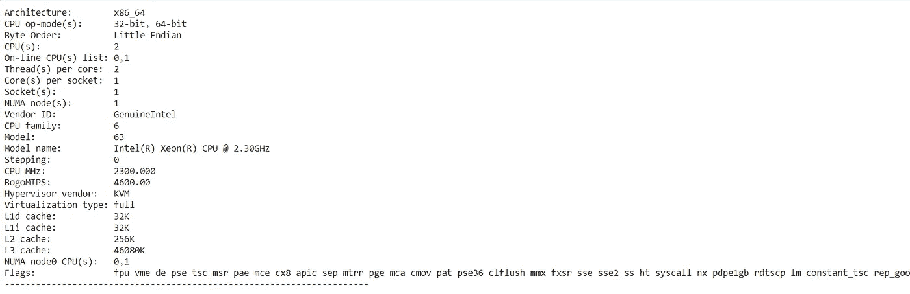

图 31:显示 CPU 规格。

**列出所有正在运行的虚拟机进程。**

```
%%shecho "List all running VM processes."ps -efecho "Done"
```


图 32:显示所有正在运行的虚拟机进程。

**嵌入 HTML 文本**

```
%%html<marquee>Towards AI is a great publication platform</marquee>
```

**设计 HTML 表单**

```
#@title Personal Details#@markdown Information.Name = 'Peter' #@param {type: "string"}Age = 25  #@param {type: "slider", min: 1, max: 100}zip = 1234  #@param {type: "number"}Date = '2020-01-26'  #@param {type: "date"}Gender = "Male"  #@param ['Male', 'Female', 'Other']#@markdown ---print("Submitting the form")print(string_type, slider_value, number, date, pick_me)print("Submitted")
```


图 33:在 Google Colab 中生成表单。


图 34:单元执行输出。

# 测绘

Google Colab 也可以用于数据可视化。以下代码和图形显示了一个包含多个多项式的图， **Y = X +X +X** [ [3](https://towardsai.net/p/machine-learning/machine-learning-algorithms-for-beginners-with-python-code-examples-ml-19c6afd60daa) ]。

```
x = np.arange(-10,10)y = np.power(x,3)y1 = np.power(x,3) + np.power(x,2) + xplt.scatter(x,y1,c="red")plt.scatter(x,y)
```

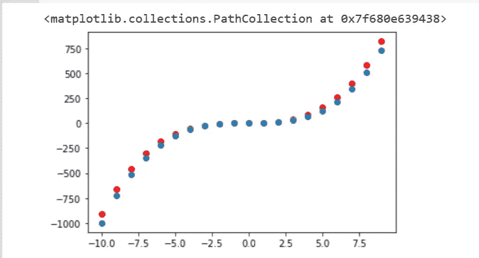

图 35:显示多个多项式的图形。

以下代码和地图用于绘制热图。

```
import matplotlib.pyplot as pltimport numpy as npimport seaborn as snslength = 10data = 5 + np.random.randn(length, length)data += np.arange(length)data += np.reshape(np.arange(length), (length, 1))sns.heatmap(data)plt.show()
```

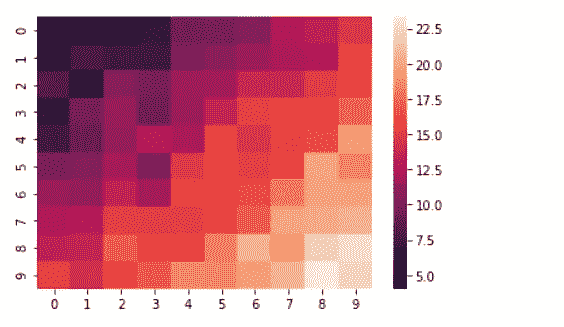

图 36:热图。

# 谷歌实验室中的 TPU(张量处理单元)

我们使用张量处理单元(TPU)在张量流图上加速。它们是专门为神经网络机器设计的人工智能加速器应用规格集成电路(ASIC)。谷歌开发了这种处理器。

TPU 拥有万亿次浮点运算、浮点运算性能等神奇配置。每个 TPU 在单个主板上集成了高达 180 万亿次浮点运算性能和 64 GB 高带宽内存。万亿次 T21 是计算机速度的度量单位。它的速度可以是每秒一万亿次浮点运算。

**在 Colab 中设置 TPU**

在 Google Colab 中设置 TPU 的步骤:

*   运行时菜单→更改运行时

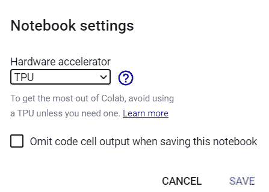

图 37:TPU 硬件加速器的选择。

**检查 TPU 硬件加速器的运行情况**

它需要 TensorFlow 包。在下面的代码中，实现检查 Colab 是否设置了 TPU 加速器？

```
import tensorflow as tftry:
    tpu = tf.distribute.cluster_resolver.TPUClusterResolver()  
    print('Running on TPU ', tpu.cluster_spec().as_dict()['worker'])
except ValueError:
    print('Exception')
```


图 38:在 TPU 硬件加速器上运行。

如果没有设置 TPU，那么这段代码将会遇到错误。

# 结论

来自 Google Research 的 Google Colab 或 Colaboratory 是一个 Jupyter 笔记本环境，用于执行基于 python 的代码来构建机器学习或深度学习模型。

它是完全免费的(除非你想去 [**pro**](https://mktg.best/5o4zj) )，并提供 GPU 和 TPU 硬件加速器。由于零配置特性要求，使用和共享起来毫不费力。

它允许在单个文档和图像、HTML、LaTex 等中组合可执行代码和富文本。它已经安装了像 TensorFlow 这样重要的机器学习库，因此它非常适合机器学习和深度学习模型构建。Colab 在开发神经网络方面表现突出。

我们可以通过使用基于 CPU 的硬件加速器来实现多线程的并行和执行。我们可以公开分享 Google Colab 笔记本作为教程笔记本。HTML 标签的插入和文本的样式为教程构建了一个有吸引力和有意义的笔记本，插入带有代码的文本对于解释代码流和逻辑非常有帮助。

数据科学家和机器学习者可以利用 Python 库的全部功能来分析和可视化数据，Google Colab 可以直接从 Kaggle 导入数据，并从 GitHub 上传代码。

**免责声明:**本文表达的观点仅代表作者个人观点，不代表卡内基梅隆大学或其他(直接或间接)与作者相关的公司的观点。这些文章并不是最终产品，而是当前思想的反映，是讨论和改进的催化剂。

**除非另有说明，所有图片均来自作者。**

通过[向艾](https://towardsai.net/)发布

# 资源

[Google colab 实现](https://colab.research.google.com/drive/1ymIYzFg4Q7iBjnTut31aBqPHgOpkjHYD?usp=sharing)。

[Github 库](https://github.com/towardsai/tutorials/tree/master/google_colab_tutorial)。

# 参考

[1]谷歌实验室，[https://colab.research.google.com/](https://colab.research.google.com/)

[2] Python 2 Deprecation，Google Colab，Google，[https://research . Google . com/co laboratory/FAQ . html # Python-2-Deprecation](https://research.google.com/colaboratory/faq.html#python-2-deprecation)

[3]用 Python 写代码示例的初学者机器学习算法，Pratik Shukla，Roberto 伊里翁多，Towards AI，[https://towardsai . net/p/Machine-Learning/Machine-Learning-Algorithms-for-初学者用 Python-Code-Examples-ml-19 c 6 AFD 60 DAA](https://towardsai.net/p/machine-learning/machine-learning-algorithms-for-beginners-with-python-code-examples-ml-19c6afd60daa)

[4]朱庇特项目，[https://jupyter.org/](https://jupyter.org/)

[5]谷歌实验室，常见问题解答，[https://research.google.com/colaboratory/faq.html](https://research.google.com/colaboratory/faq.html)