# Google Colab:真实深度学习项目中的性能分析

> 原文：<https://pub.towardsai.net/google-colab-performance-analysis-in-a-real-deep-learning-project-9a0d4f8f489d?source=collection_archive---------1----------------------->

## [机器学习](https://towardsai.net/p/category/machine-learning)

## 使用 TensorFlow 和 Keras APIs

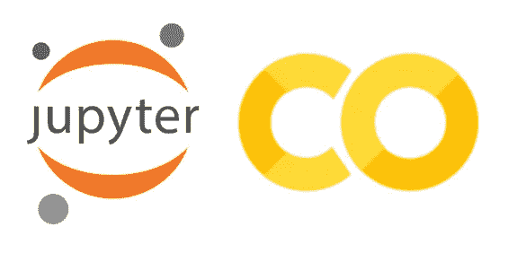

## 0.介绍

Google Colab 项目旨在为每个拥有电脑(甚至只是平板电脑或智能手机)和互联网连接的人提供免费的 GPU 访问。不是每个人都负担得起数据科学项目的强大 GPU，因此 Google Colab 是一个可能的解决方案。

但是 Google Colab 的优势并不仅限于 GPU 访问，免费的在线接口提供了一个功能齐全的 Jupyter 笔记本环境，并且易于分享(可以通过 Google Drive 分享，或者用 GitHub 连接账号)。这意味着您将需要 0(零！)配置使用 GPU 开始你的机器学习项目。你觉得这听起来不错吗？我觉得听起来很神奇！

> 所以我决定尝试一下！

## **1。配置**

你唯一需要做的就是创建一个谷歌账户。让我猜猜，你已经有一个了…只要登陆 [Google Colab 项目页面](https://colab.research.google.com)并选择“新笔记本”。新页面将看起来像一个 Jupyter 笔记本环境。你将能够编写可执行代码和 markdown 文本来描述你的项目。您可以更改为深色主题，但默认主题是浅色。

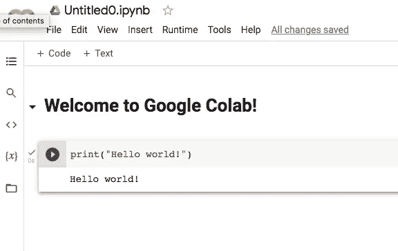

## **2。项目描述**

如标题所示，这是一个 Google Colab 性能分析，带有一个用于医学研究目的的真实数据科学项目。简而言之，该项目的目的是为医学图像的质量控制(QC)提供帮助。使用迁移学习方法，这意味着将使用不同的 Keras 模型 API。将使用相同的超参数测试六个模型，并比较每个模型的性能。

***可能的图像类型:***

***(0)质量好*** ，所有参数都有用；

***(1)质量一般*** ，部分参数仍可使用，但重复测试为宜；

***②***质量差，拒绝数据，测试必须重复。

再说一次，这个项目并不打算提供一个医疗诊断，或将图像分类为健康/疾病，只有质量控制工具。这样，在旨在将图像分类为健康/疾病的后续项目中，可以包括更多“质量好”的图像，并避免“质量差”的图像，从而减少由于数据质量差而导致的偏差。

## **3。数据库上传**

有两种简单的方法可以上传你的数据用于 Google Colab。一个是永久的，另一个是临时的，只在你的疗程结束时有效(最多 12 小时)。

您可以使用左侧菜单直接将您的数据上传到您的 Google Colab 会话。只需点击类似文件夹的图片，并选择上传选项。这只会以一种临时的方式上传你的数据库，这意味着每次你启动一个新的会话，你都需要上传数据。

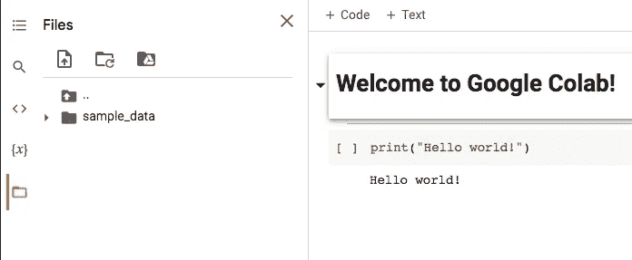

另一个选择(至少对我来说是更有效的选择)是将数据库上传到 Google Drive，然后将 Google Drive 与 Colab 连接起来。你可以在同一个菜单中完成，或者你可以在你的笔记本的开头使用一个小的代码片段，永远不要忘记连接驱动器。

```
from google.colab import drive
drive.mount('/content/drive')
```

用于本项目的数据库样本包含 3236 幅图像，大小为 75x75，分布在三个类别中，如下图所示。

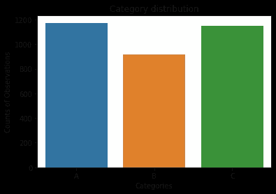

数据被分成训练、测试和验证子集，训练子集中有 2200 幅图像，验证子集中有 550 幅图像，测试子集中有 486 幅图像。

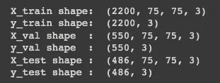

## **4。代码和模型 API**

在这项分析中，六个 Keras 应用程序用于迁移学习项目，旨在识别项目描述中解释的三种图像类别。选择的模型有:

[例外](https://keras.io/api/applications/xception/)
[vgg 16](https://keras.io/api/applications/vgg/#vgg16-function)
[InceptionV3](https://keras.io/api/applications/inceptionv3/)
[dense net 121](https://keras.io/api/applications/densenet/#densenet121-function)
[inceptionresnet v2](https://keras.io/api/applications/inceptionresnetv2/)
[resnet 50 v2](https://keras.io/api/applications/resnet/#resnet50v2-function)

相同的超参数用于所有模型，批量大小为 32，时期数= 100，学习率为 0.0001。选择最初的高次数和低学习率是为了确定每个模型的理想次数。所有模型都使用“ *imagenet* ”和“*soft max”*激活的权重。

## **5。结果:Google Colab 性能**

不得不说，Google Colab 免费提供的 GPU 能力让我印象深刻。在启用 GPU 的情况下运行深度学习项目比使用 CPU 快 10 倍。这是一个整体即时满足的体验。不过，也有一些方面我没有享受到那么多，比如免费账号的 GPU 可用性低，或者不是所有机型都有 TensorFlow 版本的 GPU 原生支持。

我将分享的每个模型的衡量标准是:

```
1\. Type of processor used;
2\. Time per step;
3\. Time per epoch;
4\. Trainable parameters;
5\. Total time execution.
```

我将从我不喜欢 Google Colab 的方面开始。为了运行这个测试，我需要大约一周的时间才能用 GPU 运行所有模型。谷歌限制免费账户中的 GPU 访问，根据我的经验，这意味着我每天只能访问大约 2 小时。过了这段时间，我的会话自动断开，大约 24 小时后我无法再次连接 GPU。如果您的会话在代码运行过程中断开，这种情况会特别令人沮丧。

这意味着我每天只能运行一个模型。这对于学习目的或小型研究项目来说已经足够了，尤其是如果您已经准备好了所有的代码。但对于更大的研究项目或商业来说，这不是最好的选择。

我发现了另一个我在运行 Xception 模型时无法解决的问题，用 Google Colab 检索 en error:
"*DepthwiseConvBackpropFilter 的确定性 GPU 实现目前不可用。*
这很奇怪，尤其是考虑到 Xception 是谷歌开发的一个模型。所以，我决定只使用 CPU 运行 Xception，并取结果进行比较。GPU 用于所有其他模型。

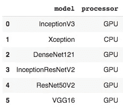

每个模型的可训练参数的数量是不同的，这是影响执行时间的一个因素。因此，向您展示每个模型中的参数数量是公平的。InceptionResNetV2 是迄今为止具有较高数量或可训练参数的模型，DenseNet121 是就要训练的参数数量而言较轻的模型。

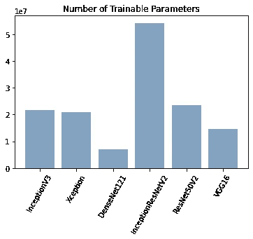

下图总结了每个时期的时间。正如我们所见，GPU 对减少每个时期的时间需求有着巨大的影响。另一个有趣的事实是，DenseNet121 是可训练参数较少的模型，但它不是训练最快的模型。VGG16 是纪元时间更快的型号。

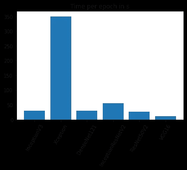

总执行时间反映了每个时期的时间以及每个步骤的时间。显示了相关图并总结了数据。总执行时间主要受每步时间的影响，在较小程度上受可训练参数数量的负面影响。

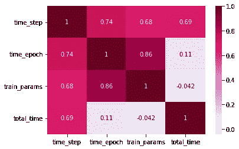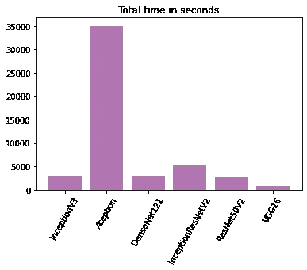

再一次，我们可以在图“*总时间(秒)*中看到，VGG16 是训练最快的模型，GPU 可以带来巨大的差异，因为所有模型都是使用 GPU 训练的，除了例外。所有模型最多花费 5000 秒或更少(大约 1 小时 20 分钟)，然而，在没有 GPU 的情况下，训练时间高达 35000，这几乎是 10 小时。

也就是说，如果你没有 GPU 访问，也买不起为深度学习准备的带有 GPU 的笔记本电脑，谷歌 Colab 是一个免费的绝佳替代选择。您不仅可以避免笔记本电脑中需要的所有配置，还可以通过使用 GPU 来改善您的工作流程。然而，由于免费版本的使用限制，我不认为 Google Colab 可以成为商业的重要替代产品。

## **6。结果:模型性能**

在尝试 Google Colab 和不同的 Keras 模型 API 时，也可以得出一些关于所研究任务的模型性能的结论。总的来说，没有一个模型表现得足够好，可以在生产环境中测试，但是我会分享我的结果。所有指标都是针对验证子集的。这些结果中不包括例外模型。

```
Validation:
1\. Overall accuracy;
2\. Three category precision;
3\. Three category recall;
4\. Three category f1-score.
```

五个模型的总体精度非常相似，但是 VGG16 的精度稍好，为 0.70。DenseNet121 性能最差，精度为 0.64。

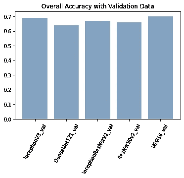

对于每个模型，在不同的历元数下实现了更高的精度，具有测试和验证损失的图形以及训练期间的测试和验证精度如下所示:

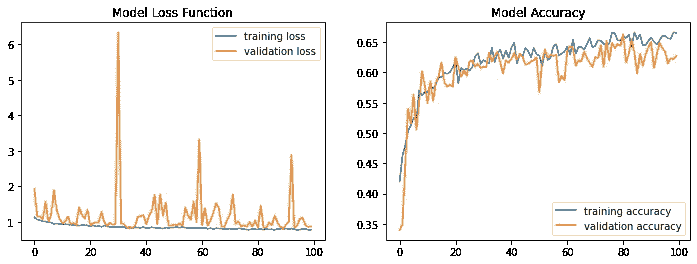

InceptionV3

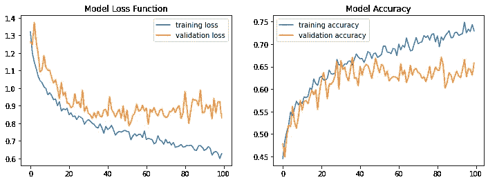

DenseNet121

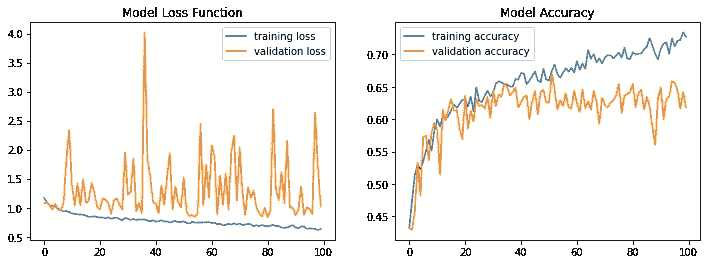

InceptionResNetV2

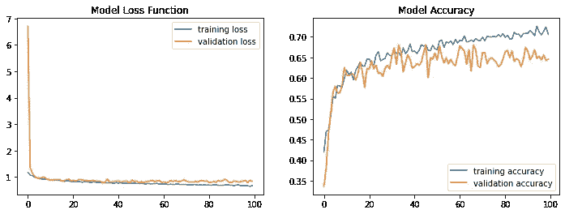

ResNet50

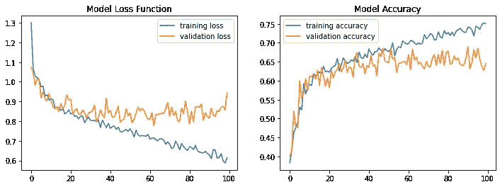

VGG16

所有模型的混淆矩阵也以同样的顺序显示:

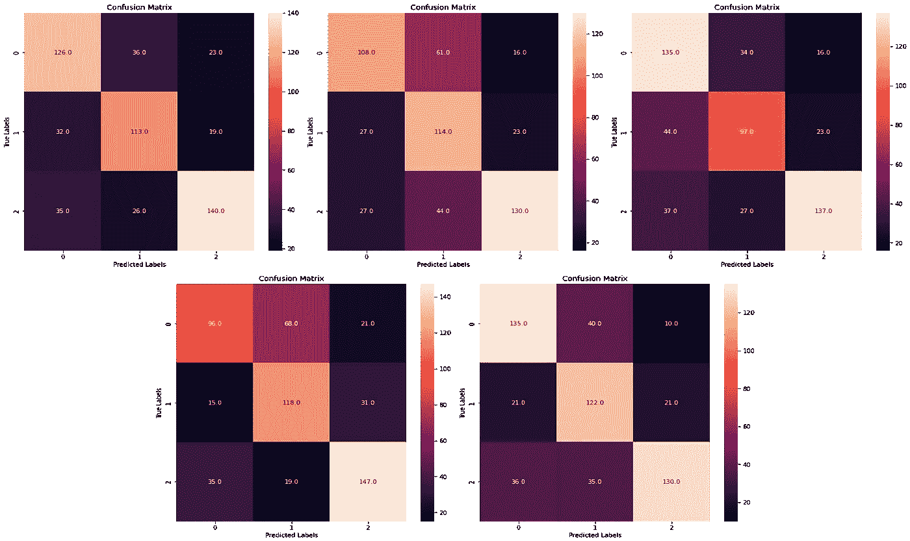

精度因图像类别而异。对于几乎所有模型，更容易分类的图像是第 2 组中的图像(质量差)。组 1(平均质量)中的图像是最难预测的。

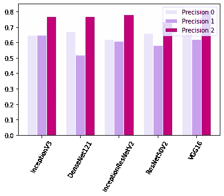

显示召回数据。同样，VGG16 可能具有更好的性能。

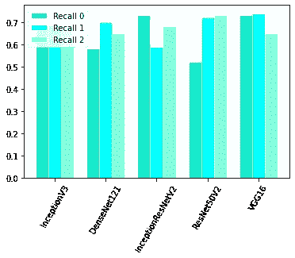

最后，我们可以看到 F1 的分数。

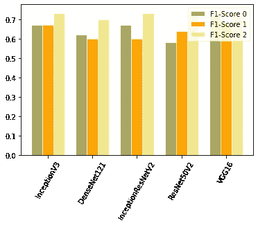

这些结果用于初步分析，将有助于为将来的训练微调 hyper 参数。

## **结论**

在 Google Colab 免费版的性能分析中，可以看出 Google 提供的 GPU 能力可以用于小型研究项目或学习目的。这有可能加快我们的工作，将培训时间缩短近 10 倍。然而，对于在更大的项目中使用这个工具来说，使用限制是一种倒退。

在经过训练的模型中，VGG16 是训练速度最快的模型，而且重要的是，它在整体准确度和精确度方面也是结果最好的模型。

感谢您的阅读。

**如果:**你喜欢这篇文章，别忘了关注我，这样你就能收到关于新出版物的所有更新。

**其他如果:**你想了解更多，你可以通过[我的推荐链接](https://cdanielaam.medium.com/membership)订阅媒体会员。它不会花你更多的钱，但会支付我一杯咖啡。

**其他:**谢谢！