# Google Colab 初学者教程

> 原文：<https://pub.towardsai.net/google-colab-tutorial-for-beginners-834595494d44?source=collection_archive---------2----------------------->

创建 Colab Notebook，设置运行时，运行 cells，从 Google Drive 读取数据，运行 R 编程语言


图片来自[GrabNGoInfo.com](http://grabngoinfo.com/)

Google Colaboratory(又名 Google Colab)是一个运行在 Google Cloud 上的在线笔记本环境。用户界面类似于 Jupyter 笔记本，它支持机器学习模型的 GPU 和 TPU。在本教程中，我们将涵盖:

*   如何创建一个谷歌 Colab 笔记本？
*   如何设置运行时间？
*   如何创建和运行 Colab 笔记本单元格？
*   如何从 Google Drive 读取数据？
*   如何用 Google Colab 运行 R 编程语言？

**本岗位资源:**

*   [YouTube](https://www.youtube.com/watch?v=nN0N_ZT2XYg&list=PLVppujud2yJpPpGIeKjCnkdmGVDlhB9ud&index=2) 上的视频教程
*   更多视频教程在 [Google Colab](https://www.youtube.com/playlist?list=PLVppujud2yJpPpGIeKjCnkdmGVDlhB9ud)
*   更多关于 [Google Colab](https://medium.com/@AmyGrabNGoInfo/list/google-colab-fb4902ae368d) 的博客文章

我们开始吧！

# 第一步:创建一个 Google Colab 笔记本

**步骤 1.1** :登录你的 Google 账户。如果你没有谷歌帐户，去 accounts.google.com 创建一个帐户。

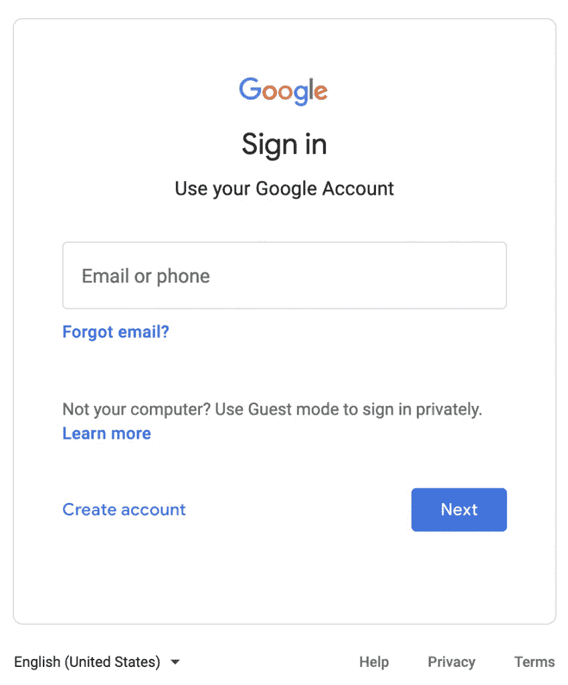

Colab 的 Google 帐户登录——图片来自 GrabNGoInfo.com

**步骤 1.2** :点击右上角的 9 点图标，选择**驱动**。


选择 Google Drive for Colab——图片来自 GrabNGoInfo.com

**步骤 1.3** :点击**新建**->-**更多**->-**Google 协同实验室**打开一个新的 Colab 笔记本。

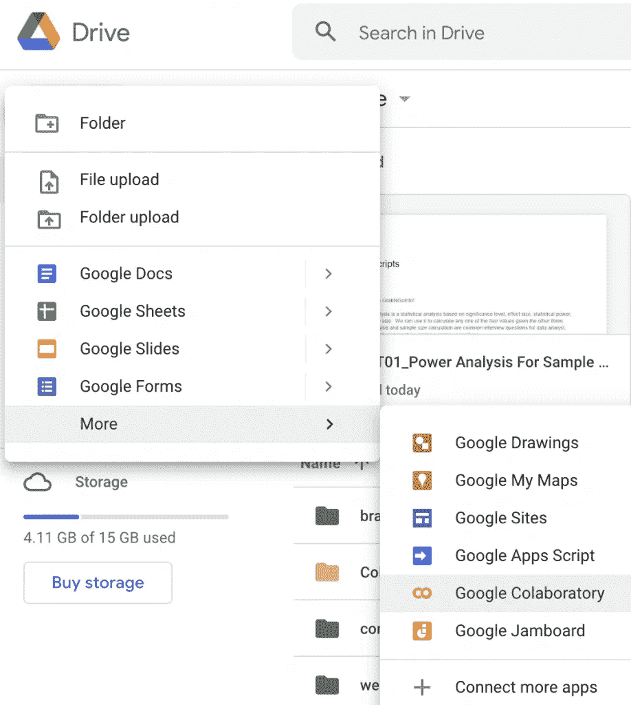

创建 Google Colab 笔记本—图片来自 GrabNGoInfo.com

如果您在列表中没有看到谷歌协作实验室，请点击**连接更多应用**并在搜索栏中搜索**谷歌协作实验室**。

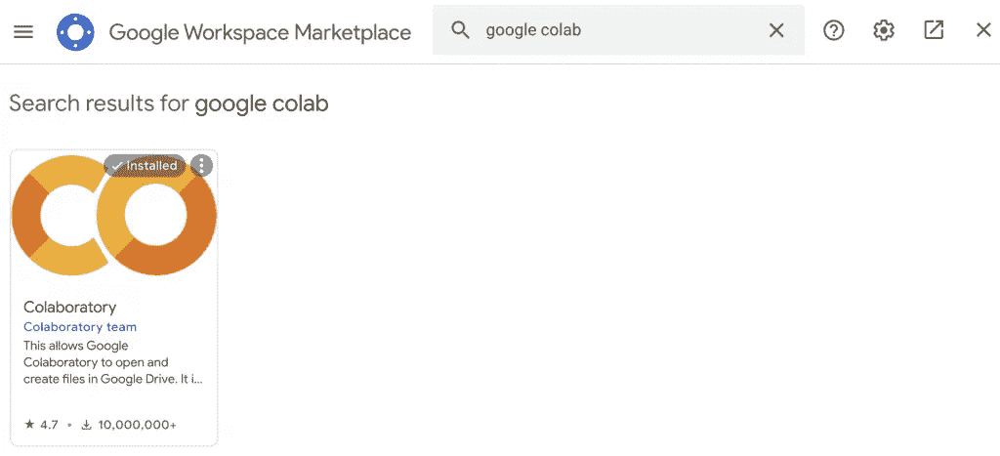

安装 Google Colab——图片来自 GrabNGoInfo.com

安装 Google Colab，点击**新建**->-**更多**->-**Google co laboratory**打开一个新的 Colab 笔记本。

**步骤 1.4** :点击左上角的文件名，更改文件名。

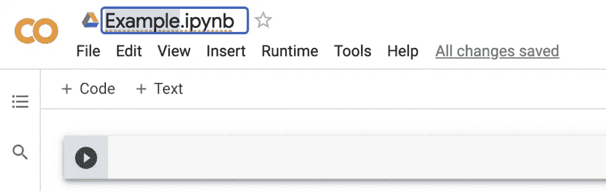

Google Colab 更改文件名—图片来自 GrabNGoInfo.com

# 步骤 2(可选):设置运行时

第二步是设置运行时间。默认运行时间使用 CPU，但是您可以通过点击**运行时间**->-**更改运行时间类型**来更改运行时间。

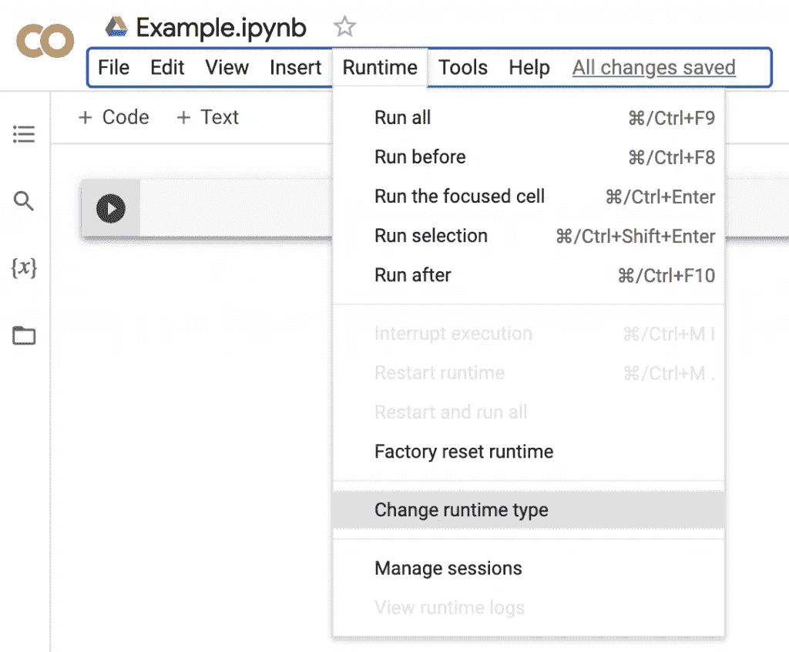

Google Colab 更改运行时类型—图片来自 GrabNGoInfo.com

在**笔记本设置**弹出窗口中，我们可以将**硬件加速器**从**无**更改为 **GPU** 或 **TPU** 。GPU(图形处理器)和 TPU(张量处理器)通常用于计算量大的模型。我们将把它保持为 **None** ，因为本教程不需要很高的计算能力。

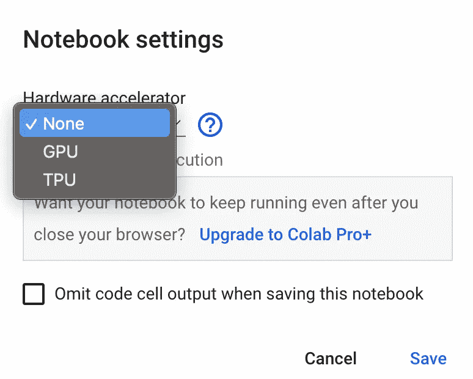

谷歌 Colab 硬件加速器——图片来自 GrabNGoInfo.com

# 步骤 3:创建和运行单元

Google Colab 笔记本中有两种类型的单元格，文本单元格和代码单元格。

**步骤 3.1** :添加新的文本单元格，将鼠标悬停在中间，直到 **+** 代码和**+文本**出现。点击**+文本**。

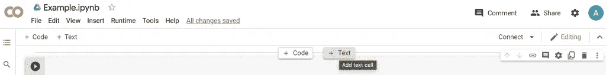

Google Colab 添加一个文本单元格——图片来自 GrabNGoInfo.com

**步骤 3.2** :在新增的文本单元格中键入文本。您可以使用 markdown 来格式化文本，呈现的文本显示在右侧。当在单元格外单击时，单元格会自动呈现。

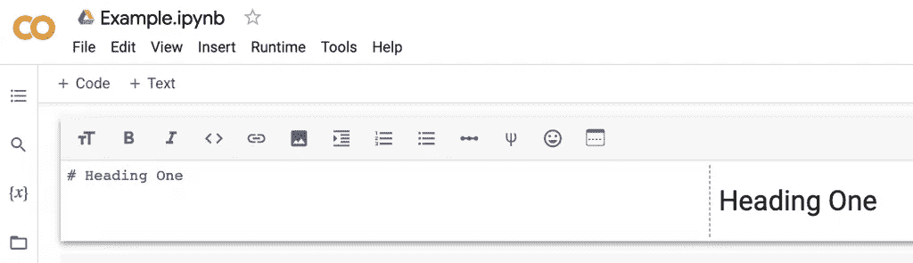

Google Colab Markdown——图片来自 GrabNGoInfo.com

**第 3.3 步**:添加新的编码单元格，将鼠标悬停在中间，直到出现**+编码**和**+文本**为止。点击**+代码**。

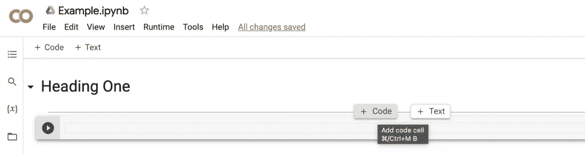

Google Colab 添加了一个代码单元——图片来自 GrabNGoInfo.com

**步骤 3.4** :在新添加的代码单元格中键入 Python 代码，点击运行按钮(一个黑色圆圈，里面有一个白色三角形)运行代码。这里我们输入`2+3`，得到`5`的结果。


谷歌实验室运行一个代码单元——图片来自 GrabNGoInfo.com

# 步骤 4:从 Google Drive 读取数据

当使用 Google Colab 时，从 Google Drive 读取数据是很常见的。在第四步中，我们将讨论如何连接 Google Drive 并读取数据。

**步骤 4.1** :通过运行下面的代码，将 Google Drive 挂载到 Google Colab 笔记本上。

```
# Mount Google Drive
from google.colab import drive
drive.mount('/content/drive')
```

将弹出一个窗口，询问“允许这台笔记本访问您的 Google Drive 文件吗？”选择蓝色的**连接到 Google Drive** 。


将 Google Colab 笔记本连接到 Google Drive——图片来自 GrabNGoInfo.com

然后选择用于 Colab 笔记本的 Google 账户，选择蓝色的**允许**。

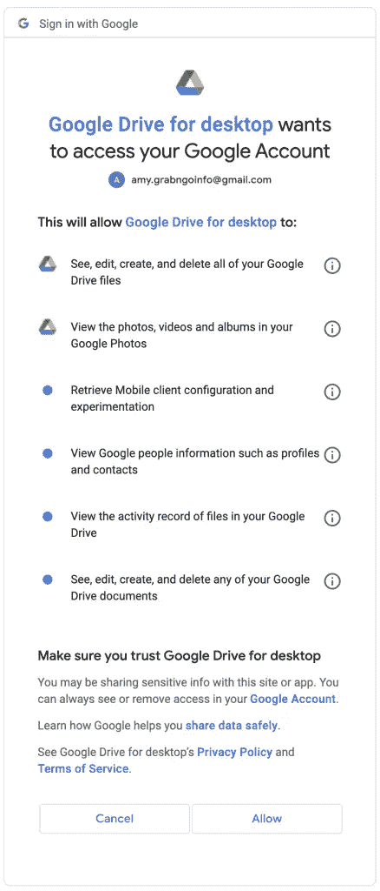

允许 Google Drive 访问来自 GrabNGoInfo.com 的图片

我们将看到 Google Drive 成功连接后的输出`Mounted at /content/drive`。

**步骤 4.2** :用数据切换到 Google Drive 目录。

```
# Change directory
import os
os.chdir("drive/My Drive/contents/google_colab")
```

我们可以使用`!pwd`来检查当前目录。输出显示我们在正确的目录中。

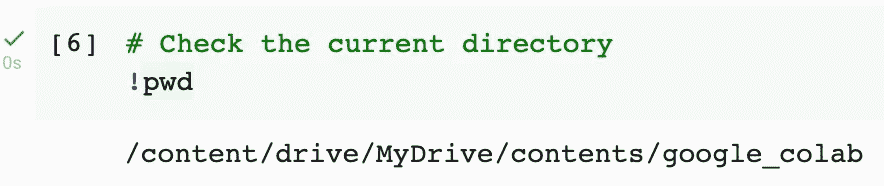

Google Colab 确认当前目录——图片来自 GrabNGoInfo.com

**步骤 4.3** :将 csv 文件读入熊猫数据帧。现在 Google Drive 已经连接到了 Colab 笔记本，我们可以像从本地文件夹读取数据一样读取保存在 Google Drive 上的数据。

```
# Read in data
import pandas as pd
df = pd.read_csv('example_data.csv')
df.head()
```

输出

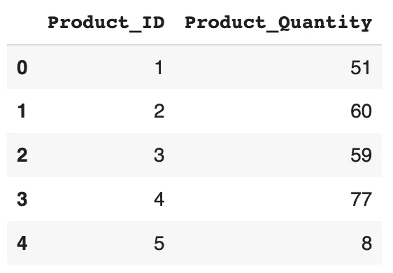

图片来自 GrabNGoInfo.com

# 步骤 5:(可选):使用 Google Colab 进行 R 编程

要将 Colab 笔记本的默认语言从 Python 改为 R，使用链接[https://colab.to/r](https://colab.to/r)打开一个新页面。

要在同一个笔记本中同时使用 Python 和 R，我们可以使用`rpy2`包。更多细节请参考我之前的教程[如何用谷歌 Colab 笔记本使用 R](https://grabngoinfo.com/how-to-use-r-with-google-colab-notebook/)。

# 摘要

在本教程中，我们讨论了如何开始使用 Google Colab。你学到了:

*   如何创建一个谷歌 Colab 笔记本？
*   如何设置运行时间？
*   如何创建和运行 Colab 笔记本单元格？
*   如何从 Google Drive 读取数据？
*   如何用 Google Colab 运行 R 编程语言？

更多教程可以在 GrabNGoInfo [YouTube 频道](https://www.youtube.com/channel/UCmbA7XB6Wb7bLwJw9ARPcYg)和[GrabNGoInfo.com](https://grabngoinfo.com/tutorials/)上获得。

# 推荐教程

*   [GrabNGoInfo 机器学习教程盘点](https://medium.com/grabngoinfo/grabngoinfo-machine-learning-tutorials-inventory-9b9d78ebdd67)
*   [用于异常检测的单级 SVM](https://medium.com/p/one-class-svm-for-anomaly-detection-6c97fdd6d8af)
*   [使用 Python 中的 Prophet 进行多时间序列预测的 3 种方式](https://medium.com/p/3-ways-for-multiple-time-series-forecasting-using-prophet-in-python-7a0709a117f9)
*   [使用 Python 实现不平衡分类的四种过采样和欠采样方法](https://medium.com/p/four-oversampling-and-under-sampling-methods-for-imbalanced-classification-using-python-7304aedf9037)
*   [利用 Python 中的 Prophet 进行具有季节性和假日效应的多元时间序列预测](https://medium.com/p/multivariate-time-series-forecasting-with-seasonality-and-holiday-effect-using-prophet-in-python-d5d4150eeb57)
*   [如何检测离群值|数据科学面试问答](https://medium.com/p/how-to-detect-outliers-data-science-interview-questions-and-answers-1e400284f6b4)
*   [利用 Python 中的 Prophet 进行时间序列异常检测](https://medium.com/p/time-series-anomaly-detection-using-prophet-in-python-877d2b7b14b4)

[](https://medium.com/@AmyGrabNGoInfo/membership) [## 通过我的推荐链接加入媒体-艾米 GrabNGoInfo

### 作为一个媒体会员，你的会员费的一部分会给你阅读的作家，你可以完全接触到每一个故事…

medium.com](https://medium.com/@AmyGrabNGoInfo/membership)