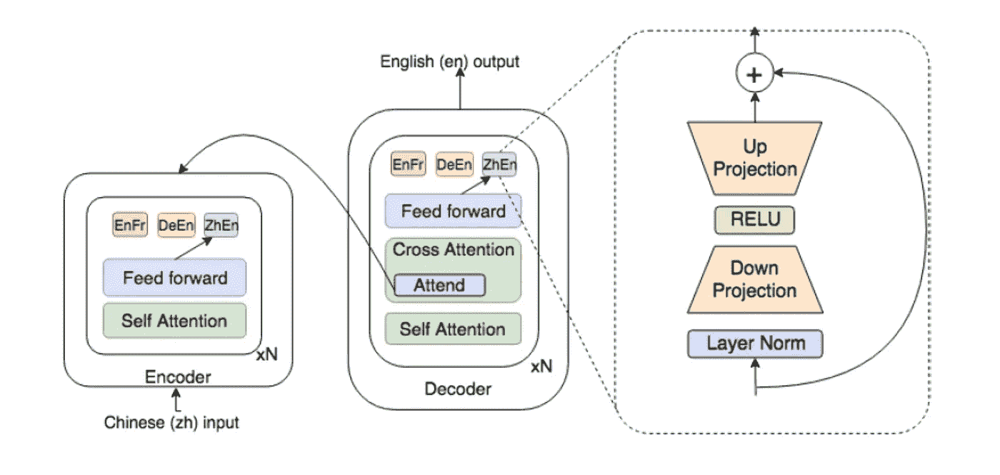
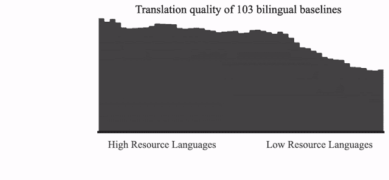

# 谷歌用大规模可扩展的多语言模型对抗 NLP 不平等

> 原文：<https://pub.towardsai.net/google-fights-language-intelligence-inequality-with-massively-scalable-multilingual-models-41d8c3fb0852?source=collection_archive---------1----------------------->

## [自然语言处理](https://towardsai.net/p/category/nlp)

## 谷歌研究人员设计了一个通用的机器翻译系统，可以跨越 100 种语言。

图片来源:谷歌研究

> 我最近创办了一份专注于人工智能的教育时事通讯，已经有超过 90，000 名订户。《序列》是一份无废话(意思是没有炒作，没有新闻等)的 ML 导向时事通讯，需要 5 分钟阅读。目标是让你与机器学习项目、研究论文和概念保持同步。请通过订阅以下内容来尝试一下:

 [## 序列

### 订阅人工智能世界中最相关的项目和研究论文。受到 85，000 多人的信任…

thesequence.substack.com](https://thesequence.substack.com/) 

自然语言系统一直是过去几年人工智能(AI)复兴的中心。然而，语言智能程序的好处仅限于世界上最流行的口语。让 Alexa 理解几乎所有的英语是微不足道的，但尝试西非的一种[克鲁语](https://en.wikipedia.org/wiki/Kru_languages)，故事就完全不同了。虽然世界上有 7000 多种语言，但其中只有 20 种占世界人口的一半以上。在人工智能的背景下，设计可以与数据稀缺的语言无缝合作的语言智能模型是维护空间平等的优先事项。最近，Google Research 发布了几份白皮书，详细介绍了一些设计多语言系统的新努力，这些系统可以扩展到数百种语言。

设计能有效处理数据受限语言的语言智能系统绝非易事。众所周知，语音识别或机器翻译等领域需要大量的标记数据。我们如何在不牺牲质量的情况下使这些模型适应数据稀缺的语言？我们能把数据丰富的语言中的知识推广到其他语言中吗？对于数据稀缺的语言，我们能在语言智能系统中达到像样的质量水平吗？谷歌一直在通过建立一种更有效的机器移植方法来慢慢应对这些挑战。

# 构建大规模多语言系统

在“[野外大规模多语言神经机器翻译:发现和挑战](https://arxiv.org/pdf/1907.05019.pdf)”中，谷歌研究人员提出了建立半通用神经机器翻译(NMT)模型的想法。具体来说，他们设计了一个单一的 NMT 模型，可以对 250 多亿个句子对进行训练，从 100 多种语言到英语，有 500 多亿个参数。

谷歌论文的目标与其说是为 NMT 系统提出一个新颖的架构，不如说是理解它们的行为。尽管多语言 NMT 模型很有吸引力，但大多数方法都是在受限的环境下开发的；它们的功效还有待于在现实世界中证明。

设计通用 NMT 模型是一个归纳偏差问题。更具体地说，在多语言 NMT 的背景下，潜在的归纳偏见是，一种语言的学习信号应该有利于其他语言的质量。从这个角度来看，我们的期望是，随着语言数量的增加，学习者会因为每种语言增加的信息量而更好地概括。谷歌的研究论文总结了构建通用 NMT 的挑战:*跨大量领域/任务的多领域和多任务学习，具有广泛的数据不平衡，以及由数据集噪声和主题/风格差异、不同程度的语言相似性等引起的非常异构的任务间关系。*

尽管这种描述势不可挡，但最重要的是要认识到这些挑战通常是由单个模型解决的，我们不知道是否有可能在一个通用的 NMT 中构建它们。一般而言，通用 NMT 方法应具有以下特征:

*单个模型中考虑的语言数量的最大吞吐量。*

*向低资源语言的最大诱导(正)迁移。*

*对高资源语言的最小干扰(负迁移)。*

*·强大的多语言 NMT 模型，在现实的开放领域环境中表现出色。*

在实验中，谷歌使用了来自 103 种语言的 250 多亿个例子的数据集。谷歌实验的关键发现之一是，NMT 系统可以学习跨类似语言的共享表示。这可以用来将知识从一个语言学习者传递给另一个语言学习者。下图显示了实验中涉及的不同语言的聚类分析。

图片来源:谷歌研究

为了实现多语言效率，Google 利用了传统 transformer 架构的适应层，该适应层允许不同任务的专门化。谷歌利用 GPipe 训练 128 层的变形金刚，参数超过 60 亿。

图片来源:谷歌研究

该模型经过训练后，显示出从高资源向低资源语言的强烈正迁移，显著提高了分布尾部 30+种语言的翻译质量，平均提高了 5 个 [BLEU](https://en.wikipedia.org/wiki/BLEU) 点。这一发现表明，大规模多语言模型在泛化方面是有效的，并且能够捕捉跨大量语言的代表性相似性。

图片来源:谷歌研究

最初的泛化对于少量的低资源语言来说工作得很好，但是随着这个数字开始增加，它有一些意想不到的副作用。具体来说，观察到高资源语言翻译的质量开始下降。Google 使用前面提到的 GPipe 架构来表示我们的神经网络的能力，通过增加模型参数的数量来提高高资源语言的翻译质量，从而使它们变得更大。另一个有趣的创新是用[稀疏选通的专家混合](https://arxiv.org/abs/1701.06538)替换变压器架构的基本前馈层，我们大幅提升了模型容量，允许用超过 500 亿个参数训练模型，这进一步全面提高了翻译质量。

图片来源:谷歌研究

谷歌实现通用 NMT 的方法是将机器翻译能力扩展到数千种语言的第一步。世界上有超过 7000 种口语，在这些语言的每个领域或任务上训练单独的神经翻译模型在计算上是不现实的。从这个角度来看，通用 NMT 是避免机器翻译不平等的唯一途径。如果我们还考虑到，到本世纪末，7000 种语言中有一半以上将不复存在，那么一个通用的 NMT 不仅是通向更高智能的一条途径，也是保存不同文化历史的一条途径。