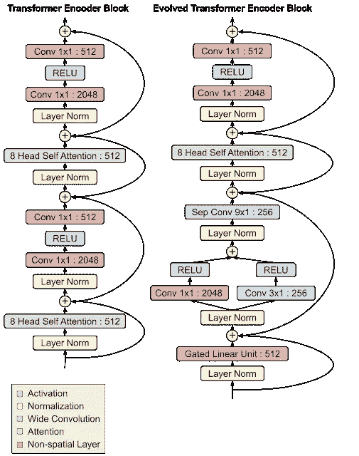
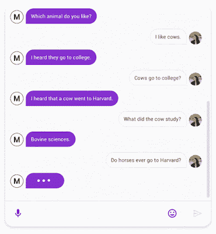

# Google Meena 是一个机器学习代理，可以谈论任何事情

> 原文：<https://pub.towardsai.net/google-meena-is-a-machine-learning-agent-that-can-chat-about-everything-dc9cf2600698?source=collection_archive---------2----------------------->

## [自然语言处理](https://towardsai.net/p/category/nlp)

## 米娜是 NLU 历史上的主要里程碑之一。谷歌是怎么建立起来的？

图片来源:谷歌研究

> 我最近创办了一份专注于人工智能的教育时事通讯，已经有超过 10 万名订户。《序列》是一份无废话(意思是没有炒作，没有新闻等)的 ML 导向时事通讯，需要 5 分钟阅读。目标是让你与机器学习项目、研究论文和概念保持同步。请通过订阅以下内容来尝试一下:

 [## 序列

### 订阅人工智能世界中最相关的项目和研究论文。受到 102，000 多人的信任…

thesequence.substack.com](https://thesequence.substack.com/) 

近年来，谷歌一直处于自然语言理解(NLU)系统一些最惊人发展的中心。从创造了绝对抢了 NLU 研究领域头条的 [BERT 模型](https://ai.googleblog.com/2018/11/open-sourcing-bert-state-of-art-pre.html)，到创造了世界上最大的 transformer 模型，谷歌在 NLU 领域已经达到了令人印象深刻的里程碑。那些没有得到那么多媒体报道但同样令人印象深刻的进展之一是谷歌研究的[论文介绍了 Meena，这是一种新的深度学习模型，可以为聊天机器人提供动力，聊天机器人可以参与任何领域的对话](https://arxiv.org/abs/2001.09977)。

在过去的几年里，NLU 一直是最活跃的研究领域之一，并产生了一些迄今为止最广泛采用的人工智能系统。然而，尽管取得了这些进步，大多数对话系统仍然高度局限于特定的领域，这与我们人类自然地谈论不同话题的能力形成了对比。在 NLU 理论中，这些专门的对话代理被称为封闭域聊天机器人。另一种选择是一个被称为开放域聊天机器人的新兴研究领域，它专注于构建对话代理，可以谈论用户想要的几乎任何事情。如果有效的话，开放域聊天机器人可能是人性化计算机交互之旅中的关键一环。

尽管开放域聊天机器人令人兴奋，但当前的实现尝试仍然有一些弱点，使它们无法普遍有用:它们经常以毫无意义的方式响应开放式输入，或者回复模糊而笼统。通过 Meena，Google ventures 试图通过建立一个可以谈论几乎任何事情的开放域聊天机器人来解决这些挑战。

在建立 Meena 之前，谷歌必须解决一个在开放域聊天机器人系统中经常被忽略的重要挑战。评估开放域聊天机器人质量的一个关键标准是它的对话对人类来说感觉自然。这个想法看起来很直观，但也非常主观。我们如何衡量对话的相似度？为了应对这一挑战，谷歌开始引入一种新的衡量标准，作为 Meena 聊天机器人的基石。

# 敏感性和特异性平均值

敏感度和特异性平均(SSA)是开放域聊天机器人的一个新指标，h 捕捉了人类对话的基本但重要的属性。具体来说，SSA 试图量化人类对话的两个关键方面:

有意义。

*明确的。*

感性可以说涵盖了人类对话的一些最基本的方面，比如常识和逻辑连贯性。理智也抓住了聊天机器人的其他重要方面，比如一致性。然而，光有理智是不够的。一个笼统的回答(例如:我不知道)可能是明智的，但也是无聊和不具体的。这种反应通常是由机器人产生的，这些机器人会根据敏感度等指标进行评估。特异性是可以帮助量化对话互动的人类相似性的第二个度量。例如，A 说，“我喜欢网球”，B 回答，“那很好”，那么话语应该被标记为“不具体”。这个回答可以用在许多不同的上下文中。然而，如果 B 回应道:“我也是，我对罗杰·费德勒百看不厌！”然后，它被标记为“具体的”，因为它与正在讨论的内容密切相关。

***SSA →f(敏感性、特异性)***

SSA 指标的实际数学公式相当复杂，但谷歌进行的初步实验显示，它与聊天机器人的人类相似度有很强的相关性。下图显示了不同聊天机器人(蓝点)之间的相关性。

制定了评估人类相似性的量化指标后，下一步是构建一个针对该指标优化的开放域聊天机器人。

# 米娜

Meena 是一个端到端的神经对话模型，它学习对给定的对话上下文做出明智的响应。令人惊讶的是，Meena 并不依赖于全新的架构，而是利用了谷歌去年开创的演进变压器架构(ET)。

## 东部时间

顾名思义，ET 是对 NLU 任务中常见的传统[变压器架构](https://ai.googleblog.com/2017/08/transformer-novel-neural-network.html)的优化。优化是将神经架构搜索(NAS)应用于 NLU 场景中使用的一系列变压器模型的结果。

乍一看，ET 看起来像大多数变压器神经网络架构。它有一个将输入序列编码成嵌入序列的编码器和一个使用这些嵌入序列构建输出序列的解码器；在翻译的情况下，输入序列是要翻译的句子，输出序列是译文。然而，ET 给 Transformer 模型增加了一些有趣的变化。其中最有趣的是编码器和解码器模块底部的卷积层，它们以类似的分支模式添加在两个位置。这种优化特别有趣，因为编码器和解码器架构在 NAS 期间不共享，所以这种架构被独立发现对编码器和解码器都有用，这体现了这种设计的优势。最初的变形金刚仅仅依赖于自我关注，而进化的变形金刚是一个混合体，利用了自我关注和宽卷积的优势。

图片来源:谷歌研究

## 米娜和 ET

一种思考 Meena 的方式是将其视为一个巨大的 ET 架构。Meena 有一个 ET 编码器模块和 13 个进化变压器解码器模块，如下图所示。编码器负责处理对话上下文，以帮助 Meena 理解对话中已经说过的内容。然后，解码器使用该信息来制定实际的响应。通过调整超参数，我们发现更强大的解码器是提高通话质量的关键。

Meena 证明的一件事是，当谈到开放域聊天机器人时，大小很重要。几十年来，人工智能研究界一直在争论，为了达到一个模型可以与人类进行高质量、多轮对话的地步，我们是否可以简单地采用一个端到端的模型，并通过添加更多的训练数据和增加其参数数量来扩大它，或者是否有必要将这样的模型与其他组件结合起来？Meena 表明，大型端到端模型可以在对话交互中实现类似人类的性能。

米娜有多大？据报道，Meena 的第一个版本有 26 亿个参数，并在 341 GB 的文本上进行训练，这些文本是从公共领域的社交媒体对话中筛选出来的。具体来说，与现有的最先进的生成模型 [OpenAI GPT-2](https://openai.com/blog/better-language-models/) 相比，Meena 的模型容量增加了 1.7 倍，训练数据增加了 8.5 倍。

对 Meena 的初步测试表明，聊天机器人能够参与各种各样主题的对话，实现高水平的 ss a。

图片来源:谷歌研究

在 Meena 研究期间，最令人惊讶的发现之一是 SSA 指标和 NLU 模型中众所周知的[困惑](https://en.wikipedia.org/wiki/Perplexity)性能指标之间的相关性。从概念上讲，困惑度量了语言模型的不确定性。困惑度越低，模型在生成下一个标记(字符、子词或词)时就越有信心。在测试过程中，SSA 指标及其单个因素(特异性和敏感性)显示出与开放域聊天机器人的困惑有很强的相关性。

图片来源:谷歌研究

考虑到它的性能要求，Meena 对大多数组织来说都是可望而不可及的。然而，毫无疑问，Meena 代表了对话式接口实现中的一个重要里程碑。除了模型本身，米娜还贡献了 SSA 指标，让我们更接近地评估聊天机器人互动的人类相似性。在未来，我们应该会看到其他类似人类的对话属性，如幽默或同理心，被添加到 SSA 指标中。同样，我们应该期待看到新的开放域聊天机器人建立在 Meena 的一些原则上，为下一代对话界面提供动力。