# 基于多元 LSTM 神经网络的谷歌股票预测

> 原文：<https://pub.towardsai.net/google-stock-prediction-using-multivariate-lstm-11278d22a78b?source=collection_archive---------3----------------------->

## [深度学习](https://towardsai.net/p/category/machine-learning/deep-learning)

## 使用堆叠 LSTM 预测谷歌股票价格。完整的代码[可在我的 Github 回购。](https://github.com/arditoibryan/Projects/tree/master/20200727_GOOG_Stock_Forecasts_2)

不久前[我发表了一篇类似的文章](https://medium.com/towards-artificial-intelligence/google-stock-predictions-using-an-lstm-neural-network-dbe785949a96)，讲述如何使用 LSTMs 通过一个普通的神经网络进行股票预测。因为我想最小化问题的复杂性，所以我使用了单一品种模型。今天我将利用一个多元模型来训练我的人工智能。它会更复杂，但会开始变得更现实。我将使用的结构几乎与上一篇文章中的结构相同，唯一的区别是这一个将能够包含多个变量(GOOG 价格和 GDP)。

*** * *免责声明**:尽管看起来令人兴奋，但这是一个财务分析模型的低分辨率模拟。现实世界的模型要复杂得多，需要多变量数据，并且不限于单个人工智能，而是一组人工智能一起工作。因此，只使用这个模型来训练建立神经网络:不要试图在真实交易中使用它，因为它不复杂，所以缺乏可靠性。

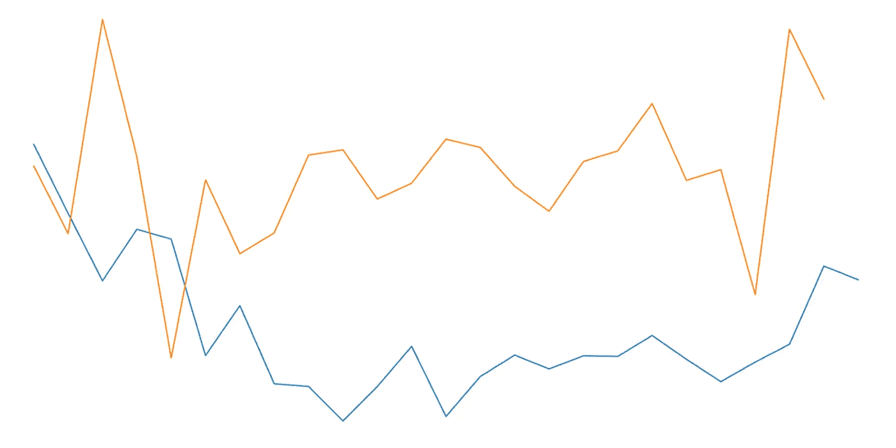

决赛成绩

# 整个过程

像往常一样，我将使用我的个人图形笔记作为指南，指导您如何进行。上面的方案很好地总结了创建用于时间序列预测的堆叠多元 LSTM 神经网络的整个过程。

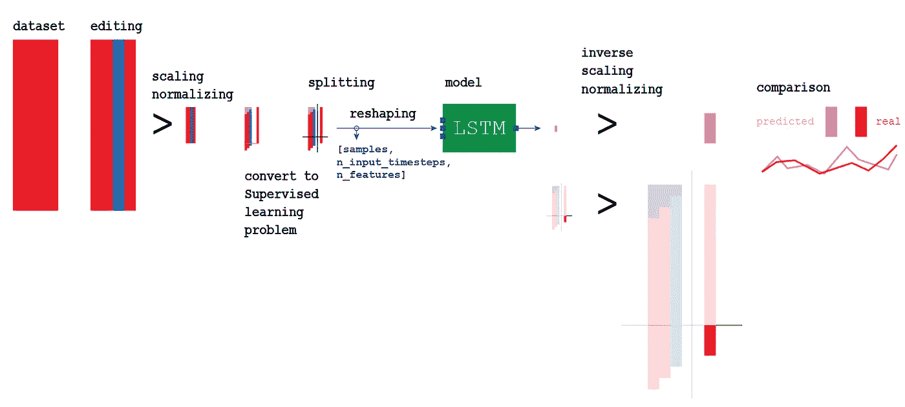

建立 LSTM

# 流程中的步骤:

1.  导入模块
2.  每天产生国内生产总值时间序列
3.  导入数据帧
4.  数据帧预处理
5.  数据帧转换成监督问题
6.  数据帧分为 X_train、y_train、X_test、y_test
7.  将输入整形为[样本，n _ 输入 _ 时间步长，n _ 特征]
8.  创建 LSTM 模式
9.  使用 X_train，y_train 拟合模型
10.  对前进的每一步进行评估
11.  对输出进行反向预处理
12.  比较预测和估计

# 进口 GOOG 股票

```
# load dataset
import pandas as pd
X = pd.read_csv('/content/drive/My Drive/Colab Notebooks/Projects/20200525_GOOG_Multivariate_LSTM/GOOG.csv')#original copy without preprocessing
X = X.drop(['High', 'Low', 'Close', 'Adj Close', 'Volume'], axis=1)
index = X.pop('Date')
X
```

为了您的方便，我已经将谷歌股票(GOOG)1 年的股票表现保存在一个. csv 文件中，您可以在这里下载。因为我用的是 Google Colab，所以会从我的个人硬盘加载。您可以下载。csv 并从自己的路径导入。

# 每天产生 GDP

GDP 每年发布 4 次，每季度一次。因为我不想立即从一个值跳到另一个值，所以我想计算一年中每一天的 GDP 变化，这样我就可以使它适应 Google 股票数据。这两个时间序列需要标准化，在这种情况下，它们需要不间断地显示一年中每天的数据。

```
#GDP interpolation
import matplotlib.pyplot as plty = [20897804, 21098827, 21340267, 21542540, 21729124, 21537940, 21537940]
x = [int((365/4)*0), int((365/4)*1), int((365/4)*2), int((365/4)*3), int((365/4)*4), int((365/4)*5), int((365/4)*6)]plt.plot(x, y, ‘o’)
x
```

因为我只有 GDP 的值，但是我不能使用日期，因为与 Google 股票不兼容，所以我选择使用从 0 开始的天数。实际上，在第 0 天，GDP 是 20，897，804，在第 91 天，GDP 是 21，098，827…

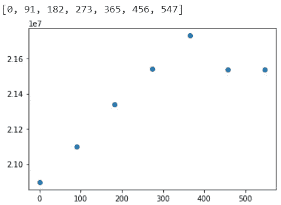

## 插入文字

我创建了一个表格，包含了从政府网站上获得的所有 GDP 值。我将利用这 7 个季度来创建一个时间序列。

```
from scipy.interpolate import interp1d
import numpy as npf = interp1d(x, y, kind='cubic')
plt.plot(f(x))
```

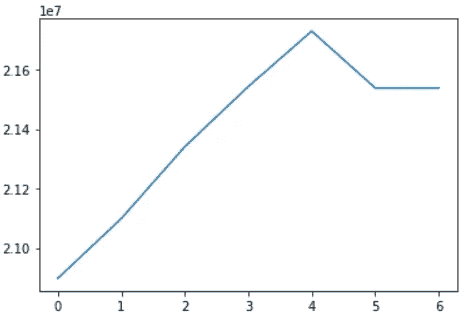

## 使 GDP 函数适应一年中的每一天

正如您已经注意到的，x 轴没有显示正确的日期，而是显示了每个新的 GDP 输入的计数。我必须使它适应谷歌股票数据集的起始日，这样我就可以同步这两个数据集。

```
list_day = list()
list_GDP = list()
for _ in range(len(index)):
  year = int(index[_][0]+index[_][1]+index[_][2]+index[_][3])
  month = int(index[_][5]+index[_][6])
  day = int(index[_][8]+index[_][9])
  date = datetime.datetime(year, month, day)
  date_add = int(date.strftime('%j'))
  history_day = date_add+((year-2019)*365)
  list_day.append(history_day)
  list_GDP.append(f(history_day))plt.plot(list_day, list_GDP, 'o', linewidth=1, markersize=2)
```

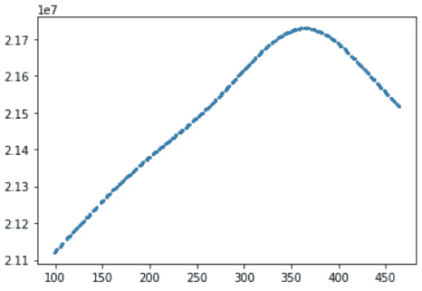

国内生产总值的完全内插法:得出每天的国内生产总值

## 合并数据集

```
list_GDP = pd.DataFrame(list_GDP)
list_GDP.columns = ['GDP']
list_GDP
```

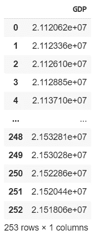

我刚刚创建的数据框架的概述

```
#merge Google Stock with GDP
X = pd.concat([X, list_GDP], axis=1)
X
```


股票价格和国内生产总值

现在数据集有了相应的日期，我终于可以把它们一个接一个地放在一起了。我将使用 GDP 值作为谷歌股票数据的预测值。与前一篇文章相比，该时间序列不会试图仅根据以前的数据来预测自己，但它也会使用 GDP 值。

# 设置功能

为了继续设置我的模型，我必须创建自定义函数来处理时间序列。不幸的是，我还没有找到任何属于任何 ML 库的预制函数。这是处理时间序列会变得激烈的原因之一。

```
from sklearn import preprocessing
import numpy as np
```

## **滞后**

这大概是这个预处理的核心功能。它将创建许多列，给原始值增加一个滞后。神经网络将考虑预测日期之前的短期值，以估计未来的一个或多个步骤。

```
#convert series to supervised learning
def series_to_supervised(data, n_in=1, n_out=1, dropnan=True, drop_col=False, y_var=1):
  n_features = int(len(data.columns))
  n_vars = 1 if type(data) is list else data.shape[1]
  df = pd.DataFrame(data)
  cols, names = list(), list()
  # input sequence (t-n, ... t-1)
  for i in range(n_in, 0, -1):
    cols.append(df.shift(i))
    names += [('var%d(t-%d)' % (j+1, i)) for j in range(n_vars)]
  # forecast sequence (t, t+1, ... t+n)
  for i in range(0, n_out):
    cols.append(df.shift(-i))
    if i == 0:
      names += [('var%d(t)' % (j+1)) for j in range(n_vars)]
    else:
      names += [('var%d(t+%d)' % (j+1, i)) for j in range(n_vars)]
  #put it all together
  agg = pd.concat(cols, axis=1)
  agg.columns = names
  # drop rows with NaN values
  if dropnan:
    agg.dropna(inplace=True)
    data = agg.copy()

  if drop_col == True:
    tot = n_features*n_in+n_features #24+8 = 32y_name = list(data.columns)[n_features*n_in-1 + y_var]
    y = data[y_name]
    for i in range(n_features*n_in, tot):
      data.drop(data.columns[[tot-n_features]], axis=1, inplace=True)
    data = pd.concat([data, y], axis=1)
  return data
```

## 剧烈的

```
def split(df, test_size):
  df = df.values
  len_df = df.shape[0]
  test_size = int(len_df*test_size)
  train, test = df[0:-test_size], df[-test_size:]
  return train, test
```

## 静止的

原始数据不是静态的。我将使用这个函数将数据转换成平稳的时间序列，然后我将不得不用一个相反的函数来逆转这个效果。

```
def transform_to_stationary(df):
  #create a differenced series
  def difference(dataset, interval=1):
    diff = list()
    for i in range(interval, len(dataset)):
      value = dataset[i] - dataset[i - interval]
      diff.append(value)
    return pd.DataFrame(diff)

  df = df.values #al di fuori delle funzioni voglio operare solo su un DataFrame
  df = difference(df, 1) #X ritorna ad essere un df
  return df
```

# 预处理

我需要我将要创建的分区的两个副本。将只对原始副本进行规范化，而第二个副本将先进行规范化，然后进行标准化。保留两个副本的原因是，我需要将输出重新转换为初始比例。到时候我会解释详细的程序。

## 仅标准化

```
#original copy
X = K.copy()input = 3
X = series_to_supervised(X, input, 1, drop_col=False)
X#X, y
y = X.pop('var1(t)')
X = X.drop(['var2(t)'], axis=1)#scaling
scaler_1 = preprocessing.MinMaxScaler(feature_range=(0, 1))
X = pd.DataFrame(scaler_1.fit_transform(X))
X
scaler_1 = preprocessing.MinMaxScaler(feature_range=(0, 1))
y = pd.DataFrame(scaler_1.fit_transform(pd.DataFrame(y)))
y#train, test
X_train_, X_test_ = split(X, 0.1)
y_train_, y_test_ = split(y, 0.1)
X_ = X.copy()
y_ = y.copy()
print(X_train_.shape, X_test_.shape, y_train_.shape, y_test_.shape)
```

如您所见，我存储的所有变量都有一个 _ 作为后缀，以区别于其他变量。

```
import matplotlib.pyplot as pltfig=plt.figure(figsize=(20, 10), dpi= 80)
fig=plt.plot(y_)
```

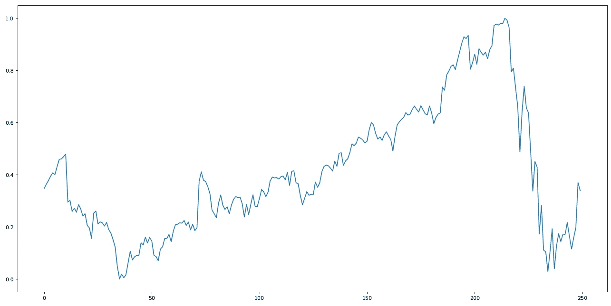

每次谷歌价格

## 规范化+标准化

```
#only scaling
X = K.copy()#preprocessing
X = transform_to_stationary(X)X = series_to_supervised(X, input, 1, drop_col=False)
X#X, y
y = X.pop('var1(t)')
X = X.drop(['var2(t)'], axis=1)
```

## 数据帧转换成监督问题

在预处理过程中，我隔离了数据集 e.y 和 e.X。如果您在分割之前查看这两个数据集，我们最终得到的结果基本上是这样的:

*   投入

```
X
```

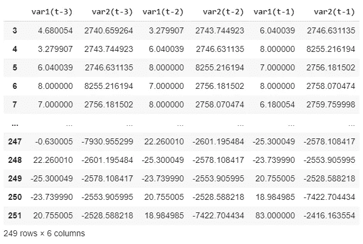

我只取了时间为 0 的股票数据集，并将其移动了三次，将每次移动存储在 GDP 和 GOOG 价格的不同列中，从而得到了上图。这叫做**滞后**。LSTM 将向后看三步，做出一步的未来预测。

*   输出

```
y
```

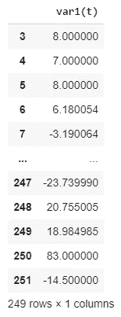

我将用这些标签来训练 LSTM。在这种情况下，我希望 LSTM 只着眼于未来的一步，因此只有一列。

## 缩放和拆分

```
#scaling
scaler_2 = preprocessing.MinMaxScaler(feature_range=(0, 1))
X = pd.DataFrame(scaler_2.fit_transform(X))
X
scaler_2 = preprocessing.MinMaxScaler(feature_range=(0, 1))
y = pd.DataFrame(scaler_2.fit_transform(pd.DataFrame(y)))
y#train, test
X_train, X_test = split(X, 0.1)
y_train, y_test = split(y, 0.1)
X = X.copy()
y = y.copy()
print(X_train.shape, X_test.shape, y_train.shape, y_test.shape)
```

与前面的代码块不同，上面的所有变量都以 no _ 作为后缀。我实际上不需要保存所有这些副本。实际上，这些代码中的大部分并不是真正必要的，但是对我来说解释起来会更容易。我将保留一个规范化的副本(在每个变量的末尾用 _ 定义)和整个 df 的一个规范化+标准化的副本。

```
import matplotlib.pyplot as pltfig=plt.figure(figsize=(20, 10), dpi= 80)
fig=plt.plot(y)
```

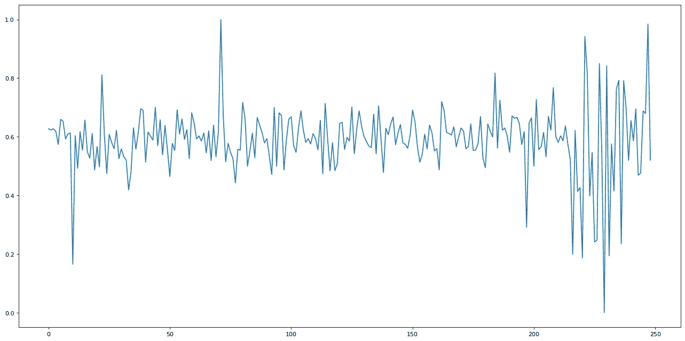

静态数据集的可视化

```
import matplotlib.pyplot as pltfig=plt.figure(figsize=(20, 10), dpi= 80)
fig=plt.plot(X)
```

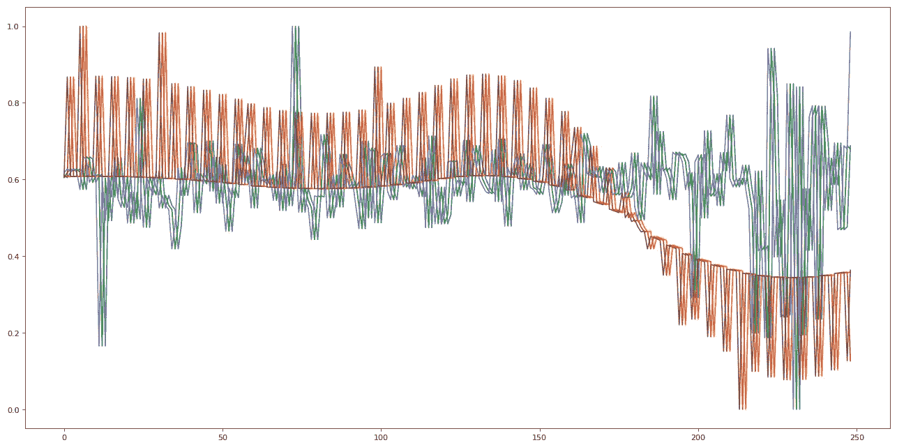

GDP 和 GOOG 价格滞后数据集的可视化

正如你在上面的代码中看到的，我将把数据集分成 X_train，y_train，X_test，y_test。我将使用训练集来训练我们的 AI，X_test 来进行预测，y_test(在其预处理被反转后)来进行估计和真实数据之间的比较。

# 为 LSTM 准备投入

作为输入，我将使用我们的列 var1(t)。因为它的原始形状是(225，6)，所以我需要把它改造成 LSTM 能理解的形式。

```
#reshape [samples, n_input_timesteps, n_features]
X_train = X_train.reshape((225, 6, 1))
y_train = y_train.reshape((225, 1, 1))
print(X_train.shape, y_train.shape)Output:
(225, 6, 1) (225, 1, 1)
```

每一个单独的样本，例如，第一行:

```
X_train[0]
...
```

将有维度(1，6，1)。

# 堆叠 LSTM

我终于可以为我们的神经网络创建模型了。我将使用的 LSTM 被称为堆叠 LSTM，两层神经元，是一种适应多变量时间序列预测的神经网络形式:

```
#LSTM
%tensorflow_version 2.x
import tensorflow as tf
from tensorflow.keras import Sequential
from tensorflow.keras.layers import RepeatVector
from tensorflow.keras.layers import TimeDistributed
from tensorflow.keras import layers
from tensorflow.keras.layers import Dense
from tensorflow.keras.layers import LSTMmodel = Sequential()
model.add(LSTM(100, activation='relu', batch_input_shape=(1, 6, 1)))
model.add(RepeatVector(1)) #numero di output
model.add(LSTM(100, activation='relu', return_sequences=True))
model.add(TimeDistributed(Dense(1)))
model.compile(loss='mse', optimizer='adam')
#model.compile(optimizer='adam', loss='mse')model.fit(X_train, y_train, epochs=3000, batch_size=1, verbose=2, shuffle=False)
model.reset_states()X_test = X_test.reshape(24, 6, 1)
y_test = y_test.reshape(24, 1, 1)
print(X_test.shape, y_test.shape)Output:
...
Epoch 2996/3000
225/225–1s — loss: 0.0004
Epoch 2997/3000
225/225–1s — loss: 0.0005
Epoch 2998/3000
225/225–1s — loss: 0.0001
Epoch 2999/3000
225/225–1s — loss: 0.0002
Epoch 3000/3000
(24, 6, 1) (24, 1, 1)
```

# 逆预处理预测

我可以将我们的预测存储在一个名为 ***yhat*** 的列表中:

```
#make a one-step forecast
yhat = model.predict(X_test, verbose=2, batch_size=1) #SENZA LA BATCH_SIZE, prende un input alla volta, con la batch_size tutto il dataset
print(yhat)
```

不幸的是，如前所述，这种预测将得出相同的输入比例，这已经被标准化，然后缩放。我将不得不颠倒这些过程，以得到一个我实际上可以用来进行比较的数据尺度。


为了反演数据，我需要 y_test_ 和我的预测的原始副本。y_test_ it 是数据的真实版本，因此我想要获得的比例(例如。1300，现在它的对等数字是. 0009)。因为预测 *yhat* 已经被标准化，然后被固定化，它们只不过是一个缺口的集合。我会将这些缺口添加到 y_test_ 的规范化版本中。

## 调节定标器

当把我的缩放器应用到 yhat 时，我需要确保它的大小合适。y_hat 只有一列，我无法使用以前应用于多列的缩放器:

```
#adjust scaler to 1 column
X = K.drop(['GDP'], axis=1)
scaler_3, X = v.partition.scale('all_df', scaler='MinMaxScaler', df=X, to_float=True, return_df=True)
```

## 逆预处理

```
#2   inverse scaling of the prediction
raw = scaler_3.inverse_transform(yhat[:, :, -1])
raw#2   inverse scaling of the gaps
#non so perchè prima ho fatto un reshaping, sembra senza ragione
#comunque, ora correggo
y_test = y_test.reshape(X_test.shape[0], 1)
gap = scaler_2.inverse_transform(y_test)
gap #err#2   invert preprocessing on predicted data
#remove stationary
y_test = y_test.reshape(X_test.shape[0], 1)
var1 = raw    #original values
var2 = gap     #gaps
var3 = list()     ##var1 = var1.values
#var2 = var2.valuesvar3.append(var1[0])
for i in range(0, len(var2)-1):
  values = var1[i] + var2[i+1]
  print('values: ', var1[i], var2[i+1])
  var3.append(values)
var3
```

我将把输出保存为变量**预测的**。

```
predicted = var3
```

# 预期

显示实际发生了什么的标记数据只是被规范化了(这就是为什么它有 _ 作为后缀)。我只需要用我从一开始就保存的**缩放器**将它恢复到正常比例。

```
#invert preprocessing on expected data
#inverse scaling
expected = scaler_.inverse_transform(y_test_)
expected
```

# 比较:预测与预期

我准备比较**预测的**和**预期的**值，看看它们有多接近:

```
for i in range(len(y_test_)-1):
  print('iteration=%d, Predicted=%f, Expected=%f' % (i+1, predicted[i], expected[i]))
iteration=1, Predicted=1327.208740, Expected=1350.199951
iteration=2, Predicted=1255.448730, Expected=1277.060059
iteration=3, Predicted=1482.946533, Expected=1205.300049
iteration=4, Predicted=1337.115722, Expected=1260.000000
iteration=5, Predicted=1123.502320, Expected=1249.699951
iteration=6, Predicted=1312.548218, Expected=1126.000000
iteration=7, Predicted=1234.089355, Expected=1179.000000
iteration=8, Predicted=1256.272949, Expected=1096.000000
iteration=9, Predicted=1338.860352, Expected=1093.109985
iteration=10, Predicted=1344.502563, Expected=1056.510010
iteration=11, Predicted=1292.143799, Expected=1093.050049
iteration=12, Predicted=1309.008422, Expected=1135.719971
iteration=13, Predicted=1355.812745, Expected=1061.319946
iteration=14, Predicted=1346.901367, Expected=1103.770020
iteration=15, Predicted=1305.695068, Expected=1126.469971
iteration=16, Predicted=1279.220459, Expected=1111.800049
iteration=17, Predicted=1332.081665, Expected=1125.670044
iteration=18, Predicted=1343.338867, Expected=1125.040039
iteration=19, Predicted=1393.632202, Expected=1147.300049
iteration=20, Predicted=1311.974854, Expected=1122.000000
iteration=21, Predicted=1323.434204, Expected=1098.260010
iteration=22, Predicted=1190.604858, Expected=1119.015015
iteration=23, Predicted=1472.490967, Expected=1138.000000
iteration=24, Predicted=1398.332275, Expected=1221.000000
```

# 最终图形

```
import matplotlib.pyplot as pltfig=plt.figure(figsize=(20, 10), dpi= 80)
fig=plt.plot(expected)
fig=plt.plot(predicted)
#predicted = orange
#expected = blue
```


橙色=预测，蓝色=预期

# 评估绩效

```
# report performance
from math import *
from sklearn.metrics import mean_squared_error
rmse = sqrt(mean_squared_error(expected[:-1], predicted))
print('Test RMSE: %.3f' % rmse)Output:
Test RMSE: 200.900
```