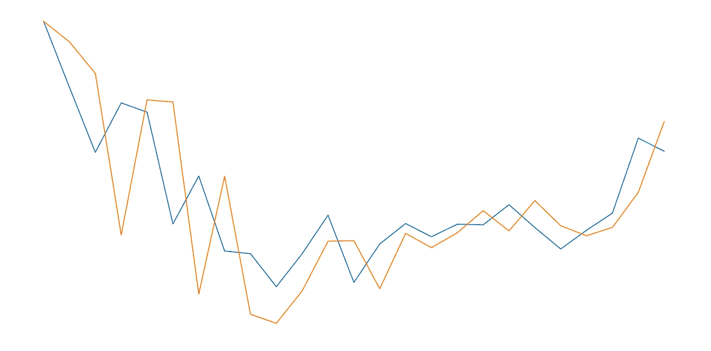
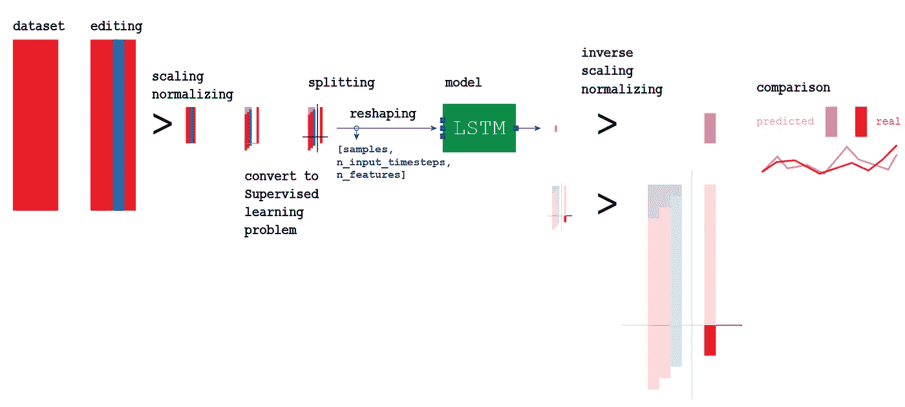
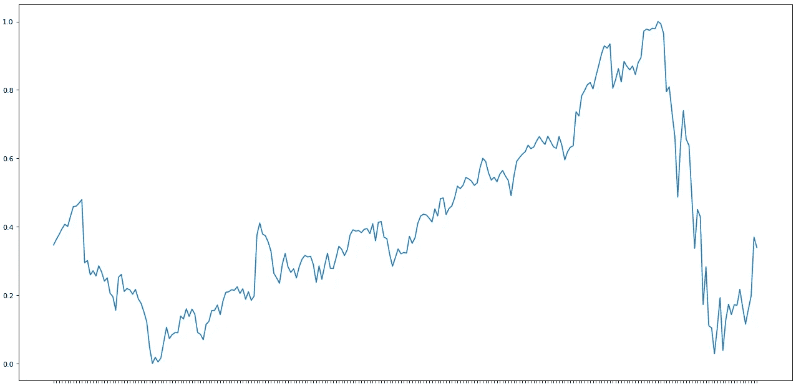
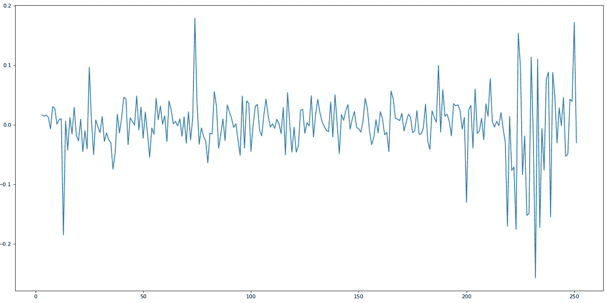
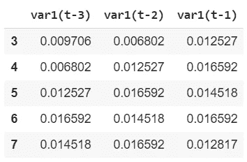
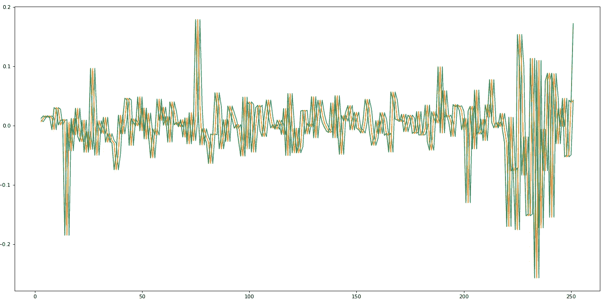
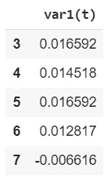
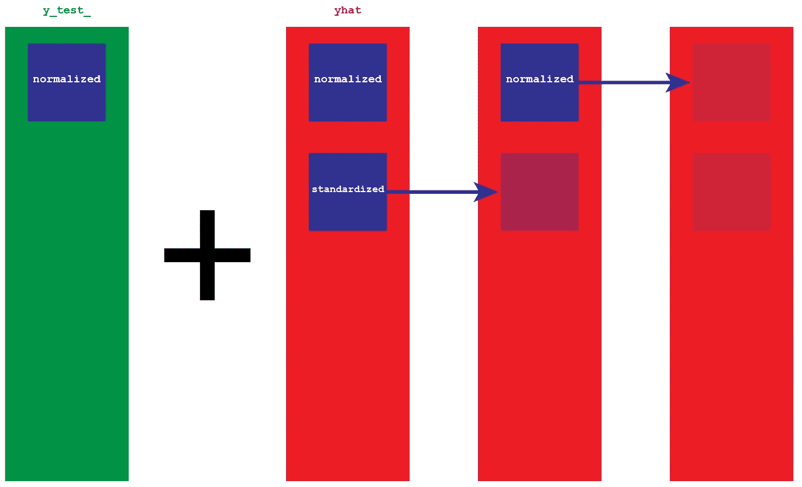
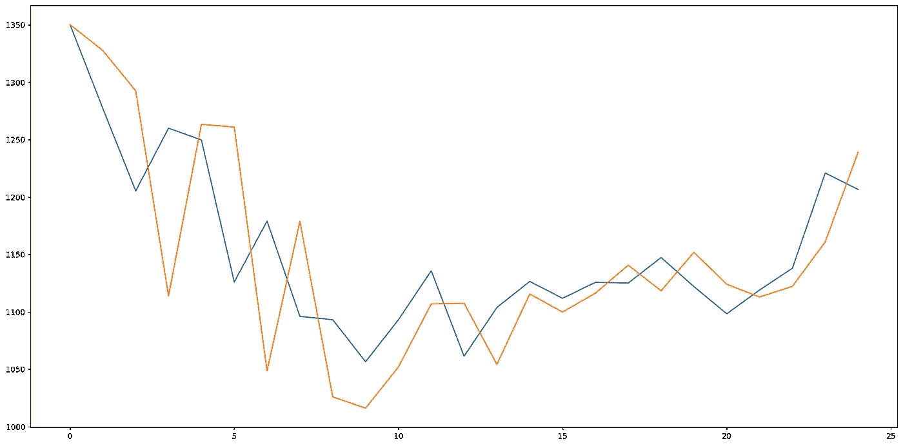

# 使用 LSTM 神经网络的谷歌股票预测

> 原文：<https://pub.towardsai.net/google-stock-predictions-using-an-lstm-neural-network-dbe785949a96?source=collection_archive---------0----------------------->

## 深度学习

## 使用香草 LSTM 进行股票预测

[**点击这里了解我，我的项目，我的最新文章。**](http://www.michelangiolo.best/)

时间序列是一种很难管理的数据格式。与横截面数据相比，预测时间序列的未来结果是一种可以直接应用机器学习算法而无需准备数据的数据格式，属于无监督学习的领域。

*** * *免责声明**:尽管看起来令人兴奋，但这是一个金融分析模型的低分辨率模拟。现实世界的模型要复杂得多，需要多变量数据，并且不限于单个人工智能，而是一组人工智能一起工作。因此，只使用这个模型来训练建立神经网络:不要试图在真实交易中使用它，因为它不复杂，所以缺乏可靠性。



[**完整代码**可在我的存储库(包括。简历和笔记本)。](https://github.com/arditoibryan/GOOG-Stock-predictions) [如果您只想使用**要点**，请点击此链接。](https://gist.github.com/arditoibryan/1fd5fabf36512732ef00bce85d992132)

# 整个过程

为了创建一个能够进行预测的神经网络，我将使用所谓的 LSTM(长短期记忆模型)。如前所述，我们不能使用监督学习问题的相同方法。需要以适当的方式准备数据，以便 LSTM 能够处理这些数据:



我们将要构建的整个模型的可视化

流程中的步骤:

1.  导入模块
2.  导入 df
3.  测向预处理
4.  df 转换为监督问题
5.  df 分为 X_train、y_train、X_test、y_test
6.  将输入整形为[样本，n _ 输入 _ 时间步长，n _ 特征]
7.  创建 LSTM 模式
8.  使用 X_train，y_train 拟合模型
9.  对前进的每一步进行评估
10.  对输出进行反向预处理
11.  实数值的反向预处理
12.  比较预测和估计

# tf _ 数据集 _ 提取器

为了加快预处理速度，我将使用我的名为 [tf_dataset_extractor 的个人库，可以从这个链接获得。](https://github.com/arditoibryan/General)该库包含两个用于快速预处理的类。如果您希望了解每个预处理步骤的细节，您可以简单地查看里面的代码。

```
import sys
sys.path.append('/content/drive/My Drive/Colab Notebooks/TensorFlow 2.0/modules')import pandas as pd
import tf_dataset_extractor as e
#import grapher_v1_1 as g
#import LSTM_creator_v1_0 as l
v = e.v
l = e.l
```

我将从实例化 tf_dataset_extractor 中的两个类开始:

*   “v”实例化了一个包含横截面数据预处理算法的类
*   “l”实例化一个包含时序数据预处理算法的类

# GOOG 股票

```
#import dataset
v.upload.online_csv('/content/drive/My Drive/Colab Notebooks/TensorFlow 2.0/csv/GOOG.csv')
e.K = v.upload.make_backup()
```

为了您的方便，我已经将谷歌股票(GOOG)1 年的股票表现保存在一个. csv 文件中，您可以在这里下载。因为我用的是 Google Colab，所以会从我的个人硬盘加载。您可以下载。csv 并从自己的路径导入。

# 预处理

我们将需要我们将要创建的分区的两个副本。将只对原始副本进行规范化，而第二个副本将先进行规范化，然后进行标准化。保留两个副本的原因是，我们需要将输出重新转换为初始比例。到时候我会解释详细的程序。

## 仅标准化

```
#preprocessing with normalization only
v.upload.retrieve_backup(e.K)#dropping extra columns
e.X = e.X.drop(['High', 'Low', 'Close', 'Adj Close', 'Volume'], axis=1)#preprocessing
index = e.X.pop('Date')
scaler, e.X = v.partition.scale('all_df', scaler='MinMaxScaler', df=e.X, to_float=True, return_df=True)
e.X = e.X.set_index(index)
e.X = l.preprocessing.series_to_supervised(e.X, 3, 1)#X, y
v.extract.labels(['var1(t)'])#train, test
X_train_, X_test_ = l.preprocessing.split(0.1, e.X)
y_train_, y_test_ = l.preprocessing.split(0.1, e.y)
e.X_ = e.X.copy()
e.y_ = e.y.copy()
print(X_train_.shape, X_test_.shape, y_train_.shape, y_test_.shape)
```

正如我们所看到的，我们存储的所有变量都有一个 _ 作为后缀，以区别于其他变量。

```
import matplotlib.pyplot as plt
fig=plt.figure(figsize=(20, 10), dpi= 80)
fig=plt.plot(e.y)
```



到目前为止，我们的数据只在从 0 到 1 的范围内进行了调整。

## 规范化+标准化

```
#preprocessing with normalization and standardization
v.upload.retrieve_backup(e.K)#dropping extra columns
e.X = e.X.drop(['High', 'Low', 'Close', 'Adj Close', 'Volume'], axis=1)#preprocessing
index = e.X.pop('Date')
scaler, e.X = v.partition.scale('all_df', scaler='MinMaxScaler', df=e.X, to_float=True, return_df=True)
e.X = e.X.set_index(index)
l.preprocessing.transform_to_stationary()
e.X = l.preprocessing.series_to_supervised(e.X, 3, 1, drop_col=False)#X, y
v.extract.labels(['var1(t)'])#train, test
X_train, X_test = l.preprocessing.split(0.1, e.X)
y_train, y_test = l.preprocessing.split(0.1, e.y) #sembra non servire a nulla
print(X_train.shape, X_test.shape, y_train.shape, y_test.shape)
```

以上所有变量都以 no _ 为后缀。我们实际上不需要保存所有这些副本。实际上，这些代码中的大部分并不是真正必要的，但是对我来说解释起来会更容易。要知道我们将保留一个规范化的副本(在每个变量的末尾用 _ 定义)和整个 df 的一个规范化+标准化的副本。

```
import matplotlib.pyplot as plt
fig=plt.figure(figsize=(20, 10), dpi= 80)
fig=plt.plot(e.y_)
```



这就是一个规范化+标准化的预处理的样子。我们会把这些数据传送给 LSTM，它会做出预测。

# 输入和输出

在预处理过程中，我们隔离了数据集 e.y 和 e.X。如果我们在分割前查看这两个数据集，基本上我们得到的结果是:

*   投入

```
e.X.head()
```



```
import matplotlib.pyplot as plt
fig=plt.figure(figsize=(20, 10), dpi= 80)
fig=plt.plot(e.X)
```



我们只取了时间为 0 的股票数据集，我们移动了三次，将每次移动存储在不同的列中，结果得到了上图。这叫做**滞后**。LSTM 将向后看三步，做出一步的未来预测。

*   输出

```
e.y.head()
```



我们将使用标签来训练 LSTM。在这种情况下，我们希望 LSTM 只着眼于未来的一步，因此只有一列。

# 剧烈的

正如你在上面的代码中看到的，我们的数据集将被分割成 X_train，y_train，X_test，y_test。我们将使用训练集来训练我们的 AI，X_test 来进行预测，最后，y_test 来比较估计值和真实数据。

# 为 LSTM 准备投入

作为输入，我们将使用我们的列 var1(t)。因为它的原始形状是(225，3)，我们将需要以 LSTM 可以理解的形式重新塑造它:[samples，n_input_timesteps，n_features]。

```
#reshape [samples, n_input_timesteps, n_features]
X_train = X_train.reshape((225, 3, 1))
y_train = y_train.reshape((225, 1, 1))
print(X_train.shape, y_train.shape)
#every individual sample has dimensions [1, 3, 1]
```

每一个单独的样本，例如，第一行:

```
X_train[0]
array([[0.00970626], [0.00680232], [0.01252675]])
```

将有维度(1，3，1)。

# 香草 LSTM

我们终于可以为我们的神经网络创建模型了。我将使用的 LSTM 被称为香草 LSTM，是一种用于单变量时间序列预测的简单形式的神经网络，它只包含一个密集层:

```
#LSTM
%tensorflow_version 2.x
import tensorflow as tf
from tensorflow.keras import Sequential
from tensorflow.keras import layers
from tensorflow.keras.layers import Dense
from tensorflow.keras.layers import LSTMmodel = Sequential()
model.add(LSTM(50, batch_input_shape=(1, 3, 1), stateful=True))
model.add(Dense(1))
model.compile(loss=’mean_squared_error’, optimizer=’adam’)model.fit(X_train, y_train, epochs=3000, batch_size=1, verbose=2, shuffle=False)
model.reset_states()
X_test = X_test.reshape(24, 3, 1)
y_test = y_test.reshape(24, 1, 1)
print(X_test.shape, y_test.shape)...
Epoch 2998/3000 225/225 - 0s - loss: 1.7274e-04 
Epoch 2999/3000 225/225 - 0s - loss: 2.9163e-04 
Epoch 3000/3000 225/225 - 0s - loss: 2.8836e-04 
(24, 3, 1) (24, 1, 1)
```

# 预言；预测；预告

我们可以将我们的预测存储在一个名为 *yhat* 的列表中:

```
#make a one-step forecast
yhat = model.predict(X_test, verbose=2, batch_size=1) 
#without batch_size the model only accepts one input at a time
yhat
24/24 - 0s 
[
[ 0.0721423 ]  
[-0.13979942]  
[ 0.02534528]  
[-0.15360811]  
[ 0.04295617]  
[ 0.14269553]  
[ 0.06470203]  
[ 0.02760611]  
[ 0.03455507]  
[-0.13316691]  
[ 0.03844658]  
[-0.00989904]  
[ 0.08717629]  
[ 0.00703726]  
[-0.05191287]  
[ 0.00792047]  
[-0.0025476 ]  
[ 0.01022832]  
[ 0.06648263]  
[ 0.05616217]  
[ 0.03048991]  
[-0.02833473]  
[ 0.00622515]  
[-0.0042644 ]
]
```

不幸的是，如前所述，我们的预测将得出相同比例的输入，这已经标准化，然后缩放。我们将不得不颠倒这些过程，以得到一个我们可以实际比较的数据尺度。



为了反演数据，我们将需要 y_test_ 和我们的预测的原始副本。y_test_ it 是数据的真实版本，因此我们想要获得的比例(例如 1300，现在它的对等数字是. 0009)。因为预测 *yhat* 已经被标准化，然后被固定化，它们只不过是一个缺口的集合。我们将把这些缺口添加到 y_test_ 的规范化版本中。

```
#invert preprocessing on predicted data
#remove stationary
y_test = y_test.reshape(24, 1)var1 = y_test_    #original values
var2 = yhat       #gaps
var3 = list()     ##var1 = var1.values
#var2 = var2.valuesvar3.append(var1[0])
for i in range(0, len(var2)):
  values = var1[i] + var2[i]
  var3.append(values)
  var3
```

在这一点上，我们仍然有我们的预测的标准化版本。我们颠倒预处理，我们有数以千计的规模。

```
#inverse scaling
predicted = scaler.inverse_transform(var3)
predicted
array([
[1350.19995824],        
[1384.98480799],        
[1209.65298139],        
[1217.52072549],        
[1185.93480519],        
[1270.41216402],        
[1194.80344785],        
[1210.19733755],        
[1109.31081349],        
[1109.77145847],        
[ 992.30088891],        
[1111.58781353],        
[1130.94699481],        
[1103.35372615],        
[1107.16316306],        
[1101.43918236],        
[1115.61908397],        
[1124.44163555],        
[1129.97183253],        
[1179.35603071],        
[1149.07968629],        
[1112.96137088],        
[1105.35280738],        
[1141.00156137],        
[1218.94379394]
])
```

# 预期

显示实际发生了什么的标记数据只是被规范化了(这就是为什么它有 _ 作为后缀)。我们只需要使用我们从一开始就保存的**缩放器**将它恢复到正常比例。

```
#invert preprocessing on expected data
#inverse scaling
expected = scaler.inverse_transform(y_test_)
expected
array([
[1350.2  ],        
[1277.06 ],        
[1205.3  ],        
[1260\.   ],        
[1249.7  ],        
[1126\.   ],        
[1179\.   ],        
[1096\.   ],        
[1093.11 ],        
[1056.51 ],        
[1093.05 ],        
[1135.72 ],        
[1061.32 ],        
[1103.77 ],        
[1126.47 ],        
[1111.8  ],        
[1125.67 ],        
[1125.04 ],        
[1147.3  ],        
[1122\.   ],        
[1098.26 ],        
[1119.015],        
[1138\.   ],        
[1221\.   ],        
[1206.5  ]
], dtype=float32)
```

# 比较

我们准备将**预测值**与**预期值**进行比较，看看它们有多接近:

```
for i in range(len(y_test_)):
  print('iteration=%d, Predicted=%f, Expected=%f' % (i+1,   predicted[i], expected[i]))
iteration=1, Predicted=1350.199958, Expected=1350.199951 iteration=2, Predicted=1384.984808, Expected=1277.060059 iteration=3, Predicted=1209.652981, Expected=1205.300049 iteration=4, Predicted=1217.520725, Expected=1260.000000 iteration=5, Predicted=1185.934805, Expected=1249.699951 iteration=6, Predicted=1270.412164, Expected=1126.000000 iteration=7, Predicted=1194.803448, Expected=1179.000000 iteration=8, Predicted=1210.197338, Expected=1096.000000 iteration=9, Predicted=1109.310813, Expected=1093.109985 iteration=10, Predicted=1109.771458, Expected=1056.510010 iteration=11, Predicted=992.300889, Expected=1093.050049 iteration=12, Predicted=1111.587814, Expected=1135.719971 iteration=13, Predicted=1130.946995, Expected=1061.319946 iteration=14, Predicted=1103.353726, Expected=1103.770020 iteration=15, Predicted=1107.163163, Expected=1126.469971 iteration=16, Predicted=1101.439182, Expected=1111.800049 iteration=17, Predicted=1115.619084, Expected=1125.670044 iteration=18, Predicted=1124.441636, Expected=1125.040039 iteration=19, Predicted=1129.971833, Expected=1147.300049 iteration=20, Predicted=1179.356031, Expected=1122.000000 iteration=21, Predicted=1149.079686, Expected=1098.260010 iteration=22, Predicted=1112.961371, Expected=1119.015015 iteration=23, Predicted=1105.352807, Expected=1138.000000 iteration=24, Predicted=1141.001561, Expected=1221.000000 iteration=25, Predicted=1218.943794, Expected=1206.500000
```

# 绘制图形

```
import matplotlib.pyplot as pltfig=plt.figure(figsize=(20, 10), dpi=80)
fig=plt.plot(expected)
fig=plt.plot(predicted)
```



# 评估绩效

正如我们所看到的，这个模型并不太准确。然而，在股票市场上，我们不能简单地根据单一变量进行预测，这是不现实的；这就是为什么我们需要更复杂的模型来进行估计。

```
# report performance
from math import *
from sklearn.metrics import mean_squared_errorrmse = sqrt(mean_squared_error(expected, predicted))
print(‘Test RMSE: %.3f’ % rmse)
Test RMSE: 58.232
```