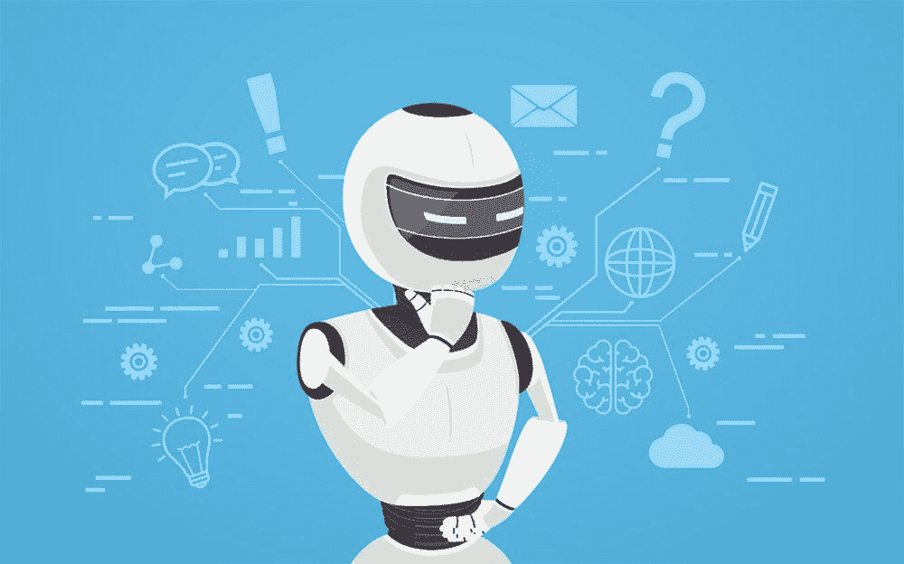
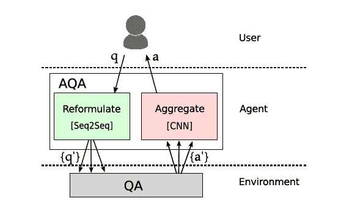
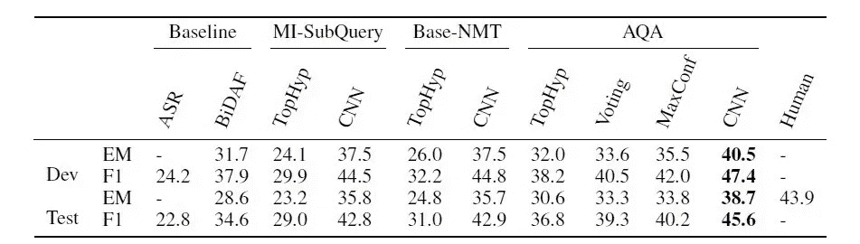

# 谷歌训练强化学习代理提出正确的问题

> 原文：<https://pub.towardsai.net/google-trains-reinforcement-learning-agents-to-ask-the-right-questions-3f7eafabb3fe?source=collection_archive---------2----------------------->

## [人工智能](https://towardsai.net/p/category/artificial-intelligence)

## AQA 训练代理主动回答问题。

来源:[https://www . cigen . com . au/cigen blog/top-5-RPA-questions-customers-ask-we-answer-them](https://www.cigen.com.au/cigenblog/top-5-rpa-questions-customers-ask-we-answer-them)

> 我最近创办了一份专注于人工智能的教育时事通讯，已经有超过 80，000 名订户。《序列》是一份无废话(意思是没有炒作，没有新闻等)的 ML 导向时事通讯，需要 5 分钟阅读。目标是让你与机器学习项目、研究论文和概念保持同步。请通过订阅以下内容来尝试一下:

 [## 序列

### 订阅人工智能世界中最相关的项目和研究论文。受到 85，000 多人的信任…

thesequence.substack.com](https://thesequence.substack.com/) 

语言智能的大部分努力集中在从文本数据集中提取知识的训练模型上。这种范式假设目标知识已经嵌入数据集中，不需要任何进一步的澄清，但这很少类似于人类的学习方式。当面对一个新的主题时，我们总是被迫提出问题并进行澄清。如果我们可以将同样的技能构建到人工智能(AI)模型中，会怎么样？

提出问题的能力是人类认知过程的基本要素。人类对话的基石依赖于我们用无数种方式表达问题以获得特定答案的能力。问题重构通过澄清一个特定的点来帮助人类克服不确定性。近年来，人工智能(AI)领域在专注于问答(QA)的自然语言处理(NLP)系统方面取得了令人难以置信的进展。尽管取得了进步，但大多数 NLP 问答系统缺乏像人类一样处理不确定性的能力，通过重新制定问题，发布多次搜索，评估和汇总响应。2018 年，来自谷歌的人工智能研究人员发表了一篇[研究论文](https://ai.google/research/pubs/pub46733)和一个[开源 TensorFlow 包](https://github.com/google/active-qa)，提出了一种强化学习技术，以训练智能体主动回答问题。

谷歌的主动问答代理(AQA)背后的想法相对简单。给定一个特定的问题，AQA 代理将多次重新制定问题，以确认正确的答案。例如，考虑问题“*特斯拉是什么时候出生的？*”。代理以两种不同的方式重新表述问题:“*特斯拉的生日是什么时候*”和“*特斯拉是哪一年出生的*”，从 QA 系统中检索这两个问题的答案。使用所有这些信息，它决定返回“*1856 年 7 月 10 日*”。

图片来源:谷歌

# 内部 AQA

Google 的主动问答(AQA)代理基于三个基本组件:环境、重构和答案选择模型。AQA 模型与黑盒环境交互。AQA 用一个问题的多个版本查询它，最后返回找到的最佳答案。

图片来源:谷歌

# 问答环境

AQA 环境基于[双向注意力流(BiDAF)](https://allenai.github.io/bi-att-flow/) 模型。BiDAF 是竞争性的神经问答模型，它能够产生查询感知的上下文表示，而不需要早期的摘要。在 AQA 的情况下，BiDAF 能够从给定文档的连续范围中选择答案。给定一个问题，环境会返回一个答案，并在训练期间返回一个奖励。

# 重构模型

Google 的 AQA 使用一个预训练的[序列到序列](https://papers.nips.cc/paper/5346-sequence-to-sequence-learning-with-neural-networks.pdf)模型作为它的重构机制。序列对序列技术在包括机器翻译在内的几个 NLP 领域已经变得流行。在某种程度上，翻译是对不同语言的重新表述😉。在 AQA 的情况下，重构系统接收问题并以相同的原始语言返回其重构。

与传统的序列对序列方法的一个主要偏差是，Google 的 AQA 使用了强化学习和策略梯度方法。对于给定的问题 q0，我们希望返回最佳可能答案 a*，最大化奖励 a* = argmaxa R(ajq0)。相对于原始问题 q0 计算奖励，同时为 q 提供答案

# 答案选择模型

答案选择模型的作用是从一组生成的答案{a1，a2…中确定最佳答案。安}。在培训期间，AQA 可以获得针对每个重新制定的 qi 返回的答案的奖励。然而，在考试时，我们必须预测最佳答案 a*。问题选择问题被设计成一个二元分类任务，区分高于和低于平均水平的表现。在训练中，AQA 为每个实例计算答案的 F1 分数。如果重写产生的答案的 F1 分数大于其他重写的平均分数，则该实例被分配一个正标签。

谷歌团队评估了不同的选项，如 FFNNs、LSTM 或 CNN，以实现答案选择模型。虽然所有选项产生了可比较的结果，但 CNN 在计算效率方面提供了一些优势。最终，AQA 的答案选择模型是使用预先训练好的查询、重写和答案的嵌入实现的。对于每个嵌入，AQA 添加一个一维 CNN，然后是最大池。然后，三个结果向量被连接起来，并通过产生输出的前馈网络。

# AQA 在行动

谷歌团队使用不同的实验评估了其主动问答(AQA)模型。值得注意的是，他们使用了基于一组危险线索的 SearchQA 数据集。线索是令人困惑的查询，比如这个*“我们的国父‘并没有真的砍倒一棵樱桃树’”。*每条线索都与正确答案相关联，例如乔治·华盛顿，以及来自谷歌热门搜索结果的片段列表。SearchQA 包含超过 14 万个问题/答案对和 690 万个片段。AQA 在 SearchQA 数据集上进行训练，并且能够优于其他问答方法，如基本 NMT 或 MI 子查询，如下节所示。

图片来源:谷歌

问题重构是人类对话本质的一部分。虽然人工智能代理在类似人类的语言环境中还有很长的路要走，但谷歌的 AQA 等技术通过提出正确的问题，提供了一种更有效的方式来减少不确定性。