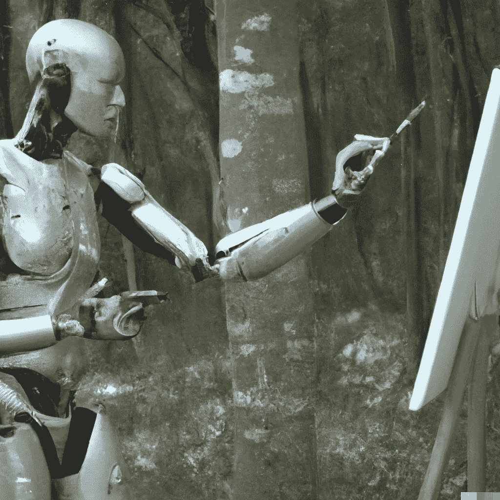
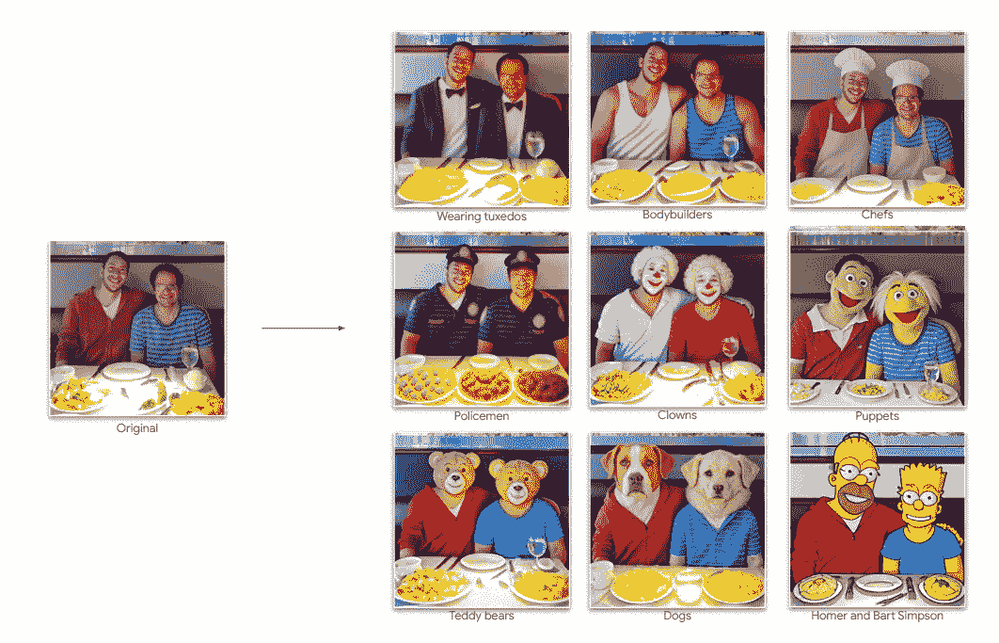
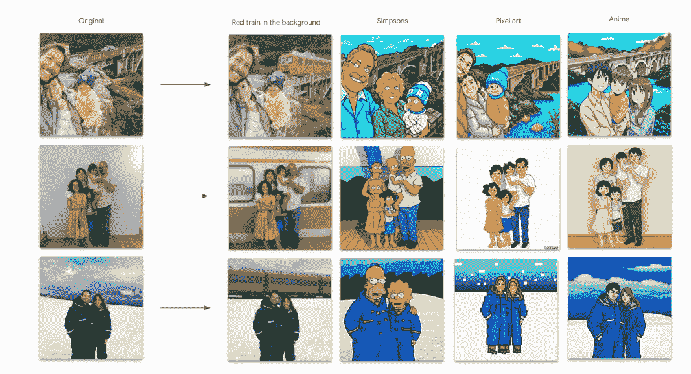
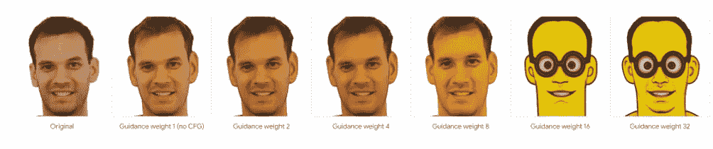
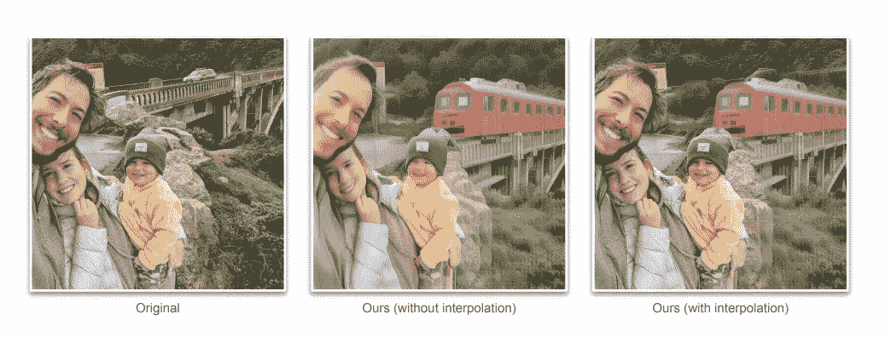
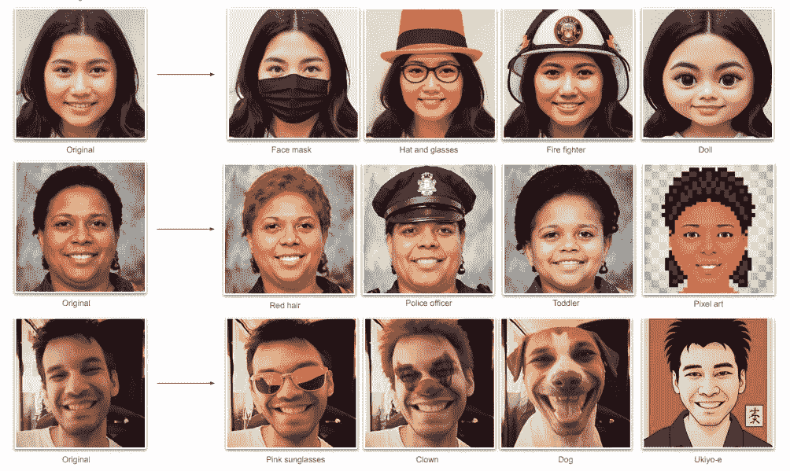
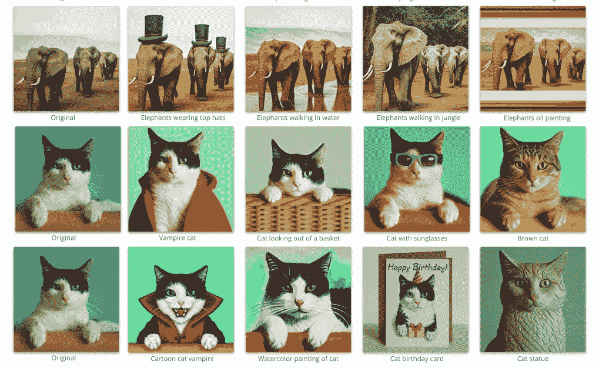

# Google UniTune:文本驱动的图像编辑

> 原文：<https://pub.towardsai.net/google-unitune-text-driven-image-editing-4b176b1b16a1?source=collection_archive---------1----------------------->

## 如何用文字修改你的图像

作者使用 [DALL-E 2](https://arxiv.org/pdf/2204.06125.pdf) 生成的图像

谷歌最近在 arXiv 上发布了一款新机型: [UniTune](https://arxiv.org/pdf/2210.09477.pdf) 。该模型能够进行一般的文本驱动的图像编辑。让我们一起来发现它在做什么，为什么这种模式是一种进步。

**为什么是这种模式？为什么是现在？**

任何试图从事人工智能艺术的人都注意到了一些奇怪的事情。当然，DALL-E、稳定扩散和中途提出了非凡的结果，但在最初的热情之后，确切地得到你想要的是相当复杂的。你必须对参数做一些改动，尝试改变用词，尝试添加更多的形容词。

这种方法被称为**即时工程**，在这种方法中，你试图将所有的元素组装起来，以达到预期的效果。还有一种叫做**逆向工程**的方法，从一幅图像和它的文本提示开始，你试图要么重新创建它，要么识别允许它生成的元素。

顺便说一下，也有一些资源允许你尝试直接从图像开始，尝试重建文本提示的元素(你可以试试这个 [Google Colab](https://colab.research.google.com/github/pharmapsychotic/clip-interrogator/blob/main/clip_interrogator.ipynb#scrollTo=ytxkysgmrJEi) )。然而，结果远不如人们所希望的那么令人兴奋，并且经常需要多次尝试。

有深度学习经验的人都知道**微调**是什么。微调模型可以使模型适合您的特定情况，而不必再次从头开始训练它。该模型考虑了一般能力，并适应于特定任务(例如，对数百万张图像进行训练的卷积网络进行微调，以识别花卉品种)。这种方法也有可能稳定扩散。这就引出了一个问题，**微调一个从文本提示生成图像的模型意味着什么？**

在稳定扩散的情况下，[微调是指对嵌入](https://towardsdatascience.com/how-to-fine-tune-stable-diffusion-using-textual-inversion-b995d7ecc095)进行微调，根据自定义样式或对象创建个性化图像。我们不从头开始微调模型，而是用某些类型的图像的新示例来呈现它，以允许它专门化。

问题是我们经常不知道我们需要微调多少个和哪些例子。Google Uni-tune 是如何解决这个问题的？

**Google UniTune**

来自原文章:[来源](https://arxiv.org/pdf/2210.09477.pdf)

先来个大概描述。Google Unitune 获取图像和文本描述并编辑图像，同时保持对原始图像的高度语义和视觉保真度。此外，不像其他模型，它不需要另一个输入或面具或草图。

> 我们方法的核心是观察到，通过正确选择参数，我们可以在单个图像上微调大型文本到图像扩散模型，鼓励模型保持对输入图像的保真度，同时仍然允许表达操作。我们使用 Imagen 作为我们的文本到图像模型，但我们希望 UniTune 也能与其他大规模模型一起工作。我们在一系列不同的用例中测试了我们的方法，并展示了它的广泛适用性——[原文](https://arxiv.org/pdf/2210.09477.pdf)

来自原文章:[来源](https://arxiv.org/pdf/2210.09477.pdf)

同时，从描述中我们可以看到，UniTune 背后的模型是 Imagen(一个稳定的类扩散模型，以文本提示作为输入，返回一个图像)。第二，一般来说，我们尽量避免过拟合，微调有助于防止过拟合。然而，在这种情况下，由于我们希望保持图像的高保真度，一些过度拟合是有益的。

该模型采用左边的图像和提示(在本例中为“minion”)，使用不同数量的分类器自由引导权重，结果演变并微调图像

来自原文章:[来源](https://arxiv.org/pdf/2210.09477.pdf)

本文简要解释了微调过程:

> 我们的目标是将(base_image，edit_prompt)的输入转换为 edited_image。简而言之，我们的系统在(base_image，rare_tokens)对上微调文本到图像和超分辨率图像模型，用于非常少的迭代次数，然后在以“[rare_tokens] edit_prompt”的形式调节文本的同时从模型中采样。

他们还使用无分类器指导，这是 Imagen 等文本到图像模型使用的一种技术，用于指导模型与文本提示保持一致。
此外，作者还使用插值进行了插值实验。

来自原文章:[来源](https://arxiv.org/pdf/2210.09477.pdf)

此外，in-panting(由 DALL-E 2 使用)需要一个显式遮罩来执行编辑。另一方面，UniTune 不需要掩码，只需要文本提示

来自原文章:[来源](https://arxiv.org/pdf/2210.09477.pdf)

UniTune 并不缺乏限制，通常，当 Imagen 遇到困难时，这些限制就会出现(这意味着该技术的能力受到底层文本到图像模型的限制)。在某些情况下，主体面部可能会被交换或克隆(重复不止一次)。另一个突出的问题是，在某些情况下，我们很难在保真度和表现力之间找到一个好的平衡(尤其是在处理小的编辑时)。

此外，延迟也是一个问题；第一步(微调基础模型)使用 TPUv4 需要 3 分钟，并且需要对每个输入图像运行一次。另一方面，后续步骤需要大约 30 秒。此外，UniTune 使用许多参数来调整最终输出。

**离别的思念**

在本文中，Google 展示了 UniTune，这是一种简单的文本驱动图像编辑方法。UniTune 在场景中放置对象或进行全局编辑，仅保留文本描述中的语义细节。

在未来，这种方法可以用来编辑照片或做其他图像编辑，通过文本提示向程序解释你想做什么改变。此外，手机用户也可以使用这种方法(过滤，在上传照片前快速编辑照片)。无论如何，作者指出，它可以在未来得到改进(自动调整保真度-表现力度盘，提高成功率，加快生成过程)。

来自原文章:[来源](https://arxiv.org/pdf/2210.09477.pdf)

此外，这种想法开辟了更多的全球视角，例如更好地理解扩散模型嵌入，减少权重的数量，以及通过单个示例测试对其他模型(如 GPT)使用微调的假设。

另一方面，在文章中，他们也讨论了他们工作中潜在的问题:

> 然而，我们认识到这项研究的应用可能会以复杂的方式影响个人和社会(见[2]的概述)。特别是，这种方法说明了这种模型可以很容易地用于改变敏感特征，如肤色、年龄和性别。尽管通过图像编辑软件这早已成为可能，但文本到图像的模式可以使它变得更容易

# 如果你觉得有趣:

你可以寻找我的其他文章，你也可以 [**订阅**](https://salvatore-raieli.medium.com/subscribe) 在我发表文章时获得通知，你也可以在**[**LinkedIn**](https://www.linkedin.com/in/salvatore-raieli/)**上连接或联系我。**感谢您的支持！**

**这是我的 GitHub 知识库的链接，我计划在这里收集代码和许多与机器学习、人工智能等相关的资源。**

** [## GitHub - SalvatoreRa/tutorial:关于机器学习、人工智能、数据科学的教程…

### 关于机器学习、人工智能、数据科学的教程，包括数学解释和可重复使用的代码(python…

github.com](https://github.com/SalvatoreRa/tutorial) 

或者随意查看我在 Medium 上的其他文章:

 [## 用艾重新想象小王子

### 人工智能如何从《小王子》中的人物描述中重构他们的形象

medium.com](https://medium.com/mlearning-ai/reimagining-the-little-prince-with-ai-7e9f68ed8b3c)  [## 人工智能如何拯救亚马逊雨林

### 亚马逊正处于危险之中，人工智能可以帮助保护它

towardsdatascience.com](https://towardsdatascience.com/how-artificial-intelligence-could-save-the-amazon-rainforest-688fa505c455)  [## 融合人工智能的力量和诗歌的细腻

### 人工智能现在能够从文本中生成图像，如果我们给它们提供伟大诗人的话语会怎么样？梦幻之旅…

towardsdatascience.com](https://towardsdatascience.com/blending-the-power-of-ai-with-the-delicacy-of-poetry-3671f82d2e1)  [## 说生命的语言:AlphaFold2 和公司如何改变生物学

### 人工智能正在重塑生物学研究，并开辟治疗的新领域

towardsdatascience.com](https://towardsdatascience.com/speaking-the-language-of-life-how-alphafold2-and-co-are-changing-biology-97cff7496221)**