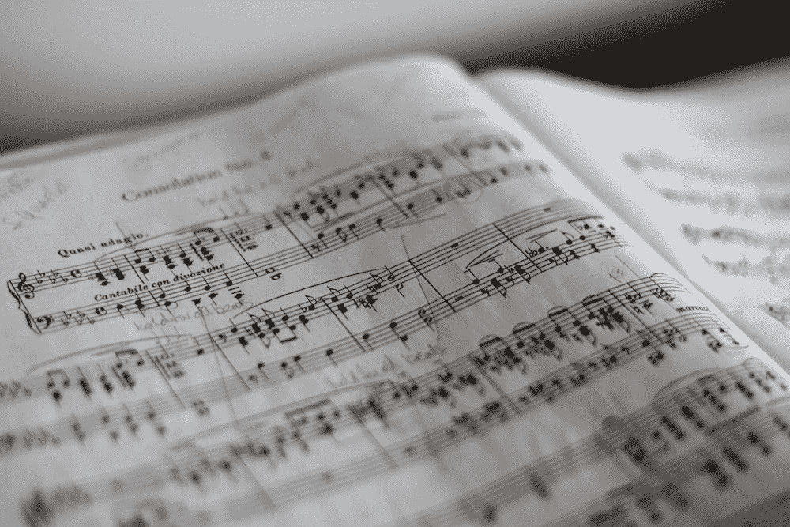

# 谷歌的 Audiolm:通过听一首歌的片段来产生音乐

> 原文：<https://pub.towardsai.net/googles-audiolm-generating-music-by-hearing-a-song-s-snippet-c9512a9290cd?source=collection_archive---------2----------------------->

## 无论是音乐还是语音，谷歌的新模式都可以继续播放所听到的内容。

马里乌斯·马萨拉尔在 unsplash.com 拍摄的照片

AudioLM 是谷歌的新型号，能够生成与提示相同风格的音乐。该模型还能够产生复杂的声音，如钢琴音乐或人们的谈话。结果令人震惊。事实上，它似乎和原作没有什么区别。

**为什么创作音乐很难？**

在 unsplash.com 由 [Dolo Iglesias](https://unsplash.com/@dolodol) 拍摄的图片

创作音乐不是一件容易的事情。事实上，生成音频信号(音乐、环境声音、人们的讲话)需要多个抽象尺度。例如，音乐有一个需要长时间分析的结构，也是由无数相互作用的信号组成的。甚至个人语音本身也可以在不同的层面进行分析，可以是简单的声音信号或语音，也可以是韵律、句法、语法或语义。

之前已经进行了几次尝试。第一次尝试生成音乐的重点是生成 MIDI 文件(他们为钢琴生成 MIDI 音乐的有趣项目是在 2018 年使用转换器创建的[)。此外，一些研究侧重于诸如](https://magenta.tensorflow.org/music-transformer)[文本到语音](https://ai.googleblog.com/2017/12/tacotron-2-generating-human-like-speech.html)的任务，其中语音是从抄本生成的。问题是，所有不在抄本中的内容都没有翻译成音频文件。几项研究解释了在人类交流中，停顿和变调以及其他信号是多么的重要。

例如，那些使用 Alexa 或其他扬声器的人已经注意到声音听起来不自然。尤其是早期，无论发音多么正确，听起来都不自然，给人一种诡异的效果。

**AudioLM，谷歌新机型**

图片由普里西拉·杜·普里兹在 unsplash.com 拍摄

日前，谷歌宣布发布新模型:“ [AudioLM:音频生成的语言建模方法](https://arxiv.org/abs/2209.03143)”。新模型能够仅通过听音频来生成音频(例如真实的音乐和语音)。

正如他们在博客中所写的，近年来，自然语言处理领域有了很大的进步。事实上，语言模型已经被证明在许多任务中非常有效。这些系统中的许多都是基于使用[转换器](https://en.wikipedia.org/wiki/Transformer_(machine_learning_model))，使用过它们的人都知道，最初的预处理步骤之一是标记化(将文本分解成较小的单元，这些单元被赋予一个数值)。

> AudioLM 背后的关键直觉是利用语言建模中的这种进步来生成音频，而无需经过带注释数据的训练。— [谷歌人工智能博客](https://ai.googleblog.com/2022/10/audiolm-language-modeling-approach-to.html)

AudioLM 不需要转录或标记。作者收集了一个声音数据库，并直接输入到模型中。该模型将声音文件压缩成一系列片段(类似于标记)。然后使用这些标记，就好像它们是 NLP 模型一样(该模型以这种方式使用相同的方法来学习各种音频片段之间的模式和关系)。与文本生成模型一样，AudioLM 通过提示生成声音。

结果很有意思，声音自然多了。AudioLM 似乎能够找到并再现人类音乐中存在的某些模式(如钢琴键被敲击时每个音符中包含的细微振动)。在下面的链接中，谷歌提供了一些例子，如果你有兴趣听的话:

 [## 有声电影

### 扎兰·博尔索斯、拉斐尔·马里尼尔、达米安·文森特、尤金·哈利托诺夫、奥利维尔·皮特奎因、马特·沙里菲、奥利维尔·特布尔……

google-research.github.io](https://google-research.github.io/seanet/audiolm/examples/) 

AudioLM 已经在一个巨大的声音库中接受了训练，其中不仅包括音乐，还包括人声。出于这个原因，该模型可以生成由人类生成的句子。该模型能够识别说话者的口音，并添加停顿和感叹词。虽然该模型生成的许多句子没有意义，但结果令人印象深刻。

事实上，将声音序列视为单词序列似乎是一种聪明的方法，尽管如此，仍然存在一些困难:

> 首先，我们必须应对音频的数据速率明显更高的事实，从而导致更长的序列——虽然一个书面句子可以由几十个字符表示，但其音频[波形](https://en.wikipedia.org/wiki/Waveform)通常包含数十万个值。第二，文本和音频是一对多的关系。这意味着同一句话可以由不同的说话人以不同的说话风格、情感内容和录音条件进行渲染。— [谷歌人工智能博客](https://ai.googleblog.com/2022/10/audiolm-language-modeling-approach-to.html)

更详细地说，音频标记化方法已经由 [OpenAI Jukebox](https://openai.com/blog/jukebox/) 尝试过，只是该模型产生了更多的伪像，并且声音听起来不自然。

AudioLM 中使用的记号赋予器概述。图片来自原纸([此处](https://arxiv.org/pdf/2209.03143.pdf))

如作者所述，该模型由三部分组成:

*   **一个记号赋予器模型**，它将一个声音序列映射成一个离散的记号序列。这一步还减小了序列的大小(采样率减小了大约 300 倍)。
*   **一个只有解码器的变换器**(一个经典语言模型)，最大化预测序列中下一个记号的可能性。该模型包含 12 层，16 个注意头，嵌入维数为 1024，前馈层维数为 4096
*   **去爆震器模型**，其将预测的记号转换成音频记号。

该模型接受了 60，000 小时的英语语音和 40，000 小时的钢琴实验音乐的训练。

> 为此，我们在 40k 小时钢琴音乐的内部数据集上重新训练了 AudioLM 的所有组件，该数据集包括从初学者到专家级别的玩家，并展示了广泛的不同声学条件，内容从钢琴音阶练习到著名作品。— *来源* [*原文*](https://arxiv.org/pdf/2209.03143.pdf)

你也可以在这个短片中看到结果:

作者报告说，听 AudioLM 结果的人没有注意到与人类讲话原始记录的差异。由于该模型可以用于对抗人工智能原理(恶意应用程序、深度伪造等)，作者已经建立了一个分类器，可以识别用 AudioLM 制作的音频，并正在研究音频“水印”技术

**离别的思念**

使用 [OpenAI Dall-E 2](https://openai.com/dall-e-2/) 生成的图像

最近几个月，我们已经看到了几个模型如何能够生成图像( [DALL-E、](https://arxiv.org/abs/2102.12092) [稳定扩散](https://ommer-lab.com/research/latent-diffusion-models/))，还有像 [GPT3](https://arxiv.org/abs/2005.14165) 这样的模型能够生成文本序列。生成音频序列带来了一些额外的困难，但似乎我们很快就会在这方面看到一些更大的进步。

事实上，谷歌刚刚推出了 AudioLM，一种能够使用音频提示(语音或钢琴)并生成延续的模型。另一方面，呈现稳定扩散的同一组刚刚呈现了 [Harmonai](https://github.com/Harmonai-org/) (它实际上使用了稳定扩散的类似算法)。

这些技术在未来可以用作视频和演示的背景音乐，更好地应用于医疗保健或互联网接入。另一方面，这些技术可能被用于深度伪造、错误信息传播、诈骗等等。

# 如果你觉得有趣:

你可以寻找我的其他文章，也可以 [**订阅**](https://salvatore-raieli.medium.com/subscribe) 获取我发布文章的通知，也可以在**[**LinkedIn**](https://www.linkedin.com/in/salvatore-raieli/)**上连接或联系我。**感谢大家的支持！**

**这是我的 GitHub 知识库的链接，我计划在这里收集代码和许多与机器学习、人工智能等相关的资源。**

** [## GitHub - SalvatoreRa/tutorial:关于机器学习、人工智能、数据科学的教程…

### 关于机器学习、人工智能、数据科学的教程，包括数学解释和可重复使用的代码(python…

github.com](https://github.com/SalvatoreRa/tutorial) 

或者随意查看我在 Medium 上的其他文章:

 [## 人工智能如何拯救亚马逊雨林

### 亚马逊正处于危险之中，人工智能可以帮助保护它

towardsdatascience.com](https://towardsdatascience.com/how-artificial-intelligence-could-save-the-amazon-rainforest-688fa505c455)  [## 诺贝尔奖赛博朋克

### 科学发现中人工智能最重要奖项的计算视角

medium.com](https://medium.com/mlearning-ai/nobel-prize-cyberpunk-e1803aa0e087)  [## AlphaFold2 第一年:它改变了世界吗？

### DeepMind 向我们承诺了一场革命，它发生了吗？

towardsdatascience.com](https://towardsdatascience.com/alphafold2-year-1-did-it-change-the-world-499a5a38130a)  [## 融合人工智能的力量和诗歌的细腻

### 人工智能现在能够从文本中生成图像，如果我们给它们提供伟大诗人的话语会怎么样？梦幻之旅…

towardsdatascience.com](https://towardsdatascience.com/blending-the-power-of-ai-with-the-delicacy-of-poetry-3671f82d2e1)**