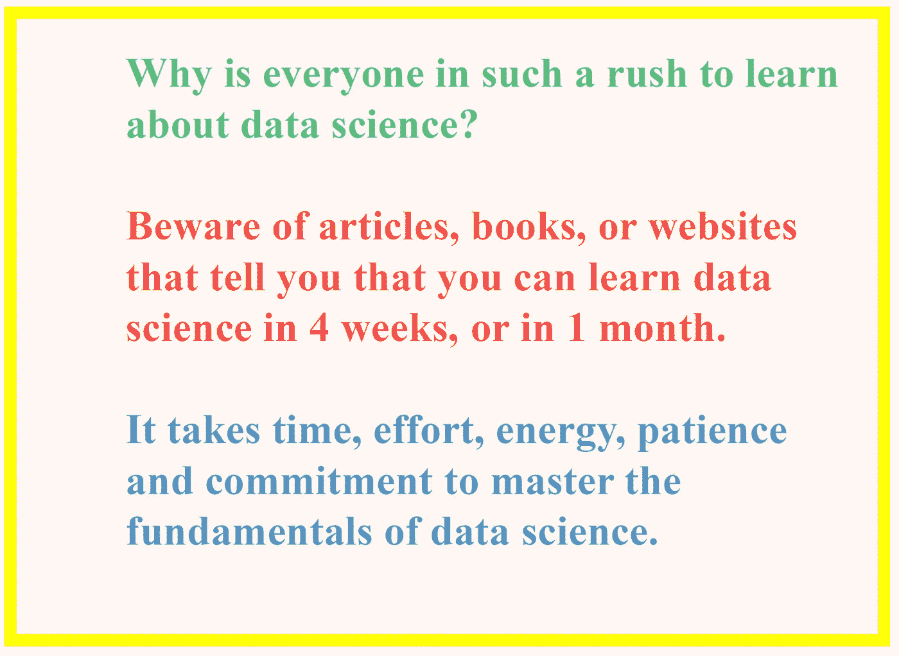
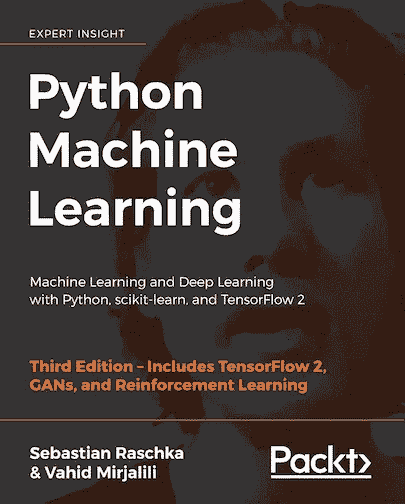

# 谷歌的研究主管对数据科学的初学者有一个建议

> 原文：<https://pub.towardsai.net/googles-director-of-research-has-an-advice-for-beginners-in-data-science-af50e12bb65a?source=collection_archive---------0----------------------->

## [数据科学](https://towardsai.net/p/category/data-science)

## 彼得·诺维格(谷歌研究部主任)给数据科学新手的建议

照片由[米切尔罗](https://unsplash.com/@mitchel3uo?utm_source=medium&utm_medium=referral)在 [Unsplash](https://unsplash.com?utm_source=medium&utm_medium=referral)

"*2021 年，数字市场领域的专业人士必须适应数据时代。他们必须知道如何操作数据，了解数据是如何收集的，并分析和解释数据。决策的未来基于数据科学*。——温迪·莫伊，马里兰大学营销学教授

对于包括市场营销和商业在内的曾经与统计无关的工作来说，数据科学技能变得越来越重要。将数据科学技能添加到您的投资组合中，将使您在今年的市场中获得优势。

如果您有兴趣将数据科学添加到您的投资组合中，毫无疑问，您可能已经思考过这些问题:

1.  ***学习数据科学基础需要多长时间？***
2.  ***学习数据科学有哪些资源*？**

本文将讨论 Peter Norvig 给考虑数据科学的个人的一些一般性建议。

## 彼得·诺维格(谷歌研究总监)的背景

选择上述标题的动机是基于彼得·诺维格的关于成为编程专家所需时间的想法。如果你还没有读过这篇文章:***【10 年自学编程】作者 Peter Norvig*** ，我鼓励你去读一读。下面是文章链接:[***http://norvig.com/21-days.html***](http://norvig.com/21-days.html)***。***

这里的重点是，你不需要 10 年来学习数据科学的基础知识，但匆忙学习数据科学肯定没有帮助。成为一名数据科学家需要时间、努力、精力、耐心和承诺。

Peter Norvig 的建议是，学习需要时间、耐心和承诺。当心那些告诉你可以在 4 周内或 1 个月内学习数据科学的文章、书籍或网站。

Benjamin O. Tayo 的图片

如果您有兴趣学习数据科学的基础知识，请准备好投入适量的时间和精力，这样您不仅可以掌握表面的概念，还可以掌握数据科学的深层概念。

我花了 2 年的时间深入学习，掌握了数据科学的基础知识(通过自学)，我每天都在继续挑战自己学习新的东西。掌握数据科学的基础知识需要多长时间取决于你的背景。一般来说，在数学、统计学、计算机科学、工程学或经济学等分析学科方面的扎实背景是有利的。

# Peter Norvig 的《十年自学编程》中的 3 课

## 1)掌握数据科学的基础知识需要时间、努力、精力、耐心和承诺

数据科学是一个多学科领域，需要扎实的高等数学、统计学、编程背景，以及数据分析、数据可视化、模型构建、机器学习等方面的其他相关技能。我花了两年的时间专门学习，才掌握了数据科学的基础，这是因为我在数学、物理和编程方面有坚实的背景。以下是一些帮助我掌握数据科学基础的资源。

(一)**数据科学专业证书(HarvardX，通过 edX):**【https://www.edx.org/professional... 

包括以下课程，全部使用 R 教授(您可以免费旁听课程或购买认证证书):

*   *数据科学:R 基础知识；*
*   *数据科学:可视化；*
*   *数据科学:概率；*
*   *数据科学:推理与建模；*
*   *数据科学:生产力工具；*
*   *数据科学:扯皮；*
*   *数据科学:线性回归；*
*   *数据科学:机器学习；*
*   *数据科学:顶点*

(二)**分析:基本工具和方法(Georgia TechX，通过 edX):**[https://www.edx.org/micromasters...](https://www.edx.org/micromasters/analytics-essential-tools-methods)

包括以下课程，全部使用 R、Python 和 SQL 讲授(您可以免费审计或购买经过验证的证书):

*   *分析建模入门；*
*   *数据分析计算导论；*
*   *商业数据分析。*

(iii) **应用数据科学与 Python 专业化(密歇根大学，通过 Coursera)**:【https://www.coursera.org/special... 

包括以下课程，全部使用 python 教授(您可以免费旁听大多数课程，有些课程需要购买认证证书):

*   *Python 中的数据科学入门；*
*   *应用 Python 进行绘图、制图&数据表示；*
*   *在 Python 中应用机器学习；*
*   *在 Python 中应用文本挖掘；*
*   *Python 中的应用社交网络分析。*

**(四)数据科学教材**

从教科书中学习提供了比你从在线课程中获得的更精炼和更深入的知识。这本书对数据科学和机器学习提供了很好的介绍，代码包括:**“Python 机器学习”，作者 Sebastian Raschka** 。[https://github . com/rasbt/python-machine-learning-book-第三版](https://github.com/rasbt/python-machine-learning-book-3rd-edition)

作者以一种非常容易理解的方式解释了机器学习的基本概念。此外，代码也包括在内，因此您实际上可以使用提供的代码来练习和构建您自己的模型。我个人认为这本书在我作为数据科学家的旅程中非常有用。我会向任何数据科学爱好者推荐这本书。你所需要的是基本的线性代数和编程技能，以便能够理解这本书。

还有许多其他优秀的数据科学教科书，如韦斯·麦金尼的《 [Python for Data Analysis](https://sushilapalwe.files.wordpress.com/2018/04/python-for-data-analytics-book.pdf) 》，库恩·约翰逊的《[应用预测建模](https://vuquangnguyen2016.files.wordpress.com/2018/03/applied-predictive-modeling-max-kuhn-kjell-johnson_1518.pdf)》，以及伊恩·h·威滕、艾贝·弗兰克&马克·a·霍尔的《[数据挖掘:实用机器学习工具和技术](https://www.wi.hs-wismar.de/~cleve/vorl/projects/dm/ss13/HierarClustern/Literatur/WittenFrank-DM-3rd.pdf)》。

**(v)与其他数据科学有志者建立网络**

从我的个人经历来看，通过与其他数据科学有志者合作，我从每周关于数据科学和机器学习各种主题的小组对话中学到了很多。与其他数据科学有志者建立联系，在 GitHub 上分享您的代码，在 LinkedIn 上展示您的技能，这将真正帮助您在短时间内学习许多新概念和工具。你还会接触到新的做事方式，以及新的算法和技术。

## 2.理解数据科学的理论基础与数据科学实践技能同样重要

数据科学是一门数学密集型学科，需要以下方面的知识:

(一)统计和概率

㈡多变量微积分

㈢线性代数

㈣优化和运筹学

从这里了解更多你需要重点关注的数学话题: [**机器学习必备数学技能**](https://medium.com/towards-artificial-intelligence/4-math-skills-for-machine-learning-12bfbc959c92) 。

即使 Python 的 sci-kit learn 和 R 的 Caret 包等包包含了几个用于进行数据科学和构建机器学习模型的工具，理解每种方法的理论基础也是极其重要的。

## 3.避免使用机器学习模型作为黑盒工具

扎实的数据科学背景将使数据科学家能够构建可靠的预测模型。例如，在构建模型之前，您可能会问自己:

㈠什么是预测变量？

㈡目标变量是什么？我的目标变量是离散的还是连续的？

(三)我应该使用分类还是回归分析？

(iv)如何处理数据集中缺失的值？

㈤在将变量纳入同一尺度时，我应该使用规范化还是标准化？

(vi)我是否应该使用主成分分析？

(vii)如何调整模型中的超参数？

(viii)如何评估我的模型以检测数据集中的偏差？

(ix)我是否应该使用集成方法，即使用不同的模型进行训练，然后进行集成平均，例如使用 SVM、KNN、逻辑回归等分类器，然后在 3 个模型上进行平均？

(x)我如何选择最终型号？

好的和坏的机器学习模型之间的区别取决于一个人理解模型的所有细节的能力，包括关于不同超参数的知识以及如何调整这些参数以获得具有最佳性能的模型。在没有完全理解模型的错综复杂的情况下，将任何机器学习模型作为黑箱，都会导致模型被证伪。

总之，数据科学是当今最热门的领域之一。数字革命创造了成吨成吨的数据。公司、行业、组织和政府每天都在产生大量的数据。对高技能数据科学家的需求只会继续增长。这是投入时间掌握数据科学基础知识的最佳时机。在这样做的时候，要小心那些告诉你可以在 4 周或 1 个月内学会数据科学的文章、书籍或网站。不要匆忙。慢慢掌握数据科学的基础知识。