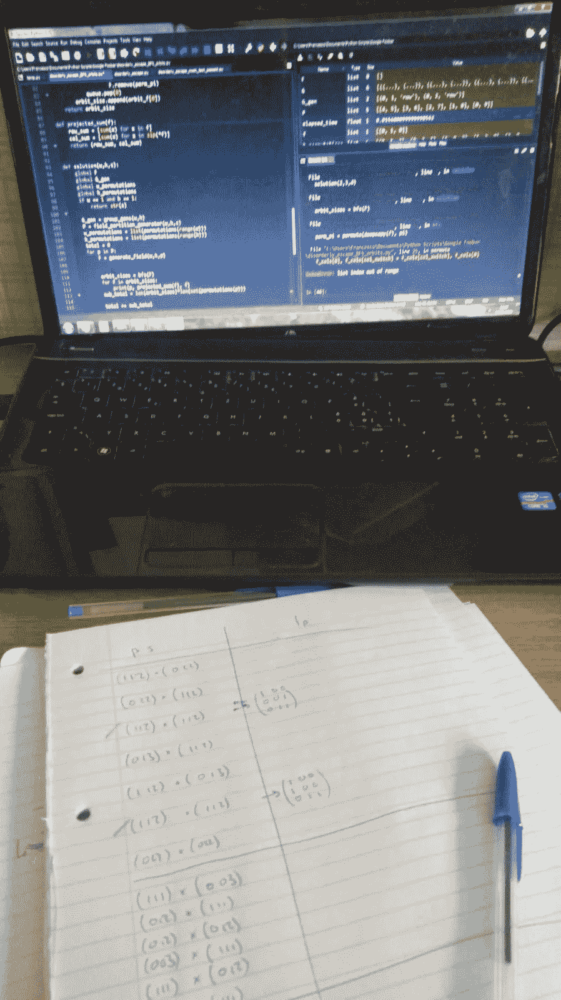
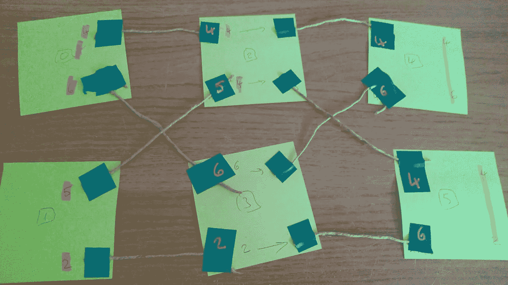

# 谷歌隐藏的招聘挑战

> 原文：<https://pub.towardsai.net/googles-hidden-hiring-challenge-200c62620598?source=collection_archive---------0----------------------->

## [职业](https://towardsai.net/p/category/careers)，[计算机科学](https://towardsai.net/p/category/computer-science)，[软件工程](https://towardsai.net/p/category/software-engineering)

## 你知道谷歌有一个秘密的招聘挑战吗？

欢迎来到谷歌 Foobar。

谷歌有一个秘密的，仅限受邀者的编码挑战系列。这是我的经验，最后还有一些快速提示，适合刚刚入门的人。

## 前体

一个周日的晚上，我坐在办公桌前做着任何正常人都会在周日晚上 11 点做的事情:谷歌搜索 TensorFlow 文档。

在这一点上，谷歌搜索页面做了一些奇怪的事情。它向我显示了以下信息:

感觉就像电影《战争游戏》中的一个角色，我立刻点击了我想玩的*。我被移植到一个带有闪烁光标的 UNIX 风格的界面上。*

在这里玩揭示了一个故事的开始。我设法渗透到 Lambda 指挥官的邪恶组织中，不得不在队伍中成长并摧毁她的 LAMBCHOP 末日装置(显然代表 Lambda 的反物质生物燃料碰撞强子氧化增强器)。

在进一步探索接口时，我遇到了一个问题，并被告知我可以用 Python(2 . 7 . 3 版)或 Java 提交一个解决方案。我很快写出了一个解决方案函数，在控制台敲入*验证 solution.py.* 所有测试用例通过。

我要求一个新的挑战，并继续进行。

第一天晚上，我解决了一些最初的问题。

我花了大约一个月的时间完成了所有的挑战。

总共有 9 个挑战，都分为不同的级别。总共有 5 关，每一关都越来越难。虽然你完成每个挑战的时间越来越长。前几次挑战，你有 32 个小时，最后一次挑战，你有 3 周多一点。

## 艰难困苦

凭借我的数学背景，我本能地从纯数学的角度处理大多数问题，然后编写代码进行计算。我首先在自己的 IDE 中编写代码进行测试，然后将代码复制并粘贴到 Foobar 环境中，并提交到那里。

这对于一些问题很有效，允许我用很少的几行代码快速提供解决方案，但对于其他我必须深入研究计算机科学算法的问题就没那么有效了。

问题开始非常简单，挑战类似于 FizzBuzz 测试，事实上，前 3 个级别并没有引起太多的汗水。这时谷歌会询问你的联系方式。然后他们加大马力。

一些在 5 级挑战中失败的尝试

在最初的几个挑战中，我面临的唯一问题实际上是在 Python 2 中实现解决方案。我的 IDE 运行 Python 3，所以我时常会遇到与这些变化相关的问题。

在最初的几个挑战中，我面临的最大问题是 Foobar 环境中缺少控制台。我不知道为什么我的代码不起作用。是因为它返回错误的值吗？有窃听器吗？是不是太慢了(因为，是的，你的代码必须在一定的时间限制内运行)？谁知道呢。我得到的只是它没有通过一些隐藏的测试用例。

当我开始处理更难的问题时，它们变得更难了。我花了更长的时间来完全理解解决它所需的概念(尽管通常不会超过几天)。挑战将涉及图论、群论、数论，还涉及一些经典的计算机科学问题，如旅行推销员和最大流。

## 我的建议

如果你有兴趣尝试这个挑战，这里是我给你的建议:

> 如果您不是算法专家或编码专家，也不用担心

在开始这个挑战之前，我可以很好地用 Python 编码，但对算法几乎一无所知。你有足够的时间研究手头的问题。

这些问题的设计方式是，即使你是一部活的算法百科全书，闭着眼睛都能写出分治算法，你仍然需要从头开始。

一个宽而浅的知识库比一个窄而深的要好。我这么说的意思是，如果你能认识到一个类似的问题，或者挑战是在哪个领域，那么你就有了一个起点。这将引导你研究这个领域，找到更多关于如何解决这个特定问题的方法。

**谷歌是你的朋友。**修卡，我知道。我花了数不清的时间研究各种主题并了解它们。我不能强调在这些事情上保持好奇心是多么重要。

由[凯文·Ku](https://unsplash.com/@ikukevk?utm_source=medium&utm_medium=referral)在 [Unsplash](https://unsplash.com?utm_source=medium&utm_medium=referral) 上拍摄

## 快速提示

1.  做你的研究。了解一下手头的题目，下兔子洞。从长远来看，这在解决问题时会有回报，而且，嘿，你会学到一些新东西。
2.  **写伪代码，画图表**。我是一个非常视觉化的思考者，所以图表对我来说非常有用，但是做任何对你有用的事情。在接触你的 IDE 之前，写下你的算法应该如何工作，以及整个解决方案应该如何运行。我花了很多时间画涂鸦试图解决问题(甚至用便利贴和绳子做了一个图表！)
3.  去散步。有时候碰壁也没关系。散步有助于理清你的思绪，并且(对我来说)给了我许多*灵感。*
4.  **不要太执着。不要害怕放弃一切，从头开始(尽管要备份你当前的代码)。有时候，我会花几天时间研究一个特定的解决方案，然后想出一个新的方法来最终解决问题，但与之前的方法毫无关系。这就是生活！**

## **外卖**

我的 4 级问题的便利贴模型。

不，不是必胜客。

虽然谷歌使用 Foobar 挑战是事实，但很少有人收到谷歌的回复，这不应该是你参与的原因。

我学到了这么多计算机科学和各种算法，以及如何分析各种解决方案的利弊。(例如，你什么时候会选择深度优先搜索而不是广度优先搜索？)

我不仅学到了硬技能，还学会了如何最好地操作。我学会了如何让我的大脑更好地解决问题。

一个额外的好处是，我建立了一个糟糕的 youtube 音乐编码播放列表！

如果你想了解更多或者讨论其中的一些问题(前提是你已经做完了；) )随时联系我 [LinkedIn](https://www.linkedin.com/in/francesco-di-lallo/) 。