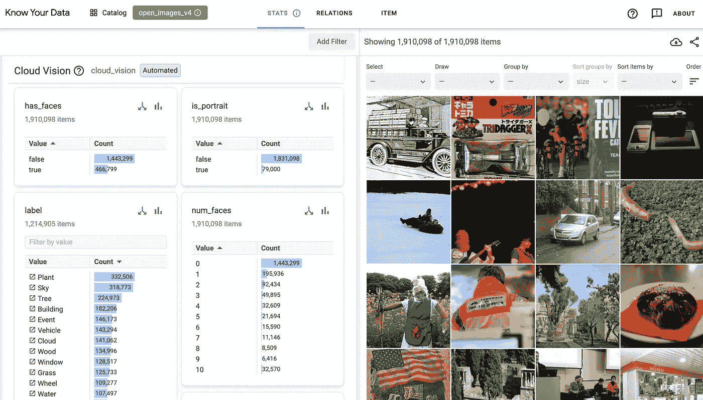
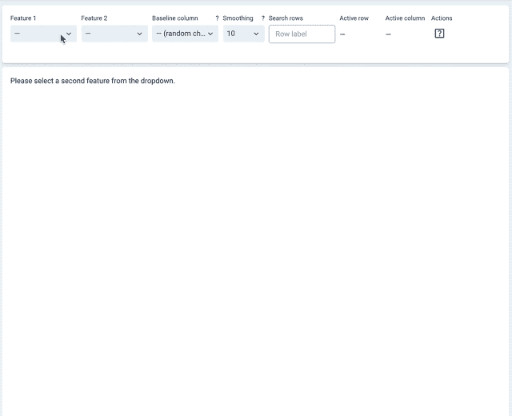
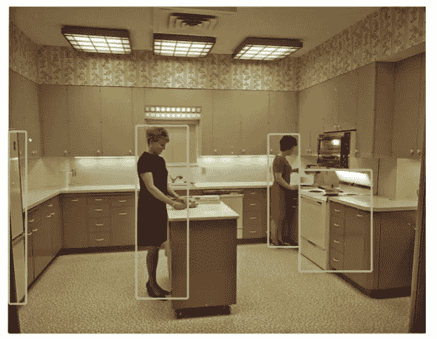
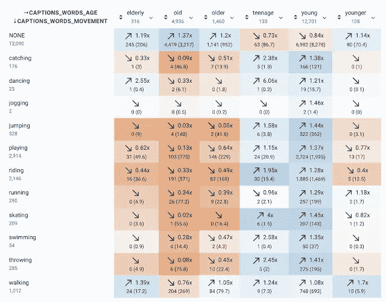

# Google 的 Know Your Data 向我们展示了 ML 模型数据探索的未来

> 原文：<https://pub.towardsai.net/googles-know-your-data-shows-us-the-future-of-data-exploration-for-ml-models-6938cc90f376?source=collection_archive---------0----------------------->

## [机器学习](https://towardsai.net/p/category/machine-learning)

## 新工具提供了评估 ML 数据集质量的高级探索功能。

图片来源:谷歌研究

> 我最近创办了一份专注于人工智能的教育时事通讯，已经有超过 10 万名订户。《序列》是一份无废话(意思是没有炒作，没有新闻等)的 ML 导向时事通讯，需要 5 分钟阅读。目标是让你与机器学习项目、研究论文和概念保持同步。请通过订阅以下内容来尝试一下:

 [## 序列

### 订阅人工智能世界中最相关的项目和研究论文。受到 102，000 多人的信任…

thesequence.substack.com](https://thesequence.substack.com/) 

在监督学习技术占主导地位的今天，高质量的数据集对于产生鲁棒的机器学习(ML)模型是必不可少的。然而，创建高质量训练数据集的过程不仅计算量大，而且受标注过程的主观性影响很大。为了更好地理解 ML 模型的行为，理解训练数据集的组成是必不可少的。最近，Google Research 推出了 [Know Your Data(KYD)](https://knowyourdata.withgoogle.com/) ，这是数据集分析领域最完整的成果之一，让我们得以一窥这一学科的未来。

分析 ML 数据集是概念上琐碎但很难实现的事情之一。想想分析表格、音频、语言或图像数据集之间的区别。为这些体验提供一个一致的模型绝非易事。KYD 的最初版本集中于图像数据集，但它应该很快会包含其他类型的数据集。

从功能的角度来看，KYD 提供了视觉探索机制，可以帮助回答 ML 数据集中的以下问题:

*   *数据损坏了吗？*
*   *数据敏感吗？*
*   *数据有差距吗？*
*   *数据集在各种属性之间是否平衡？*

在高层次上，KYD 提供了广泛的功能，允许数据科学家探索 ML 数据集的要素和属性之间的关系。KYD 包括现有功能，也包括使用谷歌[云视觉 API](https://cloud.google.com/vision) 自动计算的功能。例如，下图说明了如何使用 KYD 来探索著名的 [COCO 字幕数据集](https://arxiv.org/pdf/1504.00325.pdf)中图像的性别偏见相关性。

图片来源:谷歌研究

这项研究表明，购物或烹饪等活动往往与女性形象联系在一起。

图片来源:谷歌研究

同样，探索年龄和活动特征之间的相关性表明，骑行或跳跃等身体活动通常与老年人无关。也许是年龄偏见的表现。

图片来源:谷歌研究

KYD 是 ML 领域中最完整的数据集探索成果之一。该项目仍处于非常早期的阶段，但它已经提供了非常全面的功能探索能力，可用于评估训练数据集的质量。在第一次正式发布之前，我们应该会看到更多有趣的功能添加到 KYD 中。