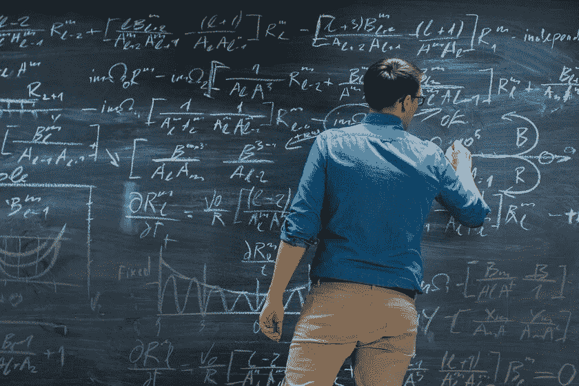
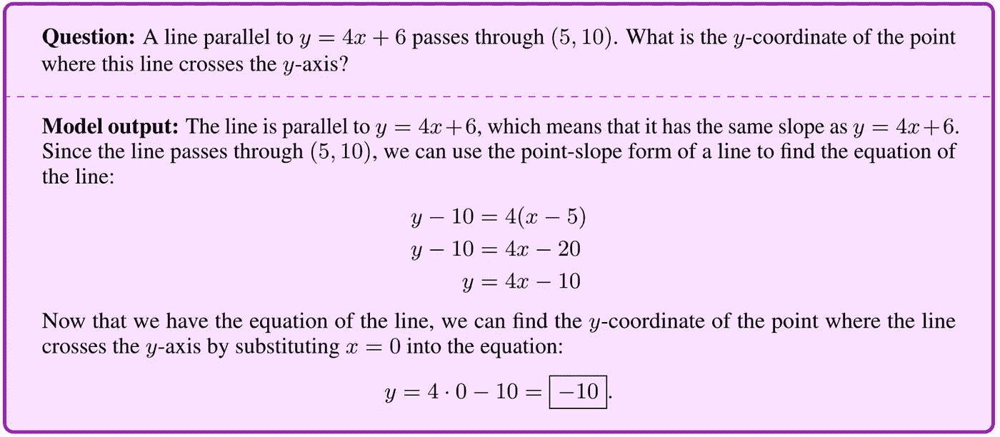
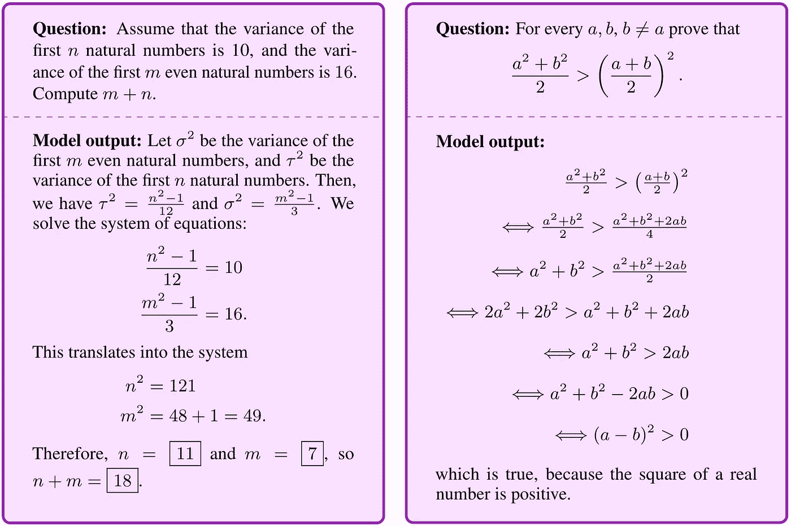
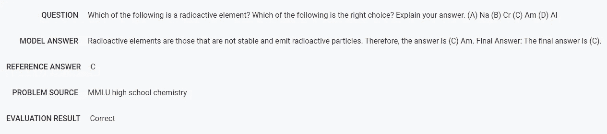
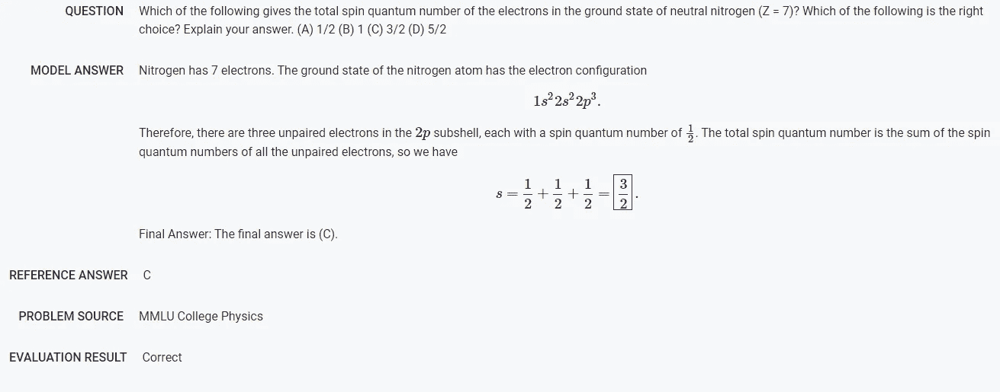
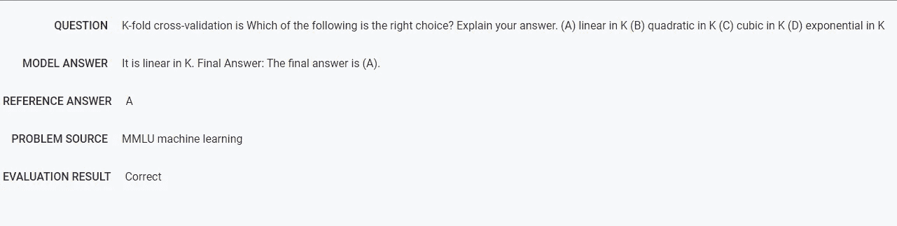

# 谷歌的 Minerva 可以通过逐步推理解决数学和科学问题

> 原文：<https://pub.towardsai.net/googles-minerva-can-solve-mathematical-and-scientific-problems-through-step-by-step-reasoning-5e3a8e749685?source=collection_archive---------0----------------------->

## 该模型是定量推理技术的重大突破。

来源:[https://thenewtrace . com/this-new-Google-ai-is-capability-solving-a-mathematical-problem-step-by-step-this-is-Minerva/238325/](https://thenewstrace.com/this-new-google-ai-is-capable-of-solving-a-mathematical-problem-step-by-step-this-is-minerva/238325/)

> 我最近创办了一份专注于人工智能的教育时事通讯，已经有超过 125，000 名订户。《序列》是一份无废话(意思是没有炒作，没有新闻等)的 ML 导向时事通讯，需要 5 分钟阅读。目标是让你与机器学习项目、研究论文和概念保持同步。请通过订阅以下内容来尝试一下:

 [## 序列

### 与机器学习、人工智能和数据发展保持同步的最佳资源…

thesequence.substack.com](https://thesequence.substack.com/) 

量化推理(QR)是新一代深度学习方法皇冠上的明珠之一。虽然最近我们看到了自然语言理解(NLU)技术的重大突破，但这种类型的模型是否能够展示推理能力的问题仍然没有答案。在语言模型的所有推理基准中，没有什么比解决数学或科学文本问题排名更高。几个月前，OpenAI 发布了 Lean，一个能够解决数学奥林匹克问题的模型，震惊了世界。几天前，谷歌研究发表了一篇[论文，讨论 Minerva，一种能够使用逐步推理解决数学或科学问题的模型。](https://arxiv.org/pdf/2206.14858.pdf)

以文本形式解决数学问题需要多种技能的结合，例如正确解释文本输入、回忆相关的数学公式以及正确的符号操作以生成逐步过程。毫不奇怪，定量推理需要不同的深度学习技术的组合，这些技术通常不是微不足道的，以使它们一起工作。通过 Minerva，谷歌能够创建一个模型，使用文本和符号的组合来回答数学问题。下图说明了 Minerva 可以解决的问题类型以及一步步的推理过程。

图片来源:谷歌研究

从架构的角度来看，Minerva 结合了一些技术，如少量提示、一连串的思考或便笺式提示，以及多数投票。Minerva 建立在 Pathways 语言模型(PaLM)模型的基础上，但 fines 使用来自 arXiv 预印本服务器的 118GB 科学论文数据集和包含使用 LaTeX、MathJax 或其他数学排版格式的数学表达式的网页来调整训练。密涅瓦展示的象征性操纵令人印象深刻。

图片来源:谷歌研究

Minerva 使用诸如思维链或便签簿提示等技术来评估几个分步解决方案，然后再提示一个新问题。该模型通过从所有不同的输出中执行随机样本，为给定的问题产生多个解决方案。之后，密涅瓦执行多数投票，以得出最常见的和最终的答案。

图片来源:谷歌研究

Minerva 在数学问题上的表现令人印象深刻，但我们在 OpenAI Lean 等模型上也看到了类似的突破。然而，除了数学，密涅瓦在解决其他科学领域的问题时表现出了令人难以置信的熟练程度，如生物，物理，化学，甚至机器学习。

**化学:**

图片来源:谷歌研究

**物理:**

图片来源:谷歌研究

**生物:**

图片来源:谷歌研究

**机器学习:**

图片来源:谷歌研究

Minerva 是展示逐步定量推理能力的最令人印象深刻的模型之一。Minerva 中包含的一些想法可以代表与人类合作推进科学研究的新一代模型的基础。