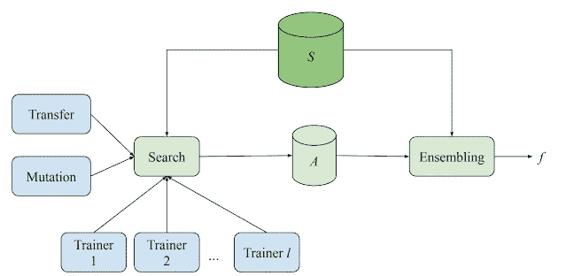

# 谷歌的模型搜索是一个新的开源框架，使用神经网络来构建神经网络

> 原文：<https://pub.towardsai.net/googles-model-search-is-a-new-open-source-framework-that-uses-neural-networks-to-build-neural-9ddc66f48ad2?source=collection_archive---------0----------------------->

## [深度学习](https://towardsai.net/p/category/machine-learning/deep-learning)，[新闻](https://towardsai.net/p/category/news)

## 新框架为 TensorFlow 带来了最先进的神经架构搜索方法。

来源:https://github.com/google/model_search

> 我最近创办了一份专注于人工智能的教育时事通讯，已经有超过 70，000 名订户。《序列》是一份无废话(意思是没有炒作，没有新闻等)的 ML 导向时事通讯，需要 5 分钟阅读。目标是让你与机器学习项目、研究论文和概念保持同步。请通过订阅以下内容来尝试一下:

 [## 序列

### 该序列解释了主要的机器学习概念，让你与最相关的项目和最新的…

thesequence.substack.com](https://thesequence.substack.com/) 

自动机器学习(AutoML)是使用机器学习来自动创建机器学习模型的思想。AutoML 已经成为深度学习领域最热门的研究领域之一。AutoML 的一个分支学科已经获得了很大的发展势头，被称为神经架构搜索(n as)。从概念上讲，NAS 侧重于为给定的问题构建神经网络架构。大多数成功的 NAS 技术使用诸如强化学习或进化算法之类的方法，这些方法已经被证明在不同的领域中实现了最先进的结果。然而，尽管取得了巨大的成功，NAS 方法仍然很难使用。

实施 NAS 的挑战无处不在。首先，没有多少 NAS 框架集成到主流深度学习堆栈中，如 TensorFlow 或 PyTorch。此外，许多 NAS 实施需要大量领域专业知识，以便从一系列对给定问题有意义的体系结构开始。最后，NAS 堆栈非常昂贵且难以使用。

为了克服其中的一些挑战， [Google Research 刚刚开源了模型搜索](https://github.com/google/model_search)，这是一个帮助数据科学家以快速和经济高效的方式找到深度学习问题的最佳架构的框架。模型搜索支持一系列关键功能，这些功能对于成功的 NAS 实验至关重要:

为给定数据集运行多个 NAS 算法。

比较搜索过程中产生的不同模型。

为给定问题创建自定义搜索空间。

模型搜索架构基于四个基本组件:

**模型训练器:**这些组件异步地训练和评估模型。

**搜索算法:**搜索算法选择训练得最好的架构，并对其添加一些“突变”，然后将其发送给训练者进行进一步评估。

**迁移学习算法:**模型搜索使用知识提炼等迁移学习技术，跨不同实验重用知识。

**模型数据库:**模型数据库以可在不同循环中重用的方式保存实验结果。

来源:[https://ai . Google blog . com/2021/02/introducing-model-search-open-source . html](https://ai.googleblog.com/2021/02/introducing-model-search-open-source.html)

模型搜索基于 TensorFlow，允许数据科学家与现代深度学习技术完全互操作。[开源版本](https://github.com/google/model_search)附带了一篇[研究论文，解释了模型搜索的复杂性](https://pdfs.semanticscholar.org/1bca/d4cdfbc01fbb60a815660d034e561843d67a.pdf)。在仍处于萌芽状态的 AutoML 技术世界中，模型搜索是为 NAS 技术的使用创建一致且可扩展的体验的最引人注目的努力之一。我真的希望谷歌在这方面加倍努力。