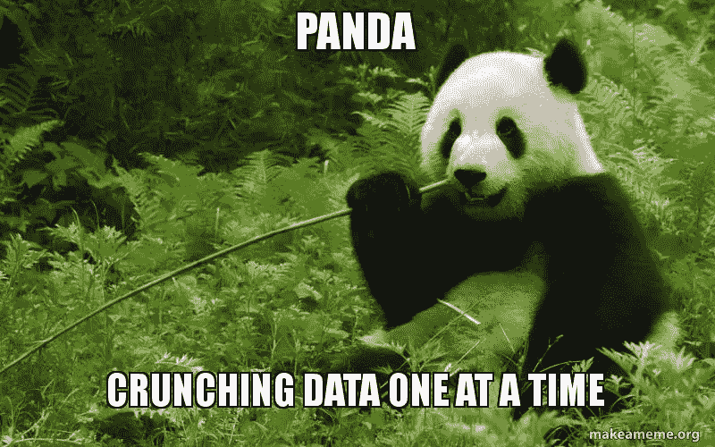
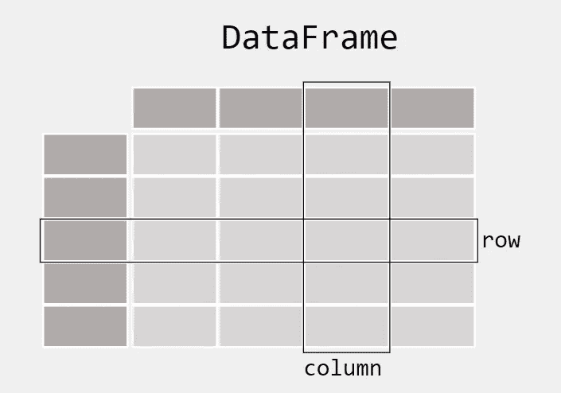
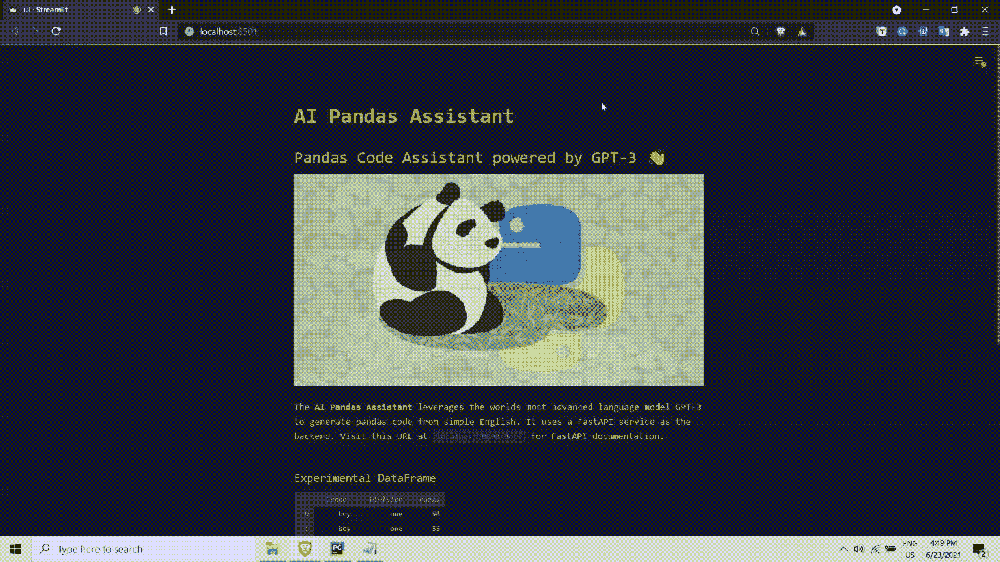

# GPT-3:正在形成的数据科学家

> 原文：<https://pub.towardsai.net/gpt-3-a-data-scientist-in-making-4e6fe4abe0c4?source=collection_archive---------1----------------------->

## [自然语言处理](https://towardsai.net/p/category/nlp)

## 通过利用 OpenAI GPT-3 的能力在熊猫中进行自动驾驶探索性数据分析


“使用不充分数据的错误比完全不使用数据的错误要少得多”——查尔斯·巴贝奇

# **先决条件**

**我以文章的形式收集了这些点，请按照相同的顺序浏览下面的文章，以连接这些点并了解智能**熊猫助手**背后的关键技术栈:**

1.  **FastAPI——超越烧瓶的绝妙方法！**
2.  **[Streamlit —革命性的数据应用创建](https://medium.com/towards-artificial-intelligence/streamlit-revolutionizing-data-app-creation-e269177d9112)**
3.  **[GPT-3 简介](/email-assistant-powered-by-gpt-3-ba39dfe999d3)**

# **熊猫简介**

****Pandas** 是一款基于 [Python](https://www.python.org/) 编程语言构建的快速、强大且易于使用的开源数据分析和操作工具。它在 Python 社区中被广泛接受，并在许多其他包、框架和模块中使用。Pandas 是一个极其灵活的框架，在为机器学习和深度学习模型准备数据方面有广泛的用例。**

****

**“把数据拷问到合适的程度，它会承认任何事情”——罗纳德·科斯**

## **安装熊猫**

**Pandas 是 PyPI 上的一个标准 python 库，可以根据 python 环境使用 pip 或 conda 轻松安装。由于 Pandas 的流行，它有自己的常规缩写，因此可以使用以下命令来安装 Pandas:**

```
import **pandas** as **pd**
```

## **熊猫能处理什么样的数据？**

**如果您处理表格数据，比如电子表格或数据库中的数据，pandas 是您的合适工具。有了熊猫，你可以探索，清理和处理你的数据。在熊猫中，一个**数据表**被称为`DataFrame`。**

****

**图:熊猫数据帧插图**

## **如何用熊猫读写表格数据？**

**Pandas 支持集成许多现成的文件格式或数据源(如 CSV、excel、SQL、JSON、parquet 等)。通过使用前缀`read_*`从这些来源导入数据非常简单明了。类似地，我们可以使用`to_*`方法将数据导出为各自的格式。**

****

**图:大熊猫进出口来源示意图**

# **应用程序演练**

**现在我将带你一步一步地完成 GPT 3 号熊猫助手应用程序:**

**在创建任何 GPT-3 应用程序时，首先要考虑的是培训提示的设计和内容。提示设计是启动 GPT-3 模型以给出有利的上下文响应的最重要的过程。**

> **作为一个经验法则，在设计训练提示时，你应该以从模型中获得零反应为目标，如果这是不可能的，就用几个例子，而不是提供一个完整的语料库。训练提示设计的标准流程应该是这样的:**零投→少投→基于语料库的启动。****

**为了设计熊猫助手应用程序的训练提示，我为 ***训练提示*** 使用了以下结构:**

*   ****描述:**关于熊猫助手应该做什么的上下文的初始描述，并添加一两行关于其功能的内容。**
*   ****自然语言(英语):**该组件包括对熊猫助理将要执行的任务的简单描述。它有助于 GPT 3 号理解上下文，以便用 python 生成适当的熊猫代码。**
*   ****熊猫代码:**该组件包括熊猫代码，对应于作为 GPT-3 模型输入提供的英文描述。**

> ***输入→自然语言；输出→熊猫代码***

****

**Streamlit 支持的 UI(全部用 Python 编写)**

****

**FastAPI 的魔力→即时 API 文档**

**让我们来看一个实际的例子，来真正理解 GPT-3 从纯英语语言中生成熊猫代码的能力。在下面的例子中，我们将通过向 AI 熊猫助手提供最少的指令来生成熊猫代码。**

# **参考**

1.  **[https://en.wikipedia.org/wiki/GPT-3](https://en.wikipedia.org/wiki/GPT-3)**
2.  **[https://openai.com/blog/openai-api](https://openai.com/blog/openai-api/)**
3.  **[https://pandas.pydata.org/docs](https://pandas.pydata.org/docs/)**

**如果你想了解更多，或者想让我写更多关于这个主题的东西，请随时联系我们。**

**我的社交链接:[LinkedIn](https://www.linkedin.com/in/shubhamsaboo/)|[Twitter](https://twitter.com/Saboo_Shubham_)|[Github](https://github.com/Shubhamsaboo)**

****

**如果你喜欢这篇文章或觉得它有帮助，请花一分钟按一下拍手按钮，它会增加文章对其他媒体用户的可见性。**