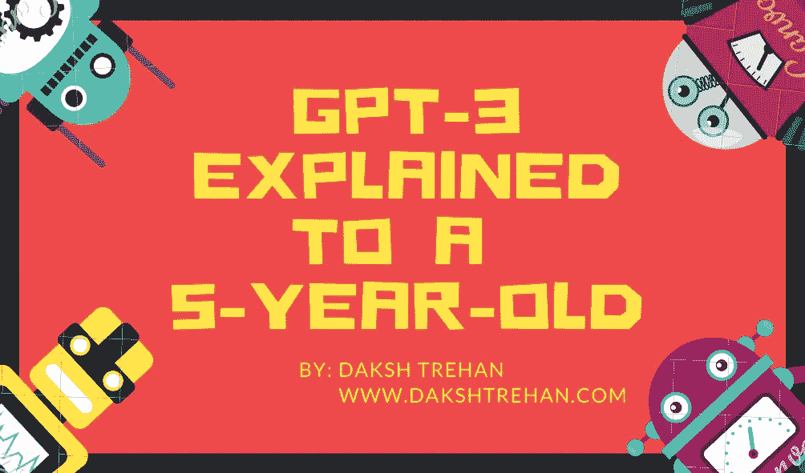
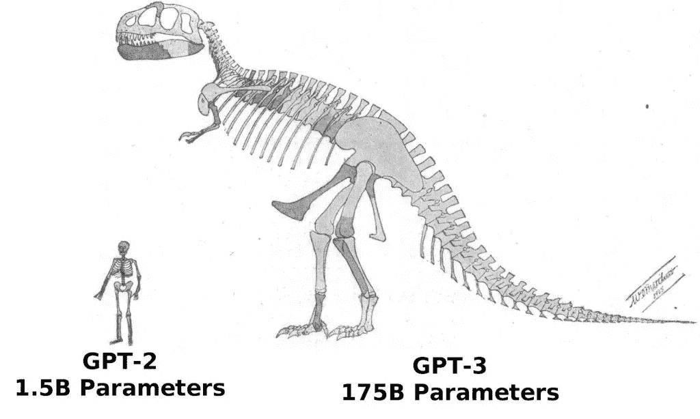
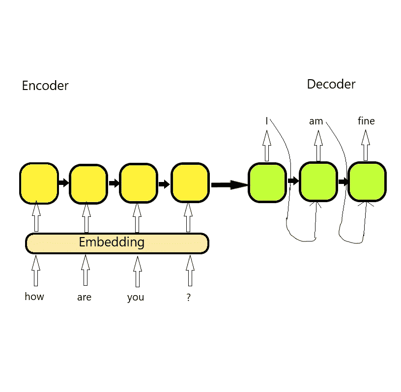
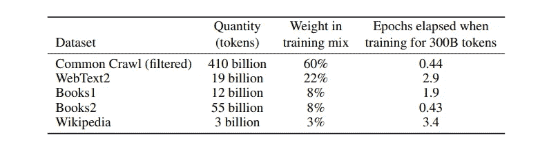

# GPT-3 向一个 5 岁的孩子解释

> 原文：<https://pub.towardsai.net/gpt-3-explained-to-a-5-year-old-1f3cb9fa030b?source=collection_archive---------0----------------------->

## [自然语言处理](https://towardsai.net/p/category/nlp)

## 如果你没有关注过人工智能的奇迹，你就根本没有用心！

网络为一个互动工具 GPT-3 而疯狂。它的使用案例和未来的可能性是惊人的。(**G)**generative(**P)**retained(**M)**odel 是自然语言处理器的第三个版本。你可以期待它像你的朋友唐纳德一样，给它一个提示，它就会按照指示去做。

如果你想在未来一窥究竟，可以看看开发者是如何使用 GPT-3 的。毫无疑问，我们可以说我们的世界充满了 AI 用例。从向你推荐东西到亚马逊到无人驾驶汽车，AI 让你无所不包。甚至，很有可能是人工智能向你推荐了这篇文章，或者是某个人工智能工具写的。是的，你没听错，这就是 GPT3 的全部。

GPT-3 是一个巨大的网络，可以执行类似人类的语言处理任务。它可以充当作家、记者、诗人、作者、研究人员或写作机器人。这也被认为是迈向人工智能(AGI)的第一步。AGI 是机器学习和执行类似人类任务的能力。

曾经有一段时间，技术被认为是神秘的。但随着我们的进步，它必须被引入聚敛。为了理解 GPT-3 如何工作的基本原理，我们必须了解推动它的机器学习的基本原理。机器学习是人工智能的组成部分。它为机器提供了通过体验改善自身的能力。

有两种类型的机器学习算法:监督的和非监督的。

监督学习包括所有那些必须需要标记数据的算法。换句话说，假设你的机器是一个 5 岁的孩子。你想教她一本书，然后做个测试，看看他是否学到了什么。在监督学习中，我们向机器输入带标签的数据。然后我们测试它，看它是否学到了什么。

监督学习不是人类积累智力的东西。相反，大多数时候，我们基于经验或直觉来收集知识。这大概就是你可以认为的无监督学习。

监督与非监督学习，[来源](https://www.google.com/url?sa=i&url=https%3A%2F%2Fclickup.com%2Fblog%2Fsupervised-vs-unsupervised-machine-learning%2F&psig=AOvVaw1ptchsO9EO56MkShIPVF51&ust=1616166623855000&source=images&cd=vfe&ved=0CAIQjRxqFwoTCPjxiYGQuu8CFQAAAAAdAAAAABBJ)

GPT-3 采用无监督学习。它能够进行元学习，即无需任何训练的学习。GPT-3 学习语料库由 common-craw 数据集组成。该数据集包括 45TB 的文本数据或大部分互联网数据。GPT-3 是 1750 亿个参数模型，而人脑中有 10-100 万亿个参数。

生命、宇宙、万物的答案假设为 4.398 万亿个参数。GPTs 家族以每年大约 100 倍的速度增长，这既令人惊讶又令人担忧。

[来源](https://blog.exxactcorp.com/what-can-you-do-with-the-openai-gpt-3-language-model/)

我们总是可以期待机器学习模型产生良好的准确性。但是他们没有能力研究自然语言。为了解决这个问题，我们使用嵌入将文本转换成数字，并将它们传递给我们的模型。这些模型在注意力机制的帮助下使用编码器和解码器。

**R**e current**N**eural**N**etworks(RNN)，是一种让我们能够研究自然语言的技术。但是由于文本数据的巨大规模，我们不能期望它学习所有的东西。为了更好地利用我们的数据，我们使用了一种关注机制。注意力机制的工作方式和我们的大脑完全一样。当我们向大脑输入信息时，它会过滤掉重要的数据，并清空其余的数据。注意力机制有助于记录每次嵌入的分数。分数使我们的模型能够过滤掉不相关的嵌入。

RNN 工作流程

当我们将文本数据输入模型时，它会通过编码器并生成向量。产生的向量被进一步输入到注意机制中。组合的工作流程有助于产生下一个单词预测。简单来说，就是根据你对自己的答案有多自信来“填空”。随着我们对语言掌握的越来越好，我们的自信也越来越强。随着更多的训练和经验，我们的模型在预测方面表现得更好。最后，我们将下一个输入字与前一个输出预测一起反馈给解码器。这个循环继续下去，帮助我们造出句子，在 AGI 变得更好。

GPT-3 的主要亮点是其大量的数据和训练。这种训练不是特定领域的，但能使它掌握任何特定领域的任务。重新编程很容易，因为它已经从现在开始记忆的数据集中学到了太多东西。让它写一个 SQL 查询，它会很擅长。请它协助体育写作，它将再次在这方面游刃有余。

资料来源:GPT-3 文件

GPT 3 更适合少量学习，也就是说，当你给它提供一个提示和一些例子的时候。就是这样，你给一个大一的学生一些书，让她解答问题。有时她做到了，有时她失败了。所以你继续给她提供更多的书和问题，让她做得更好。有时通过再次学习，有时通过查看类似的例子。

GPT-3 是另一台机器，我们不能指望机器学习大量的例子。当我们学习驾驶时，我们选择了太多的地方来提高我们的技能。一旦我们获得信心，我们就从交通流量少得多的高速公路开始。然后我们去交通稍微繁忙的郊区。最后，找到通往最繁忙街道的路，以便更好地利用它。如果你只在高速公路上学习驾驶，你不可能在郊区或街道上开得更好。同样，如果我们想要一个更好的模型，我们需要为它提供不同的学习环境。

GPT-3 向我们学习，是我们最好的人工智能射击。但它不能像我们一样，毕竟孩子们不需要看到数以百万计的例子来学习新东西。它从互联网上学习，有时也吸收它的负面影响。GPT-3 可以模仿自然语言，但当涉及到自然思维时，人工智能仍然需要提高它的游戏。自然语言和自然思想之间只有一线之隔。GPT-3 向我们展示了扩大语言模型可以提高准确性。而且，要生成类似人类的语言，我们不需要灵魂，只需要大量的数据。

当我还是个孩子的时候，我们的老师会给我们一个场景，并要求我们写下来。当我还是个孩子的时候，我花了几个小时想象假的情节，然后交给我们的老师，他会给我低分。

多年来，我一直这样做，但始终找不到相同的原因。后来有一天，我意识到我做错了。我太忙于关注富有想象力的场景，但要取得好成绩所需要的只是“语法”。显然，他是在教我们如何“写作”，而不是如何“创造性地”思考。在我看来，也许我的想象力是我的优势，但我的语法不是。

这正是 GPT 3 号正在做的，希望它是一个写作机器人。它的大部分产出来自人们以前的作品。它所关心的只是生产一些看起来像人类生产的东西。它关注的是“风格”，而不是“创造力或理解力”。语法是它的编程语言，要清楚，你就得到了很大的准确性。

无可否认，它擅长预测。但它既不是用来存储事实的，也不是用来像人脑一样检索事实的。它更像一个搜索引擎优化的关键字模式匹配算法。

它是一台语言烟雾机，因为它没有接触到现实世界，缺乏人性。即使在了解了人类的一切之后。这是一种算法，指望它给出任何推理是不公平的。它缺乏区分人类和机器的智商，我希望至少在相当长的一段时间内保持这一点。

**如果你喜欢这篇文章，请考虑订阅我的简讯:** [**达克什·特雷汉每周简讯**](https://mailchi.mp/b535943b5fff/daksh-trehan-weekly-newsletter) **。**

## 参考资料:

[https://medium . datadriveninvestor . com/GPT-3-ai-overruling-started-15fd 603470 F2](https://medium.datadriveninvestor.com/gpt-3-ai-overruling-started-15fd603470f2)
[https://pub . toward sai . net/ai-copy-assistant-powered-by-GPT-3-d5b 175 a 025 e 1](/ai-copy-assistant-powered-by-gpt-3-d5b175a025e1)
[https://the conversation . com/GPT-3-new-ai-can-write-like-a-human-but](https://theconversation.com/gpt-3-new-ai-can-write-like-a-human-but-dont-mistake-that-for-thinking-neuroscientist-146082)

请随意连接:

> *作品集~*[*https://www.dakshtrehan.com*](http://www.dakshtrehan.com/)
> 
> *LinkedIn ~*[*https://www.linkedin.com/in/dakshtrehan*](https://www.linkedin.com/in/dakshtrehan/)

关注更多机器学习/深度学习博客。

> *中等~*【https://medium.com/@dakshtrehan】T43

# 想了解更多？

[准备好拜 AI 神了吗？](https://medium.com/swlh/are-you-ready-to-worship-ai-gods-818c9b7490dc)
[利用深度学习检测新冠肺炎](https://towardsdatascience.com/detecting-covid-19-using-deep-learning-262956b6f981)
[逃不掉的 AI 算法:抖音](https://towardsdatascience.com/the-inescapable-ai-algorithm-tiktok-ad4c6fd981b8)
[GPT-3: AI 否决开始了？](https://medium.com/@dakshtrehan/gpt-3-ai-overruling-started-15fd603470f2)
[Tinder+AI:一场完美的牵线搭桥？](https://medium.com/towards-artificial-intelligence/tinder-ai-a-perfect-matchmaking-b0a7b916e271)
[使用机器学习的卡通化内幕指南](https://medium.com/towards-artificial-intelligence/an-insiders-guide-to-cartoonization-using-machine-learning-ce3648adfe8)
[强化强化学习背后的科学](https://medium.com/towards-artificial-intelligence/reinforcing-the-science-behind-reinforcement-learning-d2643ca39b51)
[解码生成性对抗网络背后的科学](https://medium.com/towards-artificial-intelligence/decoding-science-behind-generative-adversarial-networks-4d188a67d863)
[了解 LSTM 和 GRU 的](https://medium.com/towards-artificial-intelligence/understanding-lstms-and-gru-s-b69749acaa35)
[用于假人的递归神经网络](https://medium.com/towards-artificial-intelligence/recurrent-neural-networks-for-dummies-8d2c4c725fbe)
[用于假人的卷积神经网络](https://medium.com/towards-artificial-intelligence/convolutional-neural-networks-for-dummies-afd7166cd9e)

> *欢呼*