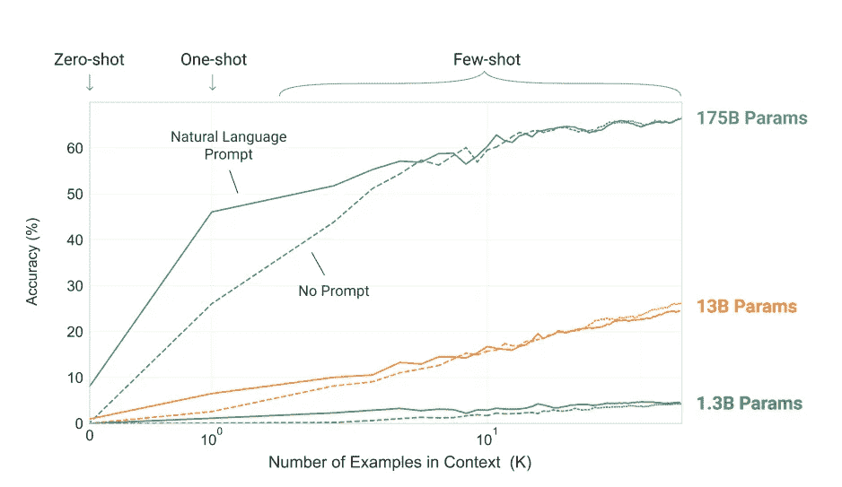

# 来自 OpenAI 的 GPT-3 在这里，它是一个怪物

> 原文：<https://pub.towardsai.net/gpt-3-from-openai-is-here-and-its-a-monster-f0ab164ea2f8?source=collection_archive---------0----------------------->

## 机器学习

## 1750 亿个参数，比之前最大的模型大 10 倍，GPT-3 是迄今为止最大的训练变压器

来自 OpenAI 的最新 GPT-3 拥有 1750 亿个参数，比之前最大的模型，微软的图灵-NLG 的 T2 大 10 倍。从这个大型模型中出现的行为是令人兴奋的:执行特定的 NLP 任务(如翻译或问答)需要较少的微调。那是什么意思？

语言模型是一次性学习器:GPT-3——模型越大，样本越少，在 NLP 任务中表现良好所需的微调就越少。图片来自 OpenAI paper。

假设您想要建立一个从英语到法语的翻译模型。你需要一个预先训练好的语言模型(比如 BERT ),然后输入带有成对翻译的英语单词/句子数据。GPT-3 无需任何额外的学习就能完成这项任务。您只需提供一个提示(询问句子或短语):

> "把英语翻译成法语:cheese = > "

得到

> " fromage "

其他任务也是如此。一个问答示例是给出一个提示:

> “问:48 加 76 是多少？

你会得到

> “答:124。”

看起来很刺激，对吧？我们可以继续这样的任务。更多例子参见 [OpenAI](http://openai.com) 的原论文名为 [**“语言模型是很少出手的学习者”**](https://arxiv.org/pdf/2005.14165.pdf) 。少量学习在这里指的是向一个模型展示几个例子，然后要求做同样的事情。在上面的例子中，例如给出一个提示:

> "把英语翻译成法语:sea otter => loutre de mer，cheese = > "

这是一个一次性学习的例子，我上面展示的是一个一次性学习的例子——模型中没有给出任何例子，只有一个任务描述“将英语翻译成法语”

微软的图灵-NLG(拥有 175 亿个参数，比 GPT-3 小 10 倍)已经能够回答诸如“二战何时开始”、“谁是英国女王”等一般性问题。，无需任何额外的微调。GPT-3 走得更远，能够高精度地进行基本常识推理。例如，它可以填充以下句子中的空格:

> 爱丽丝是鲍勃的朋友。爱丽丝去拜访她的朋友 _____

给出的答案是“鲍勃”

这种语言理解水平以前从未在通用模型上实现过，商业应用的可能性仍有待发现。

2020 年似乎是文本理解机器学习方法取得突破的又一年。如果你想更深入地了解 GPT-3 的细节，那么除了阅读原文，你可以看看 GPT-3 的这个[视频解释](https://www.youtube.com/watch?v=SY5PvZrJhLE)或围绕论文的这个[视频讨论](https://www.youtube.com/watch?v=7qPDwsCLbZc&t=290s)。

## [附:如果你想玩类似 GPT-3 的模型，测试一下我的内容生成平台 Contentyze。](http://https//contentyze.com)