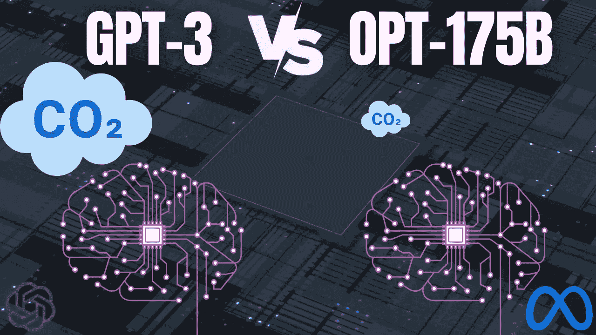

# GPT-3 最接近的竞争对手！

> 原文：<https://pub.towardsai.net/gpt-3s-closest-competitor-79b0976c9c3?source=collection_archive---------0----------------------->

## 像 GPT 3 一样强大的开源模型！通过 Meta AI

> 最初发表于 [louisbouchard.ai](https://www.louisbouchard.ai/opt-meta/) ，前两天在[我的博客](https://www.louisbouchard.ai/opt-meta/)上读到的！

## 看视频！

我们都听说过 GPT 3 号，对它的能力有一定的了解。你肯定已经看到了一些严格按照这个模型诞生的应用程序，其中一些我在[之前关于这个模型的视频](https://youtu.be/Gm4AMjV8ErM)中提到过。GPT-3 是由 OpenAI 开发的一个模型，你可以通过一个付费的 API 访问它，但是不能访问模型本身。

让 GPT-3 如此强大的是它的结构和大小。它有 1750 亿个参数。我们大脑中神经元数量的两倍！

这个巨大的网络几乎是在整个互联网上训练出来的，以理解我们如何书写、交换和理解文本。本周，Meta 为社区向前迈进了一大步。他们刚刚发布了一个同样强大的模型，而且完全开源。多酷啊。

我们现在可以访问一个类似 GPT 的模型并直接使用它，而不需要通过 API 和有限的访问。Meta 的最新型号 OPT 代表开放式预训练变压器，有多种尺寸，带有预训练的重量，可以玩或做任何研究工作，其中一种可以与 GPT-3 相媲美，效果最好。这对这个领域来说是个超级酷的消息，尤其是对我们这些学术研究者来说。

OPT，或者更准确地说是 OPT-175B，非常类似于 GPT-3，所以我强烈建议观看我的视频[来更好地理解大型语言模型是如何工作的。GPT-3 和 OPT 不仅可以总结你的电子邮件或根据一个主题写一篇短文。它还可以解决基本的数学问题，回答问题，等等。](https://youtu.be/gDDnTZchKec)

GPT-3 的主要区别在于它是开源的，这意味着你可以访问它的代码，甚至可以直接使用预先训练好的模型。另一个有趣的事实是，OPT 的训练使用了 GPT-3 的 1/7 的碳足迹，这是朝着正确方向迈出的又一步。你可以说这个新模型非常类似于 GPT 3，但是是开源的。

这是一个使用变形金刚的语言模型，我之前在视频中提到过，它是在许多不同的数据集上训练的，可以说是在整个互联网上，来处理文本并生成更多的文本。为了更好地理解它们是如何工作的，我会再次向你推荐我制作的关于 GPT-3 的视频[，因为它们是非常相似的模型。](https://youtu.be/gDDnTZchKec)

Jay Alammar 的博客视频。“GPT3 如何工作——可视化和动画”

在这里，我真正想介绍的是 Meta 努力使这种模型为每个人所用，同时投入大量精力来分享它的局限性、偏见和风险。例如，他们看到 OPT 倾向于重复，陷入循环，这在我们身上很少发生；否则，没人会和你说话。由于它是在互联网上训练的，他们还发现，OPT 很容易产生有毒的语言，并强化有害的刻板印象。基本上是复制我们的一般行为和偏见。它还会产生事实上不正确的陈述，如果你希望人们认真对待你，这是不可取的。这些限制是这些模型不会很快取代人类进行重要决策工作，甚至不会在商业产品中安全使用的一些最重要的原因。

我邀请您阅读他们对该模型容量的深入分析，并更好地了解他们在使该模型更加环保和安全使用方面所做的努力。您还可以阅读更多关于他们的培训过程，并用公开的代码亲自尝试一下！所有的链接都在下面的参考文献中。

这种带有新模型、文档和可用代码的开源贡献对于研究社区推进科学非常重要，我很高兴像 Meta 这样的大公司这样做。多亏了他们，来自世界各地的研究人员将能够用最先进的语言模型而不是较小的版本进行实验。我很兴奋地看到它将创造的所有即将到来的进步，我很想看看你们用它做什么。

欢迎在[我的视频](https://www.youtube.com/watch?v=Ejg0OunCi9U)下发表评论，或者加入我们的 Discord 社区，在那里分享你的项目，它叫做[一起学习人工智能](https://discord.gg/learnaitogether)，你也可以在下面找到链接。

我希望你喜欢本周的文章，这篇文章与往常有些不同，报道了这个令人兴奋的消息和分享公开可用研究的重要努力。

下周我会带着另一篇精彩的论文来看你！

## 参考

OPT 的视频:【张，苏珊等“OPT:开放预训练的变压器语言模型。”[https://arxiv.org/abs/2205.01068](https://arxiv.org/abs/2205.01068)
我的 GPT-3 的大型语言模型视频:[https://youtu.be/gDDnTZchKec](https://youtu.be/gDDnTZchKec)
Meta 的帖子:[https://AI . Facebook . com/blog/democratizing-access-to-large-scale-language-models-with-OPT-175b/](https://ai.facebook.com/blog/democratizing-access-to-large-scale-language-models-with-opt-175b/)
代码:[https://github.com/facebookresearch/metaseq](https://github.com/facebookresearch/metaseq)[https://github . com/Facebook research/metaseq/tree/main/projects/OPT](https://github.com/facebookresearch/metaseq/tree/main/projects/OPT)):[https://www.louisbouchard.ai/newsletter/](https://www.louisbouchard.ai/newsletter/)