# 梯度推进技术

> 原文：<https://pub.towardsai.net/gradient-boosting-technique-b3dbb7069b74?source=collection_archive---------2----------------------->

## [机器学习](https://towardsai.net/p/category/machine-learning)

## 数字解释和数学直觉

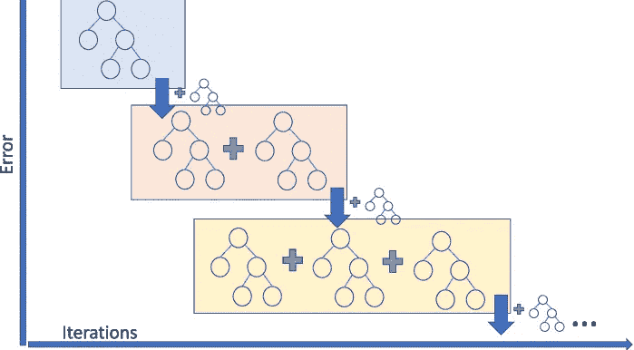

[来源](https://www.researchgate.net/profile/Ivanna_Baturynska/publication/340524896/figure/fig3/AS:878319096569859@1586418999392/Schematical-representation-of-gradient-boosting-regression-in-regards-to-algorithm.png)

# 介绍

梯度推进技术是一种监督机器学习算法，属于集成推进技术家族。它通常应用于回归和分类问题，以生成基于弱预测学习器模型的组合输出结果来评估输出特征的模型。它应用最小化损失函数的概念来优化模型。使用决策树来构建顺序模型，直到达到最大准确度。

当梯度增强用于预测给定数据集的连续输出值时，我们将为回归执行梯度增强。同样，如果我们预测离散值输出，那么我们将执行梯度推进进行分类。

在本文中，我们将主要关注使用回归的梯度推进。

# 梯度推进的步骤

我们以下面的数据集为例，根据年龄、学位和工作年限等因素来预测候选人的薪资。

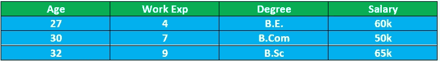

作者图片

**第一步:取输出特征的平均值**

在这里，我们计算提供给候选人的工资的平均值，并假设它是我们的预测产值。所以我们在 Salary(实际产值)列旁边添加一个新列。

**=所有工资的总和**

**=60+50+65 = 58**

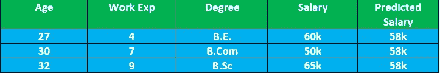

作者图片

**第二步:计算残值**

接下来是计算预测值和实际值之间的差异。这种差异被称为残值。

**残差=实际值—预测值**

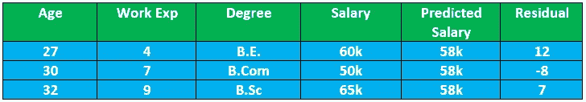

作者图片

尽管从上表中可以看出，给预测工资加上一个残差就可以得到预期的实际工资，但是你认为这可行吗？嗯，这可能有助于我们在模型测试过程中自救，但我们可能无法在模型测试过程中得到很多变化。因此，基本上，在将模型应用于未知数据集时，我们可能会遇到低偏差和高方差的问题。文章的后半部分解释了这个问题的解决方案。

**步骤 3:生成基础学习者决策树**

然后，我们基于作为输出值的残差和作为输入参数的给定独立特征来构建决策树。为了避免高方差问题，我们使用学习参数缩放剩余输出值，并将其添加到平均预测工资中。

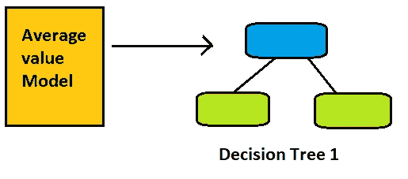

作者图片

**步骤 4:生成决策树 1 的预测输出**

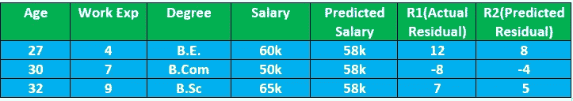

作者图片

上图中我们计算的 R1 残差值显示了决策树模型的实际值。我们可以使用损失函数的公式来获得决策树输出的预测值。因为我们希望最小化实际输出和预测输出之间的损失，所以代表决策树的预测输出的剩余值 R2 将总是具有小于其输出的值。

**步骤 5:预测每个样本的新 o/p 值**

因此，应用决策树后的新预测值如下所示:

先前预测值+学习率*当前预测值

**α =学习率= 0.1**

这里引入了学习率来解决上面在步骤 2 中引入的高方差问题。

现在我们考虑上面[图像](https://cdn-images-1.medium.com/max/720/1*y869uEHIEo39m-dmF6I0fg.png)中的记录-1，以便更好地理解事情。

这里，

实际产量最初由薪金= 60k 给出

预测工资由= 58k 给出

树 1 的预测工资= 8k

因此，新的预测值由下式给出

58+0.1*8 = 58.8

因此，通过应用一个决策树，预测值从 58 到 58.8 更接近实际值 60。

**所以结论是，我们需要不断重复创建决策树的过程，直到达到预测值等于实际值的阶段。**

我们需要继续执行迭代以达到最大的准确性。

# 数学直觉

为了理解上述过程，我们进一步理解为其设计的算法。我们将对算法和数值做一步一步的比较，以便更好地把握事物。

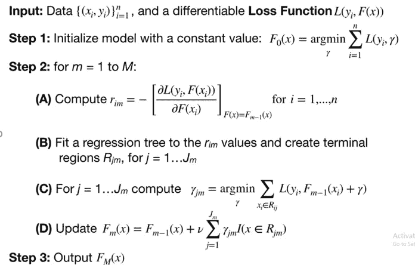

作者图片

**第一步:**

它是定义为常数值的平均值的计算。我们通过应用最小化实际和预测结果之间的差异的概念，即损失函数，来计算常数值或第一个预测工资值。数学上最小化任何东西意味着在那个点上的微分为零。因此，在下图中，我们

作者图片

现在，放回每条记录的 y 值，我们可以计算整个数据集的预测值或平均值。

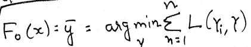

作者图片

**步骤 2(a):**

对于ῡ= f₀( x)=预测值，我们现在需要计算预测值的残差或差值

为了计算残差，我们使用由 m 表示的决策树。

rᵢₘ =决策树 m 的记录 I 的残差

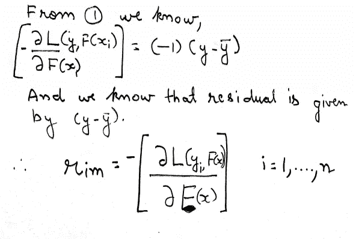

作者图片

**步骤 2(b):**

我们现在使用残差作为输出和特征 x 作为输入来构建决策树 1。

**步骤 2(c):**

对于在上述步骤中获得的每个实际剩余输出，我们现在将计算预测输出ῡ.

我们已经有了模型 1 的预测值，它被定义为步骤 1 中的平均值。

为了获得决策树中的剩余预测输出，我们使用步骤 1 的损失函数的概念。

j =决策树中的叶节点

yᵢ =实际产量

ῡ=预测产量

Fₘ-₁( x ) =先前模型输出

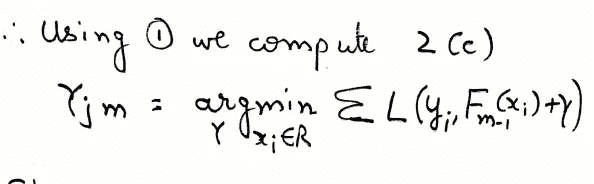

作者图片

**第二步(d)**

在获得决策树的预测值后，我们将其与先前的模型值相结合。循环将不断重复，直到预测值等于实际值。

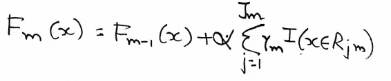

作者图片

感谢您朗读文章！！

你可以在 LinkedIn 上找到我

 [## Charanraj Shetty -技术作家-走向人工智能| LinkedIn

### Pilani BITS 软件系统(数据科学)在职硕士综合学习计划。正在寻找…

www.linkedin.com](https://www.linkedin.com/in/charanraj-shetty-a74831b2/)