# 梯度下降算法讲解

> 原文：<https://pub.towardsai.net/gradient-descent-algorithm-explained-2fe9da0de9a2?source=collection_archive---------0----------------------->

## [机器学习](https://towardsai.net/p/category/machine-learning)

## 一步一步的数学推导

来源: [Unsplash](https://unsplash.com/photos/LndSNO0J8F0)

# 索引:

*   梯度下降的基础。
*   推导的基本规则。
*   单变量梯度下降。
*   双变量梯度下降。
*   均方误差函数的梯度下降。

## 什么是梯度下降？

梯度下降是一种机器学习算法，它迭代地寻找其参数的最佳值。它考虑了用户定义的学习率和初始参数值。

## 它是如何工作的？

*   从初始值开始。
*   计算成本。
*   使用 Update 函数更新值。
*   返回成本函数的最小成本

## 我们为什么需要它？

一般来说，我们要做的是，找到给出参数最优值的公式。但是在这个算法里，它是自己找值的！很有趣，不是吗？

## 公式:

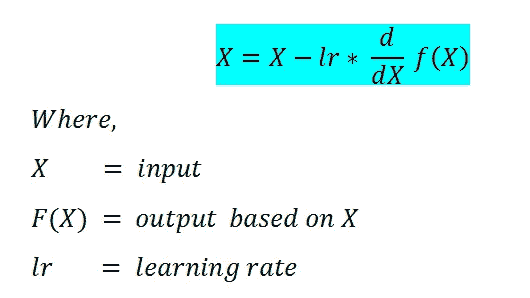

梯度下降公式

# 推导的一些基本规则:

(一)标量倍数规则:

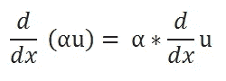

来源:图片由作者创作。

(B)总和规则:

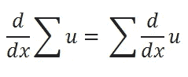

来源:图片由作者创作。

权力规则:

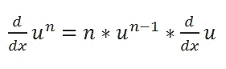

来源:图片由作者创作。

(D)连锁规则:

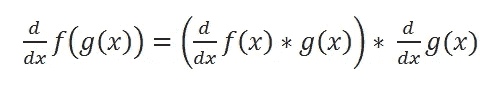

来源:图片由作者创作。

## 让我们看看各种例子来更好地理解它。

# 梯度下降最小化—单变量:

我们将使用梯度下降来寻找使成本最小的 *θ* 。但是让我们暂时忘记均方误差(MSE)成本函数，来看看一般的梯度下降函数。

现在我们通常做的是，使用某种简化找到参数的最佳值，并建立一个函数，使我们的成本最小化。但是这里我们要做的是为我们的参数取一些默认值或随机值，让我们的程序迭代运行，以找到最小化的成本。

## 让我们深入探讨一下:

先拿一个很简单的函数来说: **J( *θ* ) = *θ*** ，我们的目标是求 *θ* 的值，其中**使 J( *θ* )** 最小。

从我们的成本函数中，我们可以清楚地说，对于 *θ* = 0，它将是最小的，但在处理一些复杂的函数时，得出这样的结论就不会那么容易了。

(A)成本函数:我们将尝试最小化该函数的值。

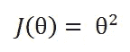

来源:图片由作者创作。

(B)目标:最小化成本函数。

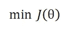

来源:图片由作者创作。

(C)更新函数:最初我们为我们的参数取一个随机数，这不是最佳的。为了使它最优，我们必须在每次迭代中更新它。这个函数会处理它。

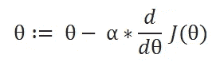

来源:图片由作者创作。

学习速度:下降速度。

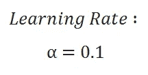

来源:图片由作者创作。

(E)更新参数:

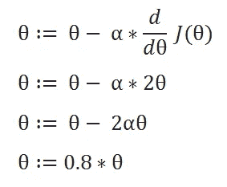

来源:图片由作者创作。

表格生成:

这里我们用θ = 5 来表示。

记住这里θ = 0.8*θ，对于我们的学习率和代价函数。

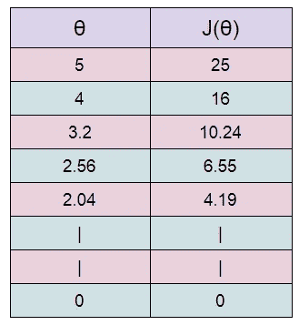

来源:图片由作者创作。

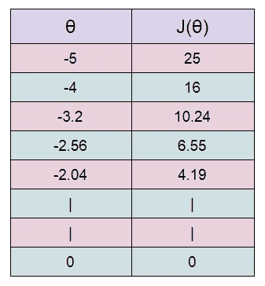

来源:图片由作者创作。

这里我们可以看到，随着θ的降低，成本值也在降低。我们只需要找到它的最佳值。为了找到最佳值，我们必须进行多次迭代。迭代次数越多，我们得到的最优值就越多！

图表:我们可以绘制上述各点的图表。

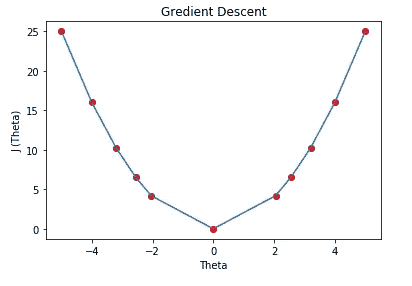

来源:图片由作者创作。

## 成本函数导数:

为什么梯度下降要用代价函数的导数？我们希望我们的成本函数最小，对吗？最小化成本函数只是让我们在预测值时有更低的错误率。理想情况下，我们取一个函数对 0 的导数，求参数。这里我们做同样的事情，但我们从一个随机数开始，并试图迭代地最小化它。

## 学习率/α:

学习速度让我们能够很好地控制我们前进的步伐。选择正确的学习速度是一项非常关键的任务。如果学习率太高，那么你可能会超过最小值而偏离。例如，在上面的例子中，如果我们取α= 2，那么每次迭代都会使我们远离最小值。所以我们使用小的阿尔法值。但是使用小的学习率的唯一问题是我们必须执行更多的迭代以达到最小的成本值，这增加了训练时间。

## 收敛/停止梯度下降:

注意，在上面的例子中，梯度下降实际上永远不会收敛到θ= 0 的最小值。决定何时停止迭代的方法超出了我的专业水平。但是我可以告诉你，在做作业的时候，我们可以进行固定次数的迭代，比如 100 或 1000 次。

# 梯度下降—多变量:

我们的最终目标是找到包含多个变量的 MSE 函数的参数。所以这里我们将讨论一个 2 变量的成本函数。理解这一点将对我们的 MSE 成本函数有很大帮助。

让我们来看看这个函数:

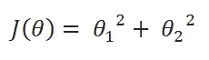

来源:图片由作者创作。

当最小化目标中有多个变量时，我们必须为更新函数定义单独的规则。由于成本函数中有多个参数，我们必须使用偏导数。这里我简化了偏导数过程。让我们看看这个。

(A)成本函数:

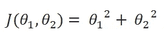

来源:图片由作者创作。

目标:

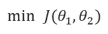

来源:图片由作者创作。

(C)更新规则:

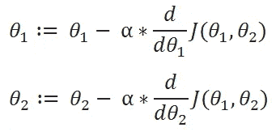

来源:图片由作者创作。

衍生产品:

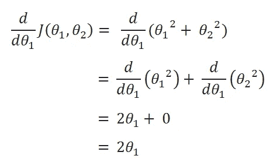

来源:图片由作者创作。

来源:图片由作者创作。

(E)更新数值:

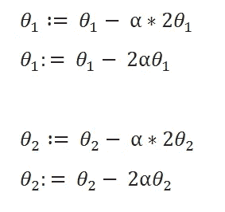

来源:图片由作者创作。

学习率:

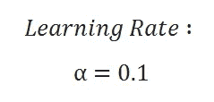

来源:图片由作者创作。

(G)表格:

从θ1 =1 开始，θ2 =1。然后使用更新函数更新该值。

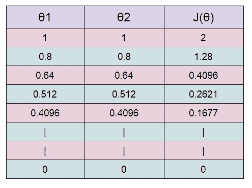

来源:图片由作者创作。

图表:

来源:图片由作者创作。

这里我们可以看到，随着迭代次数的增加，我们的成本值在下降。

注意，在 python 中实现程序时，在我们找到θ1 和θ2 的新值之前，不能更新新值。我们显然不想用θ1 的新值去用θ2 的旧值。

# 均方误差的梯度下降；

既然我们知道了如何对一个多变量的方程进行梯度下降，我们可以返回来看看我们的 MSE 成本函数的梯度下降。

我们开始吧！

(一)假设功能:

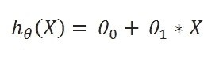

来源:图片由作者创作。

(B)成本函数:

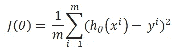

来源:图片由作者创作。

(C)求 J(θ0，θ1) w.r.t 对θ1 的偏导数:

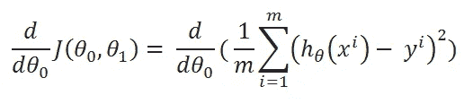

来源:图片由作者创作。

(D)简化一点:

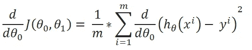

来源:图片由作者创作。

(E)定义变量 u:

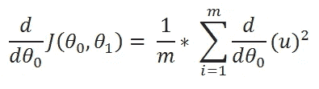

来源:图片由作者创作。

(F)u 值:

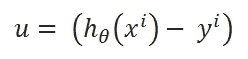

来源:图片由作者创作。

(G)求偏导数:

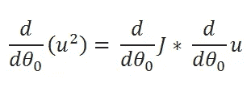

来源:图片由作者创作。

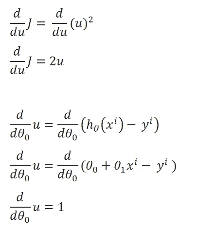

来源:图片由作者创作。

(H)重写方程式:

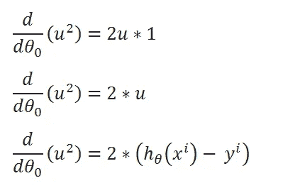

来源:图片由作者创作。

(I)合并所有计算的数据:

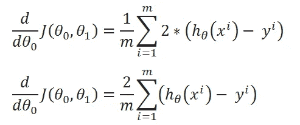

来源:图片由作者创作。

(J)重复相同的过程推导 J(θ0，θ1) w.r.t θ1:

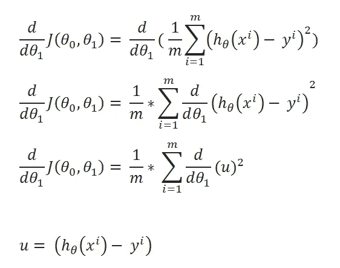

来源:图片由作者创作。

简化计算:

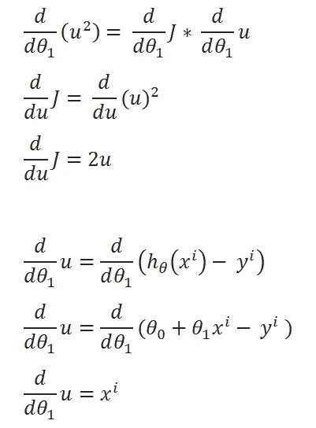

来源:图片由作者创作。

(L)合并所有计算数据:

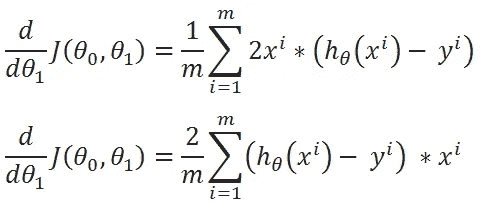

来源:图片由作者创作。

# 半均方误差:

我们将我们的 MSE 成本函数乘以 1/2，这样当我们求导时，2s 就抵消了。将成本函数乘以一个标量不会影响最小值的位置，因此我们可以摆脱这一点。

## 决赛:

(A)成本函数:一半均方误差:

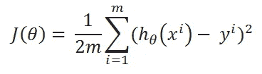

来源:图片由作者创作。

目标:

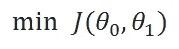

来源:图片由作者创作。

(C)更新规则:

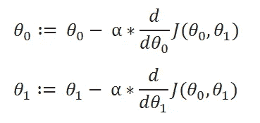

来源:图片由作者创作。

衍生产品:

来源:图片由作者创作。

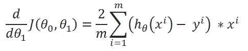

来源:图片由作者创作。

**原来如此，原来如此。我们终于成功了！**

# 结论:

我们将在机器学习算法的各种应用中使用相同的方法。但那时我们不会深入讨论这个问题，我们只是使用最终的公式。但知道它是如何推导出来的总是好的！

## 最终配方:

梯度下降公式

**你现在明白这个概念了吗？请写回信让我知道。如果你喜欢这篇文章，然后点击拍手图标。**

***如果您有任何其他困惑，请随时联系我。***[**shuklapratik22@gmail.com**](http://shuklapratik22@gmail.com)