# 使用 Python 教程的机器学习(ML) 101 的梯度下降

> 原文：<https://pub.towardsai.net/gradient-descent-algorithm-for-machine-learning-python-tutorial-ml-9ded189ec556?source=collection_archive---------0----------------------->

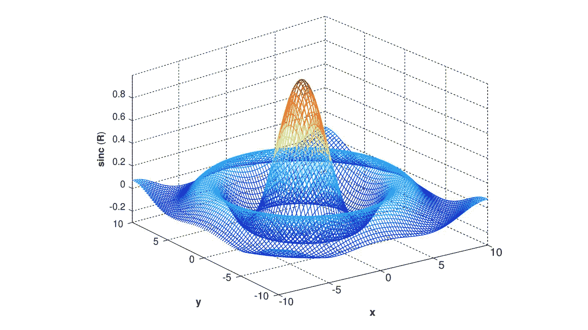

非标准化 sin(x)函数的三维线框图。来源:维基媒体知识共享[ [1](https://commons.wikimedia.org/wiki/File:MATLAB_mesh_sinc3D.svg) ]

## [数据科学](https://towardsai.net/p/category/data-science)，[编辑](https://towardsai.net/p/category/editorial)，[编程](https://towardsai.net/p/category/programming)

## 使用 Python 深入研究机器学习(ML)的梯度下降算法的教程

最后更新，2021 年 1 月 7 日

**作者:**萨妮娅·帕维斯，[罗伯托·伊里翁多](https://mktg.best/vguzs)

**本教程的代码可在**[**Github**](https://github.com/towardsai/tutorials/tree/master/gradient_descent_tutorial)**上获得，其完整实现也可在**[**Google Colab**](https://colab.research.google.com/drive/1bSHQVqbVD7ZqDHfyDy03dSWCdYmrUYmF?usp=sharing)**上获得。**

> *🤖走向 AI 是一个讨论人工智能、数据科学、数据可视化、深度学习、机器学习、NLP、计算机视觉、相关新闻、机器人、自动驾驶汽车、编程、技术等的社区！* [***加入我们***](https://towardsai.net/backers) *🤖*

# 目录

*   [什么是梯度下降？](#dbf9)
*   [成本函数](#d0c8)
*   [渐变](#7fd3)
*   [Python 实现](#32ea)
*   [学习率](#b7a5)
*   [收敛](#183b)
*   [凸函数](#1c83)
*   [批量梯度下降](#2f3c)
*   [随机梯度下降](http://30cb)
*   [小批量梯度下降](#340b)
*   [结论](#340b)
*   [资源](#a6ee)
*   [参考文献](#93c5)

> 📚查看我们的[卷积神经网络](https://towardsai.net/p/deep-learning/convolutional-neural-networks-cnns-tutorial-with-python-417c29f0403f)教程。📚

# 什么是梯度下降？

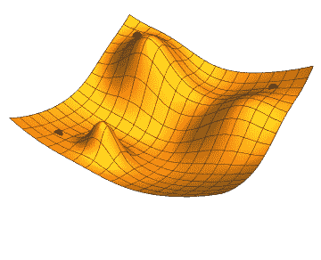

图 1:渐变下降图|来源:维基媒体知识共享[ [3](https://commons.wikimedia.org/wiki/File:Gradient_descent.gif) ]

**梯度下降**是神经网络[ [7](https://www.researchgate.net/publication/221653420_Large-scale_matrix_factorization_with_distributed_stochastic_gradient_descent) ]、数据科学、优化和机器学习任务中最常用的机器学习算法之一。梯度下降算法及其变体几乎可以在每个机器学习模型中找到。

梯度下降是一种在机器学习模型中调整参数的流行优化方法。它的目标是应用优化来找到最小或最小的误差值。它主要用于更新模型的参数，在这种情况下，参数是指回归中的系数和神经网络中的权重。

**梯度**是一个向量值函数，它描述了一个函数图形的切线斜率，指向该函数最显著的增长率的方向。它是一个导数，表示一个成本函数[ [6](http://sites.science.oregonstate.edu/math/home/programs/undergrad/CalculusQuestStudyGuides/vcalc/grad/grad.html) ]的倾斜度或斜率。

例如:

> 假设约翰在山顶上，他的目标是到达底田，但约翰是盲人，看不到底线。他将如何解决这个问题？

为了解决这个问题，他将采取小步骤，并向更高的倾斜方向移动，通过一次移动一步来反复应用这些步骤，直到他最终到达山脚。

梯度下降的执行方式与示例中提到的方式相同。它的主要目的是到达山的最低点。

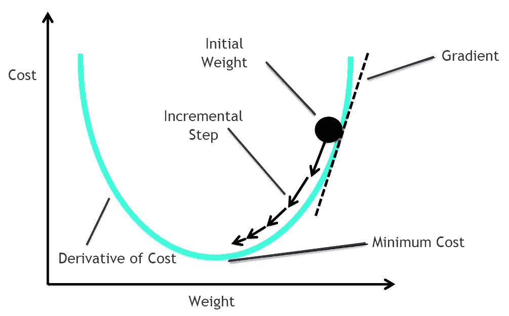

图 2:梯度下降可视化。[ [2](https://ithelp.ithome.com.tw/articles/10218912)

为了深入了解梯度下降，必须详细了解以下主题:

*   价值函数
*   成本函数的最小化
*   最小值和最大值
*   凸函数
*   梯度
*   停止条件
*   学习率

# 价值函数

成本函数衡量机器学习算法对分配数据的性能。它量化了预测值和期望值之间的误差，并以单个实数的形式模拟它。从根本上说，它衡量的是由算法造成的预测误差。它显示了给定数据集的预测值和实际值之间的差异。如果成本函数具有较低的值，则模型可以具有更好的预测能力。成本函数的一个优秀值是零— **我们使用梯度下降算法来最小化成本函数**。

这些是机器学习中使用的重要成本函数:

*   均方误差
*   对数损失或交叉熵
*   KL-散度

**均方差方程:**

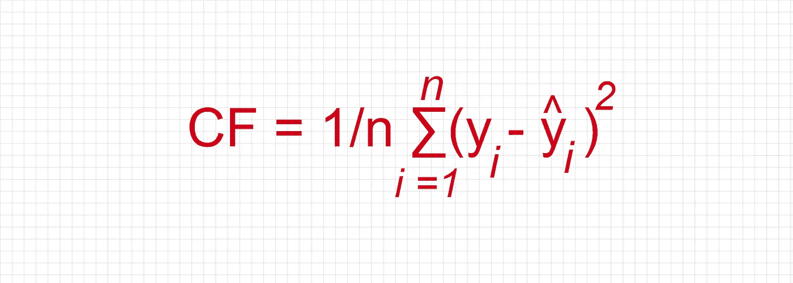

图 3:均方误差方程

其中:

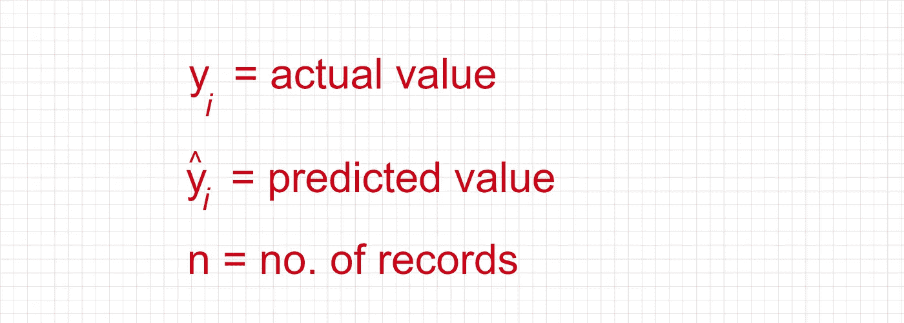

图 4:图 4:均方误差方程的条件。

均方误差用于机器学习中的回归算法。

Python 代码示例:

```
def sum_of_squares(v):
    val = sum(item ** 2 for item in v)
```

**对数损失或交叉熵方程:**

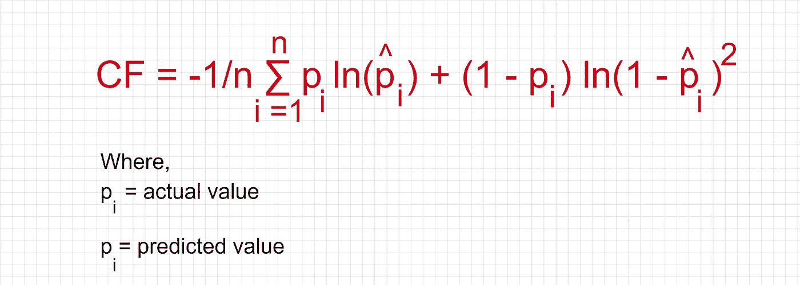

图 5:对数损失或交叉熵的等式。

在分类问题中使用了代价函数 log loss 或交叉熵。

## 成本函数与梯度下降的关系

成本函数是最小化的情况。成本函数可以是训练集的误差平方和。梯度下降法是一种求多元函数最小值的方法[ [8](https://towardsdatascience.com/minimizing-the-cost-function-gradient-descent-a5dd6b5350e1) ]，可以用来最小化代价函数。综上所述，如果**成本函数**是 **K** 变量的函数，那么**梯度**就是代表成本增长最快方向的**长度-K** 向量。

例如:

假设存在回归模型将被应用于二元分类的情况。总是期望以高精度和最小的误差或损失来执行模型。

所以，线性方程→ **y= mx + c** 中，一般都是计算参数值 **m** 和 **c** 。期望最小的误差或损失，这就是所谓的成本函数或损失函数。

寻找损失最小的参数值 **m** 和 **c** 总是具有挑战性。在这种情况下，**梯度下降**算法进入画面。本质上，它有助于模型找到损失最小的点。这就是为什么它与成本函数有密切的关系。

# 梯度

直线的坡度表示直线有多陡[ [17](https://www.mathsisfun.com/gradient.html) ]。

梯度方程:

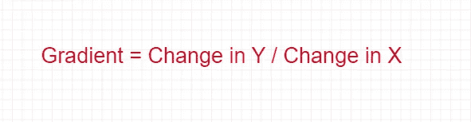

图 6:梯度的方程式。

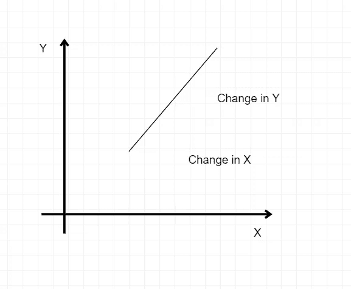

图 7:渐变图。

与梯度相关的几点:

*   向上为正，向下为负
*   从左边开始，穿过右边是积极的。

设 e1，e2，.。。，ed 2 Rd 是一组特定的单位向量，使得 ei = (0，0，.。。, 0, 1, 0, .。。，0)其中对于 ei，1 在第 I 个坐标中。

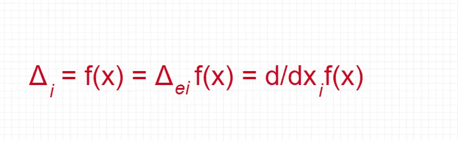

图 8:梯度的方程式。

梯度下降是机器学习中用于估计模型参数的常用优化算法。根据微积分，这是一个纯偏导数，给出了函数增加最快的输入方向。

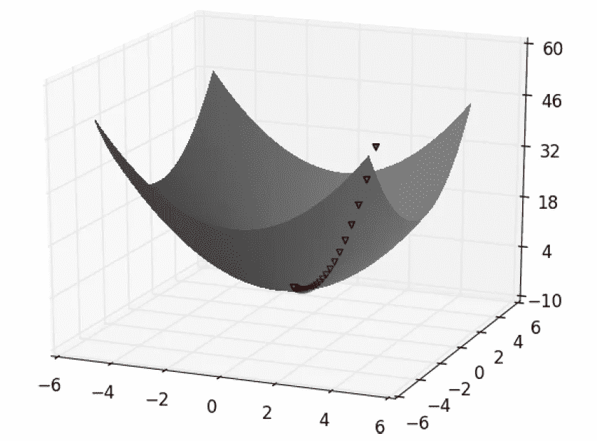

图 9:使用梯度下降寻找最小值。

基本上，为了最大化一个函数，算法选择一个随机的起点，测量梯度，在梯度的方向上迈出一小步，然后用新的起点重复。类似地，通过在相反的方向上采取小的步骤，功能被最小化。我们基于其初始值来计算成本函数，并且参数估计在各个步骤上被细化，使得成本函数最终暗示最小值。

**梯度下降算法**:

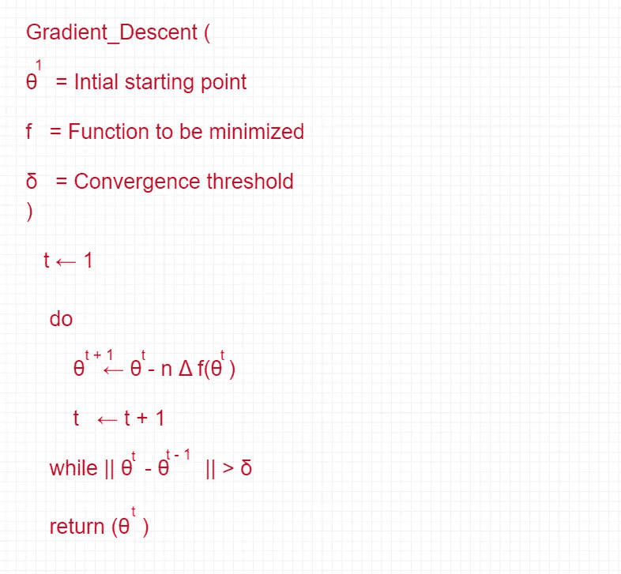

图 10:梯度下降算法。

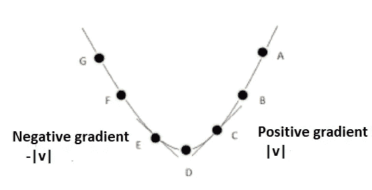

图 11:渐变步骤。

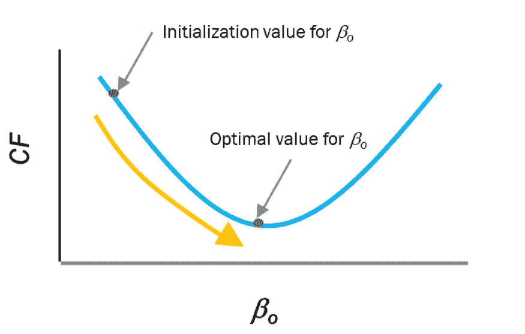

图 12:成本函数最小化过程。[ [9](https://www.mygreatlearning.com/blog/understanding-learning-rate-in-machine-learning/)

梯度下降方程:

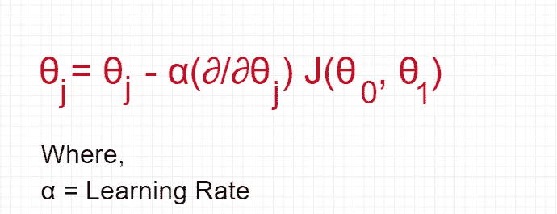

图 13:梯度下降算法的等式。

首先，这个公式告诉我们它需要去的下一个位置，也就是最陡的下降方向。

```
#Pseudocode
train(θ) = (1/2m) Σ( hθ(x(i)) - y^(i))^2Repeat {
 θj = θj – (learning-rate/m) * Σ( hθ(x^(i)) - y^(i))xj^(i)
    For every j = 0 … n 
}
```

在这种情况下:

**xj^(i)** 是 **i^th** 训练示例的第 j 个特征。接下来，我们重复直到它达到收敛:

1.  给定梯度，计算参数随学习率的变化。
2.  用新的参数值重新计算新的梯度。
3.  重复步骤 1。

有三种**常见的梯度下降类型**:

*   **批量梯度下降**
*   **随机梯度下降**
*   **小批量梯度下降**

# 用 Numpy 实现梯度下降的 Python 实现:

导入所有必需的包:

```
import pandas as pdimport numpy as npimport matplotlib.pyplot as plt%matplotlib inline
```

从 CSV 读取数据:

```
column_names = ['Population', 'Profit']df = pd.read_csv('/content/data.txt', header=None, names=column_names)df.head()
```

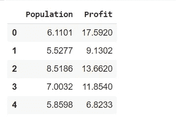

图 14:数据输出。

获取 X 和 Y 的值:

```
df.insert(0, 'Theta0', 1)cols = df.shape[1]X = df.iloc[:,0:cols-1]Y = df.iloc[:,cols-1:cols]theta = np.matrix(np.array([0]*X.shape[1]))X = np.matrix(X.values)Y = np.matrix(Y.values)
```

绘制数据:

```
df.plot(kind='scatter', x='Population', y='Profit', figsize=(12,8))
```

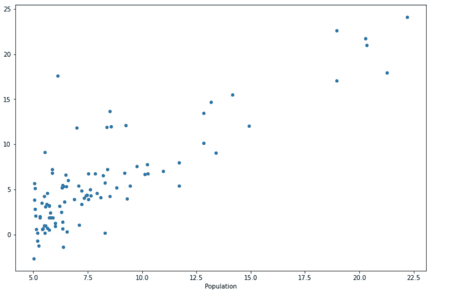

图 15:数据的绘制。

计算 RSS 的方法:

```
def calculate_RSS(X, y, theta):  
    inner = np.power(((X * theta.T) - y), 2)
    return np.sum(inner) / (2 * len(X))
```

计算梯度下降的方法:

```
def gradientDescent(X, Y, theta, alpha, iters):  
    t = np.matrix(np.zeros(theta.shape))
    parameters = int(theta.ravel().shape[1])
    cost = np.zeros(iters)

    for i in range(iters):
        error = (X * theta.T) - Y    for j in range(parameters):
         term = np.multiply(error, X[:,j])
         t[0,j] = theta[0,j] - ((alpha / len(X)) * np.sum(term))     theta = t
     cost[i] = calculate_RSS(X, Y, theta)     return theta, cost
```

不应用梯度下降计算误差:

```
error = calculate_RSS(X, Y, theta)error
```

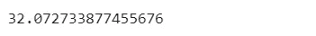

图 16:没有应用梯度下降的错误。

通过应用梯度下降计算误差:

```
g, cost = gradientDescent(X, Y, theta, 0.01, 1000)g
```

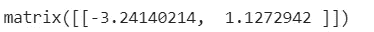

图 17:误差矩阵。

应用梯度下降后计算误差:

```
error = calculate_RSS(X, Y, g)error
```

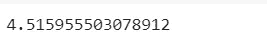

图 18:应用梯度下降后的错误。

数据绘图:

```
x = np.linspace(df.Population.min(), df.Population.max(), 100)f = g[0, 0] + (g[0, 1] * x)fig, ax = plt.subplots(figsize=(12,8))ax.plot(x, f, 'r', label='Prediction')ax.scatter(df.Population, df.Profit, label='Traning Data')ax.legend(loc=2)ax.set_xlabel('Population')ax.set_ylabel('Profit')ax.set_title('Predicted Profit vs. Population Size')
```

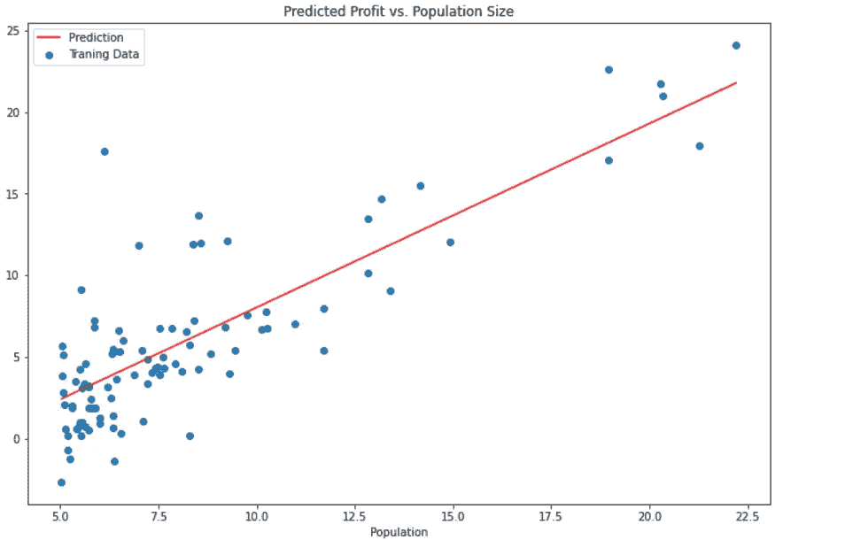

图 19:数据的绘制。

# 学习率

学习速率是一个超参数，用于控制算法更新参数估计值或学习参数值[ [9](https://www.mygreatlearning.com/blog/understanding-learning-rate-in-machine-learning/) ]的速率。它主要是优化算法中的一个调整参数，并在向最小损失函数移动时确定每次迭代的步长。它用于缩放梯度下降过程中参数更新的幅度。它将梯度乘以一个数字(学习率或步长)来确定下一个点。

示例:

有一个**大小**为 **4.2** 和**学习速率**为 **0.01 的梯度，然后**梯度下降算法将选取下一个点，距离上一个点 **0.042** 。

理解**局部最大值**和**局部最小值概念**对于详细理解学习率概念至关重要。

# 局部极大

一个函数 **f(x)** 在 **x = a，**处有一个局部最大值，如果 **f(a)** 的值比 **f(x)** 在 **x=a** 的一个小邻域内的所有值都重要。因此，在下面所示的数学等式中:

> ***f(a)>f(a-h)****和****f(a)>f(a+h)****。其中，****h>0****，则***称为局部最大值的点。**

*从根本上说，局部最大值是景观中大于其每个相邻状态的峰值位置。*

*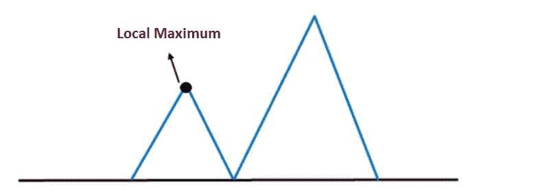*

*图 20:局部最大值。*

# *局部极小*

*如果在 **x = a** 处的函数值小于在 **x = a** 的相邻点处的函数值，则函数 **f(x)** 在**x = a**处具有局部最小值。因此，在下面所示的数学等式中:*

> ****f(a)<f(a-h)****和* ***f (a) < f (a + h)。*** *其中****h>0****，则 a 称为局部最小值的点。**

*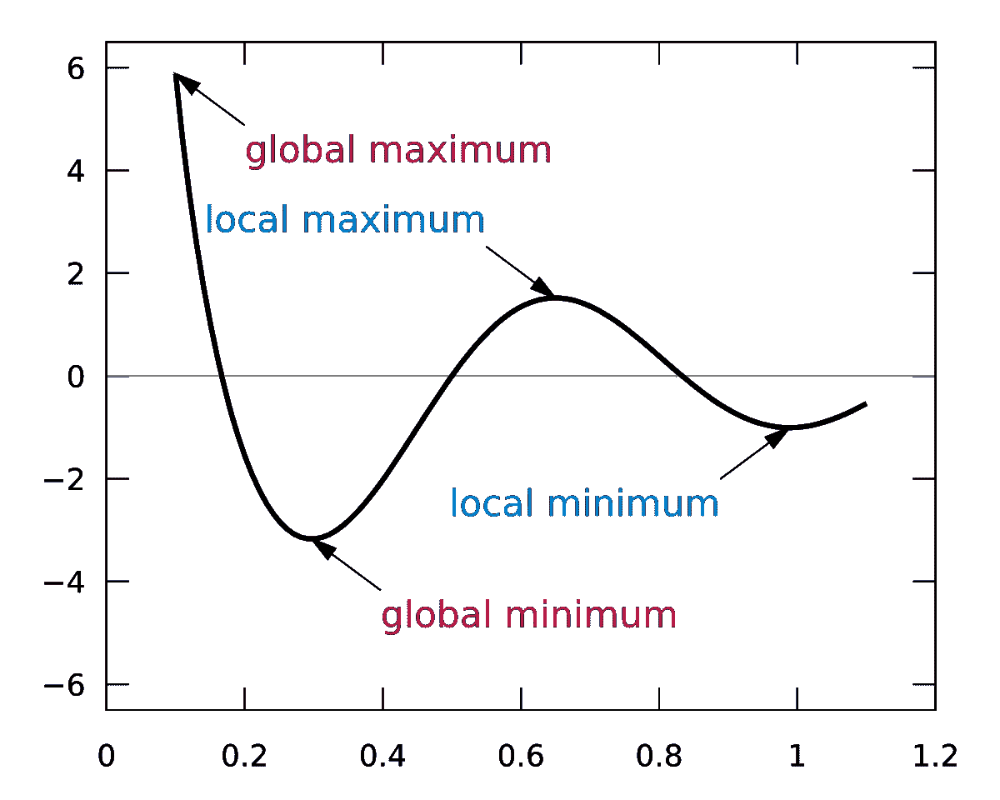*

*图 21:局部最大值和局部最小值|来源:维基百科[ [4](https://en.wikipedia.org/wiki/Maxima_and_minima#/media/File:Extrema_example_original.svg) ]，许可证 [GFDPL 1.2](http://www.gnu.org/licenses/old-licenses/fdl-1.2.html)*

# *学习速度的重要性*

*为了在梯度下降中达到局部最小值，将学习率设置为既不太低也不太高的适当值是至关重要的。学习率是它的一个组成部分，因为如果它采取的步骤太大，它可能达不到**本地最小值。**毕竟**，**它在梯度下降的凸函数之间来回弹跳。*

*如果学习率设置为最小值，那么梯度下降将最终达到局部最小值，然而，这可能需要一段时间[ [16](https://builtin.com/data-science/gradient-descent) ]。*

*学习率可能出现两种不同的情况:*

*   *大学习率*
*   *小学习率*

*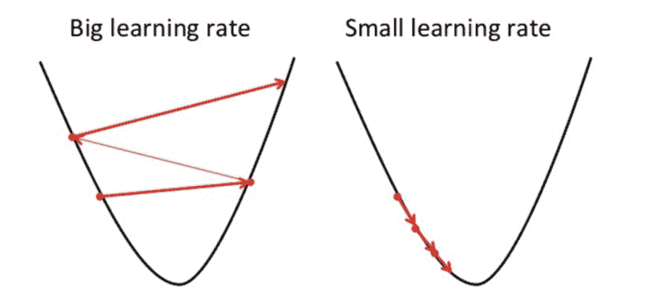*

*图 22:不同的学习率。*

*因此，根据上面显示的不同场景，学习率不应该太高或太低。如果学习率太大，振荡就会发散。*

*显示学习率:*

```
*def step_gradient(b_current, m_current, points, learning_rate):
    b_gradient = 0
    m_gradient = 0
    n = float(len(points))

    for i in range(0, len(points)):
        x = points[i, 0]
        y = points[i, 1]
        b_gradient += -(2/n) * (y - ((m_current * x) + b_current))
        m_gradient += -(2/n) * x * (y - ((m_current * x) + b_current))

    latest_b = b_current - (learning_rate * b_gradient)
    latest_m = m_current - (learning_rate * m_gradient)
    return [latest_b, latest_m]*
```

# *趋同；聚集*

*收敛是指损失函数没有明显改善的位置，我们停留在最小值附近的一个点上。如果成本函数在每次迭代后都下降，那么就说梯度下降是正确的。如果梯度下降不再降低成本函数，并且或多或少地保持在同一水平，则它收敛。*

*当梯度下降开始足够接近最小值时，它收敛到局部最小值。如果有多个局部极小值，其收敛性取决于迭代开始的点。收敛到全局最小值是一个挑战。*

*收敛性总是取决于优化所使用的函数类型。如果目标函数是凸的，梯度下降总是收敛到同一个局部极小值，它也是全局极小值。*

*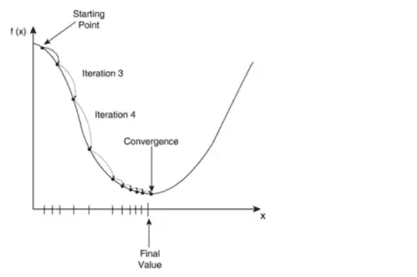*

*图 23:梯度下降中的收敛。*

# *凸函数*

*如果函数的图上任意两点之间的线段位于图 [15](https://towardsdatascience.com/gradient-descent-unraveled-3274c895d12d) 之上或之上，则为凸函数。*

*数学上，凸函数可以定义为:*

> **凸函数是指在其定义域内每个区间中点的值不超过其在区间两端的值的算术平均值的函数[* [*14*](https://artofproblemsolving.com/wiki/index.php/Convex_function) *]。**

*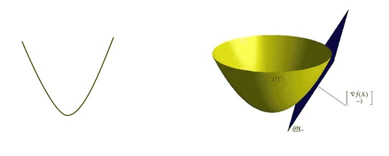*

*图 24:凸函数图。*

*从而进入数学方程式:*

*有一个区间【T8【a，b】**f(x)**是一个函数 **x1** 和 **x2** 是区间【T16【a，b】和任意 **λ** 中的两点其中 **0 < λ < 1** 。所以，*

*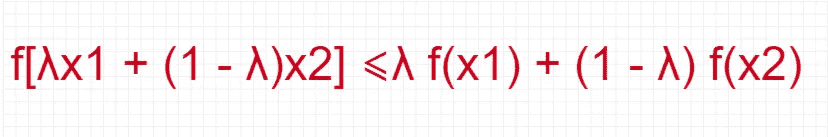*

*图 25:凸的方程式。*

*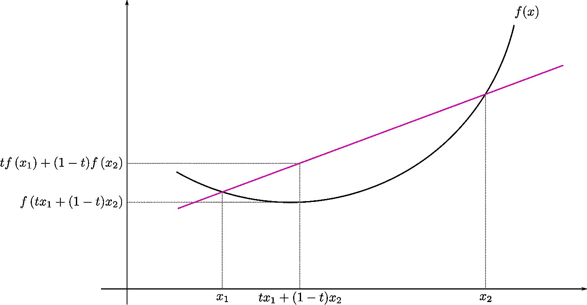*

*图 26:区间上的凸函数|来源:维基百科[ [5](https://en.wikipedia.org/wiki/Convex_function#/media/File:ConvexFunction.svg) ]，许可证 [CC BY-SA 3.0](https://creativecommons.org/licenses/by-sa/3.0)*

# *梯度下降的主要类型*

## *批量梯度下降(BGD)*

*批量梯度下降为训练数据集中的每个示例计算误差，但仅在评估了所有训练示例后更新模型[ [13](https://machinelearningmastery.com/gentle-introduction-mini-batch-gradient-descent-configure-batch-size/) ]。这对于凸的或相对光滑的误差流形是非常好的。这种方法计算量很大，但随着特征数量的增加，它的规模也很大。以下内容对于批量梯度下降至关重要:*

*   *这是非常缓慢和计算昂贵的。*
*   *从不建议使用庞大的训练数据集。*
*   *在这里，收敛是缓慢的。*
*   *它使用整个训练数据集计算梯度。*

## *随机梯度下降*

*批量梯度下降中有一种情况，如下所述:*

> **假设有一个数据集，有 500 万个例子。所以，走一步，模型将计算所有 500 万个例子的梯度。这种情况发生在批量梯度下降中。**

*上述情况是低效的，所以随机梯度下降是在图片中处理这个问题。本质上，它会计算错误，并更新训练资料集中每个范例的模型。*

*随机梯度下降有以下几点:*

*   *它使用单个训练样本计算梯度。*
*   *建议使用大型训练样本。*
*   *与批量梯度下降相比，它速度更快，计算成本更低。*
*   *它更快地达到收敛。*
*   *它能更容易地浅化局部极小值。*

## *小批量梯度下降(MBGD)*

*小批量梯度下降将训练数据集分成小批量，这些批量用于计算模型误差和更新模型系数。它可以用于更平滑的曲线。*

*小批量梯度下降具有以下要点:*

*   *当数据集很大时，可以使用它。*
*   *它直接收敛到最小值。*
*   *对于较大的数据集，速度更快。*
*   *由于在 SGD 中，同时使用的只有一个例子，所以无法实现矢量化实现。*
*   *它可以降低计算速度——为了解决这个问题，混合使用了批量梯度下降和 SGD。*

*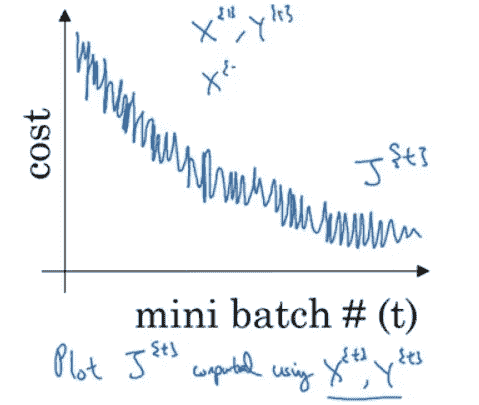*

*图 27:最小批量梯度下降。*

# *结论*

*梯度下降是一种一阶迭代优化算法[ [10](https://en.wikipedia.org/wiki/Gradient_descent) ]，用于获得可微函数的局部最小值。它基于一个凸函数，并反复调整其参数，使给定的函数最小化到其局部最小值。*

*就梯度下降的类型而言，批量梯度下降(BGD)是机器学习中最常用的梯度下降形式[ [12](https://machinelearningmastery.com/master-machine-learning-algorithms/) ]。使用梯度下降法优化系数的一些日常算法是线性回归和逻辑回归[ [11](https://machinelearningmastery.com/gradient-descent-for-machine-learning/) ]。*

***损失函数**解释了模型在当前参数集(权重和偏差)下的表现，而**梯度下降**用于寻找最佳参数集。*

***免责声明:**本文表达的观点仅代表作者个人观点，不代表卡内基梅隆大学或其他(直接或间接)与作者相关的公司的观点。这些文章并不打算成为最终产品，而是当前思想的反映，同时也是讨论和改进的催化剂。*

***除非另有说明，所有图片均来自作者。***

*通过[向 AI](https://towardsai.net/) 发布*

# *资源*

*[Github 库](https://github.com/towardsai/tutorials/tree/master/gradient_descent_tutorial)。*

*[Google colab 实现](https://colab.research.google.com/drive/1bSHQVqbVD7ZqDHfyDy03dSWCdYmrUYmF?usp=sharing)。*

# *参考*

*[1] MATLAB mesh sic3D.svg，Wikimedia Commons，[https://Commons . Wikimedia . org/wiki/File:MATLAB _ mesh _ sinc3d . SVG](https://commons.wikimedia.org/wiki/File:MATLAB_mesh_sinc3D.svg)*

*[2] 從 Gradient Descent to Optimizer, by ITHome, [https://ithelp.ithome.com.tw/articles/10218912](https://ithelp.ithome.com.tw/articles/10218912)*

*[3]梯度下降，维基共享资源，[https://Commons . Wikimedia . org/wiki/File:Gradient _ descent . gif](https://commons.wikimedia.org/wiki/File:Gradient_descent.gif)*

*[4]本地和全球最大值和最小值，维基百科，许可 GFDL 1.2，[https://en . Wikipedia . org/wiki/Maxima _ and _ Minima #/media/File:Extrema _ example _ original . SVG](https://en.wikipedia.org/wiki/Maxima_and_minima#/media/File:Extrema_example_original.svg)*

*[5]区间上的凸函数，维基百科，License CC BY-SA 3.0，[https://en . Wikipedia . org/wiki/Convex _ Function #/media/File:Convex Function . SVG](https://en.wikipedia.org/wiki/Convex_function#/media/File:ConvexFunction.svg)*

*[6]《梯度与方向导数》，俄勒冈州立大学，[http://sites . science . oregonstate . edu/math/home/programs/underbrad/CalculusQuestStudyGuides/vcalc/grad/grad . html](http://sites.science.oregonstate.edu/math/home/programs/undergrad/CalculusQuestStudyGuides/vcalc/grad/grad.html)*

*[7]杰穆拉、莱纳&尼坎普、埃里克&哈斯、彼得&西斯马尼斯、亚尼斯。(2011).分布式随机梯度下降的大规模矩阵分解。ACM SIGKDD 知识发现和数据挖掘国际会议录。69–77.10.1145/2020408.2020426.*

*[8]最小化成本函数:梯度下降，XuanKhanh Nguyen，走向数据科学，[https://towardsdatascience . com/Minimizing-the-cost-function-Gradient-descent-a5dd 6b 5350 e 1](https://towardsdatascience.com/minimizing-the-cost-function-gradient-descent-a5dd6b5350e1)*

*[9]理解机器学习中的学习率，伟大的学习团队，[https://www . mygreatlearning . com/blog/Understanding-Learning-Rate-in-Machine-Learning/](https://www.mygreatlearning.com/blog/understanding-learning-rate-in-machine-learning/)*

*[10]梯度下降，维基百科，[https://en.wikipedia.org/wiki/Gradient_descent](https://en.wikipedia.org/wiki/Gradient_descent)*

*[11]用于机器学习的梯度下降，机器学习掌握，[https://Machine Learning Mastery . com/Gradient-Descent-for-Machine-Learning/](https://machinelearningmastery.com/gradient-descent-for-machine-learning/)*

*[12]Master Machine Learning Algorithms，Jason Brownlee 博士，[https://Machine Learning mastery . com/Master-Machine-Learning-Algorithms/](https://machinelearningmastery.com/master-machine-learning-algorithms/)*

*[13]关于小批量梯度下降和如何配置批量大小的温和介绍，机器学习掌握，[https://machinelementmastery . com/Gentle-Introduction-Mini-Batch-Gradient-Descent-Configure-Batch-Size/](https://machinelearningmastery.com/gentle-introduction-mini-batch-gradient-descent-configure-batch-size/)*

*[14]凸函数，解题的艺术，[https://artofproblemsolution . com/wiki/index . PHP/Convex _ Function](https://artofproblemsolving.com/wiki/index.php/Convex_function)*

*[15] Gradient Descent Unraveled，Manpreet Singh Minhas，[https://towardsdatascience . com/Gradient-Descent-Unraveled-3274 c 895d 12d](https://towardsdatascience.com/gradient-descent-unraveled-3274c895d12d)*

*[16]梯度下降:机器学习最流行的算法之一介绍，尼克拉斯·东格斯，[https://builtin.com/data-science/gradient-descent](https://builtin.com/data-science/gradient-descent)*

*【17】直线的坡度(斜率)，数学很好玩，[https://www.mathsisfun.com/gradient.html](https://www.mathsisfun.com/gradient.html)*