# 梯度下降背后的数学和线性回归的标准方程

> 原文：<https://pub.towardsai.net/gradient-descent-and-the-normal-equation-for-linear-regression-with-practical-implemetation-in-2e7fc99cb80d?source=collection_archive---------0----------------------->


在 [Unsplash](https://unsplash.com?utm_source=medium&utm_medium=referral) 上由[zbysu Rodak](https://unsplash.com/@zbigniew?utm_source=medium&utm_medium=referral)拍摄的照片

## [数据科学](https://towardsai.net/p/category/data-science)，[机器学习](https://towardsai.net/p/category/machine-learning)

## *梯度下降和线性回归的标准方程，用 Python 实现*

当我开始机器学习之旅时，数学一直让我着迷，现在依然如此。
就我个人而言，我相信 scikit learn 这样的库确实在实现算法方面为我们创造了奇迹，但如果不理解制作算法所需的数学知识，我们肯定会在复杂的问题上出错。
在这篇文章中，我将回顾梯度下降背后的数学和正常线性方程背后的推导，然后在数据集上实现它们以获得我的系数。

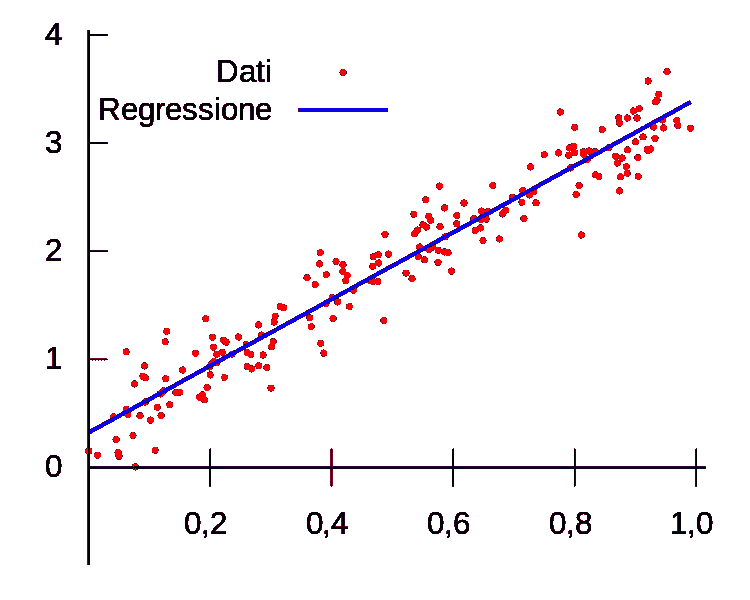

线性回归模型。红点是真正的 y 值，蓝线是模型线

# **法线方程**


看起来很直截了当，不是吗？当我开始学习线性回归并试图理解计算系数的不同方法时，正规方程是我最喜欢的寻找系数的方法，但是这个方程从何而来呢？好吧，让我们来看看。
我们首先要明白的是，均方差(简称 MSE)是衡量我们的模型表现如何的一个指标。MSE 越低，我们的预测就越接近 y 的实际值。

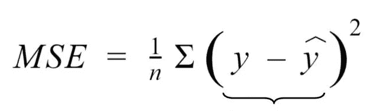

从等式中可以看出，y 的实际值和预测值之间的差异越小，MSE 就越低。**这就是我们的目标，尽可能降低 MSE。**

但是我们能使用 MSE 来找到我们的系数吗？是的，我们可以。

# **进入成本函数**

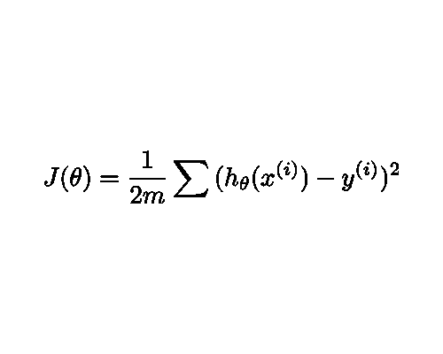

线性回归成本函数

你可能已经注意到了，MSE 方程和成本函数是相同的，但是我们用θ来代替ŷ的预测值。
在这里，ŷ只不过是θ的转置和 x 的值的点积

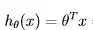

将 h(θ)的值代入我们的成本函数并简化方程，我们得到:

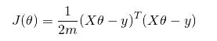

注意，我用矩阵乘法代替了求和符号，得到了相同的结果。
现在使用矩阵转置恒等式，我们进一步将其简化为:

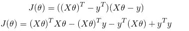

现在，取 J(θ)关于θ的导数并将其设置为零，
我们找到成本函数的最小点(微积分 101):


进一步简化后，我们得到:

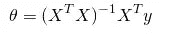

# 梯度下降:

顾名思义，梯度下降就是沿着梯度下降，直到我们到达可能的最低点

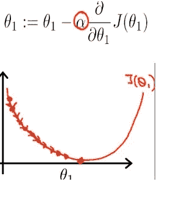

代价函数只不过是一个二次方程，所有的二次方程都有一个“全局最小值”，即函数值最低，梯度为零。

**那么梯度下降是如何工作的呢？**

简而言之，我们对我们的θ值进行初始猜测，以找到**梯度**，然后从初始θ**值中减去**梯度**，以获得新的θ值，并重复该过程，直到我们收敛到**全局最小点。****

数学上，这个等式看起来有点像:

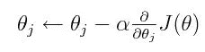

这里， **α** 表示学习率，如果梯度太大，它基本上防止我们的θ值“过冲”。

学习率的高值导致函数错过其目标，而小的学习率有助于容易地收敛到全局最小值。

注意:学习率不应该太小，因为这会不必要地增加计算时间。一个好的估计是从 0.01 到 0.001，但这取决于手头的情况。

# Python 中的实际实现

在这一部分中，我将在 Andrew ng 的“机器学习入门课程”中的回归数据集上实现梯度下降法和法方程。
数据集是基于房屋总面积和卧室数量的房屋价格列表。
这里价格是我们的因变量 y，X 是我们的一组自变量。
注意:我添加了一个额外的列“intercept_term ”,顾名思义，它将用于查找我们的截距。

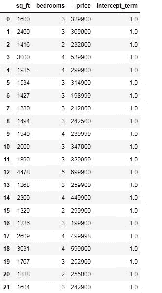

在分离变量和进行计算之前，我们必须意识到我们的值有不同的范围。

我的意思是卧室栏在 1 到 5 的范围内，而平方英尺栏有数百个不同的值。

仅仅因为一个变量有一个更高的值并不意味着它更重要，但是这个高值可能会对我们的模型产生一些负面影响。

所以在线性回归中，标准化我们的变量总是一个好的做法，这样它们就在同一个范围内。我们希望变量的均值为零，标准差为一。

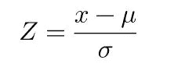

标准化公式

使用 Scikit 学习内置的 StandardScaler 模块，我们将标准化我们的整个变量，使其达到相同的规模。

```
from sklearn.preprocessing import StandardScaler
sc = StandardScaler()
data_new = sc.fit_transform(data)
S = pd.DataFrame(data_new)
S.drop(3,axis=1,inplace=True)
S.columns = ['sq_ft','bedrooms','price']
S['ones'] = S['bedrooms']/S['bedrooms']
S
```

标准化后，我们得到

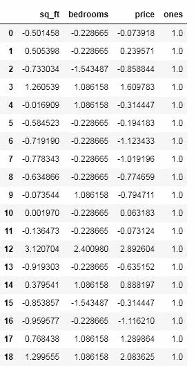

注意:我们之前的“intercept_term”标准化为零，所以我们再次添加了它。

我们将把**平方英尺、卧室和个人列**分离出来作为我们的 **X** 数据框架，而**价格**列将表示为 **y.**

```
X_array = S.drop('price',axis=1)
X_array
y = S['price']
X_array = np.array(X_array).reshape(46,3)
y_array = np.array(y).reshape(46,1)
```

注意:我们将把列转换成 numpy 数组，这样我们就可以对变量执行 numpy 矩阵运算。

# **首先:正规方程**


我将法线方程分成两部分，第一部分将是 **X_transpose 与 X** 的点积的倒数，第二部分将是 **X_transpose 与 y** 的点积

然后，我将得到两个结果的点积。

```
first_term = np.linalg.inv((np.dot(x_transpose,X_array)))
second_term = np.dot(x_transpose,y_array)
Theta = np.dot(first_term,second_term)
Theta 
```

我得到的结果是:

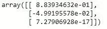

我有一个 3x1 矩阵，两个是系数，另一个是截距项。

# **梯度下降**

```
m = 96 # number of samples
alpha=0.01
x_transpose = X_array.transpose()
for iter in range(0, 100000):
        hypothesis = np.dot(x, theta)
        loss = hypothesis - y_array

        gradient = np.dot(x_transpose, loss) / m         
        theta = theta - alpha * gradient  # update
print(theta)
```

我将样本变量的数量定义为 m，将学习率定义为α，并将迭代次数设置为 100000。
随着 for 循环的运行，我们的θ值在每次迭代中都会更新，直到我们到达θ不再收敛的点，结果为。

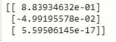

所以我们的结果匹配，还有什么？
好吧，让我们试试 scikit learns 的线性回归模块，看看它能给我们带来什么。

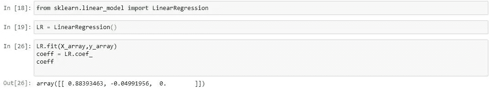

让我们想象一下我们的结果。尽管这是一个多元回归问题，让我们将价格变量与 sq_ft 变量进行对比。

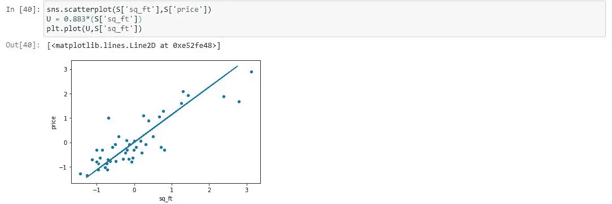

注意:U 变量不过是一个线性方程，其中一个系数作为梯度。(0.883)
这条线很好地捕捉了数据。

希望对梯度下降法和法方程的介绍将证明是富有成果和有益的。

[1]:the green place(2014 年 12 月 22 日)。*线性回归正规方程的推导*[https://Eli . the green place . net/2014/线性回归正规方程的推导](https://eli.thegreenplace.net/2014/derivation-of-the-normal-equation-for-linear-regression)

[2]:千里眼软件. com([2019 年 9 月 30 日](https://blog.clairvoyantsoft.com/the-ascent-of-gradient-descent-23356390836f?source=post_page-----23356390836f----------------------) ) *梯度下降的上升* [https://blog .千里眼软件. com/The-Ascent-of-Gradient-Descent-23356390836 f](https://blog.clairvoyantsoft.com/the-ascent-of-gradient-descent-23356390836f)