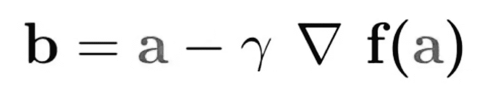
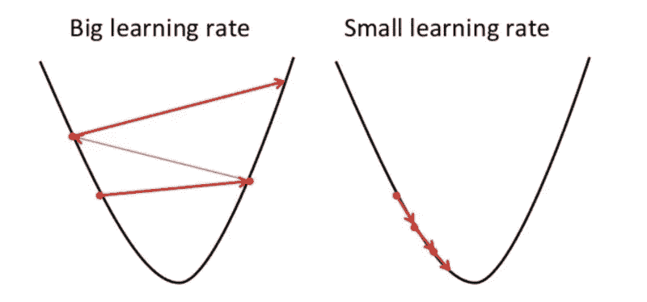
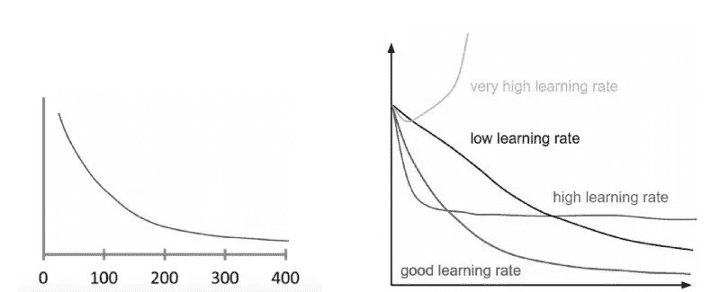

# 梯度下降:用外行人的话来说

> 原文：<https://pub.towardsai.net/gradient-descent-in-layman-language-d4028b486103?source=collection_archive---------0----------------------->

资料来源:联合国人类住区规划署

## 5 分钟内梯度下降| [朝向 AI](https://towardsai.net)

## 在 5 分钟内介绍最流行和最常用的优化技术

每当我们谈论机器学习的时候，这个词我们听到很多，需要了解和推理的大概就是这个词*。那是什么？网上有大量的教程可以让你了解和理解这个话题。有些很容易理解，附有非常有用的图表和解释，而有些则使用数学计算以非常微妙的方式解释主题。*

*但是，有时要完全理解它会变得非常困难，这比让我们正确理解这个主题更让我们困惑。当我第一次读到这个话题时，它确实让我感到困惑，而不是帮助我理解这个话题。因此，这篇短文。*

*那好吧。*

> *首先，让我们打破两个单词的完整单词。梯度-坡度。下降:这意味着下降。简单的英语。*

*所以，梯度下降可以被认为是走下山谷，而不是爬山。假设，我们有一个被蒙住眼睛的人，他被要求到达山谷的最低点。他会怎么做？嗯，他会从他觉得更低的方向开始，不是吗，他会继续这样做，直到他到达山谷的最低点。*

**

*从珠穆朗玛峰下来*

*梯度下降以同样的方式工作。它一直向下，直到达到 ***局部最小值*** *。需要注意的重要一点*是梯度下降是最小化给定函数的最小化算法。*

*梯度下降的方程式如下:*

**

*梯度下降公式*

> ***b'** 是我们下降者的下一个位置，而' **a** 是他的当前位置。'*伽玛*'是等待因子，梯度项(***δf(a)*'**)是他下降的方向。中间的减号表示他正在向最低点下降。*

*所以基本上，这个公式告诉我们，这个人需要去哪里才能到达最低点。另一个重要的术语，我们在研究梯度下降时发现是术语 ***代价函数*** *。**

> **成本函数*基本上告诉我们，模型在发现*因变量(Y)和自变量(x)之间关系的能力方面表现有多差。成本函数*有助于纠正算法必须执行的步骤，从而有助于减少错误。*

> *因此，该算法的目标是找到有助于最小化成本函数的权重、参数或结构。*

*现在，我们如何最小化成本函数？我们通过对算法达到局部或全局最小值所需的学习速率进行必要的改变来做到这一点。 ***学习率..嗯……那是什么？****

*学习率是达到函数的局部最小值所采取的步骤( ***基本上是一个超参数*** )。我们需要确保采取正确的步骤来达到全局最小值，因为步骤的数量将决定我们多快达到全局最小值，这是学习率的目标。如果学习率太高，它将跳过全局最小值，并将在梯度的凸函数之间保持跳跃。*

*例如:像这样-*

**

*我们可以看到小的和大的学习率是如何影响凸函数的*

*现在，如果步长太小，将需要很长时间才能达到最小值，这将需要多次迭代。*

> *现在，我们如何检查如何以不消耗我们太多时间的方式达到最小值？我们通过在图表上绘制学习率来做到这一点。*

**

*不同学习率的比较*

> *在上图中，我们可以看到，我们将迭代次数放在了 x 轴上，将成本函数值放在了 y 轴上。这使我们能够在每次迭代后看到成本函数的值，然后使用由图表设置的值可以确定一个好的学习速率。*

> ****如果梯度下降正常工作，则成本函数在每次迭代后应该减少*** *。**

*现在，当谈到迭代达到正确的最小值时，我们应该记住，根据手头的任务，可能需要 50、50000 或 500 万次迭代才能达到最小值。*

> *一般来说，最适合我们目的的学习率从 0.0001、0.003、0.01、0.3 等开始。*

*好的。！解释够了。现在，让我们来看看目前业内正在使用的 ***类型的渐变下降*** 。*

## ****1。批量梯度下降****

*批量梯度下降，也叫 V ***anilla 梯度下降*** ，是梯度下降的最简单形式。它的主要特点是我们在梯度方向上迈出小步。它主要计算数据中每个样本的误差，并仅在计算完训练示例后更新模型。*

> **普通梯度下降的优点是计算效率高。**

## ***2。*随机梯度下降****

*另一方面，随机梯度下降( *SGD* )对数据集上的每个训练示例都这样做，这意味着它逐个更新每个训练示例的参数。这使得这一个比普通梯度下降快得多，但计算相当昂贵。昂贵，因为频繁的更新也考虑了噪声梯度，这可能导致迭代次数更长时间地达到最小值。*

## ***3。*迷你批量渐变下降****

> *顾名思义，它融合了香草血统和新加坡元血统。这里，我们取一个固定大小的小批量，然后对每个批量进行更新。这是有效达到最小值的最佳方法。因此，它在随机梯度下降的鲁棒性和批量梯度下降的效率之间建立了平衡。*

*通常的批量大小从 50 到 250 不等，但是对于通常的批量大小应该是多少没有明确的规则，所以，我们假设并基于需求保持批量大小的变化。*

## ****汇总****

*正如我们所见，梯度下降是主要用于机器学习算法的优化技术，如逻辑回归、线性回归等。当涉及到机器学习时，它仍然是最受欢迎的优化技术。它的有用性对于从数据中解码出正确和有用的见解是非常重要的。*

> *梯度下降也称为最速下降算法，因为它的目的是达到凸函数的最低点。*

## ***参考文献:***

*以获取更多关于该主题的阅读资料。*

* [## 机器学习的梯度下降法

### 优化是机器学习的一大部分。几乎每个机器学习算法都有一个优化算法…

machinelearningmastery.com](https://machinelearningmastery.com/gradient-descent-for-machine-learning/)  [## 保持简单！如何理解梯度下降算法

### 来源:dilbert.com 当我第一次开始学习机器学习算法时，它被证明是相当…

www.kdnuggets.com](https://www.kdnuggets.com/2017/04/simple-understand-gradient-descent-algorithm.html) 

*所以，下次见..！！再见..！！！**